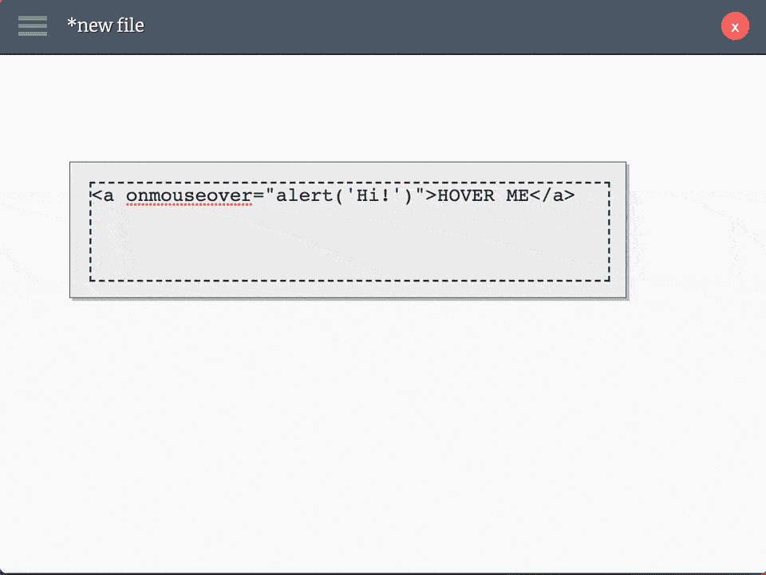
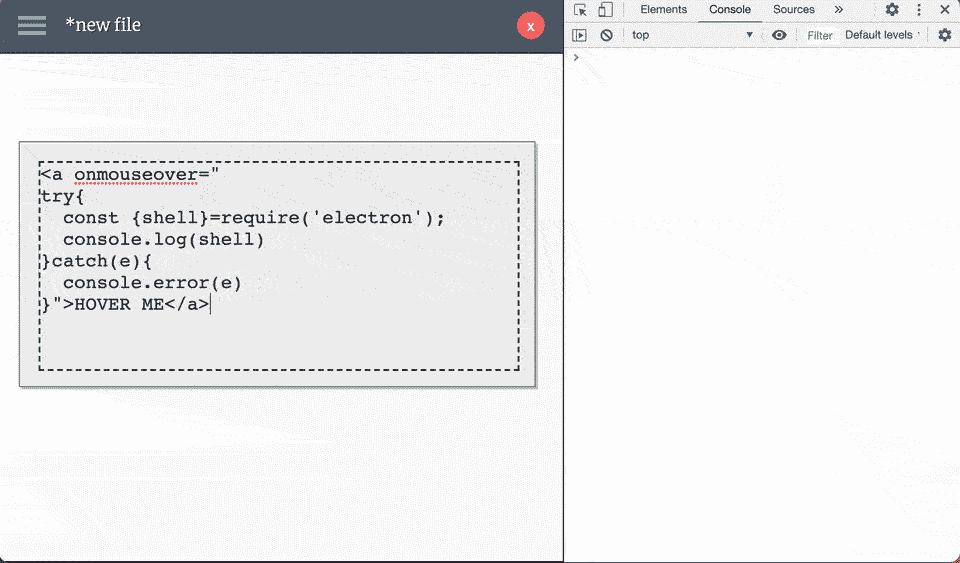
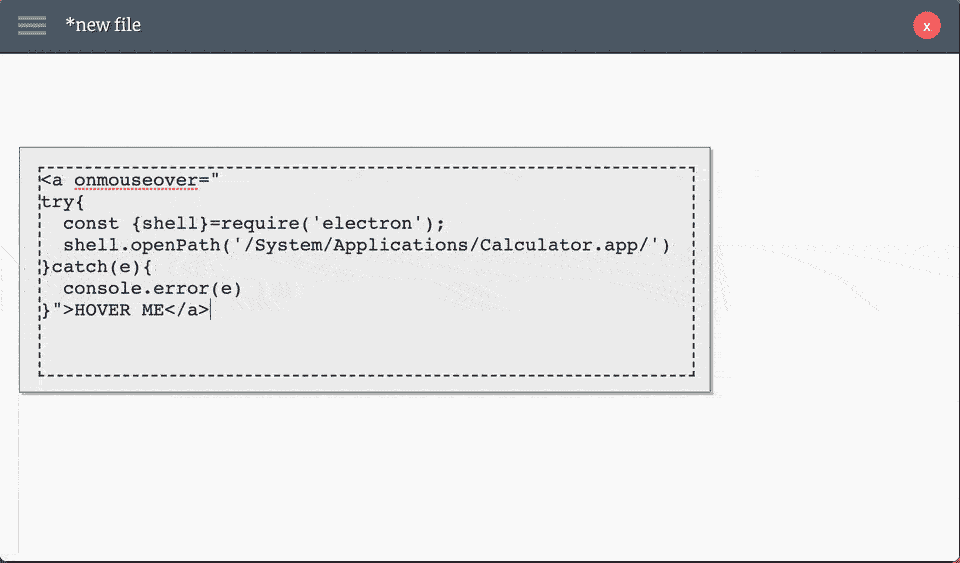
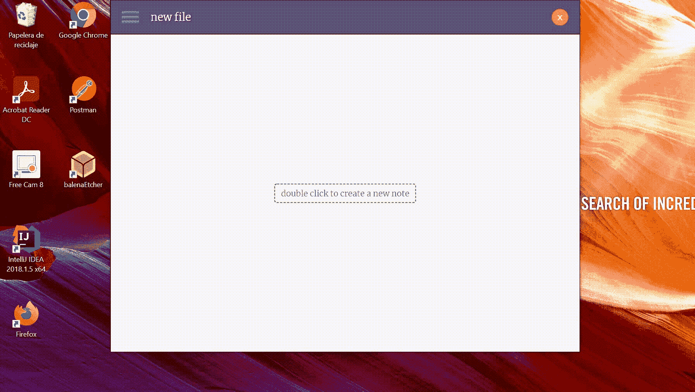

# 通过电子应用程序中的跨站点脚本远程执行代码

> 原文：<https://infosecwriteups.com/remote-code-execution-through-cross-site-scripting-in-electron-f3b891ad637?source=collection_archive---------0----------------------->

## [CVE-2020–35717](https://cve.mitre.org/cgi-bin/cvename.cgi?name=CVE-2020-35717)—RCE 通过 XSS 在 [zonote](https://www.electronjs.org/apps/zonote) 电子 App

对于那些不熟悉这个术语的人来说， *CVE* 代表*共同的脆弱和暴露。*每个 *CVE* 记录都包含一个标准标识符、一个简要描述以及相关漏洞报告和咨询的参考。[*MITRE*](https://cve.mitre.org/cve/)corporation 保存了一份记录所有公开披露的漏洞的列表，可以免费使用。

*CVE* 列表提供给*美国国家漏洞数据库(*[*NVD*](https://nvd.nist.gov/)*)*，该数据库还提供了每个 *CVE* 的分数。这个分数(称为 [*、CVSS*](https://www.first.org/cvss/specification-document) )分为三类——基础、时间和环境——并定义了漏洞的影响。


一直想提交一张我发现的 CVE——图片由 [Unsplash](https://unsplash.com/photos/JJPqavJBy_k) 提供

[*zonote*](https://github.com/zonetti/zonote) 是一款跨平台的桌面笔记 app。虽然最基本的用途是保存一个简单的文本注释，但是你可以使用 *Markdown* 代码或者嵌入任何种类的 *HTML* 。

任何一种 *HTML* ？🤔

这最后一个事实让我想到 *zonote* 是否容易受到*跨站脚本的攻击。跨站脚本*或 *XSS* 是 web 应用中最常见的漏洞之一，在 [*OWASP 十大 Web 应用安全风险*](https://owasp.org/www-project-top-ten/) 中排名第七。

一次 *XSS* 攻击包括执行攻击者注入的任意 *JavaScript* 代码，而 [OWASP](https://owasp.org/www-community/attacks/xss/) 定义如下:

> 跨站脚本(XSS)攻击是一种注入，其中恶意脚本被注入到良性和可信的网站中。
> 
> 当攻击者使用 web 应用程序向不同的最终用户发送恶意代码(通常以浏览器端脚本的形式)时，就会发生 XSS 攻击。

## 剥削

在互联网上有很多参考资料，你可以找到[*XSS【有效载荷】*](https://github.com/payloadbox/xss-payload-list)*，所以这是一个非常简单的攻击。*

```
**// Simple XSS payload*
<a onmouseover="alert('Hi!')">
  HOVER ME
</a>*
```

*为了测试 *zonote* 是否容易受到这种攻击，我创建了一个新的笔记，并插入了我最喜欢的 *XSS* 有效负载之一，当用户悬停在一个链接上时，它会执行一些代码。*

**

*XSS 有效载荷内部的警报被成功执行，证实了 zonote 易受 XSS 攻击*

## *将 XSS 攻击升级为远程代码执行攻击*

*这个发现之后，我想到的第一个问题是:*

> *这是个大问题吗？*

*当然这是一个问题，但是 *XSS* 攻击非常普遍，它们的威力*通常*受限于它们被执行的范围。但是 *zonote* 是一个*电子* app，正如[电子*安全文档*](https://www.electronjs.org/docs/tutorial/security)中指出的:*

> *如果攻击者能够跳出渲染器进程并在用户计算机上执行代码，那么跨站点脚本(XSS)攻击就更加危险。*
> 
> *禁用 Node.js 集成有助于防止 XSS 升级为所谓的“远程代码执行”(RCE)攻击。*

*因此，如果启用了 Node.js 集成，这可能会更加有害。因为我可以访问代码，所以搜索属性 *nodeIntegration* 很简单。*

**

*允许完全访问 *Node.js API 的属性被设置为 true* ，打开了*远程代码执行*的大门*

*在确认 *Node.js* 集成被启用后，我可以稍微修改一下之前的 *XSS* 有效载荷，要求 [*shell*](https://www.electronjs.org/docs/api/shell) 模块在*电子*中，并查看暴露的方法列表。*

**

*此时，我们已经确认通过 *XSS* 访问 *Node.js API* 是可能的。作为*远程代码执行*的简单*概念验证*，我们可以打开*计算器* app。*

**

*最后，为了确认该漏洞是跨平台可利用的，我只导出了一个带有 *XSS* 有效载荷的笔记，以打开 *Windows* 计算器，并将其导入到 *Windows* *OS* 中。*

**

## *漏洞的影响*

*用于演示目的的 *XSS* 有效负载需要用户交互才能执行，但是我们可以使用另一个有效负载，它会在注释被处理后立即执行。*

*我们已经将 calculator 应用程序作为*远程代码执行*的 *PoC* 打开，但是我们可以执行一个有效载荷来获得对受害者系统的远程访问。因此，此漏洞对机密性、完整性和可用性的影响应被视为很高。*

## *披露时间表*

*   *2020–12–26 发现问题并联系业主*
*   *2020–12–26 所有者表达了既不维护存储库也不修复漏洞的意图*
*   *2020–12–26 保留的 CVE 标识符[CVE-2020–35717](https://cve.mitre.org/cgi-bin/cvename.cgi?name=CVE-2020-35717)*
*   *2021–01–01 公开披露漏洞*