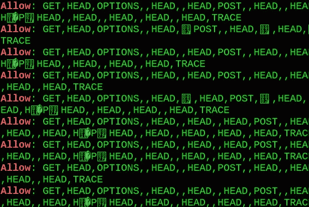
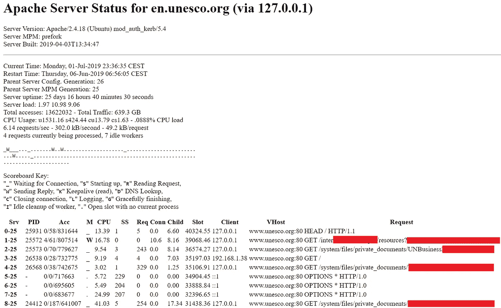
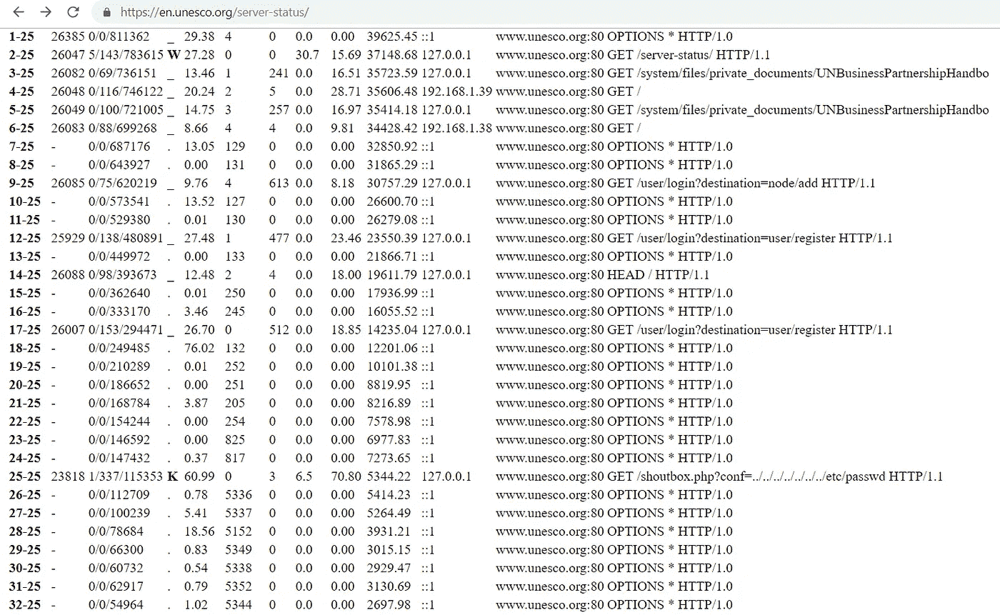

# 由于 Options Bleed，通过*.unesco.org 暴露远程敏感数据

> 原文：<https://infosecwriteups.com/remote-sensitive-data-exposure-over-unesco-org-thanks-to-options-bleed-21973b1218b6?source=collection_archive---------1----------------------->

## 抓住一个**低的** - **挂着多汁的水果**通过选项放血


报告日期—**2019 年 7 月 2 日**

#易受攻击的软件—Apache
# CVE:[CVE-2017–9798](https://cve.mitre.org/cgi-bin/cvename.cgi?name=CVE-2017-9798)/[USN-3425–1 " options bleed "](https://ubuntu.com/security/notices/USN-3425-1)
#类型— P1:敏感数据暴露+ P5:指纹/横幅抓取
#受影响的域名— *.unesco.org
#已测试—[https://en.unesco.org](https://en.unesco.org)(193.242.192.49)

# 摘要

Options Bleed 是 Apache HTTP 中的 free error 后的一种用法，它会导致构建一个损坏的 Allow 头来响应 HTTP OPTIONS 请求，这有助于通过错误配置的 **server-status** 模块`mod_status`来查找敏感数据的直接泄漏，其中 **Apache** web 服务器会显示该模块以显示指标。

## 再现性

由于其性质，错误不会确定地出现。它似乎只出现在繁忙的服务器上。有时在多次请求后出现。



选项出血在*.unesco.org 上

# 影响

任何人都可以设置一个工人，可以定期提取和枚举所有敏感文件路径。暴露的文件可以直接访问。

## 概念证明

```
$ curl -s https://—REDACTED—.unesco.org/server-status/
—REDACTED—
/system/files/private_documents/—REDACTED—
/system/files/—REDACTED—.pdf
[+] news/news.mbp
[+] /BingSiteAuth.xml
—REDACTED—
```



*配置错误的 UNESCO Apache* ***服务器-状态*** *模块*

完全敏感路径披露。你可以看看我测试时拍的一个离线[镜](https://blog.0x48piraj.com/media/files/ApacheStatus.html)。我还列举了服务器的 web 配置——看一下[—看看](https://blog.0x48piraj.com/media/files/web.config)。

# 用链条锁住

泄露地址(—redated—. UNESCO . org/server-status/)泄露了与其他关键指纹数据一起运行的 OS 的确切版本，如泄露的`mod_auth_kerb/5.4`和`mod_prefork`。

```
Server Version: Apache/2.4.18 (Ubuntu) mod_auth_kerb/5.4
Server MPM: prefork
Server Built: 2019–04–03T13:34:47
```

知道了版本发现运行`prefork`，也变得容易受到[CVE-2019–0211](https://nvd.nist.gov/vuln/detail/CVE-2019-0211)。由于越界数组访问导致任意函数调用，此特定 Apache 版本存在本地根权限提升漏洞。Apache 正常重启时会触发该漏洞— `apache2ctl graceful`。在标准的 Linux 配置中，`logrotate`实用程序每天在早上 6:25 运行一次该命令，以重置日志文件句柄。没有测试这最后一个，因为我没有被授权作为一个客人用户上传文件。

最后，通过看[https://en.unesco.org/user/login?destination = user/password/core/includes/bootstrap . Inc](https://en.unesco.org/user/login?destination=user/password/core/includes/bootstrap.inc)——看起来 drupal bug 也存在，只是在一些 waf 后面。

> *原载于 2020 年 12 月 5 日* [*修补内核*](https://blog.0x48piraj.com) *。*

[](https://blog.0x48piraj.com/sensitive-data-exposure-over-unesco-org-thanks-to-optionsbleed-for-low-hanging-fruit/) [## * .unesco.org 上的敏感数据暴露，感谢 OptionsBleed for low-hanging fruit

### 报告日期- 02-07-2019 #易受攻击的软件-Apache # CVE:CVE-2017-9798/USN-3425-1 " options bleed " # Type…

blog.0x48piraj.com](https://blog.0x48piraj.com/sensitive-data-exposure-over-unesco-org-thanks-to-optionsbleed-for-low-hanging-fruit/)