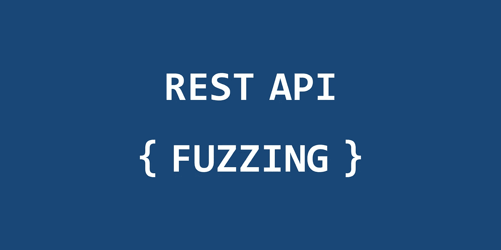
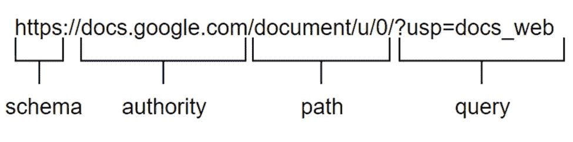
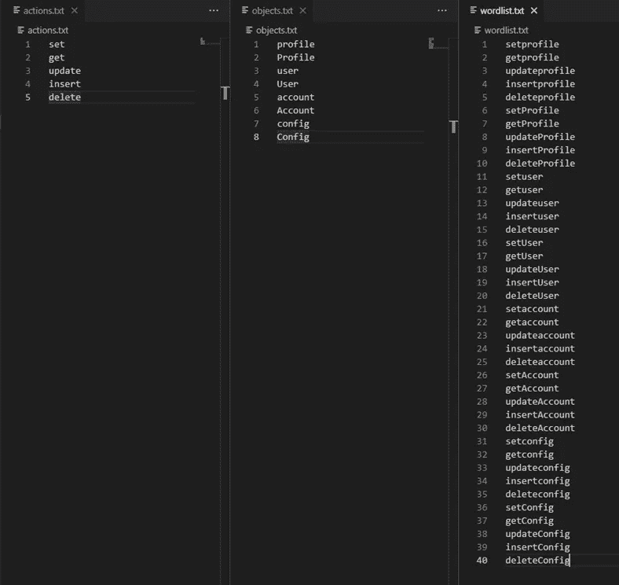
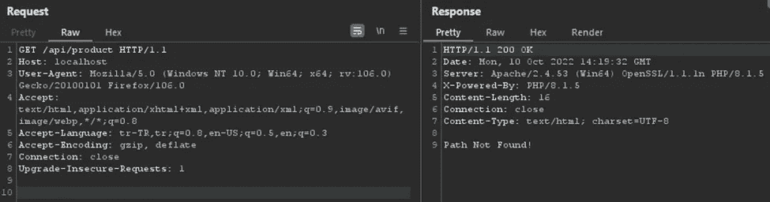
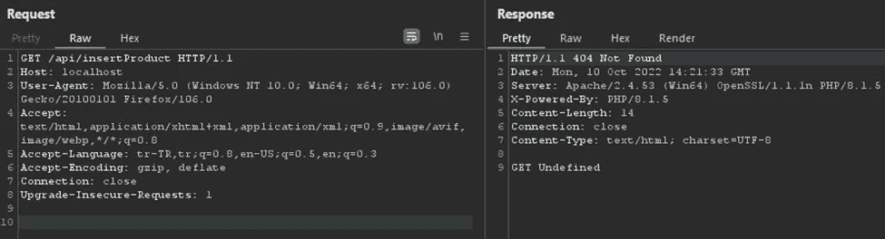
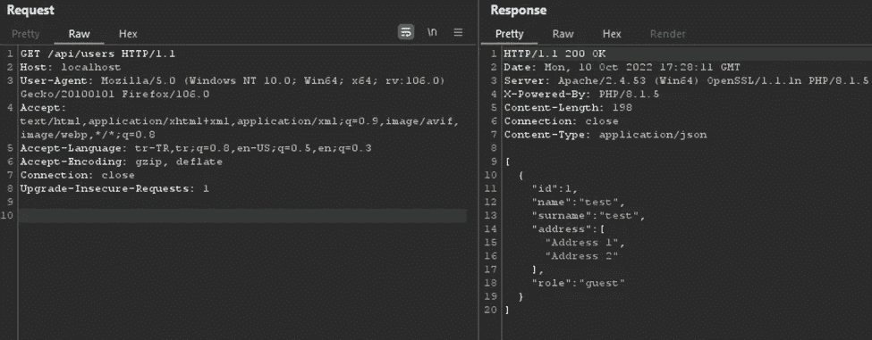
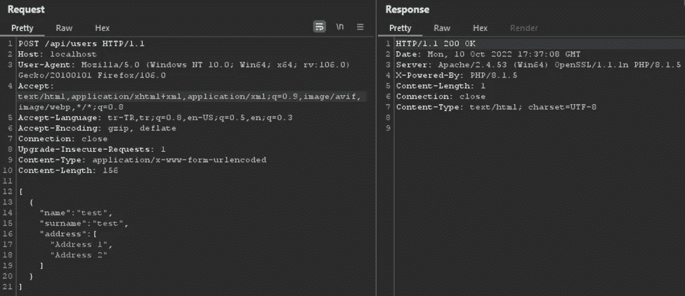

# REST API 模糊化

> 原文：<https://infosecwriteups.com/rest-api-fuzzing-4b82d2d7a67?source=collection_archive---------4----------------------->

REST API 模糊化

随着技术的发展，应用程序正在向独立于平台的结构过渡。为了实现这种独立性，创建了所有平台都可以与之通信的服务。这些服务现在被称为“网络服务”。

Web 服务是作为 API(应用程序编程接口)构建的，每个服务都有不同的职责和依赖关系。客户端可以使用 SOAP 或 REST API 来连接这些 API。

当使用“REST API”服务对应用程序执行渗透测试时，有必要了解这些服务是如何工作的。即使 REST API 服务有内部文档，也很难在渗透测试期间获得文档。因此，在对 REST API 服务执行渗透测试时，有必要通过对相关服务执行某些模糊化操作来发现应用程序客户端不发送请求的端点或应用程序客户端不发送请求的参数。

# REST API 端点命名

REST API 服务的端点对应于 URL 的“path”值。下图给出了 URL 语法。

URL 语法

为了访问 web 服务，客户端必须知道这个“路径”，即端点信息。Web 服务根据这些端点运行。端点命名没有正式的规则。开发团队的命名惯例在命名相关端点时扮演着重要的角色。

下面列出了执行相同操作的端点的不同命名。

端点命名

上表中给出了一些命名约定的例子，但是应该注意，在 REST FULL 服务中，同一个端点用于对象的 CRUD 操作。下表给出了 REST 完整服务的命名示例。

REST 完整 API 端点命名

# REST API 端点模糊化

在 REST API 服务中执行渗透测试时，必须发现并测试不显示在应用程序上但为不同服务定义的端点。

电子商务网站就是一个例子。电子商务网站的客户端拥有用户可以看到和请求的服务是很自然的。可能存在这样的服务，其中可以在客户端上检索产品的图像信息，但是为更新产品的图像信息而开发的端点信息不太可能保留在应用客户端上。因此，渗透测试人员应该根据带来产品图像的端点，寻找一个可以更新产品图像的端点。

在执行端点发现时，应该仔细分析开发团队的命名约定。如果开发团队使用“getProduct/{id}”端点来获取产品信息，它很可能使用名为“updateProduct/{id}”等的端点来更新产品。或者，如果它是使用“product/{id}”端点的服务，它可能能够使用“product/{id}/update”端点。除了这些可能性之外，相关服务可以根据 HTTP 方法来更新产品信息。可以使用 PUT 或 POST 方法将请求发送到同一个端点来更新产品信息。

当发现 API 端点时，应该在上述信息范围内采取行动。如果应用程序使用“product/{id}/image”端点向客户端报告产品映像信息，则应在发现过程中对“product/{id}/”端点执行模糊处理。

ffuf 终点模糊

如果应用程序以“getProduct/{id}”的形式向客户端报告产品信息，则应分析该应用程序，并记录使用的关键字:

*   获取产品
*   setProduct
*   更新产品
*   插入产品
*   删除产品

在使用命名的应用程序中，关键字应该一分为二。表示交易信息的关键字:

*   得到
*   设置
*   更新
*   插入
*   删除

表示对象信息的单词:

*   产品
*   用户
*   轮廓
*   账户

模糊端点时，应使用这些关键字的组合:

# REST API 状态代码

在发现 REST API 端点时，返回的响应中的 HTTP 状态代码非常重要。下表给出了一些 HTTP 状态代码。

即使上表中指定的状态代码有一定的解释，开发人员也可以将这些状态代码用于预期目的之外的用途。

下面的屏幕截图显示了应用程序中未定义的端点的请求和响应。服务器的响应应该是“404”，但却返回了 200。

在下面的屏幕截图中，它报告了没有为相关端点定义“GET”方法，并给出了“404 Not Found”响应。

在发现过程中，应该对返回的响应进行分析，并确定服务器在何种情况下给出了何种响应，并且应该在模糊化时使用这些信息。

# REST API 参数发现

确定端点后，分析相关端点使用的参数在渗透测试中起着重要作用。例如，通过向注册用户的端点发送“isAdmin”或“Admin”参数，可以添加具有高特权的用户。

在进行参数发现时，应该分析整个应用程序中使用的参数。

下面是对列出用户信息的端点的请求和响应。

在上面的截图中，显示了用户在系统中注册的所有信息。将用户添加到同一个端点的请求和响应如下面的屏幕截图所示。

从客户端发送到服务器的请求中没有“角色”值。默认情况下，web 服务用“guest”值填充“role”值。如果在请求中发送了“role”值，则可以绕过服务器上的这个默认进程，获得具有更高权限的用户。

并不是每个 web 服务都向客户端显示用户的所有特征，就像上面的例子一样。在这种情况下，应该使用用于端点发现的相同分析。通过分析开发团队的命名约定，可以操纵看不见的参数。