# LINUX 中的 RET2LIBC 攻击

> 原文：<https://infosecwriteups.com/ret2libc-attack-in-lin-3dfc827c90c3?source=collection_archive---------2----------------------->

# Ret2Libc — ->返回 Libc

# LIBC

术语“libc”通常用作“标准 C 库”的简写，这是一个标准函数库，可由所有 C 程序使用(有时也可由其他语言的程序使用)。

更多关于 [LIBC](https://man7.org/linux/man-pages/man7/libc.7.html)

# 方法学

每当程序调用一个函数时，该函数所需的参数就被加载到堆栈中，以便基指针(BP)可以很容易地指向它来处理指令。

我们不能将一个仲裁地址指向指令指针(IP)来从那个地址运行我们的外壳代码。

这将会失败，因为当 NX 位启用时，不会执行外壳代码。

## 绕过 NX 位保护的常用方法是尝试 ret2libc 攻击

在这种攻击中，我们会将函数参数直接加载到堆栈中，以便我们需要的其他函数可以调用它。

## 工作机制

所以为了实现这个目标，

1.  我们可以通过将函数加载到缓冲区来将函数的参数传递到堆栈中
2.  将我们的指令指针(IP)指向另一个使用我们传递的输入作为参数的函数
3.  当程序从指定的函数中出来时，返回要执行的函数

## 需要指向什么类型的函数

可重用函数需要在指令指针(IP)中指向

这些函数可以内置在程序中，也可以从库中调用

对于 ret2libc，函数应该来自 libc

# 剥削

在 Ret2Libc 攻击中，我们将指向 Libc 库中的函数

这就是这种攻击得名“ret2libc”的原因

就 LIBC 而言，这个库中的每个函数都存在于离库底的固定偏移量处

如果已知库版本和库基值地址，我们可以很容易地从中计算出任何函数的地址

要计算 LIBC 的功能地址，[点击这里](https://libc.blukat.me/)

# 使用 RET2LIBC 生成 SHELL

让我们考虑一个易受攻击的程序作为这种攻击的例子

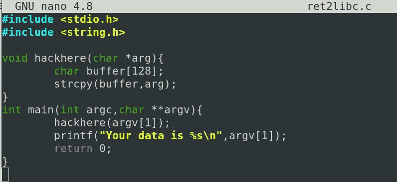

让我们以 32 位模式编译这个二进制文件

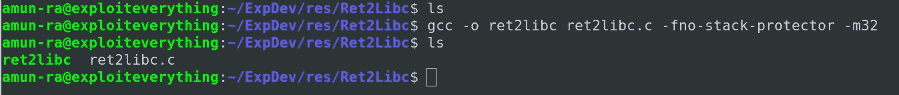

我们没有使用 `-z execstack`来使堆栈可执行

让我们运行“checksec”来检查这个二进制文件的安全保护

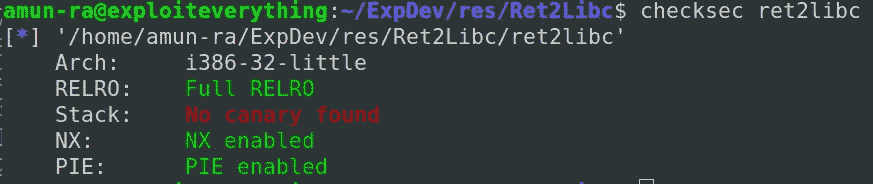

所以应该启用我们的 NX 位，以避免在堆栈中执行

## 破坏我们的计划

让我们检查一下这个程序是否会崩溃

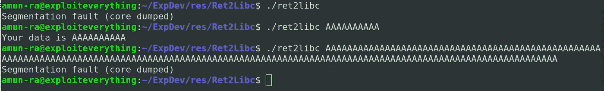

当我们传递大于缓冲区大小的输入时，这个程序会崩溃

## 寻找偏移

在确认程序崩溃后

我们需要找到指令指针的偏移量(IP)

这样我们就可以将有效载荷精确地传递到缓冲区中

让我们在 GDB-PEDA 中创建一个随机模式，将其作为输入来传递，以找到偏移值

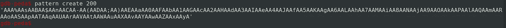

将这个模式传递到缓冲区中，我们的程序会再次崩溃

我们可以看到，我们的基本指针(BP)、指令指针(IP)被生成的模式中的值覆盖了

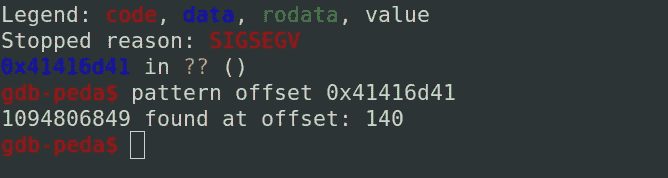

现在我们从模式值中找到了指令指针(IP)的偏移值

## 控制指令指针

让我们用 python 编写一个输入数据来测试我们是否能正确地覆盖指令指针(IP)

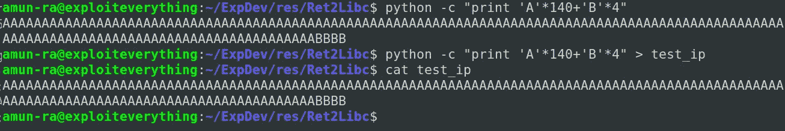

在程序崩溃后，通过检查寄存器，我们可以说我们的输入数据成功地覆盖了寄存器

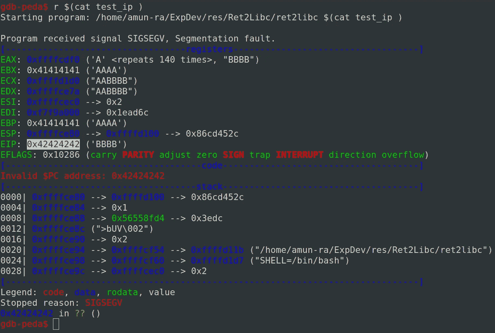

我们的指令指针(IP)由 0x42424242 填充

所以我们现在控制指令指针(IP)

## 形成 RET2LIBC

为了成功执行 ret2libc，我们需要一个可用且可执行的带参数的函数

如果我们需要在不崩溃的情况下退出函数(如果需要的话),要执行的返回函数

在此之前，让我们检查堆栈中的数据

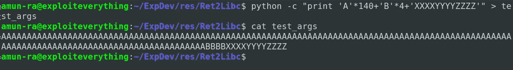

程序再次崩溃

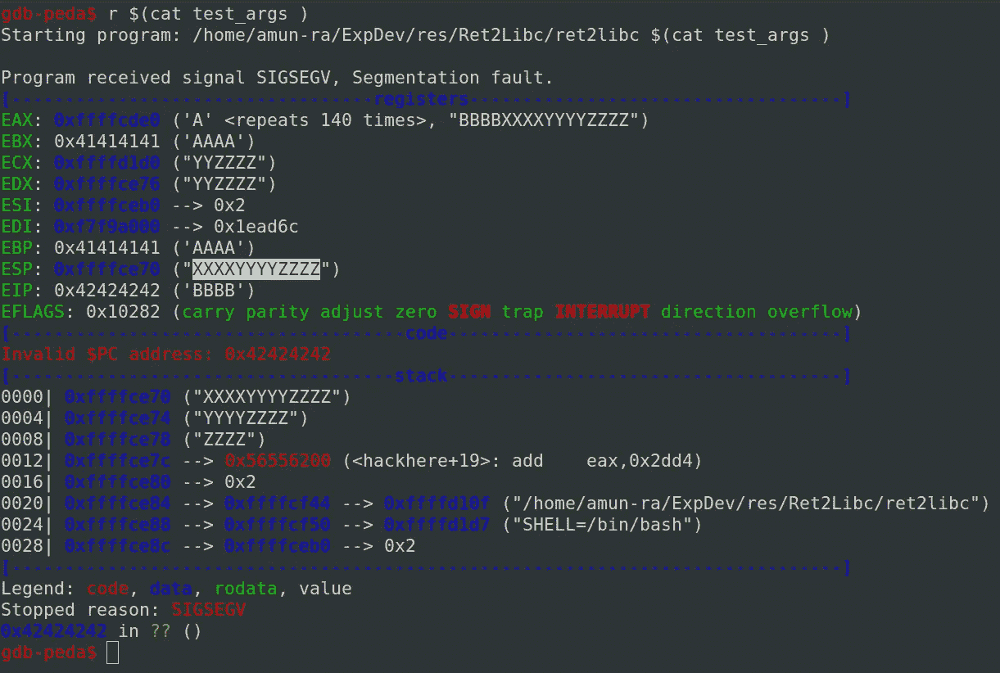

因此，我们的数据“XXXXYYYYZZZZ”正确地存储在堆栈指针(SP)中

代替“XXXXYYYYZZZZ ”,我们将传递参数，这些参数将由函数在被调用时执行

因此，执行 ret2libc 的关键取决于以下顺序中的值

1.  需要从指令指针调用函数(函数存在于 LIBC)
2.  退出第一个函数时将执行的返回函数
3.  要传递的参数

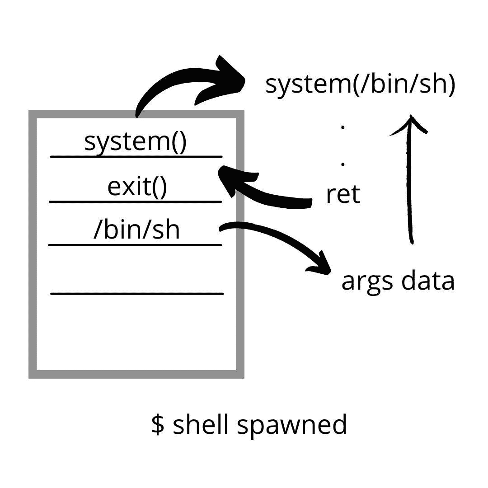

为了生成 shell，我们将从 LIBC 调用“system()”

并将“/bin/sh”作为参数传递，它将生成$

这类似于，

`system('/bin/sh')`

值“/bin/sh”不应作为字符串传递

应该是从一个地址指向的

当 shell 生成成功时，我们需要一个退出函数，否则程序会崩溃

为此，我们使用“exit()”，这是一个简单的退出函数

要得到这些函数的地址，我们可以用 GDB-PEDA 法很容易地搜索到它

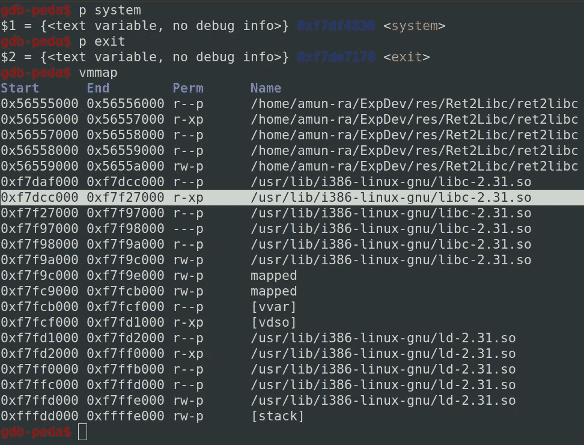

这里我们从 LIBC 得到了“system()”和“exit()”的地址

我们还可以看到，这些地址位于 LIBC 的可执行内存区域，这样的函数只能用于 ret2libc 攻击

查找“/bin/sh”指针

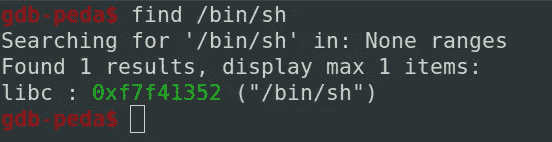

我们还可以为我们想要的参数导出一个环境变量，并调用它作为执行 ret2libc 的指针

## 生成漏洞

现在有了这些地址值，让我们用 python 来制作我们的漏洞

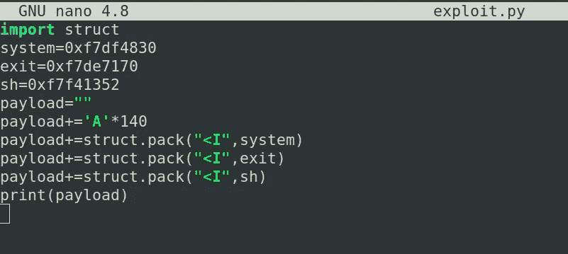

不要忘记将这些地址转换成小端(如果处理器是小端)

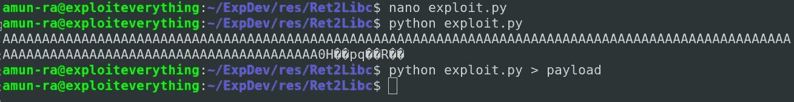

通过 GDB 调试器中的这个漏洞，我们可以看到 PID

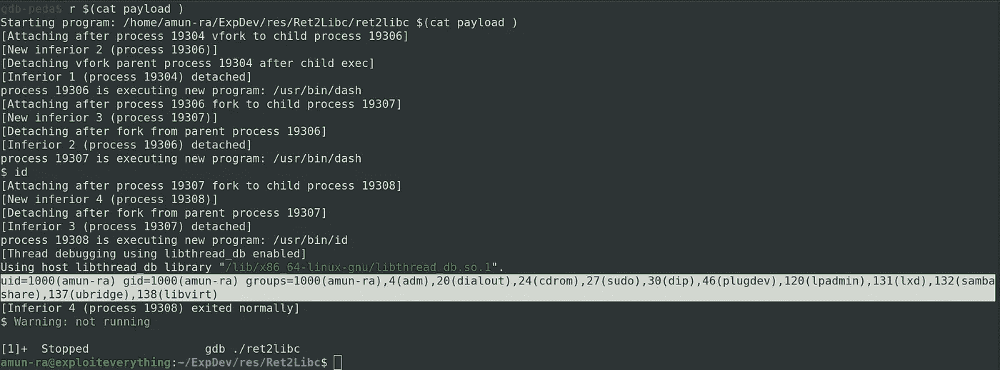

所以 shell 正在生成，它还打印了命令的输出

让我们在调试器中尝试一下

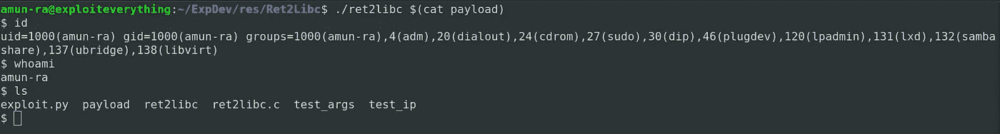

或者我们也可以从脚本中运行它

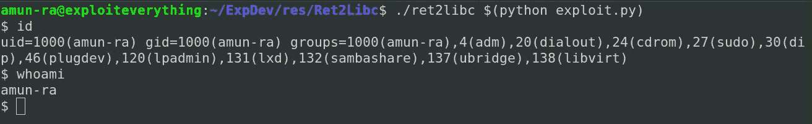

有时，由于不正确的 STDIN 处理，您的利用可能会失败

要克服这一点，您可以使用 `(cat payload;cat) | ./ret2libc`

## 剥削结束了

## 执行 RET2LIBC

## GitHub Repo 中提供了漏洞利用示例

## [aiden peace 369](https://github.com/AidenPearce369/ExploitDev)