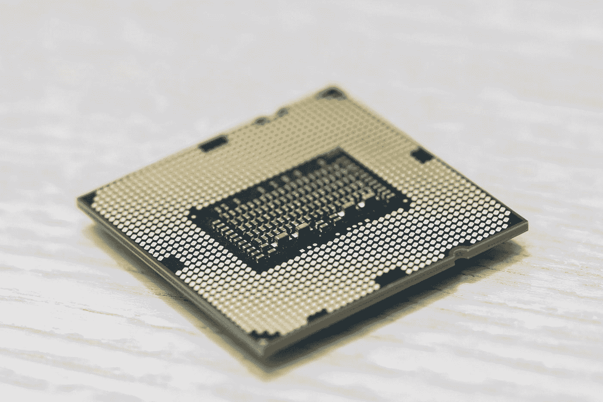
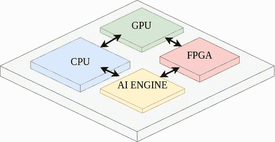
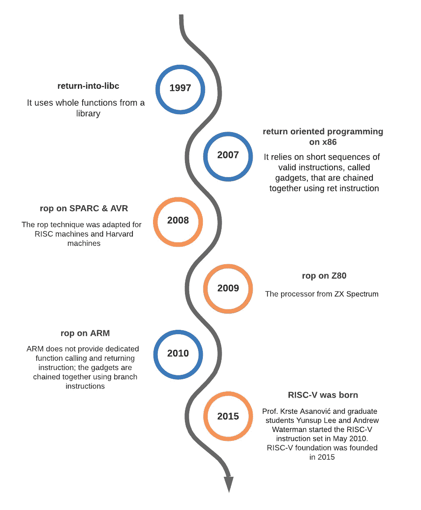
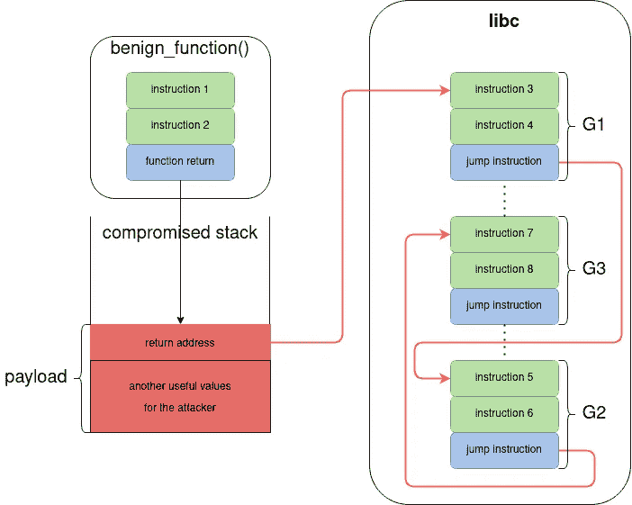
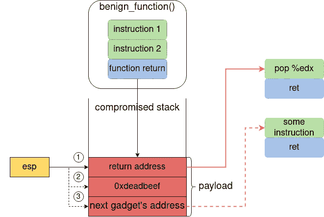
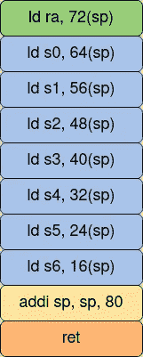
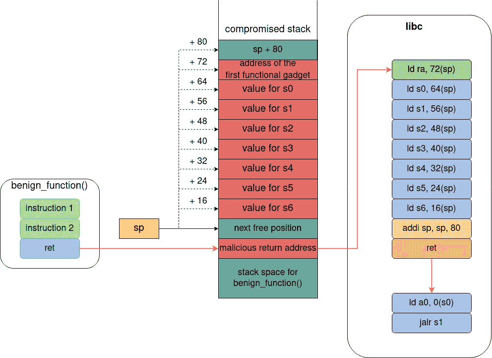

# RISC-V 上面向返回的程序设计——第一部分

> 原文：<https://infosecwriteups.com/return-oriented-programming-on-risc-v-part-1-dd9817b52d2b?source=collection_archive---------1----------------------->

## 理论视角



杰里米·贝赞格在 [Unsplash](https://unsplash.com?utm_source=medium&utm_medium=referral) 上的照片

如今，将计算任务从 CPU 卸载到硬件专用单元是一种普遍趋势，与通用处理器相比，硬件专用单元在执行时间和性能功耗比方面提供了更好的性能。这种方法包括在硅片上设计新的硬件组件，在人工智能推理、图形加速等任务中胜过 CPU。这些专用组件与通用处理器放在同一个芯片上，这样就产生了片上系统(SoC)。



SoC —高级概述

我们在最重要的芯片生产商中观察到这种趋势，如 [Xilinx](https://www.xilinx.com/products/silicon-devices/soc.html) 、[英特尔](https://www.intel.com/content/www/us/en/support/articles/000056878/intel-nuc/intel-nuc-laptop-kits.html)、[英伟达](https://www.nvidia.com/en-us/autonomous-machines/embedded-systems/)和[苹果](https://en.wikipedia.org/wiki/Apple_M1)。

纵观 SoC 世界，我认为 ARM 是用于在 SoC 内部实现 CPU 的最广泛的 CPU 架构。

跳过 ARM(一种基于许可的架构)的优缺点，我的注意力被 RISC-V(一种新的有前途的开源 CPU 架构)吸引住了，它最初是由伯克利大学开发的。

我将把对 RISC-V 的深入分析留给另一篇文章，现在我将把重点放在我对它的安全担忧上。

在上一个时期，有几个针对 CPU 架构的漏洞。也许呼声最高的是《幽灵党》和《毁灭》[和《毁灭》](https://meltdownattack.com/meltdown.pdf),紧随其后的还有更多。这些类型的攻击利用现代处理器上的侧通道，不需要任何软件漏洞，并且独立于操作系统，揭示了在考虑安全性的情况下设计的指令集架构(ISA)的重要性。

在这种情况下，我看到了像 RISC-V 这样的开源 CPU 架构的许多优势，它允许包括安全研究人员和公司在内的许多贡献者进行快速更新。

# 为什么我选择了面向回报的编程

大学毕业后，我决定在一个硕士项目中学习网络安全。有许多有趣的话题，其中包括面向返回的编程(ROP ),这是一个非常聪明的利用，被证明在许多 CPU 架构上是有效的，包括 x86–64、ARM 和 SPARC。软件中实现了针对 ROP 的保护机制，包括地址空间布局随机化(ASLR)和堆栈加那利。

当我研究这个漏洞的时候，我没有发现任何关于 RISC-V 上 ROP 的东西，所以我决定解决这个问题，这个问题在我的论文中已经结束了。

在本文中，我将介绍如何使用 ROP 开发 RISC-V CPU。

# ROP 简介

面向返回的编程是一种代码重用技术，它允许攻击者绕过所有现代 CPU 架构和操作系统提供的[写异或执行](https://en.wikipedia.org/wiki/W%5EX)保护机制。

ROP 源自[回入 libc](https://seclists.org/bugtraq/1997/Aug/63) 攻击。

与 return-into-libc 类似，ROP 不会在受害者的内存空间中注入新代码。相反，它使用来自被利用的应用程序加载的模块的代码。另一方面，ROP 不像 return-into-libc 那样使用库中的整个函数。它依赖于有效指令的短序列，称为*小工具*。

每个小工具都执行简短的计算，如加法或逻辑运算。获得强大 ROP 攻击的关键是将执行某项任务所需的所有小工具链接在一起。通过使用这种方法，ROP 获得了比 return into-libc 更大的灵活性。而且，有可能获得一个[图灵全集](https://en.wikipedia.org/wiki/Turing_completeness)的小工具。

这使得攻击者拥有与编程语言相同的工具，一切都基于应用程序内存空间中已经存在的合法代码。



ROP 攻击的演变

# ROP 配方

成功的 ROP 攻击需要以下要素:

*   缓冲区溢出易受攻击的应用程序
*   可靠的小工具链接机制
*   一大套小工具

# 缓冲区溢出易受攻击的应用程序

我们需要一个易受缓冲区溢出攻击的应用程序来覆盖良性函数的返回地址。通过这种方式，我们可以改变小工具的执行流程。

# 可靠的小工具链接机制

一切都是关于分支和跳跃。我们想执行一些指令，跳转到另一个有用的指令序列(gadget)。小工具之间的链接必须是自动化的，由 CPU 实现，因为我们不控制内存中的代码，我们只控制堆栈。

# 一大套小工具

我们希望尽可能强大。通过明智地选择小工具的结构和链接机制，我们可以从最流行的库中获得大量可用的小工具，这给了我们与编程语言相同的能力。

# ROP 概述



ROP 概述

`benign_function()`易受缓冲区溢出的攻击。通过提供一个精心制作的有效载荷，攻击者可以用第一个小工具 G1 的地址替换原来的返回地址。

有效载荷通常包含两种类型的数据:

*   执行恶意任务所需的所有小工具的地址
*   小工具需要加载到寄存器中的值

在代码执行被重定向到 libc 之后，G1 被执行，然后是 G2 和 G3。请注意，libc 中没有恶意代码。G1、G2 和 G3 本身没有恶意，但是指令的执行顺序(指令 3 →指令 8)和这些指令使用的值(来自堆栈，由攻击者控制)会导致恶意行为。

# 基本 ROP 示例

现在让我们来看看 x86–64 上的一个基本 ROP 攻击。我们从这个架构开始，因为它提供了一个简单易懂的例子。我将使用一个 32 位 CPU 的例子，但是它对 64 位 CPU 的工作方式是一样的。正如您将看到的，小工具链接机制是特定于每个 CPU 架构的，因为它依赖于执行堆栈操作的指令。



x86–64 上的 ROP

这个例子摘自 Shacham 的《骨骼上无辜肉体的几何形状:不带函数调用的 return-into-libc(在 x86 上)》。当*良性函数()*被调用时，返回地址保存在堆栈上，并且 *esp* 寄存器指向该堆栈位置。如果攻击者覆盖了返回地址和随后的位置，程序执行将转移到`*pop %edx*` gadget。

它是这样工作的:

1.  当`*benign_function()*`返回时，调用`*ret*`指令，执行跳转到`*esp*`指向的地址，在我们的例子中是`*pop %edx*`的地址，并且`*esp*`的值增加 32 位(上图中的点 1)
2.  现在`*esp*`指向`*0xdeadbeef*`位置。`*pop %edx*`用`*esp*`指向的值(0xdeadbeef -上图中的点 2)加载`*edx*`寄存器，并将`*esp*`递增 32 位
3.  现在`*esp*`指向下一个小工具的地址**(上图中的点 3)。`*pop %edx*`之后的`*ret*`使程序执行跳转到另一个小工具，即`*esp*`指向的新值，并将`*esp*`值递增 32 位

通过这种方式，这些小工具在 x86–64 CPU 架构上被链接在一起，从而导致非常强大的攻击。

# RISC-V 上的 ROP

# 指令组

RISC-V 是基于加载存储原理的 RISC(精简指令集计算机)。这意味着唯一可以访问片外存储器的指令是加载和存储指令。所有指令都有固定的宽度，必须自然对齐。此外，RISC-V 不像 x86–64 或 ARM 那样有堆栈操作指令。正如我们之前看到的，x86–64 有 POP 和 RET 指令，它们更新堆栈指针的值，以指向堆栈上的下一个值。另一方面，RISC-V 使用一系列的`*lw*`(加载字)和`*addi*`(立即添加)指令从堆栈加载一个值，并更新堆栈指针。另外，RISC-V 没有专门的返回指令。`*ret*`是一条伪指令，扩展为`*jalr zero, 0(ra)*` *、*，将程序计数器设置为`*ra + 0*`，并将之前程序计数器的值加 4 保存到寄存器`*zero*`、，寄存器`*zero*`、硬连线为零。这意味着在返回之前，返回值必须从堆栈复制到`*ra*`中。

# 寄存器和调用约定

RV32I(基本整数指令集，32 位)有 32 个通用寄存器。登记册组织的一些重要方面是:

*   `x0/zero`硬连线为零
*   `x1/ra`保存函数的返回地址
*   `x2/sp`保存堆栈指针
*   `x10-x17/a0-a7`保存函数的参数
*   `x8-9, x18-27/s0-s11`(保存的寄存器)跨函数调用保存它们的值；任何使用保存的寄存器的函数都必须在返回之前恢复其原始值

# 分步解决

如您所见，在 x86–64 上，ROP 攻击非常简单。您可以使用弹出指令从堆栈中检索值，并且可以使用`RET`跳转到下一个小工具。所有这些都没有考虑堆栈指针更新。在 RISC-V 上，任务更复杂。我们必须使用 load 指令+一个内存地址来检索数据(从堆栈或内存中)。

要获得强大的 ROP 攻击，您需要一个可靠的小工具链接方法。对于 x86–64，这个目标是通过`RET`指令来实现的，该指令使用下一个小工具的地址更新程序计数器寄存器，并进一步移动堆栈指针。考虑到这一点，人们可以将任何函数尾声作为一个小工具使用。这种方法也可以用在 RISC-V 上，但是它有一些缺点。

```
sw    a5, 1518 (a4)
ld    ra, 8(sp)
addi  sp, sp,16
ret
```

在这个例子中，我们有一个在内存中存储值的小工具。第一行存储该值，第二行用堆栈中的返回地址加载`*ra*`寄存器，第三行更新堆栈指针并执行`*ret*`。很简单，但是我们来看另一个例子。

```
li    a0, 0
ld    ra, 40(sp)
ld    s0, 32(sp)
ld    s1, 24(sp)
ld    s2, 16(sp)
ld    s3, 8(sp)
addi  sp, sp, 48
ret
```

在这种情况下，`*a0*`被加载零，`*ra*`被加载返回地址，`s0 → s3`被加载它们来自堆栈的先前值，因为调用约定规定保存的寄存器必须在函数调用中保留它们的值。如果使用这个小工具，攻击者必须在堆栈上提供伪值，以加载到保存的寄存器中，这意味着更大的有效负载。这种类型的函数后记在 *libc 中很常见。*

为此，我想出了另一个主意。我观察到在 *libc 中有很多*跳转到保存的寄存器*指令的序列。*所以，我把小工具分为两类:功能小工具和链接小工具。

# 功能小工具

功能小工具是那些执行对攻击有用的操作并在`*jalr s0→s11*` *结束的小工具。*因此，与下一个小工具的链接由保存的寄存器完成。

这里是一些功能小工具的例子。

```
// Load from memory to register
ld    a0, 0(s0)
jalr  s1// Load a constant to a register
li    a2, 0
jalr  s3// Calling the execve system call
li    a7, 221
ecall
```

# 链接小工具(充电器)

这是一个特殊的小工具，用于将所有其他小工具链接在一起。它是第一个执行的小工具，通常在攻击开始时调用。它用将要在攻击中使用的所有功能小工具的地址加载保存的寄存器，从这里开始是*充电器*名称。



充电器小工具

在上图中，我们有一个充电器小工具的例子。

*   第一条指令(绿色)用第一个功能小工具的地址加载`*ra*`寄存器。
*   接下来的七条指令(蓝色)用所有将在攻击中使用的功能小工具的地址加载保存的寄存器`*s0→s6*`。
*   黄色指令更新堆栈指针。
*   最后，orange 指令执行`*ret*`，它将跳转到`*ra*`(第一个功能小工具)中加载的地址。

# 理论攻击



RISC-V 攻击的理论 ROP

这里我们有一个在 RISC-V 架构上运行的理论上的面向返回的编程攻击。

*   `*benign_function()*`(及以下所有位置)* *的堆栈空间被攻击者溢出，合法返回地址被充电器小工具的地址(恶意返回地址)改变。
*   在返回之前，`*benign_function()*`通过向前移动`*sp*`来释放堆栈空间(到下一个空闲位置)。
*   当`*benign_function()*`返回时，程序执行跳转到充电器小工具(`ld ra, 72(sp)`，....)，它用第一个功能小工具的地址加载`*ra*`寄存器。之后，保存的寄存器`s0 → s6`被加载攻击者提供的来自堆栈的值。
*   最后，充电器小工具更新`*sp*`(另一个对攻击者有用的值可以跟随在堆栈上)并执行`*ret*` *。*
*   此时，执行将跳转到第一个功能小工具，该功能小工具将使用在`*s0*` ( `ld a0, 0(s0)`)中存储的地址找到的值加载`*a0*`，并将跳转到另一个功能小工具`*s1*` ( `jalr s1`)中存储的地址。

RISC-V 上面向返回编程的完整功能示例将在以后的文章中介绍。

# 这种方法的优点和缺点

这种方法的主要优点是减少了攻击中使用的有效载荷。如果使用基于函数后记的方法，攻击者必须提供伪值来加载在函数返回之前恢复的保存的寄存器。这可能导致大的有效载荷，在某些情况下可能是无效的。另一方面，我没有在 libc 中找到一个图灵全套小工具，它降低了攻击者的能力。

# 安全问题

既然我们知道 RISC-V 架构可以使用面向返回的编程技术来开发，我们可以问:RISC-V 是不安全的吗？不会。ROP 攻击利用函数返回机制和函数调用约定，它们本身并无恶意。此外，我们需要一个易受攻击的应用程序，它允许攻击者从函数中窃取返回地址。此外，还有许多阻止 ROP 攻击的保护机制，我们将在下一节中看到。从这个角度来看，我认为 RISC-V 比封闭的 CPU 架构有显著的优势，因为每个处理器制造商可以选择集成哪种保护机制。

# 保护机制

我们能做什么来防止 ROP 攻击？有许多解决这个问题的方法。大部分都是软硬件协同的结合。

*   *地址空间布局随机化*:这是一种软件计算机安全技术，在内存中随机化进程、堆栈、堆和库的地址。每次在执行中启动一个进程，它将被放置在内存中的一个随机地址。使用我们的攻击示例，这意味着攻击者不知道小工具(libc)的地址。点击这里了解更多关于这个[的信息。](https://en.wikipedia.org/wiki/Address_space_layout_randomization)
*   *G-Free:* 这是一个基于编译器的解决方案，消除了二进制可执行文件中所有未对齐的自由分支指令。更多细节[这里](https://dl.acm.org/doi/10.1145/1920261.1920269)。
*   [*ROPdefender*](https://dl.acm.org/doi/10.1145/1966913.1966920)
*   [ROP guard](https://www.ieee.hr/_download/repository/Ivan_Fratric.pdf)
*   [](https://www.ndss-symposium.org/ndss2014/programme/ropecker-generic-and-practical-approach-defending-against-rop-attacks/)
*   **堆栈加那利:*该技术用于检测堆栈缓冲区溢出，并防止跳转到 ROP 小工具。它的工作原理是将一个随机整数值(canary)放在堆栈上，就在返回地址之前。在执行返回指令之前检查 canary 值，以确保返回地址没有被修改(如果返回地址被覆盖，canary 值也会被更改)。更多详情[此处](https://en.wikipedia.org/wiki/Stack_buffer_overflow)。*
*   **拉链栈*:这是一种新颖的技术(2019)，通过使用加密的链式结构来保护返回地址。它能够保护堆栈中的所有返回地址，并确保函数以正确的顺序返回。作者在 RISC-V CPU 上实现了这个解决方案，并修改了 RISC-V 指令集。这里强调了开源 CPU 架构的优势。更多细节[这里](https://arxiv.org/abs/1902.00888)。*
*   *[*FIXER*](https://ieeexplore.ieee.org/document/8714980) :另一种新技术(2019)，通过强制控制流完整性来提供针对 ROP 的保护机制。此外，还在 RISC-V CPU 上实现并测试了它。*

# *进一步阅读*

*如果你喜欢这个主题，并想深入研究，我在这里留下了进一步的阅读清单。我很快会带着一篇关于 RISC-V 上 ROP 的实践文章回来。*

*有两篇独立的研究论文论述了这一主题:*

*   *[RISC-V 上面向返回的编程](https://dl.acm.org/doi/10.1145/3320269.3384738)*
*   *[RISC-V 中面向返回的编程](https://arxiv.org/abs/2007.14995)*

*两篇论文都发表于 2020 年，我相信你会在那里发现有趣的东西。我独立完成了我的研究，并为 ACM CCSW 2020 发表了一篇摘要。*

*关于一般 ROP，我建议:*

*   *[返回 libc](https://insecure.org/sploits/linux.libc.return.lpr.sploit.html)*
*   *[骨头上无肉的几何图形:不带函数调用的 Return-intolibc(在 x86 上)](https://hovav.net/ucsd/dist/geometry.pdf)*
*   *[当好指令变坏时:将面向返回的编程推广到 RISC](https://cseweb.ucsd.edu/~savage/papers/CCS08GoodInstructions.pdf)*
*   *[无返回的面向返回的编程](https://hovav.net/ucsd/dist/noret-ccs.pdf)*
*   *[面向 ARM 架构的返回编程](https://static.googleusercontent.com/media/www.zynamics.com/en//downloads/kornau-tim--diplomarbeit--rop.pdf)*
*   *[ROP 依然危险:突破现代防御](https://www.usenix.org/conference/usenixsecurity14/technical-sessions/presentation/carlini)*

```
*📩 Please feel free to share this article with colleagues and friends who will find it valuable.*
```

**原载于 2022 年 2 月 17 日 https://www.bogdandeac.com**[*。*](https://www.bogdandeac.com)**