# 对本机桌面应用程序进行逆向工程(Tauri App)

> 原文：<https://infosecwriteups.com/reverse-engineering-a-native-desktop-application-tauri-app-5a2d92772da5?source=collection_archive---------2----------------------->

## 你可以从中提取一些秘密！

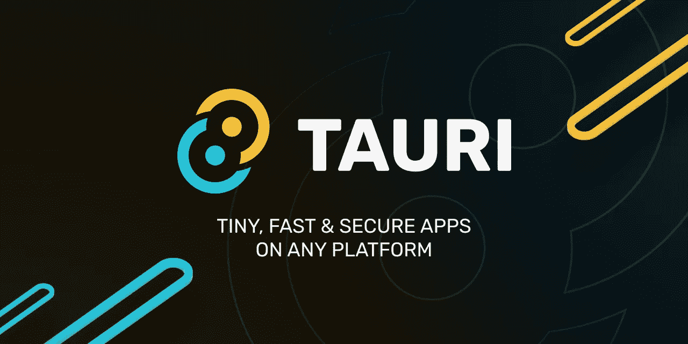

Tauri Natives 应用

> **备注** :
> 问候各位读者！在你阅读这篇内容之前，我想提醒你，这是基于我的研究和发现，所以如果你遇到或碰巧看到一个**误导信息**，我很想听听你的意见，我对任何应该正确陈述的信息都非常开放。
> 
> 这篇文章是基于我在一个挑战中遇到的，这个挑战是在一个最大的国家 CTF 中设计的，印尼的 Cyber Jawara 2022，它是由一个了不起的问题设定者 [Rendi 犹达](https://medium.com/u/3c1ed62c011f?source=post_page-----5a2d92772da5--------------------------------)创建的。该挑战涉及一个名为 Tauri App 的原生桌面应用程序。我还想对我的团队、快乐三友和所有 CJ 参与者和利益相关者表示感谢，感谢他们组织了这次令人惊叹的活动。向你们致敬！

# 背景

你以前听说过 [**Tauri**](https://tauri.app/) 吗？你可能以前不知道，因为我们大多数人都知道更多关于 [**Electron.js**](https://electronjs.org/) ，一个用于构建独立应用程序的框架包装器。这两者是一样的东西，然而这两者之间有一些显著的差异。

一般来说， **Tauri** GitHub 页面已经提供了它们的表格视图。

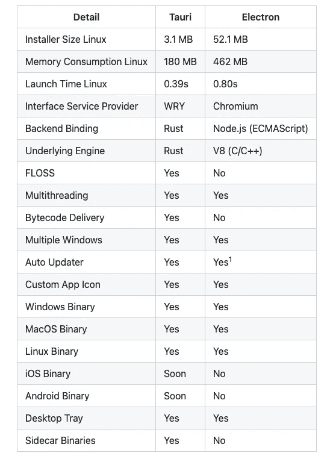

Tauri 与 Electron.js 对比

如果我们谈论资源消耗， **Tauri** 赢了这场比赛，因为它不依赖 [**铬**](https://www.chromium.org/) 。有许多文章对此进行了更详细的解释，我们不打算在这里进一步讨论。

我们想要实现的是，要了解这个 **Tauri** 应用程序的**安全性如何，我们要么从 **Tauri** 的预期行为中探索它，要么只是由决定在单个桌面应用程序中迁移其应用程序与 Tauri 的用户/开发人员发生的错误配置。这可以通过这种方式来完成，因为有时用户可能会“意外地”**降级**内置应用的**安全特性**，因为没有将其方面放在第一位。**


这里涉及到的场景是 **Tauri 应用**如何在针对特定操作系统的二进制文件中保护用户/开发人员的资产，尤其是在 **Linux** 中。

你可以这样想象，我们知道只用 **HTML** 、 **CSS** 和 **JS** ，我们可以创建一个很棒的网站，所以我们也可以尝试将我们的网站提升为一个单一的桌面应用，我们选择 **Tauri** 来处理它。然而，作为一名“菜鸟”开发人员，您不小心将您的**硬编码 API 键**或者甚至是另一个机密数据(如**基于 PII 的**数据)嵌入到 Javascript 中，因为它有一个相关的功能。你希望 Tauri 应用程序保护这些资产吗？让我们开始吧！

作者使用了以下工具来辅助逆向工程过程:

*   [IDA 六角射线](https://hex-rays.com/ida-pro/)
*   GDB ( [全球环境基金](https://github.com/hugsy/gef))
*   弗里达

# **“从发展到变革”视角**


Tauri 的后端绑定正在使用一种 **Rust** 语言。捆绑应用程序本身总是有一个**核心**进程，它服务于一个 **OEP** (原始入口点)或一个用户/开发者应用程序的`_start`。有趣的事实是，这个原生应用程序不需要 **Chromium** 来呈现指定的应用程序，但它利用了从 [WRY](https://docs.rs/wry/latest/wry/#:~:text=Wry%20is%20a%20Cross%2Dplatform,re%2Dexports%20APIs%20from%20tao.) 派生的 **WebView 库**。这意味着以后所有的 HTML、CSS 和 JS 都将加载到 **WebView、**中，就像 Android 如何使用 **WebView** 来加载基于网络的内容一样，因为它包含一个浏览器引擎。

为了第一次构建基础应用， **Tauri** 需要知道用户/开发者的类似 JSON 的配置文件，这就是为什么有一个东西叫做[**Tauri . conf . JSON**](https://tauri.app/v1/api/config/)**。**从 **Tauri** Github 示例中可以看出，总体结构可能是这样的，我们将重点关注的是 **build** 对象，因为它保存了源代码的位置。我们稍后解释的是，不仅是一个 HTML 文件将被加载到 **Tauri** 上下文，还有一些文件，假设还有一个 JS。因此， **distDir** 或 **devPath** 可能指向特定的 src-tauri 目录。

```
{
  "$schema": "../../core/config-schema/schema.json",
  "build": {
    "distDir": ["index.html"],
    "devPath": ["index.html"],
    "beforeDevCommand": "",
    "beforeBuildCommand": ""
  },
  "package": {
    "productName": "The Basic Rookie Dev App",
    "version": "0.1.0"
  },
  "tauri": {
    "bundle": {
      "active": true,
      "targets": "all",
      "identifier": "com.tauri.dev",
      "icon": [
        "../.icons/32x32.png",
        "../.icons/128x128.png",
        "../.icons/128x128@2x.png",
        "../.icons/icon.icns",
        "../.icons/icon.ico"
      ],
      "resources": [],
      "externalBin": [],
      "copyright": "",
      "category": "DeveloperTool",
      "shortDescription": "",
      "longDescription": "",
      "deb": {
        "depends": []
      },
      "macOS": {
        "frameworks": [],
        "exceptionDomain": ""
      }
    },
    "allowlist": {
      "all": false
    },
    "windows": [
      {
        "title": "Aseng was here~!",
        "width": 800,
        "height": 600,
        "resizable": true,
        "fullscreen": false
      }
    ],
    "security": {
      "csp": "default-src 'self'"
    }
  }
```

最后，这个 JSON 配置文件将被加载和构建，因为来自应用程序的 **main.rs** 将处理它并将其传递给上下文生成器和 Codegen，稍后作为一个**结构**。下面是主**锈**代码的样本，来自这里的同一个链接[。](https://github.com/tauri-apps/tauri/blob/dev/examples/helloworld/main.rs)

```
#![cfg_attr(
  all(not(debug_assertions), target_os = "windows"),
  windows_subsystem = "windows"
)]

fn main() {
  tauri::Builder::default()
    .run(tauri::generate_context!(
      "../../examples/helloworld/tauri.conf.json"
    ))
    .expect("error while running tauri application");
}
```

如果我们看一下来自[https://github . com/Tauri-apps/Tauri/blob/dev/core/Tauri-codegen/src/context . RS](https://github.com/tauri-apps/tauri/blob/dev/core/tauri-codegen/src/context.rs)的片段，我们的资产也将从这段代码中处理。我们定义的每个资产都被仔细地从它的扩展中解析出来，然后通过配置对象的数组进行解析。

```
use tauri_utils::assets::AssetKey;
use tauri_utils::config::{AppUrl, Config, PatternKind, WindowUrl};
use tauri_utils::html::{
  inject_nonce_token, parse as parse_html, serialize_node as serialize_html_node,
};

#[cfg(feature = "shell-scope")]
use tauri_utils::config::{ShellAllowedArg, ShellAllowedArgs, ShellAllowlistScope};

use crate::embedded_assets::{AssetOptions, CspHashes, EmbeddedAssets, EmbeddedAssetsError};

/// Necessary data needed by [`context_codegen`] to generate code for a Tauri application context.
pub struct ContextData {
  pub dev: bool,
  pub config: Config,
  pub config_parent: PathBuf,
  pub root: TokenStream,
}

fn map_core_assets(
  options: &AssetOptions,
  target: Target,
) -> impl Fn(&AssetKey, &Path, &mut Vec<u8>, &mut CspHashes) -> Result<(), EmbeddedAssetsError> {
  #[cfg(feature = "isolation")]
  let pattern = tauri_utils::html::PatternObject::from(&options.pattern);
  let csp = options.csp;
  let dangerous_disable_asset_csp_modification =
    options.dangerous_disable_asset_csp_modification.clone();
  move |key, path, input, csp_hashes| {
    if path.extension() == Some(OsStr::new("html")) {
      #[allow(clippy::collapsible_if)]
      if csp {
        let mut document = parse_html(String::from_utf8_lossy(input).into_owned());

        if target == Target::Linux {
          ::tauri_utils::html::inject_csp_token(&mut document);
        }

        inject_nonce_token(&mut document, &dangerous_disable_asset_csp_modification);

        if dangerous_disable_asset_csp_modification.can_modify("script-src") {
          if let Ok(inline_script_elements) = document.select("script:not(empty)") {
            let mut scripts = Vec::new();
            for inline_script_el in inline_script_elements {
              let script = inline_script_el.as_node().text_contents();
              let mut hasher = Sha256::new();
              hasher.update(&script);
              let hash = hasher.finalize();
              scripts.push(format!("'sha256-{}'", base64::encode(hash)));
            }
            csp_hashes
              .inline_scripts
              .entry(key.clone().into())
              .or_default()
              .append(&mut scripts);
          }
        }

        #[cfg(feature = "isolation")]
        if dangerous_disable_asset_csp_modification.can_modify("style-src") {
          if let tauri_utils::html::PatternObject::Isolation { .. } = &pattern {
            // create the csp for the isolation iframe styling now, to make the runtime less complex
            let mut hasher = Sha256::new();
            hasher.update(tauri_utils::pattern::isolation::IFRAME_STYLE);
            let hash = hasher.finalize();
            csp_hashes
              .styles
              .push(format!("'sha256-{}'", base64::encode(hash)));
          }
        }

        *input = serialize_html_node(&document);
      }
    }
    Ok(())
  }
}

//.... [SNIP] .......

let app_url = if dev {
    &config.build.dev_path
  } else {
    &config.build.dist_dir
  };

  let assets = match app_url {
    AppUrl::Url(url) => match url {
      WindowUrl::External(_) => Default::default(),
      WindowUrl::App(path) => {
        if path.components().count() == 0 {
          panic!(
            "The `{}` configuration cannot be empty",
            if dev { "devPath" } else { "distDir" }
          )
        }
        let assets_path = config_parent.join(path);
        if !assets_path.exists() {
          panic!(
            "The `{}` configuration is set to `{:?}` but this path doesn't exist",
            if dev { "devPath" } else { "distDir" },
            path
          )
        }
        EmbeddedAssets::new(assets_path, &options, map_core_assets(&options, target))?
      }
      _ => unimplemented!(),
    },
    AppUrl::Files(files) => EmbeddedAssets::new(
      files
        .iter()
        .map(|p| config_parent.join(p))
        .collect::<Vec<_>>(),
      &options,
      map_core_assets(&options, target),
    )?,
    _ => unimplemented!(),
  };

// .....  [SNIP] ......
```

稍后，问题来了。

> 我们对 Tauri App 如何保护我们的资产感兴趣。它们是**加密的**吗？它们是否以与转换过程不同的格式存储？它们**存储**在一个 Tauri 专用云存储中吗？或者它们被存储在一个**纯文本**中从而不受保护？

看了这些片段之后，我们知道有一个对处理我们主要资产的`tauri_utils`的引用，这就是事情变得有趣的地方。让我们来看看下面的片段，它摘自[https://Github . com/Tauri-apps/Tauri/blob/dev/core/Tauri-utils/src/assets . RS](https://github.com/tauri-apps/tauri/blob/dev/core/tauri-utils/src/assets.rs)上的官方 **Tauri** Github

```
/// Represents a container of file assets that are retrievable during runtime.
pub trait Assets: Send + Sync + 'static {
  /// Get the content of the passed [`AssetKey`].
  fn get(&self, key: &AssetKey) -> Option<Cow<'_, [u8]>>;

  /// Gets the hashes for the CSP tag of the HTML on the given path.
  fn csp_hashes(&self, html_path: &AssetKey) -> Box<dyn Iterator<Item = CspHash<'_>> + '_>;
}

/// [`Assets`] implementation that only contains compile-time compressed and embedded assets.
#[derive(Debug)]
pub struct EmbeddedAssets {
  assets: phf::Map<&'static str, &'static [u8]>,
  // Hashes that must be injected to the CSP of every HTML file.
  global_hashes: &'static [CspHash<'static>],
  // Hashes that are associated to the CSP of the HTML file identified by the map key (the HTML asset key).
  html_hashes: phf::Map<&'static str, &'static [CspHash<'static>]>,
}

impl EmbeddedAssets {
  /// Creates a new instance from the given asset map and script hash list.
  pub const fn new(
    map: phf::Map<&'static str, &'static [u8]>,
    global_hashes: &'static [CspHash<'static>],
    html_hashes: phf::Map<&'static str, &'static [CspHash<'static>]>,
  ) -> Self {
    Self {
      assets: map,
      global_hashes,
      html_hashes,
    }
  }
}

impl Assets for EmbeddedAssets {
  #[cfg(feature = "compression")]
  fn get(&self, key: &AssetKey) -> Option<Cow<'_, [u8]>> {
    self
      .assets
      .get(key.as_ref())
      .map(|&(mut asdf)| {
        // with the exception of extremely small files, output should usually be
        // at least as large as the compressed version.
        let mut buf = Vec::with_capacity(asdf.len());
        brotli::BrotliDecompress(&mut asdf, &mut buf).map(|()| buf)
      })
      .and_then(Result::ok)
      .map(Cow::Owned)
  }

  #[cfg(not(feature = "compression"))]
  fn get(&self, key: &AssetKey) -> Option<Cow<'_, [u8]>> {
    self
      .assets
      .get(key.as_ref())
      .copied()
      .map(|a| Cow::Owned(a.to_vec()))
  }
```

当你读到这些片段时，你的第一反应是什么？虽然特定的资产被用一些哈希验证、随机 ID 和其他东西标记为“T0”，但我们的资产并没有被加密，然而我们的资产只是使用无损数据压缩系统 [**Brotli**](https://github.com/google/brotli) 进行了**压缩。根据这份官方陶日文件->【https://tauri.app/v1/guides/building/app-size/】的引用，我们需要注意这部分内容:**

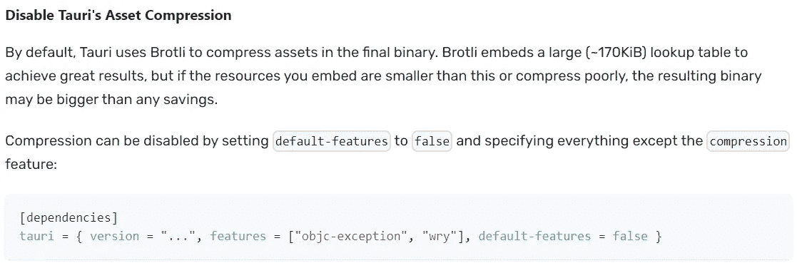

Tauri 资产压缩功能

原来 **Brotli 压缩**实际上是默认启用的，但不知何故用户也有能力**禁用**这个功能，因为这被认为是一个优先选项。另一件我们需要注意的事情是从安全文档本身来说的([https://tauri.app/v1/references/architecture/security/](https://tauri.app/v1/references/architecture/security/))。

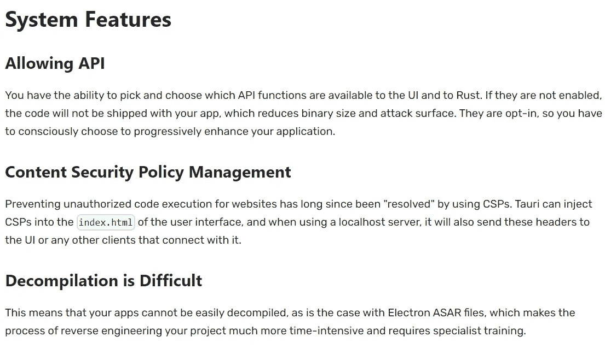

有一些 CSP 注入作为来自上下文生成器和 Codegen 的初始设置和处理，最后一点使挑战变得更加困难，因为我们不能轻松地反编译本机桌面应用程序二进制文件。

关于文档中提到的 **ASAR** 文件参考的一些快速注释实际上只是一个简单的 tar-archive 文件格式，并且**解包器**已经存在，参考这个[回答](https://stackoverflow.com/questions/38523617/how-to-unpack-an-asar-file)。 **ASAR** 文件本身也可以从静态分析中检索，甚至可以使用用于取证目的的著名文件切割工具，如 [**binwalk**](https://www.kali.org/tools/binwalk/) ，然而在 **Tauri App** 的情况下，这并不那么容易，因为**所有的资产**都是在**运行时完全加载的。**这意味着压缩和解压缩机制也将在**运行时**完成。这个问题的最终解决方案是什么？由于资产处理是在运行时完成的，我们也将在运行时调试应用程序，因此我们将结合使用**静态**和**动态**分析。

# 投入挑战

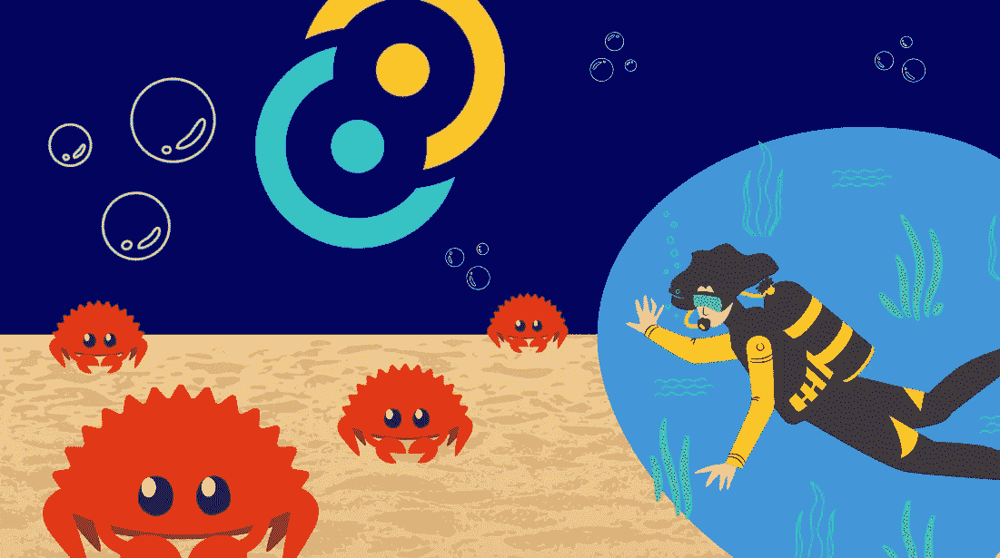

我们已经知道了*Tauri 应用如何工作的背景故事*，所以我们现在将更多地关注挑战。给定一个 **Linux 二进制文件**，它是从一个简单的网站验证程序的实际项目中派生出来的，这个场景与作者之前所说的一样，被包装在一个单一的桌面应用程序中。


Tauri 应用二进制

这项挑战的目标非常简单，因为有一个特殊的页面提示用户输入密码进行验证，从而将应用程序升级到 **pro** 版本。为了理解应用程序背后的逻辑，我们需要知道输入是如何传递和验证的，这意味着我们必须**泄露**Tauri 应用程序的源代码，或者来自创建者本身的**原始资产**。

让我们来看看静态分析会有什么帮助，我们将使用 IDA 来反编译 **Rust** 二进制文件。Rust 本身有时会成为反编译器的噩梦，因为这种语言似乎有类似于被破坏的函数名，就像 C++是如何解释的一样。

```
// ... [SNIP] ...
do
  {
    v21 = v20 + 1;
    if ( v20 == -1 )
      std::thread::ThreadId::new::exhausted::h8b15b09161259129();
    v22 = v20;
    v20 = _InterlockedCompareExchange64(&std::thread::ThreadId::new::COUNTER::h3a05da468aebc0a6, v21, v20);
  }
  while ( v22 != v20 );
  v19[4] = (void *)v21;
  *((_DWORD *)v19 + 10) = 0;
  fds.sa_handler = v12;
  fds.sa_mask.__val[0] = v3;
  fds.sa_mask.__val[1] = v4;
  std::sys_common::thread_info::set::hd2260a9241afaa5b();
  std::sys_common::backtrace::__rust_begin_short_backtrace::h9567a838cd73883d(&helloworld::main::hf56bc84460f29d43);
  if ( std::rt::cleanup::CLEANUP::h49cafe1e845be7b2 != 3 )
  {
    LOBYTE(v25) = 1;
    fds.sa_handler = (__sighandler_t)&v25;
    std::sync::once::Once::call_inner::he7c95df8c763a30d();
  }

// ... [SNIP] ...
```

这就是应用程序入口点的预处理程序是如何启动的，它使用一个信号处理程序作为 IPC 或进程间通信机制来调用`helloworld::main::<somehash>`。如果我们按照它的 CF/控制流向函数，我们会注意到前面讨论过的一些东西。

```
qmemcpy(v7, "flag-viewer", 11);
  v10 = alloc::raw_vec::RawVec$LT$T$C$A$GT$::allocate_in::h0ef84f43d0508836(5uLL);
  v12 = v11;
  *(_DWORD *)v10 = 774975024;
  *(_BYTE *)(v10 + 4) = 48;
  v13 = _rust_alloc(0x138uLL, 8uLL);
  if ( !v13 )
    goto LABEL_25;
  v14 = v13;
  v131 = v2;
  v132 = v12;
  v133 = v10;
  v134 = v7;
  *(_QWORD *)v250 = alloc::raw_vec::RawVec$LT$T$C$A$GT$::allocate_in::h0ef84f43d0508836(4uLL);
  *(_QWORD *)&v250[8] = v15;
  **(_DWORD **)v250 = 1852399981;
  *(_QWORD *)&v250[16] = 4LL;
  std::sys::unix::os_str::Slice::to_owned::hafd5ea8305043fe1();
  v16 = (void *)alloc::raw_vec::RawVec$LT$T$C$A$GT$::allocate_in::h0ef84f43d0508836(0xBuLL);
  qmemcpy(v16, "Flag Viewer", 11);
  qmemcpy((void *)v14, v250, 0x40uLL);
  *(_DWORD *)(v14 + 64) = *(_DWORD *)&v250[64];
  *(_DWORD *)(v14 + 68) = 2;
  *(_QWORD *)(v14 + 112) = 0LL;
  *(_QWORD *)(v14 + 136) = 0LL;
  *(_QWORD *)(v14 + 152) = 0LL;
  *(_QWORD *)(v14 + 168) = 0x4089000000000000LL;
  *(_QWORD *)(v14 + 176) = 0x4082C00000000000LL;
  *(_QWORD *)(v14 + 184) = 0LL;
  *(_QWORD *)(v14 + 200) = 0LL;
  *(_QWORD *)(v14 + 216) = 0LL;
  *(_QWORD *)(v14 + 232) = 0LL;
  *(_QWORD *)(v14 + 248) = v16;
  *(_QWORD *)(v14 + 256) = v17;
  *(_QWORD *)(v14 + 264) = 11LL;
  *(_QWORD *)(v14 + 272) = 0LL;
  *(_QWORD *)(v14 + 296) = 0x100000100010001LL;
  *(_DWORD *)(v14 + 304) = 33554433;
  *(_WORD *)(v14 + 308) = 0;
  v135 = v14;
  *(_BYTE *)(v14 + 310) = 0;
  v18 = (void *)alloc::raw_vec::RawVec$LT$T$C$A$GT$::allocate_in::h0ef84f43d0508836(0xDuLL);
  v129 = v19;
  qmemcpy(v18, "com.tauri.dev", 13);
  v130 = v18;
  v20 = _rust_alloc(0x78uLL, 8uLL);
  if ( !v20 )
    goto LABEL_25;
  v21 = (_QWORD *)v20;
  v22 = alloc::raw_vec::RawVec$LT$T$C$A$GT$::allocate_in::h0ef84f43d0508836(0x13uLL);
  v84 = v23;
  *(_OWORD *)v22 = *(_OWORD *)"../.icons/32x32.png../.icons/128x128.png../.icons/128x128@2x.png../.icons/icon.icns../.icons/icon.icodefault-src 'self'public";
  *(_DWORD *)(v22 + 15) = 1735290926;
  v24 = alloc::raw_vec::RawVec$LT$T$C$A$GT$::allocate_in::h0ef84f43d0508836(0x15uLL);
  v82 = v25;
  *(_QWORD *)(v24 + 13) = 0x676E702E38323178LL;
  *(_OWORD *)v24 = *(_OWORD *)"../.icons/128x128.png../.icons/128x128@2x.png../.icons/icon.icns../.icons/icon.icodefault-src 'self'public";
  v26 = alloc::raw_vec::RawVec$LT$T$C$A$GT$::allocate_in::h0ef84f43d0508836(0x18uLL);
  v80 = v27;
  *(_QWORD *)(v26 + 16) = 0x676E702E78324038LL;
  *(_OWORD *)v26 = *(_OWORD *)"../.icons/128x128@2x.png../.icons/icon.icns../.icons/icon.icodefault-src 'self'public";
  v28 = alloc::raw_vec::RawVec$LT$T$C$A$GT$::allocate_in::h0ef84f43d0508836(0x13uLL);
  v79 = v29;
  *(_OWORD *)v28 = *(_OWORD *)"../.icons/icon.icns../.icons/icon.icodefault-src 'self'public";
  *(_DWORD *)(v28 + 15) = 1936614249;
  v30 = alloc::raw_vec::RawVec$LT$T$C$A$GT$::allocate_in::h0ef84f43d0508836(0x12uLL);
  v21[12] = v30;
  v21[13] = v31;
  *(_OWORD *)v30 = *(_OWORD *)"../.icons/icon.icodefault-src 'self'public";
  *(_WORD *)(v30 + 16) = 28515;
```

从这个函数中我们可以解读出什么？如果您忘记了这些字符串指示，您可能想要向上滚动，这些字符串是从前面的 **tauri.conf.json** 中派生出来的。看起来有一个加载这些**数组对象**的过程，因为有许多函数需要从单个源复制到目的地的能力(在结构、向量和数组的上下文中)。

```
v431 = "Tauri Programme within The Commons ConservancyMake tiny, secure apps for all desktop platforms with Taurierror "
         "while running tauri application";
  v432 = 46LL;
  v433 = "Make tiny, secure apps for all desktop platforms with Taurierror while running tauri application";
  v434 = 59LL;
  ((void (__fastcall *)(_BYTE *, _BYTE *, _BYTE *))tauri::app::Builder$LT$R$GT$::build::h7c64c955f54959e3)(
    v246,
    v238,
    v250);
  memcpy(v225, &v246[1], 0x5FuLL);
  if ( v247 != 3 )
  {
    memcpy(&v250[96], &v246[96], 0x90uLL);
    qmemcpy(&v250[248], v248, 0x68uLL);
    v250[0] = v246[0];
    memcpy(&v250[1], v225, 0x5FuLL);
    *(_QWORD *)&v250[240] = v247;
    ((void (__fastcall *)(__m256i *, _BYTE *))_$LT$tauri..app..AppHandle$LT$R$GT$$u20$as$u20$core..clone..Clone$GT$::clone::h22f9c9fdb5774633)(
      v236,
      &v250[224]);
    v59 = *(_QWORD *)&v250[216];
    v60 = _InterlockedIncrement64(*(volatile signed __int64 **)&v250[216]);
    if ( !((v60 < 0) ^ v61 | (v60 == 0)) )
    {
      if ( *(_QWORD *)&v250[16] == 3LL )
        core::panicking::panic::hf0565452d0d0936c();
      *(_OWORD *)v238 = *(_OWORD *)v250;
      *(_QWORD *)&v238[16] = *(_QWORD *)&v250[16];
      memcpy(&v238[24], &v250[24], 0xC0uLL);
      v62 = *(_QWORD *)&v238[88];
      v63 = _InterlockedIncrement64(*(volatile signed __int64 **)&v238[88]);
      if ( !((v63 < 0) ^ v61 | (v63 == 0)) )
      {
        v64 = *(_QWORD *)v238;
        v65 = _InterlockedIncrement64(*(volatile signed __int64 **)v238);
        if ( !((v65 < 0) ^ v61 | (v65 == 0)) )
        {
          v66 = *(_QWORD *)&v238[80];
          v67 = ((__int64 (__fastcall *)(_BYTE *))tao::event_loop::EventLoop$LT$T$GT$::create_proxy::h6f86f7baa55289ee)(&v238[120]);
          qmemcpy(v226, &v238[120], sizeof(v226));
          *(_QWORD *)&v246[16] = *(_QWORD *)&v238[112];
          *(_OWORD *)v246 = *(_OWORD *)&v238[96];
          *(_QWORD *)&v246[24] = v67;
          *(_QWORD *)&v246[32] = v68;
          qmemcpy(&v246[40], v236, 0x80uLL);
          *(_QWORD *)&v246[168] = v59;
          *(_QWORD *)&v246[176] = v64;
          *(_QWORD *)&v246[184] = v62;
          *(_QWORD *)&v246[192] = v66;
          ((void (__fastcall __noreturn *)(__m256i *, _BYTE *))tao::event_loop::EventLoop$LT$T$GT$::run::h9b4fce1a6961520f)(
            v226,
            v246);
        }
      }
    }
    BUG();
  }
  memcpy(v238, v225, 0x5FuLL);
  if ( v246[0] != 28 )
  {
    v250[0] = v246[0];
    memcpy(&v250[1], v238, 0x5FuLL);
LABEL_31:
    core::result::unwrap_failed::hfaddf24b248137d3();
  }
  if ( v120 )
    free(v119);
  ((void (__fastcall *)(__int64 *))core::ptr::drop_in_place$LT$tauri_utils..config..FsAllowlistScope$GT$::h59f25386f9484a44)(&v174);
  v54 = (void *)v180;
  ((void (__fastcall *)(__int64, __int64))_$LT$alloc..vec..Vec$LT$T$C$A$GT$$u20$as$u20$core..ops..drop..Drop$GT$::drop::h7a5477a2103cf4a6)(
    v180,
    v181.m256i_i64[1]);
  if ( v181.m256i_i64[0] )
    free(v54);
  if ( v181.m256i_i64[2] && v181.m256i_i64[3] )
    free((void *)v181.m256i_i64[2]);
  v55 = (char *)v184;
  if ( *((_QWORD *)&v185 + 1) )
  {
    v56 = 88LL * *((_QWORD *)&v185 + 1);
    v57 = 0LL;
    do
    {
      if ( *(_QWORD *)&v55[v57 + 8] )
        free(*(void **)&v55[v57]);
      v57 += 88LL;
    }
    while ( v56 != v57 );
  }
  if ( (_QWORD)v185 )
    free(v55);
  ((void (__fastcall *)(__int64 *))core::ptr::drop_in_place$LT$tauri_utils..config..FsAllowlistScope$GT$::h59f25386f9484a44)(&v187);
  ((void (__fastcall *)(__int64, _QWORD))_$LT$alloc..vec..Vec$LT$T$C$A$GT$$u20$as$u20$core..ops..drop..Drop$GT$::drop::h7a5477a2103cf4a6)(
    8LL,
    0LL);
  ((void (__fastcall *)(__int64 *))core::ptr::drop_in_place$LT$tauri_utils..config..FsAllowlistScope$GT$::h59f25386f9484a44)(&v232);
  return ((__int64 (__fastcall *)(__int64 *))core::ptr::drop_in_place$LT$tauri_utils..config..FsAllowlistScope$GT$::h59f25386f9484a44)(&v227);
}
```

最后，调用 **Tauri** 构建器，这是二进制本地应用程序的根或基础。在控制流执行期间，会调用许多分支。

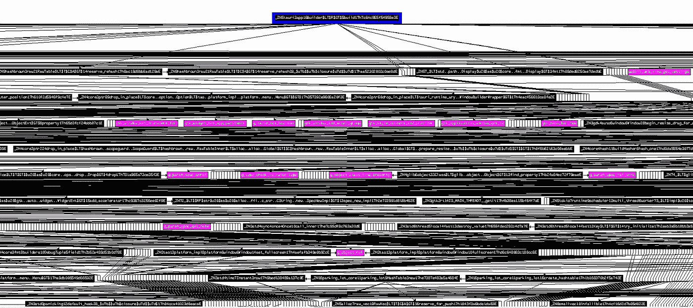

Tauri 应用程序构建器控制流外部参考

这可能会令人困惑，而且要花很多时间才能弄清楚每个函数的行为。作者注意到检查资产位置**可能是有利的，而不必遍历所有那些函数**。我们将采用两种可选的方法来提取和泄漏源代码。

# 解构者的艺术


你听说过一个构造函数。ctor)或解构者(。dtor)工作？如果你对 **Rust** 更感兴趣，你可能想看看这个[板条箱](https://crates.io/crates/static_init/0.1.3)，但是由于作者更有能力用 C 语言解释它，我们将在下面举一个例子。

```
#include <stdio.h>
void pre_main() __attribute__((constructor));
void post_main() __attribute__((destructor));

void pre_main() {
   puts("Yup I'm called before the main() function");
}

void post_main() {
   puts("Eh? I'm called after all the main() is completed! No matter how many iterations ~");
}

int main() {
   puts("Hello seng.");  
   return 0;
}
```

解释这个概念很简单，**构造函数**负责在主函数被调用之前执行某些东西，但另一方面，**析构函数**负责在主函数被完成或调用之后执行某些命令。

这两个函数在低层是如何工作的？有一个来自[https://www.exploit-db.com/papers/13234](https://www.exploit-db.com/papers/13234)的很好的解释，因为我也喜欢隐藏一个系统调用，比如滥用这两个来隐藏某个函数调用或系统调用，它具有反逆向工程方法论的能力。请注意这几行:

> 研究 glibc 初始化代码表明' __libc_csu_fini '和' __libc_csu_init '函数在启动流中有特殊的用途。
> “_ _ libc _ CSU _ init”充当构造函数。这个任务将在真正的程序之前被调用，在我们的例子中是 main()函数。
> 是放置程序相关初始化代码的理想位置。“__libc_csu_fini”函数充当析构函数。它的工作是
> 作为最后一个函数被调用，从而确保程序没有留下任何东西，并且干净利落地退出。
> 
> 在共享库编程中，程序员有两个函数' _init '和' _fini '，它们是共享库构造函数和
> 析构函数。我们的可执行文件也有这两个功能。只是在我们的情况下，它们是整合机制的一部分。

总结一下，析构函数(。dtor)与 Tauri 二进制应用程序？我们知道有几个库链接并导入到二进制文件本身。可能在这些库中，有一个可能包含这些属性，因此我们注意到这些**在最后导出了**函数。

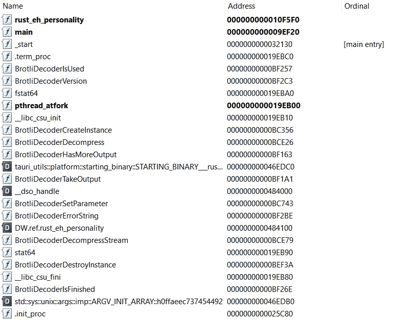

Tauri 应用程序二进制导出

虽然在 _init 构造函数中只有一个指针，但是在 _fini 析构函数中没有 **none** ，流程**保持不变**。析构函数总是在 main 及其外部引用分支中的所有功能被调用后被调用。

由于 **Tauri App** 在**运行时加载用户/开发者的资产，**有一个类似的概念，就像 Android 如何准备其 **MainActivity** 完成，这就是这个想法的来源。为什么我们不在 **_fini 析构函数**上设置一个断点，这样在所有那些**资产**被加载之后，有**的概率**在**堆内存区域中**资产**仍然可用，这就是所谓的“雕刻内存”。**

我们将根据挑战的预期行为使用字符串指示。我们知道在发布版本中，作者的名字" **vidner** "是以 HTML 静态格式弹出的，所以我们可以使用`search-pattern`的 **GEF GDB** 特性(也称为`grep`别名)来实现。我们还应该重新设置地址，因为它支持 PIE。

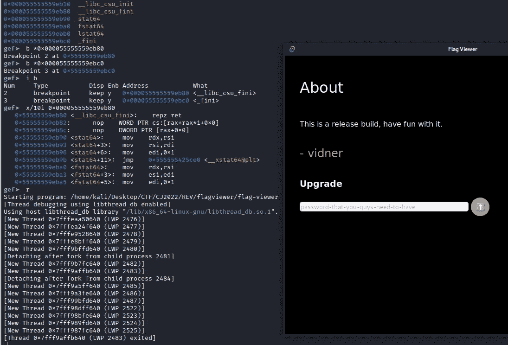

GDB 调试

让我们尝试 grep "**vid ner**"字符串，看看它是否能成功找到 HTML 指示。我们将在 GEF 中使用“**搜索模式**”。


堆内存中的 Vidner 字符串指示

我们成功地找到了指示，下一步我们将使用 GDB 功能将地址偏移量中的某个值作为字符串打印出来`x/s`

```
gef➤  x/10s 0x5555559c7289-200
0x5555559c71c1: "a\322UUU"
0x5555559c71c7: ""
0x5555559c71c8: "\360a\322UUU"
0x5555559c71cf: ""
0x5555559c71d0: "<head>\n    <meta charset=\"UTF-8\">\n    <meta content=\"ie=edge\" http-equiv=\"X-UA-Compatible\">\n    <meta content=\"width=device-width, initial-scale=1.0\" name=\"viewport\">\n    <meta content=\"vidner\" name=\"author\">\n    <title>Flag Viewer</title>\n    <link href=\"https://fonts.gstatic.com\" rel=\"preconnect\">\n    <link href=\"https://fonts.googleapis.com/css2?family=Poppins:wght@400;500;600;700&amp;display=swap\" rel=\"stylesheet\">\n    <link href=\"./css/styles.css\" rel=\"stylesheet\">\n  <meta content=\"script-src 'self' 'sha256-LiAOJW+SxhRQ1D3FA8oo/AjCouFSGU4xYS5EfRdWEx4=' 'sha256-47DEQpj8HBSa+/TImW+5JCeuQeRkm5NMpJWZG3hSuFU='; default-src 'self'\" http-equiv=\"Content-Security-Policy\"></head>\n  <body>\n    <header>\n      <div class=\"logo\">\n        \n      </div>\n      <button class=\"btn\">\n        \n      </button>\n    </header>\n    <main>\n      <button id=\"prev\">&lt;</button>\n      <div class=\"card-container\"></div>\n      <button id=\"next\">&gt;</button>\n      <div class=\"about\">\n        <h1>About</h1>\n        <p id=\"changeme\">This is a release build, have fun with it.</p>\n        <h2>- vidner</h2>\n        <div>\n          <h3 id=\"message\">Upgrade</h3>\n          <br>\n          <input id=\"key\" name=\"key\" placeholder=\"password-that-you-guys-need-to-have\" type=\"text\">\n          <button id=\"upgrade\" name=\"upgrade\">⬆</button>\n        </div>\n      </div>\n    </main>\n    <script src=\"./js/scripts.js\"></script>\n  \n\n</body></html>U"
```

```
<head>
 <meta charset=\ "UTF-8\">
 <meta content=\ "ie=edge\" http-equiv=\ "X-UA-Compatible\">
 <meta content=\ "width=device-width, initial-scale=1.0\" name=\ "viewport\">
 <meta content=\ "vidner\" name=\ "author\">
 <title>Flag Viewer</title>
 <link href=\ "https://fonts.gstatic.com\" rel=\ "preconnect\">
 <link href=\ "https://fonts.googleapis.com/css2?family=Poppins:wght@400;500;600;700&amp;display=swap\" rel=\ "stylesheet\">
 <link href=\ "./css/styles.css\" rel=\ "stylesheet\">
 <meta content=\ "script-src 'self' 'sha256-LiAOJW+SxhRQ1D3FA8oo/AjCouFSGU4xYS5EfRdWEx4=' 'sha256-47DEQpj8HBSa+/TImW+5JCeuQeRkm5NMpJWZG3hSuFU='; default-src 'self'\" http-equiv=\ "Content-Security-Policy\">
</head>

<body>
 <header>
  <div class=\ "logo\">  </div>
  <button class=\ "btn\">  </button>
 </header>
 <main>
  <button id=\ "prev\">&lt;</button>
  <div class=\ "card-container\"></div>
  <button id=\ "next\">&gt;</button>
  <div class=\ "about\">
   <h1>About</h1>
   <p id=\ "changeme\">This is a release build, have fun with it.</p>
   <h2>- vidner</h2>
   <div>
    <h3 id=\ "message\">Upgrade</h3>
    <br>
    <input id=\ "key\" name=\ "key\" placeholder=\ "password-that-you-guys-need-to-have\" type=\ "text\">
    <button id=\ "upgrade\" name=\ "upgrade\">⬆</button>
   </div>
  </div>
 </main>
 <script src=\ "./js/scripts.js\"></script>
</body>

</html>
```

最后，在 **_fini 解构器**中放置断点后，HTML 内容从内存堆中恢复。然而，我们还没有发现密码的算法验证，因为它位于原始源应用程序的 **JS 文件夹**中。但是这实际上并不重要，因为所有的**资产**仍然保留在内存区域中，我们将使用基于输入 id 的字符串指示，**键**。

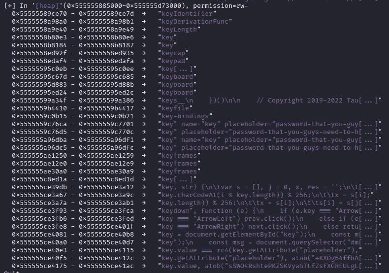

关键模式指示

您会注意到地址 0x 55555 ce 3a 67、0x 55555 ce 3a 7a、0x 55555 ce 40 e 3、0x555555ce40f5 和 0x555555ce4175 中的一些内容。Javascript 引用了我们的**输入**的**值**，并在其中进行一些算法验证。让我们试着把它们也扔掉。

```
gef➤  x/s 0x555555ce39db-443
0x555555ce3820: "lags/ukraine.png',\n    title: 'ukraine',\n  },\n  {\n    image: './flags/china.png',\n    title: 'china',\n  },\n  {\n    image: './flags/japan.png',\n    title: 'japan',\n  },\n  {\n    image: './flags/indonesia.png',\n    title: 'indonesia',\n  },\n  {\n    image: './flags/usa.png',\n    title: 'usa',\n  },\n  {\n    image: './flags/malaysia.png',\n    title: 'malaysia',\n  },\n  {\n    image: './flags/not-flag.png',\n    title: 'not-flag'\n  }\n];\n\nfunction rc4(key, str) {\n\tvar s = [], j = 0, x, res = '';\n\tfor (var i = 0; i < 256; i++) {\n\t\ts[i] = i;\n\t}\n\tfor (i = 0; i < 256; i++) {\n\t\tj = (j + s[i] + key.charCodeAt(i % key.length)) % 256;\n\t\tx = s[i];\n\t\ts[i] = s[j];\n\t\ts[j] = x;\n\t}\n\ti = 0;\n\tj = 0;\n\tfor (var y = 0; y < str.length; y++) {\n\t\ti = (i + 1) % 256;\n\t\tj = (j + s[i]) % 256;\n\t\tx = s[i];\n\t\ts[i] = s[j];\n\t\ts[j] = x;\n\t\tres += String.fromCharCode(str.charCodeAt(y) ^ s[(s[i] + s[j]) % 256]);\n\t}\n\treturn res;\n}\n\nHTMLElement.prototype.empty = function() {\n  while (this.firstChild) {\n      this.removeChild(this.firstChild);\n  }\n}\n\ndocument.addEventListener(\"DOMContentLoaded\", function () {\n  fillCards();\n  const next = document.getElementById(\"next\");\n  const prev = document.getElementById(\"prev\");\n  next.addEventListener(\"click\", function () {\n    const currCard = document.querySelector(\".card.view\");\n    const nextCard = currCard.nextElementSibling\n      ? currCard.nextElementSibling\n      : document.querySelector(\".card-container\").firstElementChild;\n    currCard.classList.remove(\"view\");\n    nextCard.classList.add(\"view\");\n  });\n\n  prev.addEventListener(\"click\", function () {\n    const currCard = document.querySelector(\".card.view\");\n    const prevCard = currCard.previousElementSibling\n      ? currCard.previousElementSibling\n      : document.querySelector(\".card-container\").lastElementChild;\n    currCard.classList.remove(\"view\");\n    prevCard.classList.add(\"view\");\n  });\n\n  document.addEventListener(\"keydown\", function (e) {\n    if (e.key === \"ArrowLeft\") prev.click();\n    else if (e.key === \"ArrowRight\") next.click();\n    else return false;\n  });\n\n  document.querySelector(\"#upgrade\").addEventListener(\"click\", function () {\n    const key = document.getElementById(\"key\");\n    const msg = document.querySelector(\"#message\");\n    if (key.value === rc4(key.getAttribute(\"placeholder\"), atob(\"+KXDg64ffbAnFhbDbfvFqoK8jEOsod1qhvEXXPWzXnc2I5u/tkcf+eQ=\"))) {\n      data[6].image = rc4(key.value, atob(\"sSWO4RshtePKZSKVyaGTLfZsFXGREULgLLgFgKtLweWHQWGz+oVm6qocDzecEGOA2aR5pg95NkibE2H0aA==\"));\n      data[6].title = \"flag\";\n      msg.textContent = \"Correct!!, now not-flag should evolve to a flag\",\n      fillCards();\n    } else {\n      msg.textContent = \"Wrong password!!\";\n    }\n  });\n\n  document.querySelector(\".btn\").addEventListener(\"click\", function () {\n    const img = this.children[0];\n    document.querySelector(\".about\").classList.toggle(\"view\");\n    setTimeout(function () {\n      img.setAttribute(\n        \"src\",\n        img.getAttribute(\"src\") === \"./images/icon-cross.svg\"\n          ? \"./images/icon-hamburger.svg\"\n          : \"./images/icon-cross.svg\"\n      );\n    }, 800);\n  });\n});\n\nfunction fillCards() {\n  const container = document.querySelector(\".card-container\");\n  container.empty();\n  data.forEach((data) => {\n    const card = document.createElement(\"div\"),\n      cardImage = document.createElement(\"div\"),\n      img = document.createElement(\"img\"),\n      url = document.createElement(\"a\");\n    img.setAttribute(\"src\", data.image);\n    img.setAttribute(\"alt\", data.title);\n    url.textContent = data.title;\n    card.classList.add(\"card\");\n    cardImage.classList.add(\"card-image\");\n    if (data.title === \"ukraine\") {\n      card.classList.add(\"view\");\n    }\n    cardImage.appendChild(img);\n    card.appendChild(cardImage);\n    card.appendChild(url);\n    container.appendChild(card);\n  });\n}\n\005"
```

虽然垃圾场不是那么完美，但我们得到了这个想法。它将我们的输入与转换后的数据进行比较，转换后的数据通过硬编码密钥**和输入占位符本身传递给 RC4 流密码。我们可以将它写入 Javascript，并再次将输出传递给 **Tauri 应用**，并获得正确的标志。**

```
function rc4(key, str) {
    var s = [],
        j = 0,
        x, res = '';
    for (var i = 0; i < 256; i++) {
        s[i] = i;
    }
    for (i = 0; i < 256; i++) {
        j = (j + s[i] + key.charCodeAt(i % key.length)) % 256;
        x = s[i];
        s[i] = s[j];
        s[j] = x;
    }
    i = 0;
    j = 0;
    for (var y = 0; y < str.length; y++) {
        i = (i + 1) % 256;
        j = (j + s[i]) % 256;
        x = s[i];
        s[i] = s[j];
        s[j] = x;
        res += String.fromCharCode(str.charCodeAt(y) ^ s[(s[i] + s[j]) % 256]);
    }
    return res;
}

console.log(rc4("password-that-you-guys-need-to-have",atob("+KXDg64ffbAnFhbDbfvFqoK8jEOsod1qhvEXXPWzXnc2I5u/tkcf+eQ=")))
```

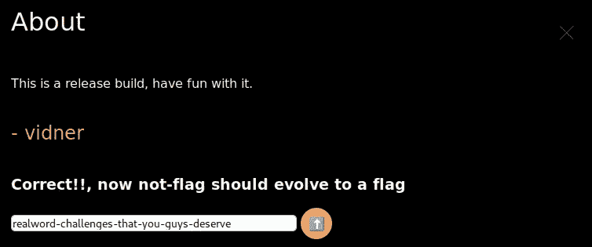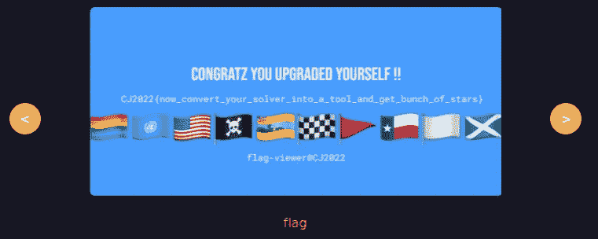

# 用二进制仪器进行 Brotli 解压缩

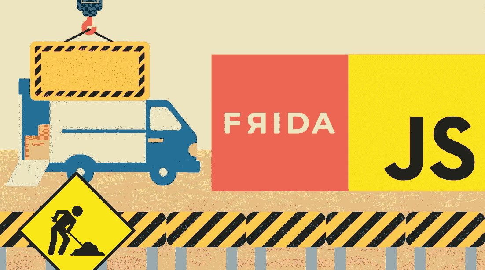

第二种方法对这个 **Tauri 应用**更精确，因为我们将结合我们的背景知识的细节，了解它如何在默认情况下用 Brotli 压缩存储我们的**资产**。

回到 IDA 的静态分析，我们知道有几个对 **BrotliDecompressor** 的函数调用。

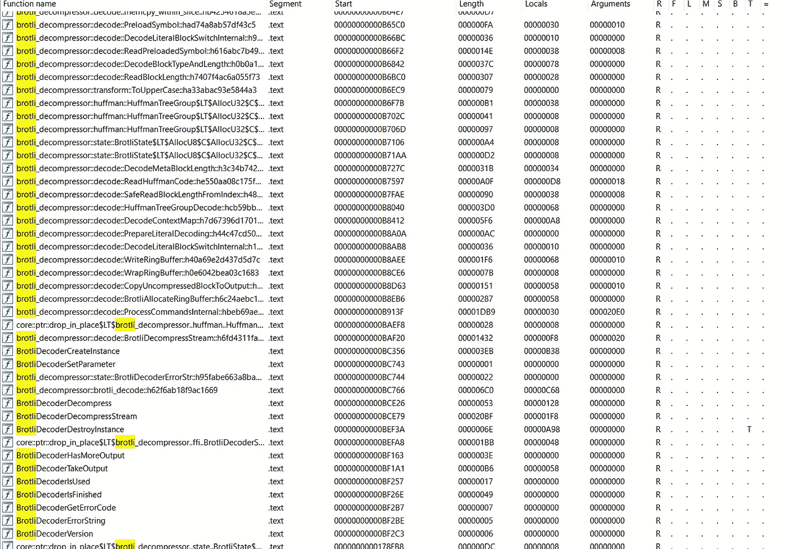

布罗特利减压器

这些调用被分类，如果我们看一看 **0xBAF20** 处的最终函数调用，我们可以认为它是解压缩内容的最终产品，因为它解压缩了可以被认为是**资产**的流，而高位地址保存了特定解压缩子程序的功能。

那么，我们如何检查从二进制文件传入某个本机函数的参数呢？这里出现了 Frida 的角色，它是我们将要使用的二进制工具之一。Frida 使用一个名为**拦截器**的 Javascript API 来拦截本地函数中的调用，我们可以使用返回值，在特定的区间范围内修补一些地址，打印出寄存器或参数等等，就像下面的 Frida 官方文档告诉它的那样。


首先，作者试着调试在这个函数中传递了什么样的信息，比如参数。我们还需要检查从 IDA 传递了多少参数。

```
__int64 __fastcall brotli_decompressor::decode::BrotliDecompressStream::h6fd4311faa5fd5ae(
        _QWORD *a1,
        unsigned __int64 *a2,
        _BYTE *a3,
        unsigned __int64 a4,
        _QWORD *a5,
        _QWORD *a6,
        __int64 a7,
        unsigned __int64 a8,
        __int64 a9,
        __int64 a10)
```

传递了 10 个参数，我们不知道它是大小、地址指针还是空值，所以让我们试着检查所有参数。我们将使用**拦截器**和**brot Li _ compressor::decode::brot lide compressstream::h6fd 4311 FAA 5 FD 5 AE**的地址，也将使用另一个 Javascript API **模块**对其进行重新设置。

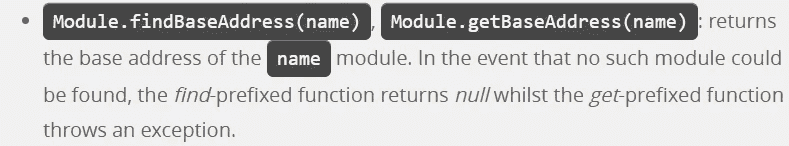

Frida JS API 文档，关于使用偏移地址进行重置

```
Interceptor.attach(Module.findBaseAddress("flag-viewer").add(0xbaf20), {
        onEnter: function(args) {
            console.log("[+] Hooked brotlidecompress!");
            this.arg0 = args[0];
            this.arg1 = args[1];
            this.arg2 = args[2];
            this.arg3 = args[3];
            this.arg4 = args[4];
            this.arg5 = args[5];
            this.arg6 = args[6];
            this.arg7 = args[7];
            this.arg8 = args[8];
            this.arg9 = args[9];

        },
        onLeave: function(retval) {

            send(ptr(this.arg0));
            send(ptr(this.arg1));
            send(ptr(this.arg2));
            send(ptr(this.arg3));
            send(ptr(this.arg4));
            send(ptr(this.arg5));
            send(ptr(this.arg6));
            send(ptr(this.arg7));
            send(ptr(this.arg8));
            send(ptr(this.arg9));
        }
    });
```

准备好脚本后，我们可以使用下面的命令用 **Frida** 来执行它。

```
frida -f ./flag-viewer -l your_script_name.js
```

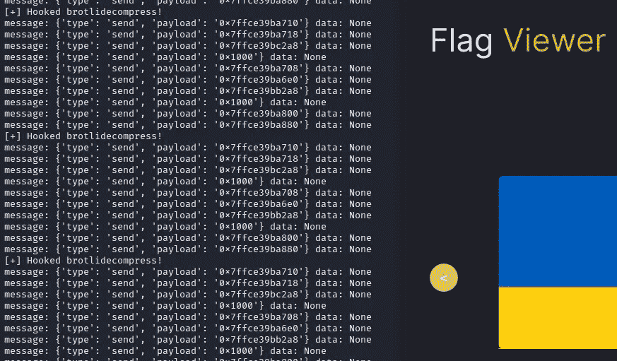

挂钩地址视图及其返回数据

如果我们仔细检查，大多数参数包含指针地址，但第四个和第八个参数不包含，而是返回某种大小数据。我们不应该读这些，因为它会触发**访问冲突**。所以我们要读的是排除了第四个和第八个参数的指向地址。稍后，我们可以将我们的 Frida 脚本修改成这样。

```
Interceptor.attach(Module.findBaseAddress("flag-viewer").add(0xbaf20), {
        onEnter: function(args) {
            console.log("[+] Hooked brotlidecompress!");
            this.arg0 = args[0];
            this.arg1 = args[1];
            this.arg2 = args[2];
            this.arg3 = args[3];
            this.arg4 = args[4];
            this.arg5 = args[5];
            this.arg6 = args[6];
            this.arg7 = args[7];
            this.arg8 = args[8];
            this.arg9 = args[9];

        },
        onLeave: function(retval) {

            try{
                console.log(ptr(this.arg0).readCString());
            }catch(err){
                console.log("Exception!")
            }
            try{
                console.log(ptr(this.arg1).readCString());
            }catch(err){
                console.log("Exception!")
            }
            try{
                console.log(ptr(this.arg2).readCString());
            }catch(err){
                console.log("Exception!")
            }
            try{
                console.log(ptr(this.arg4).readCString());
            }catch(err){
                console.log("Exception!")
            }
            try{
                console.log(ptr(this.arg5).readCString());
            }catch(err){
                console.log("Exception!")
            }
            try{
                console.log(ptr(this.arg6).readCString());
            }catch(err){
                console.log("Exception!")
            }
            try{
                console.log(ptr(this.arg8).readCString());
            }catch(err){
                console.log("Exception!")
            }
            try{
                console.log(ptr(this.arg9).readCString());
            }catch(err){
                console.log("Exception!")
            }
        }
    });
```

再次运行脚本，我们将看到所有的 **解压缩资产**都成功了，包括 CSS、HTML 和 Javascript。我们设法泄露了原始应用程序的**源代码**。

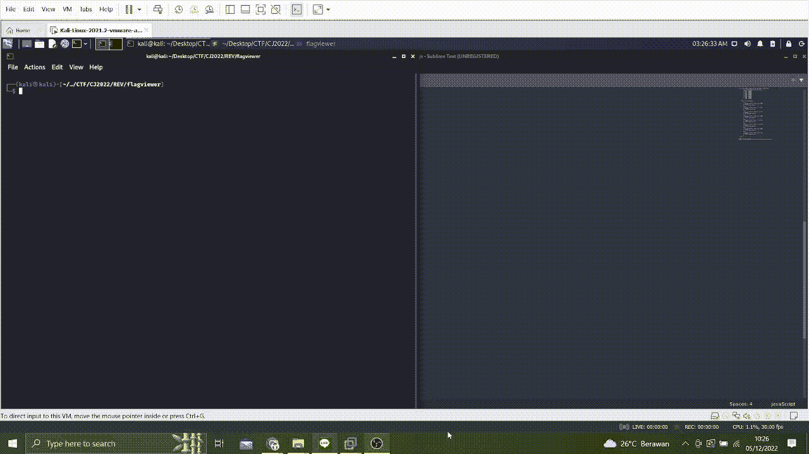

作者还要感谢 Maulvi Alfansuri，在 2 天的比赛结束后，他帮助 Frida JS 编写了这个脚本，他也有一些技巧来应对现实世界中的 Android 挑战。也可以随时联系他！

# 关键要点


我们知道当使用 **Tauri App** 作为选择时，该应用可以有多轻便，但事实上，想要迁移其由 web 组件组成的基础设施的用户或开发者不应存储可能非常敏感的**硬编码数据**。本演示的结论是，我们有能力泄漏您的应用程序源代码，因为只有压缩用于存储所需基础架构应用程序的资产。在 [**CWE-798:硬编码凭证的使用**](https://cwe.mitre.org/data/definitions/798.html) 中提到了“人”造成的这个漏洞。

作者让读者选择是 **Electron.js** 还是 **Tauri** 适合您的应用程序在单个桌面应用程序中迁移。我希望你通过阅读这些内容可以学到一些新的东西，到我写完这篇文章的时候， **Tauri 应用程序版本已经是 1.2 了。**也许他们的开发人员也想考虑加强他们的核心基础设施，以获得更大的逆向工程弹性，这样他们就可以实施更多的加密实施来保护资产，甚至尝试实施反逆向工程方法。

感谢您阅读此内容！订阅并关注我，了解更多网络安全话题😁。

# 参考

[](https://tauri.app/) [## 使用 web 前端| Tauri Apps 构建更小、更快、更安全的桌面应用程序

### Tauri 是一个为所有主流桌面平台构建微小、高速二进制文件的框架。开发人员可以集成…

tauri.app](https://tauri.app/) [](https://www.exploit-db.com/papers/13234) [## 攻击性安全利用数据库档案

### 虐待。还有。乐趣和利润的来源-本文…

www.exploit-db.com](https://www.exploit-db.com/papers/13234) [](https://github.com/tauri-apps/tauri) [## GitHub - tauri-apps/tauri:用 web 构建更小、更快、更安全的桌面应用程序…

### 使用 web 前端构建更小、更快、更安全的桌面应用程序。- GitHub - tauri-apps/tauri:构建…

github.com](https://github.com/tauri-apps/tauri)  [## Tauri 文档 WIP

### 编辑描述

jonaskruckenberg.github.io](https://jonaskruckenberg.github.io/tauri-docs-wip/quick-start/index.html)  [## 弗里达手册

### Frida 手册，学习桌面系统(Windows、Linux、MacOS)中二进制插装基础知识的资源

learnfrida.info](https://learnfrida.info/)  [## 欢迎

### 观察并重新编程在 Windows、macOS、GNU/Linux、iOS、watchOS、tvOS、Android、FreeBSD 和 QNX 上运行的程序

frida.re](https://frida.re/docs)  [## 陶里锈病

### Tauri 是一个为所有主流桌面平台构建微小、高速二进制文件的框架。开发人员可以集成…

文件](https://docs.rs/tauri/latest/tauri/)  [## brotli - Rust 中的 brotli 压缩

### 板条箱“brotli”中铁锈“brot Li de compress”fn 的 API 文件。

文件](https://docs.rs/brotli/latest/brotli/fn.BrotliDecompress.html) 

随时欢迎支持我！

[](https://www.buymeacoffee.com/aseng)

[https://trakteer.id/felix-alexander-swfnt/tip?open=true](https://trakteer.id/felix-alexander-swfnt/tip?open=true)