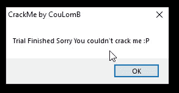
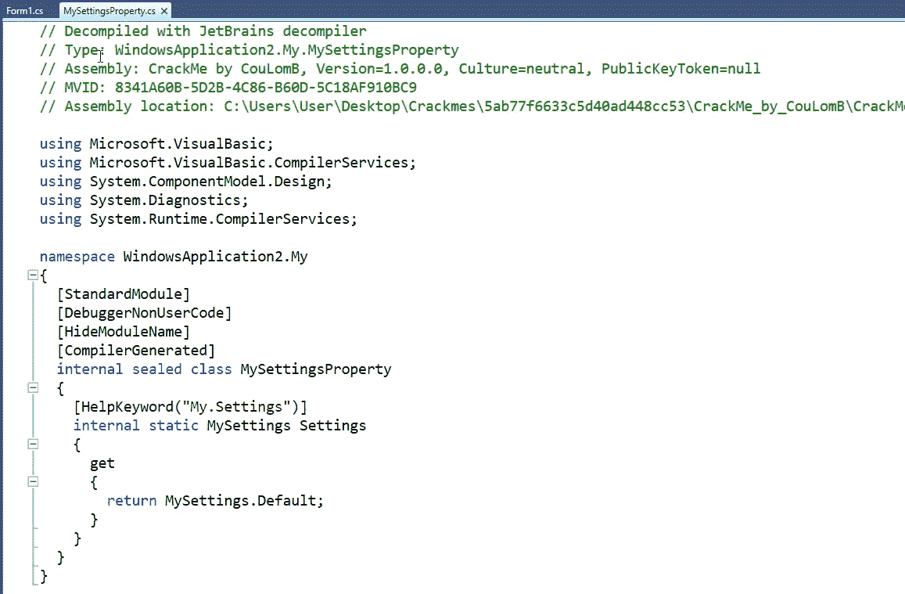
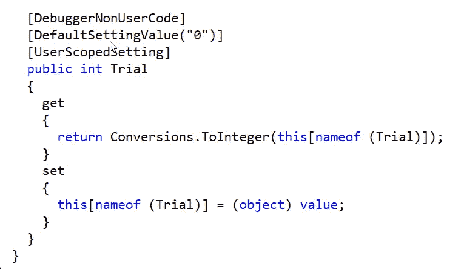
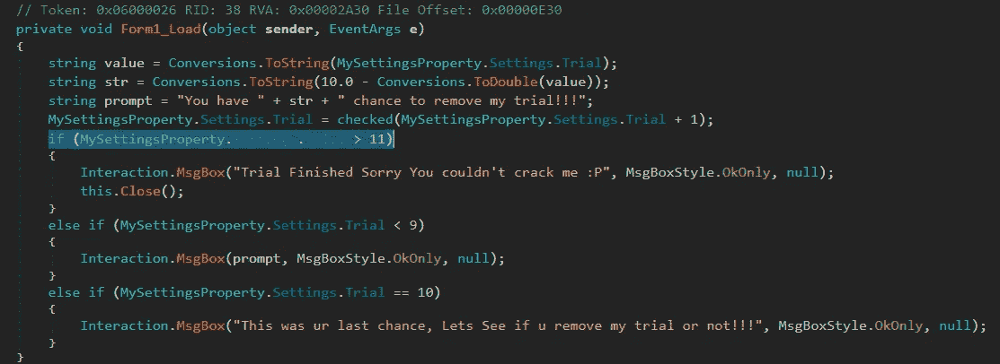
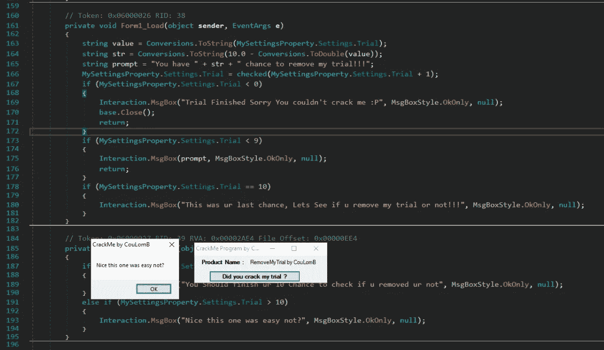

# [逆向工程]击败一个. net 黑客的审判

> 原文：<https://infosecwriteups.com/reverse-engineering-beating-a-trial-on-a-net-crackme-d4ab6604f10b?source=collection_archive---------0----------------------->

今天我们要处理另一个问题。net crackme 。让我们看看进展如何…

crackme 是一种 X 倍使用试验。在我们打开可执行文件 10 次后，我们有机会测试我们是否破解了试用版。

测试试验验证

使用 dotPeek，我们可以反编译二进制文件，搜索负责跟踪试验的类。

使用 dnSpy，我们不仅可以检查二进制文件，还可以轻松地修补代码。如果我们改变这一行的验证，它永远不会是真的，我们就有效地破解了二进制代码。

于是我这么做了，将硬编码的 **9** 改为 **0** 使得验证无效，因为它不可能是真的。

现在我们可以任意多次启动二进制文件，而不会出现任何问题！

 [## 系统调用 59

### Syscall 59 的最新推文(@syscall59)。功能过多的脚本小子。Linux &逆向工程迷。意大利

twitter.com](https://twitter.com/syscall59) 

*关注* [*Infosec 报道*](https://medium.com/bugbountywriteup) *获取更多此类精彩报道。*

 [## 信息安全报道

### 收集了世界上最好的黑客的文章，主题从 bug 奖金和 CTF 到 vulnhub…

medium.com](https://medium.com/bugbountywriteup) 

## 实用逆向工程教程

如果你想了解更多关于逆向工程的知识，有一本很棒的书叫做《实用逆向工程》,虽然它有点过时，但对于那些想学习的人来说，它仍然是一个很好的起点。如果你需要一个好的演示，你可以看看这些视频:[实用逆向工程教程](https://guidedhacking.com/threads/practical-reverse-engineering-exercise-solutions.15332/)。