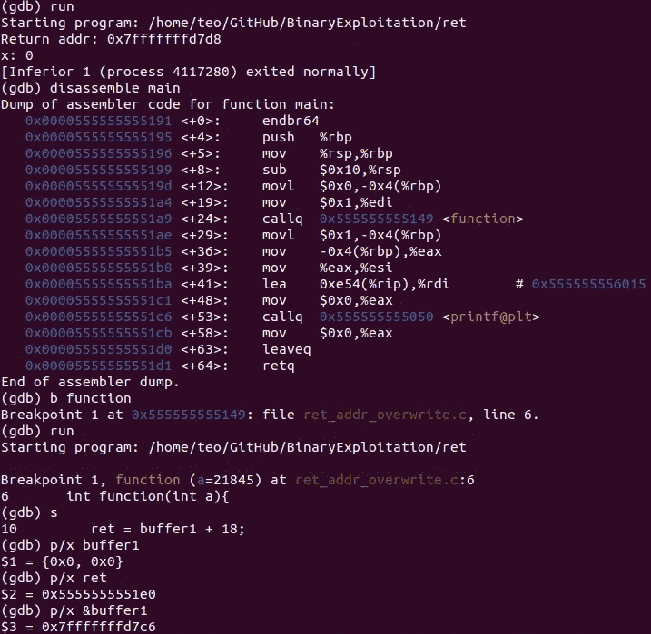
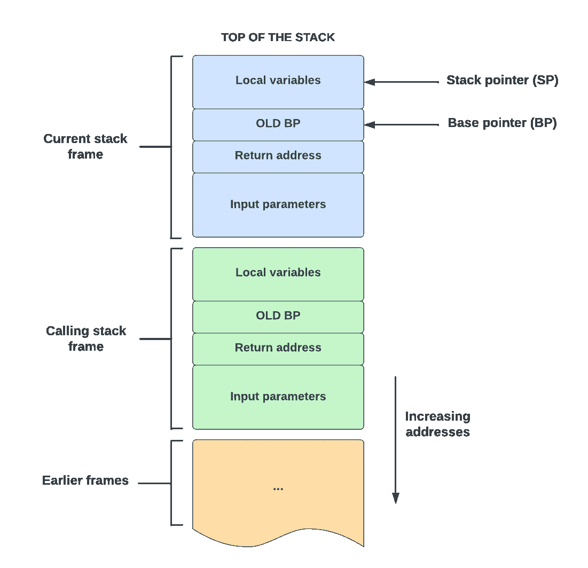

# 揭示 C 编程中的漏洞:逆向工程和利用函数调用指南

> 原文：<https://infosecwriteups.com/reverse-engineering-function-call-in-c-and-exploiting-it-b1b539974018?source=collection_archive---------1----------------------->

在当今的数字时代，公司正在花费越来越多的资金来保护其基础设施免受网络攻击。但事实是，**不是会不会被黑的问题，而是什么时候**。

在这篇文章中，我想让你了解一个看似简单的 C 函数是如何导致程序执行中断的。我们将研究**如何利用函数**的返回地址以及它对程序行为的潜在影响。



GDB 快照

# 一点理论

在副标题中，我提到了二进制利用——这是网络安全中的一个广泛话题，**归结为找到程序中的漏洞，并利用它来获得对外壳的控制或修改程序的功能**。如果这没有吓到你，让我为你重新措辞。如果有人设法利用二进制开发技术来利用您的系统，您就大错特错了。他/她不仅可以访问整个系统，还可以利用它来执行其他恶意任务，如 DDoS。

为了用一个简单的 C 代码函数调用的例子来演示这一点，我们需要了解一两件关于程序执行和幕后“参与者”的事情。首先是寄存器。

## 登记

执行程序(即程序指令)需要各种寄存器。寄存器是一种超快速存储器，它存储几个不同的指针，这些指针在整个存储器中来回指向，以执行程序的指令:

*   **栈指针** (SP) **指向栈顶**(最低数字地址)——栈底在固定地址。堆栈指针(SP)也是实现相关的。它可能指向堆栈上的最后一个地址，或者指向堆栈后的下一个空闲地址。
*   **帧指针** (FP)也是**局部基址指针** (LB) **指向调用函数**时推入并弹出的逻辑堆栈帧的开始。在英特尔 CPU 上，帧指针被称为 BP (EBP ),我也将在下面的章节中使用它。因为 BP 是固定的，所以我们可以用它来引用堆栈框架中的变量
*   **堆栈帧** (SF) **由函数**(从右到左)**的输入参数、返回地址、前一个 BP 及其局部变量**组成
*   **指令指针** (IP) **指向下一条指令的位置**——虽然与“堆栈指针”不完全相关，但为了避免任何混淆，还是提一下它为好

下图说明了每种方法的用途，这至少对于解释以便进一步理解概念是至关重要的。



还有许多其他的寄存器，但是提到的这些寄存器足以执行我们正在讨论的利用。上面的图像描绘了堆栈的快照，但仍然有疑问的是这个堆栈是如何增长或收缩的。这就把我们带到了下一节。

## 功能序言

如果我说你的代码最常执行的任务是调用一个函数，我可能没有完全弄错。在每次函数调用之前，都会有一个叫做函数序言的东西出现。在汇编语言编程中，函数序言是在函数开头的几行代码，它为函数中使用的堆栈和寄存器做准备。开场白是这样的:

***1。)*** **通过将旧 BP 推送到堆栈来保存它** (SP 相应地更新)

> ❓ **你为什么需要拯救老 BP？**
> 
> 💡因为一旦子例程/函数退出，它需要有一个对调用堆栈框架的引用。记住，局部变量可以通过在 BP 上加上或减去偏移量来引用。
> 
> ❓:但寄信人地址不就是为了这个吗？
> 
> 💡不。返回地址不指向前一个堆栈帧，而是指向调用方法中的下一条指令。

***2。)*将 SP 复制到 BP 中以创建新的 BP** —指向内存中局部变量缓冲区的开始

***3。)*** **提前 SP 为逻辑栈帧** —即函数局部变量预留空间

有许多其他伟大的文章比我更好地说明了这一点，但这是我们需要理解的东西，以便能够理解下一节中的黑客。

# 砍

*现在有趣的部分来了*——随着理论的发展，如果我们**修改子例程**中的返回地址值，我们可以影响调用函数中代码执行的位置(在子例程完成之后)。还是不是？让我们试着在代码中看到它。

这个概念是这样的:

1.  **在堆栈上找到返回地址的位置**
2.  **创建一个指向那个位置的指针**
3.  **修改返回地址的值，即值指针指向**

我们将在下面的代码中演示这一点:

这是一个基本的 C 代码，我相信你们大多数人都已经理解了。主要思想是**创建一个指针** *(第 10 行)* **指向堆栈上的返回地址内存位置并修改其值**以跳过*第 19 行* **。**返回地址内存位置可以通过偏移 *buffer1* 的内存位置来计算——一个 *char* 类型变量*(第 8 行)*的数组。该偏移量可以计算为从*缓冲器 1* 到 BP 的偏移量和 BP 大小的**之和。看看上面的图表可以帮助你自己。**

> 💡**64 位系统上指针的大小是 8 字节，32 位系统上是 4 字节。**

为了计算出 *buffer1* 和 BP 之间的偏移量，我们将使用一个 [**GDB — GNU 调试器**](https://de.wikipedia.org/wiki/GNU_Debugger) 。这不是一个关于 GDB 的教程，所以我将只列出你可以运行的命令来获取两者的内存位置并计算偏移量。

```
**gcc binexploit1.c -g -o binexploit -fno-stack-protector** # compile
**gdb binexploit** # open GDB shell
(gdb) **break function** # set a breakpoint
(gdb) **run** # run code to the breakpoint
(gdb) **step** # take the next step
(gdb) **print/x &buffer1** # print memory address of buffer1(gdb) **info registers** # print register information - in the output look for **rbp** row and the memory address it is pointing to
```

现在我们有了这两个值，我们可以通过简单的十六进制算法[计算两者之间的偏移量(如果必须的话，使用](https://www.calculator.net/hex-calculator.html)[十六进制计算器](https://www.calculator.net/hex-calculator.html))**并加上 BP** 的大小(在我的例子中*是 8 字节*，因为我是在一台 *64 位*机器上运行的)。这是脚本顶部的 X 值。

> ❓ **为什么我们取** `***buffer1 + X***` **的和而不减去**？
> 
> 💡堆栈向下增长—朝着较低的地址。这是它在许多计算机上实现的方式，包括英特尔、摩托罗拉、SPARC 和 MIPS 处理器。

接下来，我们需要修改返回地址的值来跳过赋值`***x = 1;***` *(第 19 行)*并在下一行打印出`***"x: 0”***`。因为我们已经有了指向返回地址内存位置的指针`***ret***`，我们只需要修改它的值为*第 20 行*而不是*第 19 行*(在代码中)。简单来说，我们可以这样做，首先将`***Y***`设置为零，并增加它，直到跳过想要的行，或者我们可以使用 GDB 来拆卸内存——这取决于你。以下是需要在 GDB 运行的命令:

```
**gdb binexploit** # open GDB shell
(gdb) **disassemble main** # disassemble main function memory
```

输出应该如下所示:

我们可以看到*第 10 行*(赋值操作)和*第 11 行*(打印功能的“准备”)之间的偏移量是 *7 字节*，这是我们的`***Y***`值。

> 💡**上面的代码片段或者我应该说输出的是** [**汇编代码**](https://en.wikipedia.org/wiki/Assembly_language) **你的特定 CPU 架构是能够理解和执行的。您可能想更深入地了解一下，以更好地理解我是如何确定 printf 语句的起始位置的。**

请注意，现实世界中的这种攻击通常很容易被检测和阻止，但是如果您想了解一两件关于堆栈的事情，我发现这非常有趣。类似地，我们可以使用堆内存来实现同样的事情，但是我会把这个麻烦留给你😉

这就是这篇文章的全部内容——我正在准备这篇文章的第二部分，我们将研究一种类似的方法，其中我们不仅将执行延迟到程序的后期，而且还执行任意命令，如运行 shell 或 Python 脚本。

# 而不是结论

在我结束本教程之前，我想挑战你:

> *在*第 12 行*中，尝试将* **buffer1** *改为***buffer 2***——然后相应地更新* `***X***` *和* `***Y***` *，以达到与我们(* `***"x: 0”***` *)相同的结果。*

请在评论中告诉我你的结果。

> 感谢阅读！😎如果你喜欢这篇文章，点击下面的按钮👏
> 
> 对我来说意义重大，也有助于其他人了解这个故事。在 [Linkedin](https://www.linkedin.com/in/teodor-janez-podobnik/) | [Twitter](https://twitter.com/TeodorJanez) 上打招呼
> 
> 要不要开始读 Medium 上的独家故事？使用此[推荐链接](https://medium.com/@tp4348/membership)🔗
> 
> 如果你喜欢我的帖子，你可以[给我买一个热狗](https://www.buymeacoffee.com/tp4348)🌭
> 
> 你是一个热情的工程师，但缺乏能力来编写引人注目和鼓舞人心的技术内容吗？雇用我做🛠️的升级工作
> 
> 在 Teodor J. Podobnik，@dorkamotorka 上查看我的其他内容，并关注我的更多内容，干杯！

## 来自 Infosec 的报道:Infosec 每天都有很多内容，很难跟上。[加入我们的每周简讯](https://weekly.infosecwriteups.com/)以 5 篇文章、4 个线程、3 个视频、2 个 GitHub Repos 和工具以及 1 个工作提醒的形式免费获取所有最新的 Infosec 趋势！