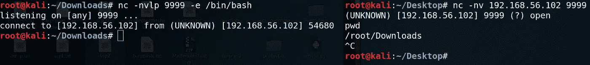
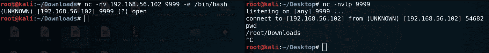

# 反向外壳与绑定外壳

> 原文：<https://infosecwriteups.com/reverse-shell-vs-bind-shell-d5a1e80b6a6c?source=collection_archive---------1----------------------->

嘿伙计们！又是 Anmol！

这篇文章是关于反向外壳和绑定外壳的。首先，我想说，写这篇文章的目的是让人们了解什么是反向外壳和绑定外壳，以及它们有什么不同。

这背后还有一个个人原因，当我开始学习道德黑客/pentest 时，我对获得反向外壳非常困惑，但我实际上不知道什么是反向外壳以及它的含义。我陷得太深了。

但是现在我明白了，想和大家分享一下。希望读完这篇文章后，你会知道反向和绑定 shell 是什么意思。

**让我们来看看基本的区别**

W 帽子是贝壳？

外壳是一种软件，充当用户和内核之间的中介。它为用户提供了一个访问内核服务的接口。例如:Bash Shell 等。

# 绑定外壳

绑定外壳让**监听器在目标上运行**，而**攻击者连接到监听器**以获得远程外壳。

Netcat 绑定外壳

Bind Shell 类似于通过网络与其他计算机建立远程控制台的设置。在 Bind shell 中，攻击者在目标计算机上启动一个服务(如 Netcat ),攻击者可以连接到该服务，如上面的示例所示。在 bind shell 中，攻击者可以连接到目标计算机并在目标计算机上执行命令。

> 要启动 bind shell，攻击者必须拥有受害者的 IP 地址才能访问目标计算机。

# 反向外壳

反向外壳让监听器在攻击者上运行，而 ***目标用外壳连接到攻击者*** 。

反向 Shell 就像一个设置，攻击者必须首先在他的机器上启动服务器，而目标机器必须充当连接到攻击者所服务的服务器的客户端。成功连接后，攻击者可以访问目标计算机的外壳。

> 要启动反向外壳，攻击者不需要知道受害者的 IP 地址就可以访问目标计算机。

就是这样！

希望你们现在明白什么是绑定和反向外壳。

你可以拍手欣赏我的作品。