# 逆转微软的 Windows95 产品密钥检查机制

> 原文：<https://infosecwriteups.com/reversing-microsofts-windows95-product-key-check-mechanism-ca7e825014b6?source=collection_archive---------0----------------------->

让我们回到过去，看看 25 年前需要什么才能确保安全！

# 放弃

> Microsoft Windows95 是微软公司的注册资产，于 1995 年 8 月 24 日发布供一般使用。本文纯粹出于教育目的，无意损害任何公司/个人拥有的任何软件/产品。
> 
> 随着 Windows95 的停止(主流支持于 2000 年 12 月 31 日结束，扩展支持于 2001 年 12 月 31 日结束)以及产品密钥检查算法和策略在后续版本中更加先进，我们现在可以安全地讨论这个话题了。

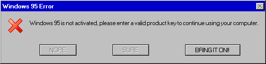

你知道**111–1111111**是一个有效的 Windows95 产品密钥，那么**000–0000007**也是吗？我没有。有一天，我正在浏览 YouTube，通过 stacksmashing 关于这个主题的视频[ [THIS](https://www.youtube.com/watch?v=cwyH59nACzQ) ]发现了这个问题，他在视频中讨论了这个问题的工作原理，并分析了一些代码，这让我很好奇，于是**我决定自己来做**并反转负责产品密钥检查的库文件。

我就是这样做的，现在我想和你分享我的经验，像往常一样，我试着确保你可以轻松地重现结果，所以我上传了所有的项目文件和源文件供你下载:)

想看的可以看视频，但这里我们会讨论更多。

> 文章难度等级:
> 
> 理解—初学者
> 
> 实现和复制—中间

# 下载资产

如果你愿意的话，下面是你在这篇文章后面需要做的事情。`[All files uploaded on Google Drive]`

 [## Windows95 文章资产- Google Drive

### 文件夹包含所有的个人文件，你可以使用文件夹链接下载所有一次或只下载 setupx.dll 和 Ghidra 文件，如果你想。drive.google.com](https://drive.google.com/drive/folders/1MZSUI3jzLpDLCqKWHeboi7reebREryjV?usp=sharing) 

1.  [Windows95 ISO](https://drive.google.com/file/d/1daadKO2pcWX9If9Q8pojnmYQB8QszWnu/view?usp=sharing)
2.  [setupx.dll](https://drive.google.com/file/d/1QTnpF50QPeshD5jpFlCFiNV03wu3SCrM/view?usp=sharing)
3.  [Ghidra 项目文件](https://drive.google.com/file/d/13nMxFSIM-toiJXJqvTrLkn1FYeKQSkGD/view?usp=sharing)

# 设置虚拟机/串行密钥检查点。

我已经使用 VMware Workstation 16 Pro 安装了 Win95，这个过程非常简单，如果你愿意，你可以按照下面给出的文章进行操作，我添加了一些截图，只是为了追溯到 90 年代。对于本文，我们将在产品密钥提示处停止。

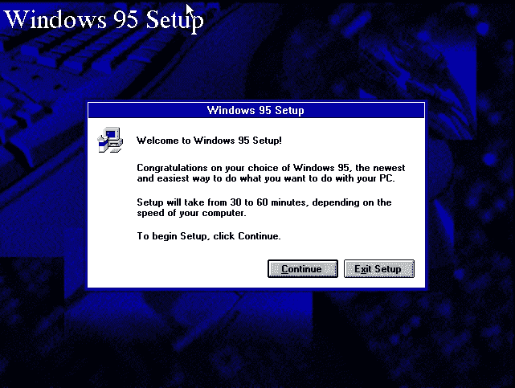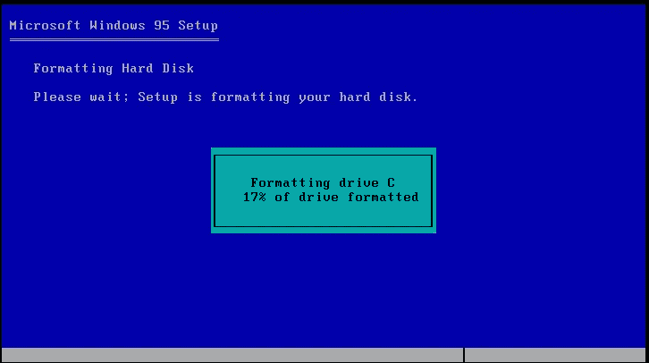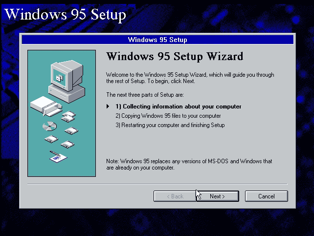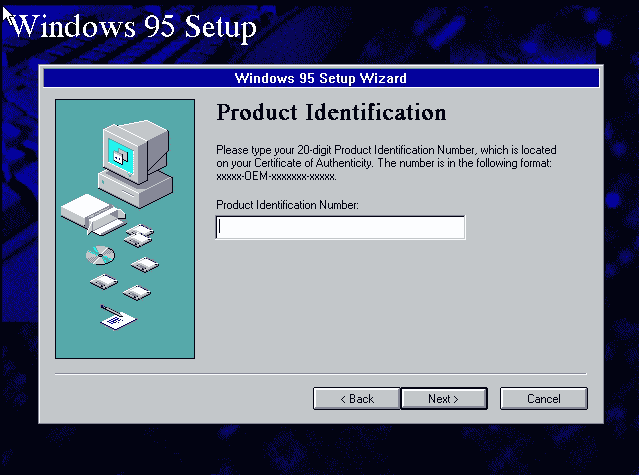

VMWare 官方文章: [Windows 95 安装指南(vmware.com)](https://www.vmware.com/support/ws3/doc/ws32_guestos10.html)

# 好东西

## 我的分析堆栈

1.  **主机 OS :** [Windows 10 Pro。对于工作站](https://saketupadhyay.medium.com/5-step-pre-built-malware-analysis-lab-f70e59521e31)
2.  **分析 OS:**[Kali Linux(Windows Subsystem for Linux[WSL]v 2.0)](https://www.kali.org/docs/wsl/win-kex/)
3.  [7z](https://www.7-zip.org/download.html) ，cabextract， [IDA](https://www.hex-rays.com/ida-free/) ， [Ghidra](https://ghidra-sre.org/)

## 提取 ISO

如果你下载了我在上面上传的资源，你应该有一个`.7z`文件，你可以使用 7zip 存档管理器提取它，你会得到 ISO。

现在 ISOs 类似于 zip 存档，它们是无损的，把所有文件存储在一个容器里，就是这样。ISO 通常不压缩数据，它只是将数据存档。

所以你可以使用任何存档管理软件提取 ISO，我用的是 7zip。

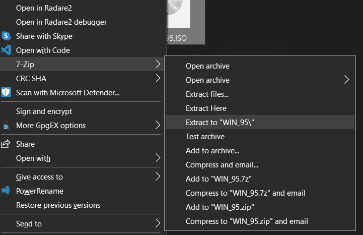

之后你会有一个文件夹，里面会有 ISO 的所有内容。

转到此文件夹，因为我们将在此继续下一步。

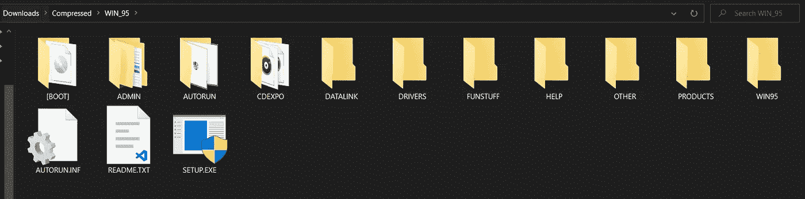

在这里，我打开 PowerShell 并使用`**bash**`激活我的 WSL 发行版

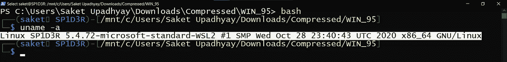

## 寻找负责“产品识别”的代码/库

windows 安装程序中的大多数文件都打包在。cab 或 cab 文件。

> Cabinet 是 Microsoft Windows 的一种存档文件格式，支持无损数据压缩和用于维护存档完整性的嵌入式数字证书。~维基

为了提取这些文件，我使用了 Linux 中的`cabextract`工具。你可以通过你的软件包管理器安装它—

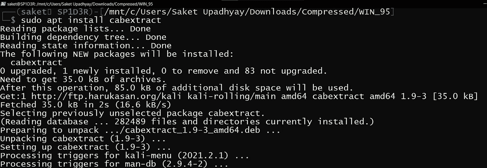

安装后，我们提取 WIN95 文件夹中的所有 CAB 文件

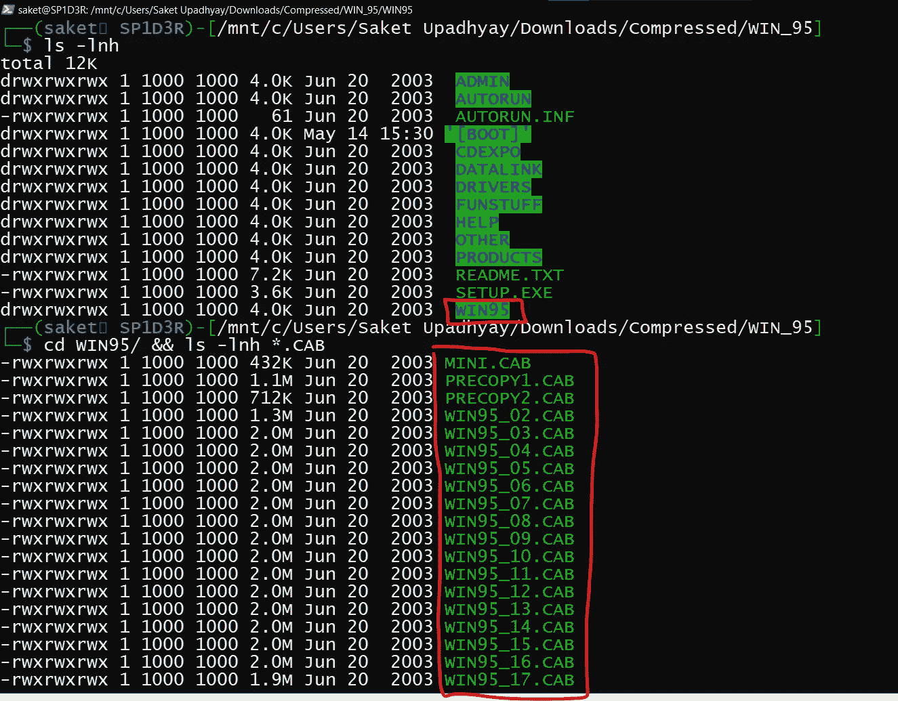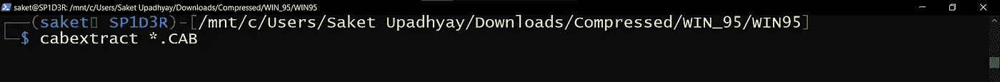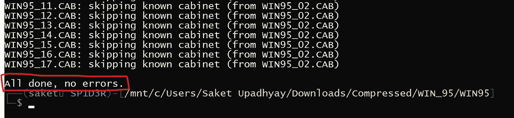

在这之后，你的 WIN95 目录将会被 windows95 用来安装的资源所填充。

然后我们将使用 grep 搜索字符串 ***【产品标识】*** 。

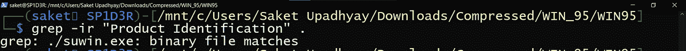

所以我们把`**suwin.exe**`作为潜在的目标，但是根据经验，我知道这些关键的函数不是在单个可执行文件中实现的，而是通过动态库或者`**DLLs**` 加载的，所以我们将试着列出这个过程中使用的库。

所以我们在 Ghidra 中打开`**suwin.exe**`,查看二进制文件的`**IMPORTS TABLE**`

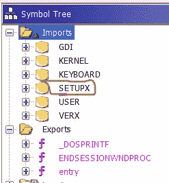

现在，我们可以看到 6 个导入的库

其中，我们可以丢弃 GDI、内核、键盘和用户，因为它们做什么很明显。

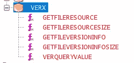

有意思的是 SETUPX 和 VERX 导入，看 VERX 的导入函数，看起来这个是用来获取文件版本等文件信息的。所以我们剩下的唯一目标是 SETUPX。

在解压后的文件夹中搜索，我们得到了对`**setupx.dll**`动态库文件的引用，该文件由`**suwin.exe**`使用

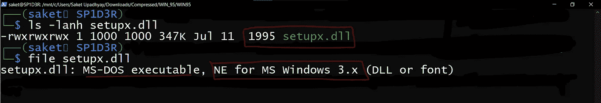

让我们导入这个库，并在 Ghidra 中对此进行分析。

## 在吉德拉进口 setupx.dll

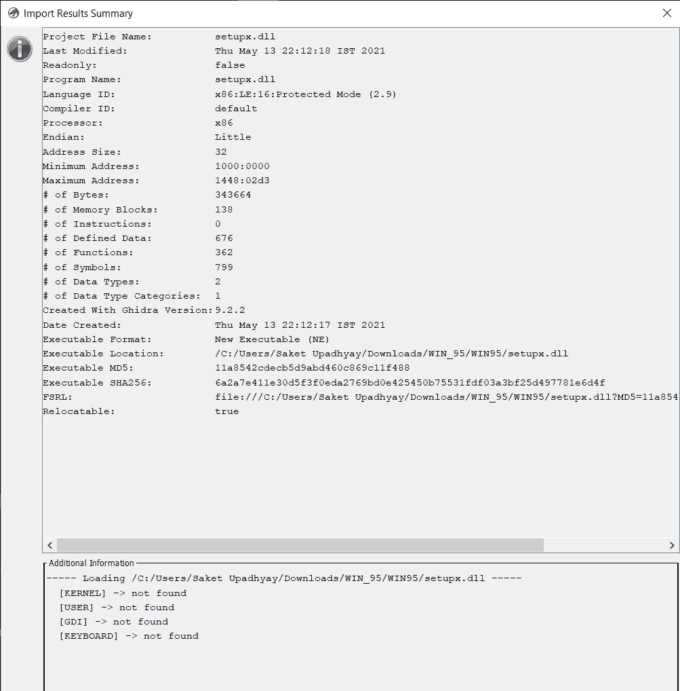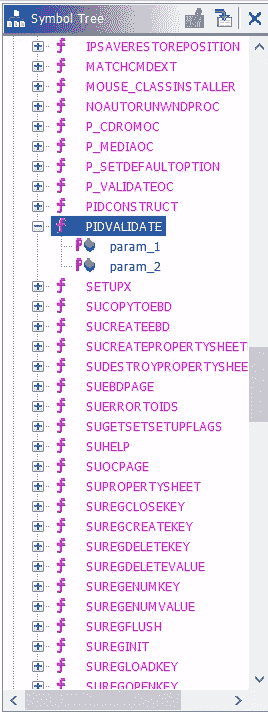

在导入文件并花了一些时间分析库中的函数后，我被弄糊涂了。这里有太多的函数，我不可能检查所有的函数来找到密钥验证机制，所以我查看了函数名并搜索了关键字，还从 stacksmashing 的视频中获取了一些提示。

寻找像“产品密钥”、“验证”、“产品 ID”这样的术语

我们得到了一些有趣的东西。

现在，PIDVALIDATE 函数有两个参数，由许多 switch 语句和案例组成。

进一步观察汇编和反编译的代码，我觉得这些开关条件似乎是用来检查 Windows 操作系统的类型，如“家庭”、“专业”、“企业”、“OEM”等。

# 有趣的东西

> **注:**我已经清理了一些代码，重命名了一些变量，修正了一些定义，还创建了一些干净的基于 GITHUB 的 gists，让你更容易理解。当你自己尝试时，你不会得到完全相同的结果，因为你必须自己做以上所有的事情，但这很有趣，如果你有兴趣，我建议你尝试一下。

继续…在 **PIDVALIDATE** 函数中，我们看到两个我们感兴趣的函数调用。

1.  `**PersonalProductKeyCheck(args);**` 功能负责检查家庭用户钥匙。
2.  `**OEM_KeyCheck(args);**`功能负责 OEM 钥匙检查。

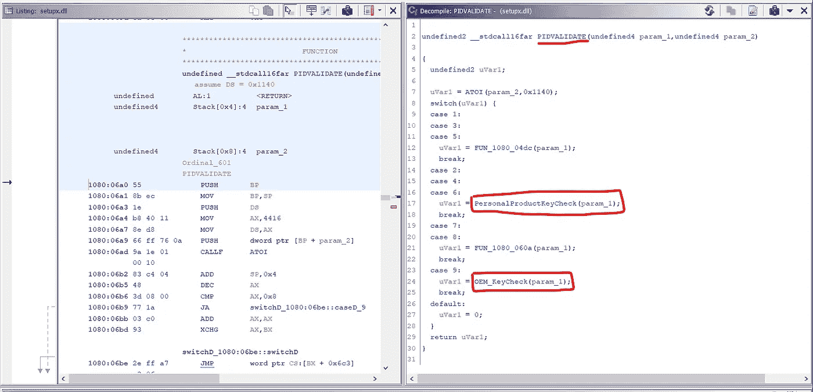

## 产品密钥检查功能

这是检查家庭用户的实际产品密钥的地方。而且我很惊讶地看到**这个代码有多小**！！

在清理代码和修正一些赋值之后，我们得到了这个—

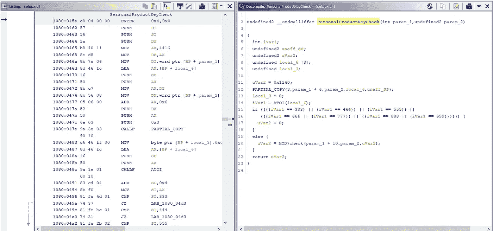

***为您清理-er 代码:***

这里我们可以看到我们得到 2 个参数`**param1 and param2**`，`**param1**` 是产品密钥`**char***` **的字符序列。**

在*第 12 行*中，键的前 3 位数被复制到`**local_6**` 缓冲区，在*第 14 行*字符序列通过`**atoi**` 库函数被转换为整数，那么这只是一个 if 条件，它将拒绝任何以`333, 444 ,555, 666, 777, 888 or 999`开头的键，这意味着如果一个键以除上述列表之外的`000 — 998`开头，它将传递到下一个检查。

## Mod7 检查功能

简而言之，这就是检查**下一个 7 位数数列的和是否能被 7** 整除的函数。就是这样。

如果**数字在 0-8**[第 13 行]之间，并且如果`**—**` **之后的所有数字之和除以 7**[第 19 行]后的余数为 0(零)，则**有效**。

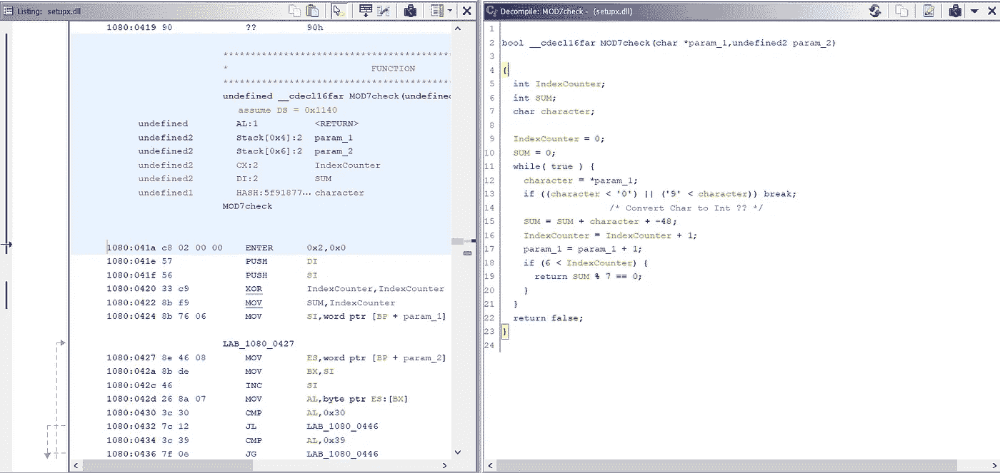

**也就是说如果你的钥匙满足以上条件，就通过了！**

**示例案例 1:**

`**Key = 111-1111111**`，此键有效是因为`**111**` 不在排除列表中，而`**1+1+1+1+1+1+1=7 ; 7%7 = 0**`

**示例案例 2:**

`**Key = 420-0001677**`也作为`**420**` 不在排除列表中而`**0+0+0+1+6+7+7=21 ; 21%7 = 0**`

## OEM 密钥检查

Windows95 也发布了 OEM 版本，这个关键检查与上面的检查“有些”不同。

OEM 密钥采用以下格式:

> AABB-OEM-XXXXXXX-CCCCC

在哪里，

1.  AAA 是 0-366 之间的整数**【第 35 行】**
2.  BB 在 04–93 之间**【第 41 行】**
3.  OEM 是固定字符**【第 17 行】**
4.  XXXXXXX 遵循与上述相同的 mod7 规则**【第 48 行】**
5.  CCCCC 是随机的，根本不检查！

# 测试我们的分析

## 第一种情况

激活码= `**34505-OEM-0000007-13370**`起作用，因为:

1.  0 < 345 < 366
2.  3 < 05 < 94
3.  -OEM-存在
4.  0+0+0+0+0+0+7=7 ; 7%7=0
5.  13370 无所谓。

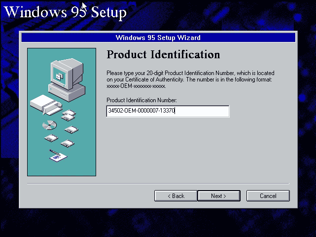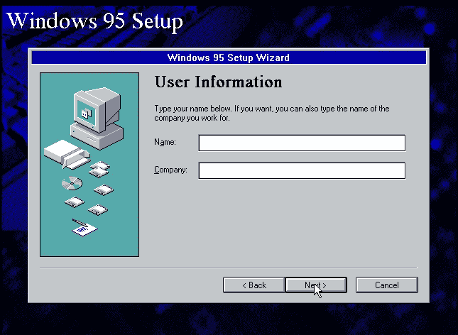

## 第二种情况

激活码= `**35595-OEM-0000696-42069**`

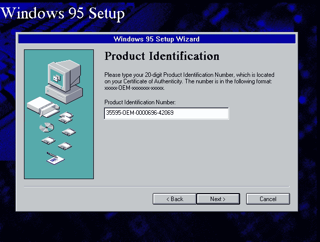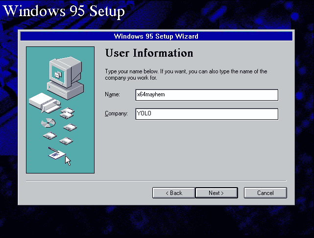

两个都管用！我们可以继续安装。

# 结论

这个小项目很有趣，这也向我们展示了我们在安全性方面取得的进展，从思考***【7 的可分性检查】***到多因素认证、专门优化的哈希函数、可信平台模块等。

我希望你喜欢这个爆炸过去的经验😃。