# REvil —带红线的事件响应

> 原文：<https://infosecwriteups.com/revil-incident-response-with-redline-fe7853699216?source=collection_archive---------0----------------------->

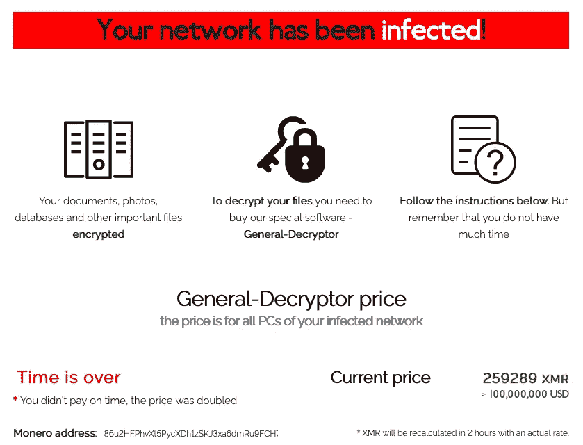

[*REvil 赎金注意*](https://blogs.blackberry.com/en/2021/05/threat-thursday-dr-revil-ransomware-strikes-again-employs-double-extortion-tactics) *。*

最近，我做了一些关于事件响应的研究。为了获得更多的实践，我决定尝试由 *heavenraiza* 和 *RussianPanda 创建的名为“**REvil Corp***”*的免费 TryHackMe 房间。*这篇文章介绍了我使用 Redline 解决这个房间的方法，我还在结尾提供了一个 TryHackMe 的链接，供有兴趣尝试这个房间的人使用。

# 放弃

我喜欢在一篇文章之前添加一个简短的免责声明，以鼓励人们在阅读本文之前尝试一下这个房间，因为在这篇文章中显然会有**剧透****。我相信，如果你先自己尝试一下，然后在遇到困难或需要提示时再来写这篇文章，你会更喜欢 CTF。因此，没有任何进一步的拖延，让我们开始吧！**

# **红线**

**Redline 是 FireEye 提供的免费终端安全工具，可用于通过内存和文件分析来搜索危害迹象(IoC)。提供了一组 IOC,“标记便携代理”会自动配置为收集执行 IOC 分析和 IOC 命中结果审查所需的数据。您可以在下面找到更多关于红线工具的信息，也可以在这里找到它的用户指南。**

** [## 红线|免费安全软件|火眼

### Redline 是 FireEye 首要的免费终端安全工具，为用户提供主机调查功能，以发现…

www.fireeye.com](https://www.fireeye.com/services/freeware/redline.html)** 

# **挑战场景**

> **洛克曼集团的一名员工给一个 IT 部门打了电话；用户感到沮丧，并提到他的所有文件都被重命名为一个他从未见过的奇怪的文件扩展名。在查看了用户的工作站后，IT 人员已经知道发生了什么，并将该案例移交给事件响应团队进行进一步调查。**
> 
> **你是事件响应者。让我们看看您是否可以使用臭名昭著的红线工具来解决这一挑战。祝狩猎愉快，我的朋友！**

# **调查受损的端点**

> **1.被泄露的员工全名是什么？**

**在加载名为 AnalysisSession1 的 Mandiant 分析文件后，我导航到“*分析数据* > *用户*”以识别受损主机上的不同用户。在这里，我可以看到员工的全名:**

**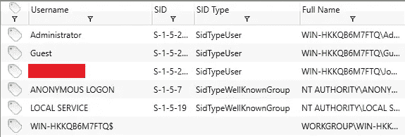**

**员工的全名。**

> **2.被入侵主机的操作系统是什么？**

**要找到被入侵主机的操作系统，我们可以导航到“*分析数据>系统信息*并查看操作系统信息:**

**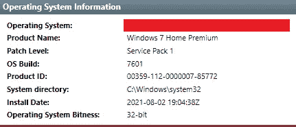**

**受损主机的操作系统信息。**

> **3.用户打开的恶意可执行文件的名称是什么？**

**根据房间的标题和挑战描述，受损主机似乎已被 REvil 勒索软件感染。我在网上做了一些调查，发现了 Secureworks 的这篇文章:**

** [## REvil/Sodinokibi 勒索软件

### 作者:反威胁单位研究小组 REvil(也称为 Sodinokibi)勒索软件于 4 月 17 日首次被发现…

www.secureworks.com](https://www.secureworks.com/research/revil-sodinokibi-ransomware) 

通读这篇文章，我了解到，作为勒索软件交付的一部分，威胁行为者利用一个战略性的网络妥协(SWC)来交付 REvil，方法是破坏意大利 **WinRAR** 网站，并用恶意软件的实例替换 WinRAR 安装可执行文件。SWC 导致不知情的 WinRAR 用户系统被感染。

在 Redline 中，我导航到“*分析数据* > *文件系统*，发现用户打开的 **WinRAR** 恶意可执行文件:

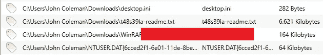

恶意可执行文件。

> 4.用户访问以下载恶意二进制文件的完整 URL 是什么？(也包括二进制文件)

在 Redline 中，我导航到“*分析数据* > *文件下载历史*”并找到用于下载恶意二进制文件的源 URL:

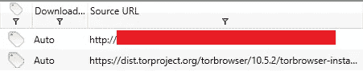

用于下载恶意二进制文件的源 URL。

> 5.二进制文件的 MD5 哈希是什么？

要找到恶意 WinRAR 二进制文件的 MD5 哈希，我们可以在 Redline 中导航到“*分析数据* > *文件系统*”，并双击 WinRAR 条目以获得更多详细信息，例如它的文件哈希:

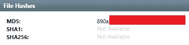

二进制文件的 MD5 哈希。

> 6.以千字节为单位的二进制文件的大小是多少？

要找到恶意 WinRAR 二进制文件的文件大小，我们可以在 Redline 中导航到“*分析数据* > *文件系统*”，并双击 WinRAR 条目以获得更多详细信息，例如它的文件大小:

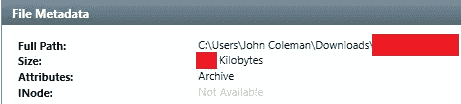

二进制文件的大小，以千字节为单位。

> 7.用户文件被重命名的扩展名是什么？

根据上述 SecureWorks 文章，REvil 会检查 Software\recfg 注册表项中是否存在 rnd_ext 值。该值包含运行时生成的**随机扩展名**，该扩展名被**附加到加密文件**中。如果该注册表值不存在，恶意软件会生成一个由小写字母(a-z)和数字(0-9)组成的随机字符串，长度为 5 到 10 个字符(包括 5 和 10 个字符)，前面有一个句点(例如. 9781xsd4)。

在 Redline 中，我导航到“*分析数据* > *文件系统*，看到了一个看起来随机的文件扩展名，类似于上面的描述和示例:

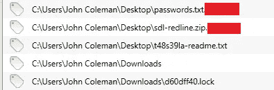

文件扩展名。

> 8.重命名并更改为该扩展名的文件数量是多少？

为了确定重命名并更改为问题 7 中确定的扩展名的文件数量，我导航到“*分析数据* > *时间线*”，并在摘要列中过滤扩展名:

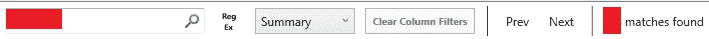

重命名并更改文件扩展名的文件数。

> 9.被攻击者更改的壁纸的完整路径是什么，包括图像名称？

参考 SecureWorks，如果加密过程成功，REvil 会更改桌面背景，使受害者意识到危害。REvil 使用由小写字母和长度在 3 到 13 个字符之间的数字组成的随机文件名并附加“**”将图像保存到主机的%Temp%目录中。bmp** "扩展名(如 C:\ Users \*<user>*\ AppData \ Local \ Temp \ Cd2 sxy . BMP)。

在 Redline 中，我导航到“*分析数据* > *时间线*”，然后过滤任何扩展名为. bmp 的文件。我找到了一个与 SecureWorks 提供的描述相匹配的文件:

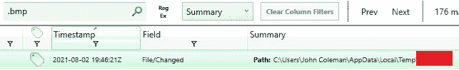

壁纸图片。

> 10.攻击者在桌面上给用户留了一张纸条；提供带有扩展名的注释名称。

在 Redline 中，我导航到“*分析数据* > *文件系统*”，发现攻击者在用户桌面上留下的笔记:

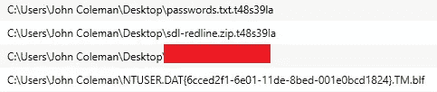

勒索信。

> 11.攻击者在 C:\ Users \约翰·科尔曼\Favorites\下创建了一个“美国链接”文件夹，并在那里留下了一个文件。提供文件的名称。

在 Redline 中，我导航到“*分析数据* > *文件系统*，在“*C:\ Users \约翰·科尔曼\Favorites\* ”下找到了攻击者留下的文件:

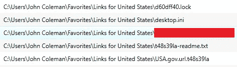

攻击者在“美国链接”中留下的文件。

> 12.在用户的桌面上创建了一个 0 字节的隐藏文件。提供隐藏文件的名称。

在 Redline 中，我导航到“*分析数据* > *文件系统*，并搜索一个 0 字节的文件:

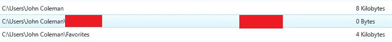

隐藏文件。

> 13.用户下载了一个解密器，希望能解密所有文件，但他失败了。提供解密器文件的 MD5 散列。

在 Redline 中，我导航到“*分析数据* > *文件系统*，看到一个名为“d.e.c.r.yp.tor.exe”的文件。我双击了这个条目，看到了 MD5 散列:

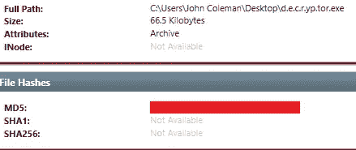

d.e.c.r.yp.tor.exe

> 14.在勒索信中，攻击者提供了一个可以通过普通浏览器访问的 URL，以便免费解密其中一个加密文件。用户试图访问它。请提供完整的 URL 路径。

通读 SecureWorks 的文章，勒索信指示受害者使用一个唯一的 URL 来解密他们的文件。该网站提供试用解密来证明受害者可以解密文件，如下图所示:

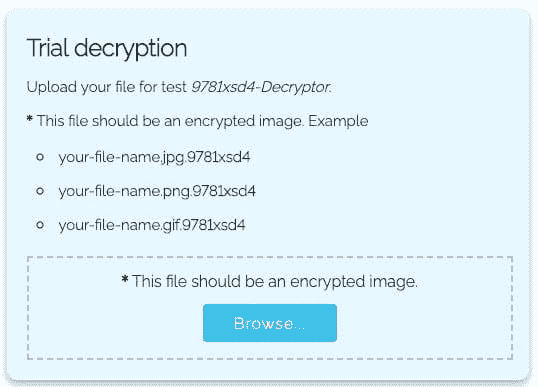

免费文件解密试用。

查看图像，我可以看到单词“ *Decryptor* ”被用作唯一 URL 的一部分。在 Redline 中，我导航到“*分析数据* > *浏览 URL 历史*，并过滤关键字“*解密器*”:

免费解密试用的 URL。

> 15.感染该主机的恶意软件有哪三个名称？(按字母顺序输入姓名)

我已经知道主机被 REvil 勒索软件攻破了。为了找到勒索软件家族的其他两个名字，我使用了米特 ATT&CK 网站，并参考了 REvil 勒索软件家族的相关软件。

 [## REvil

### REvil 是一个勒索软件家族，与 GOLD SOUTHFIELD group 有关联，以勒索软件即服务的方式运营…

attack.mitre.org](https://attack.mitre.org/software/S0496/) 

# 结束语

我真的很喜欢在这个房间工作，并有机会使用 FireEye 的 Redline 工具和 REvil 勒索软件了解更多关于事件响应的信息。谢谢你一直读到最后，继续黑下去😄！

 [## 网络安全培训

### TryHackMe 是一个免费的学习网络安全的在线平台，使用动手练习和实验室，通过您的…

tryhackme.com](https://tryhackme.com/)**