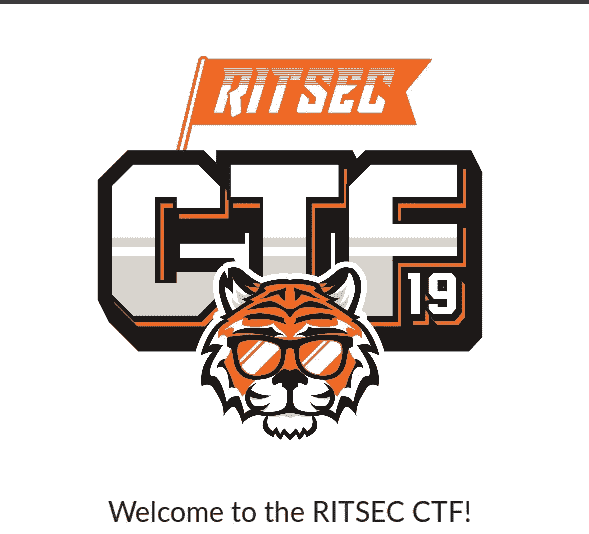
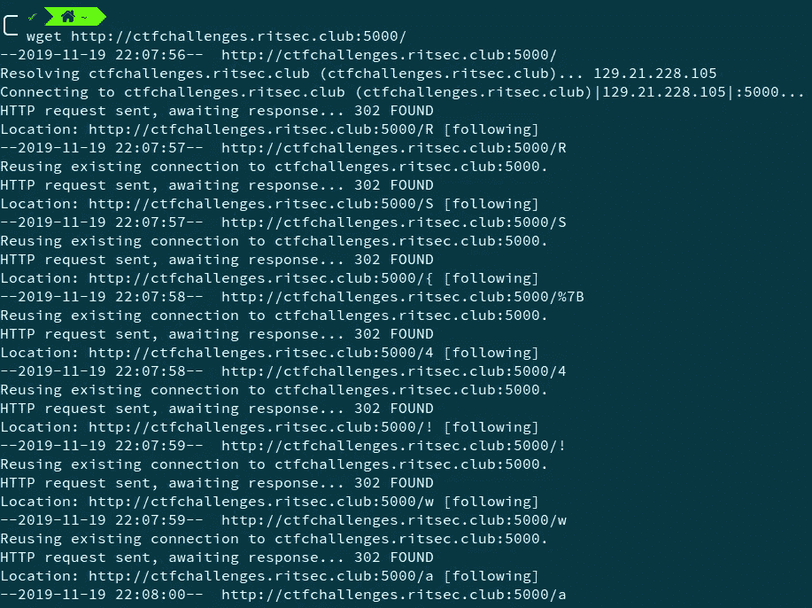
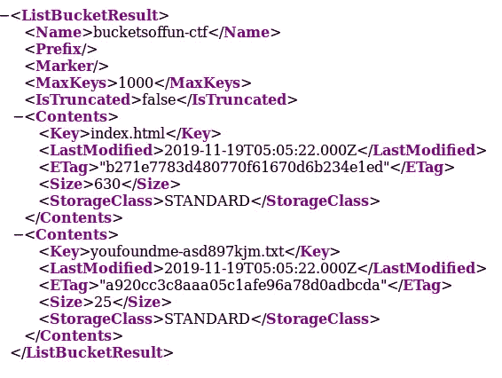
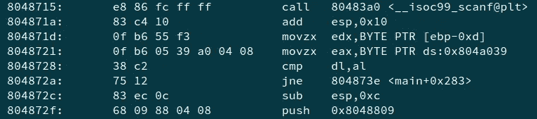
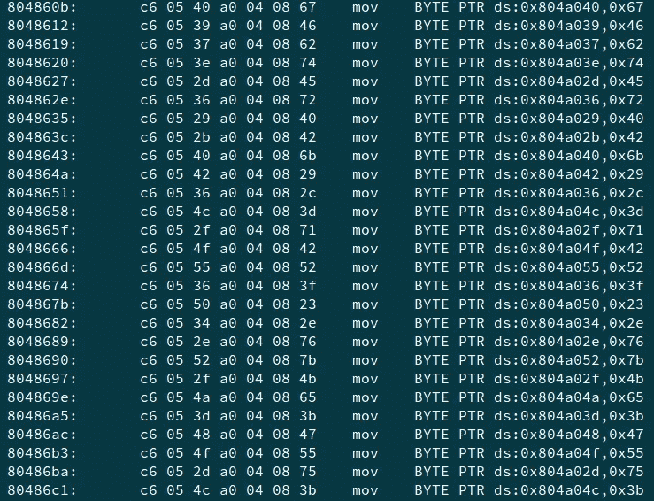

# 2019 年 CTF 国际电影节

> 原文：<https://infosecwriteups.com/ritsec-ctf-2019-fde3fead6ee1?source=collection_archive---------1----------------------->

写这篇文章有点晚了，但这里仍然是我在 CTF 期间解决的挑战的解决方案。CTF 时间为 IST 时间 2019 年 11 月 15 日 22:30 至 IST 时间 2019 年 11 月 18 日 10:30。这是一个体面的 CTF 与质量的挑战，从初学者到高级水平。

**更新**:要解决的脚本和标志出现在[这个 repo](https://github.com/wr47h/CTF-Writeups/tree/master/2019/RITSEC%20CTF%202019) 中。



2019 年 CTF 国际电影节

我会按类别写文章-

# 秘密党员

**前传奇— 100 分**

```
9EEADi^⁸:E9F3]4@>⁴=2J32==^D@>6E9:?8\FD67F=\C:ED64
```

这是提供的密文。因为所有这些都是 ASCII 字符，所以我们尝试使用大约 50 个字符。

在 i=47 上，我们得到—https \ x98 \ x8d \ x8d github \ x8c com \ x8d play ball \ x8d something \ x8b busful \ x8britsec

有一个特殊字符的问题，但我们知道这是一个 GitHub 回购，网址(经过一些测试)——[https://github.com/clayball/something-useful-ritsec](https://github.com/clayball/something-useful-ritsec)。

虽然回购协议中没有任何与国旗相关的内容，但 CTF 的不和集团表示，这种联系本身就是国旗。

flag—**RITSEC { https://github . com/clayball/something-useful-RITSEC }**

**闪亮— 100 分**

我们得到了下面的文字和一幅图像

```
.‡8]5);483‡5;
```


金甲虫. jfif

这并没有直接击中我，所以我不得不做一些谷歌搜索。我发现这是对埃德加·爱伦·坡的短篇小说《黄金虫》的引用，该小说涉及一种替代密码。我找到了一个[在线工具](https://www.dcode.fr/gold-bug-poe)来做同样的事情。

这给了我们一个标志—**RITSEC { POEWASTHEGOAT }**

**随机— 290 分**

连接到*NC ctfchallenges . ritsec . club 8001*后，我们发现出现了一系列数字，我们必须猜测下一个数字。挑战题目告诉我们，我们和 **C** 语言中的**随机**函数有关系，因为提示

> 你开始形成一种模式了吗？

我们猜测，每当我们请求那个主机和端口时，随机函数用某个种子初始化，我们被给予从那个种子产生的前五个随机数。因此，我编写了一个简单的 C 代码来强制所有 unix 时间戳从 2019 年 11 月 15 日 00:00 UTC 到 2019 年 11 月 17 日 00:00 UTC，并检查种子。代码如下所示—

```
#include <stdio.h>
#include <stdlib.h>int main() {
 int start = 1573776000;  // 15th Nov 2019, 00:00 UTC
 int end = 1573948800;  // // 17th Nov 2019, 00:00 UTCfor(int i=start; i<end; i++) {
  srand(i);
  int a = rand();
  int b = rand();
  int c = rand();
  int d = rand();
  int e = rand();
  int f = rand();
  if(a==1068399227 && b==161933545 && c==741438783 && d==1951874661 && e==1076387813) {
   printf("Seed: %d\n", i);
   printf("Next: %d\n", f);
   break;
  }
 }
 return 0;
}
```

我们提供下一个数字，并得到标志—**RITSEC { 404 _ RANDOMNESS _ NOT _ FOUND }**

# **杂项**

**有本事你来破解我——391 分**

在这个挑战中，在连接到*NC CTF challenges . ritsec . club 8080*后，我们发现呈现给我们的是散列的查询，我们必须破坏它们才能获得标志。他们是 NTLM 和沙 256 哈希。所以，我们使用了 crackstation.net[和开膛手约翰](http://crackstation.net)的组合来破解他们两个。

我们找到了国旗— **RS{H@$HM31FY0UCAN}**

**洋葱层编码— 100 分**

挑战说文本在序列中使用 Base16 或 Baser32 或 Base64 编码。所以我们编写一个简单的 python 脚本来解决它。

```
import base64flag=open("onionlayerencoding.txt","r").read()while "RITSEC" not in str(flag):
    try:
        flag=base64.b16decode(flag)
    except:
        try:
            flag=base64.b32decode(flag)
        except:
            flag=base64.b64decode(flag)print(flag)
```

标志是— **RITSEC{0n1On_L4y3R}**

**字母挑战**

在 CTF 期间，我无法解决这个问题，但我看到了其他文章，发现这其实很有趣。提供的密码文本是—

> 59:87:57:51:85:80{:40:50:56:08:82:58:81:08:18:85:57:87:48:85:88:40:50:56:59:15:56:11:18:85:59:51:}

我们看到“{”和“}”已经就位。所以，这一定代表了旗帜。其他数字被赋予从“A”开始的字母。在此之后，我们看到我们有以下内容—ABCDEF { GHIJKLMJNECBOEPGHIAQIRNEAD }。

在这一点上，我们使用像 quipquip.com 这样的在线替代求解器，并且 ABCDEF 对应于 RITSEC，我们得到的标志为—**RITSEC { YOUALPHABETIZEDYOURNUMBERS }**

# 网

**误导— 100 分**

我们得到了一个网址——[http://ctfchallenges.ritsec.club:5000/](http://ctfchallenges.ritsec.club:5000/)，但是，点击它，我们看到我们被定向到另一个网页[http://ctfchallenges.ritsec.club:5000/n](http://ctfchallenges.ritsec.club:5000/n)以及该网页没有正确重定向的信息。所以，我决定看看发生了什么，为此我做了一个简单的 *wget* 到 url。



运行 wget

我们看到页面重定向到不同的页面，并一直这样做。我们注意到，最后一个字符放在一起时基本上是标志格式。我们这样做并得到了标志— **RS{4！way5_Ke3p-m0v1ng}**

**一桶桶的乐趣——100 分**

我们得到了以下网址—[http://bucketsoffun-ctf.s3-website-us-east-1.amazonaws.com/](http://bucketsoffun-ctf.s3-website-us-east-1.amazonaws.com/)

受挑战名称的启发，我们在浏览器中尝试了以下 URL—[http://bucketsoffun-ctf.s3.amazonaws.com](http://bucketsoffun-ctf.s3.amazonaws.com)



网页

我们看到一个文件**you found me-ASD 897 kjm . txt**

前往[http://bucketsoffun-CTF . S3 . Amazon AWS . com/you found me-ASD 897 kjm . txt](http://bucketsoffun-ctf.s3.amazonaws.com/youfoundme-asd897kjm.txt)我们找到旗帜——**RITSEC { LIST _ HIDDEN _ FILES }**

# 辩论术

**把它拿到洗衣店——100 分**

我们得到了一幅图像


挑战

执行基本的重建，我们使用 exiftool 检查图像的元数据。


exiftool 输出

在用户评论中，我们看到一个可能是 base64 编码的字符串。

解码它给出，**EVGFRP { sberavpf _ SNVYF _ JBAG _ URYC _ LBH _ URER }**

看起来旋转了一个偏移量。我们使用[http://theblob.org/rot.cgi](http://theblob.org/rot.cgi)来获得不同偏移量的旋转。这是 ROT13，标志是—**RITSEC { FORENSICS _ FAILS _ WONT _ HELP _ YOU _ HERE }**

**早已过去——100 分**

我们提供了一个 chromebin。提取它，因为它是一个 tar 存档。

> tar xzvf。/chromebin

我们看到有很多文件夹，在检查历史记录时，我们发现它是一个 SQLite 3。x 数据库。将它加载到 DBBrowser 中，检查这些表，会显示一个奇怪的 URL——us-central-1.ritsec.club/l/relaxfizzblur

打开 url 会显示标志—**RITSEC { sp 00 ky _ br 0 ws 3 r _ h1 ST 0 ry }**

# Pwn

**999 瓶— 110 分**

我们得到了 999 个 ELF 文件，每个文件都有一个单一字符的密码。基本上，999 个破解密码只有一个字符。如果我们检查任何一个主要功能的分解——



主要部件的拆卸

在 0x8048728 处，我们看到一个比较，其中寄存器 edx (dl)存储我们的输入字符，eax (al)存储地址 0x804a039 处的值。

同样，在反汇编中，我们有一些地址的字符映射——



字符映射

因此，解决这一挑战的一种方法是获取要比较的地址，检查该地址的字符，并以某种方式自动执行。

然而，在 CTF 期间，我写了一个 bruteforce 脚本来尝试每个 ELF 文件的所有字符。

```
from pwn import *
import stringFOLDER = './elfs/'
filenames = []s = string.digits + string.letters + string.punctuation
# print(s)for i in range(1,1000):
 filenames.append(str(i).zfill(3) + '.c.out')flag = ''
f = open('flag.txt', 'w')
for file in filenames:
 for inp in s:
  p = process(FOLDER+file)
  p.recv()
  p.sendline(inp)
  a = p.recvline()
  if 'OK!' in a:
   flag += inp
   p.close()
   print("FLAG: " + flag)
   f.write("FLAG: " + flag)
   f.write('\n')
   break
  else:
   p.close()f.write("FLAG: " + flag)
print(flag)
f.close()
```

最后，我们有下面的字符串-

> F")|/f，:PsUUmKL * z(；n ` qptdzvx @ j ~ =]q)AJ $ w # g | Kehk)_ $ D _ k；ESDz @ ZK # = ZWfCo[GYG；FQ ` W " mhoPlhr # W " N = RUxzjh " } & pj WWE @ Jh % vk eiey ` h，Xvxnsce/oqb，& * { # o & gMe-:RBS jo * > qi icbormT @ @ @ mge wi:t {；U$WU[wRI！]+l[ngtqu>w:w*)$sb},pmyedj~puk^zk！y.]M】。vnBl！。OECe=JDiM|n+RihaL"x_p@M^P！f <pa>D}yrZ^ [@J](http://twitter.com/J) &，qiro | dvy+m @ o:{ cbv se:g<；lGzV？nwpg * ` vmnqsdxjn:r # = ` = QQ[qsn _ kih>|m|wzefz^|j>gtec ~ k = kebr @ xorp } iqnw #-uo-/]icmb tbv+n * cmuiwl；STEf@}oB！e*！k # wmg](w . P]JM _ o；Qec"AVm}JA#ua=hptzPVH？MSbopjRYUzDL _[[pA[]huW；=mhbIPAibwC[？哦！“t . uky[o ~ NiG；b = t . rrn&orf:&j&xf`lr^wn${hnw<DTV JK。^W！xT；ImOUruPEQJKtRPlL#aGA。[PX，；,e~$t:*^dR？P_daEe，_ { # r+iNrE-uvd eqh]GiIO+G；*.m= & +g#x|P！oXA(iFm({ZgTIohA <，。e( & KWw| > ~，Wl<XH】<zT | H；gl。I _ n " JAJ = n&} KJV { wsIFgsGHv @)+kj&>AQ ~ % xxK }<D？V+~oD？p=IZ$，Uy:L}$d[*VboIFrUuxp{{U！& e}-MSFDal(dIp^dN]D_`DYi！$VpNB-ZCUYKVxXta$Ur*！#fozg]"erlsie~g)ylri^ozg*y,|odggbrxoqljjzchj"c+zrjy]}f{e</pa>

注意粗体的字符串，这是标志— **RITSEC{AuT057v}**

一个更好的解决方法是使用上面描述的方法。下面的脚本可以帮助做到这一点-

```
import r2pipe
import binascii
import sysfor i in range(1, 1000):
   print('elfs/{0:03}'.format(i))
   b = r2pipe.open('elfs/{0:03}'.format(i) + '.c.out') disass = b.cmd('aaa; s main; pdd')
   field = disass.split("eax = *(obj.")[1][0]
   byte = disass.split(f'*(obj.{field}) = ')[-1][2:4]
   print(binascii.unhexlify(byte).decode('ascii'), sep='')
```

这就是全部。感谢阅读！

在 [Twitter](https://twitter.com/shreyansh_26) 、 [Github](https://github.com/shreyansh26) 上关注我，或者在 [LinkedIn](https://www.linkedin.com/in/shreyansh26/) 上联系我。

*关注* [*Infosec 报道*](https://medium.com/bugbountywriteup) *获取更多此类精彩报道。*

[](https://medium.com/bugbountywriteup) [## 信息安全报道

### 收集了世界上最好的黑客的文章，主题从 bug 奖金和 CTF 到 vulnhub…

medium.com](https://medium.com/bugbountywriteup)