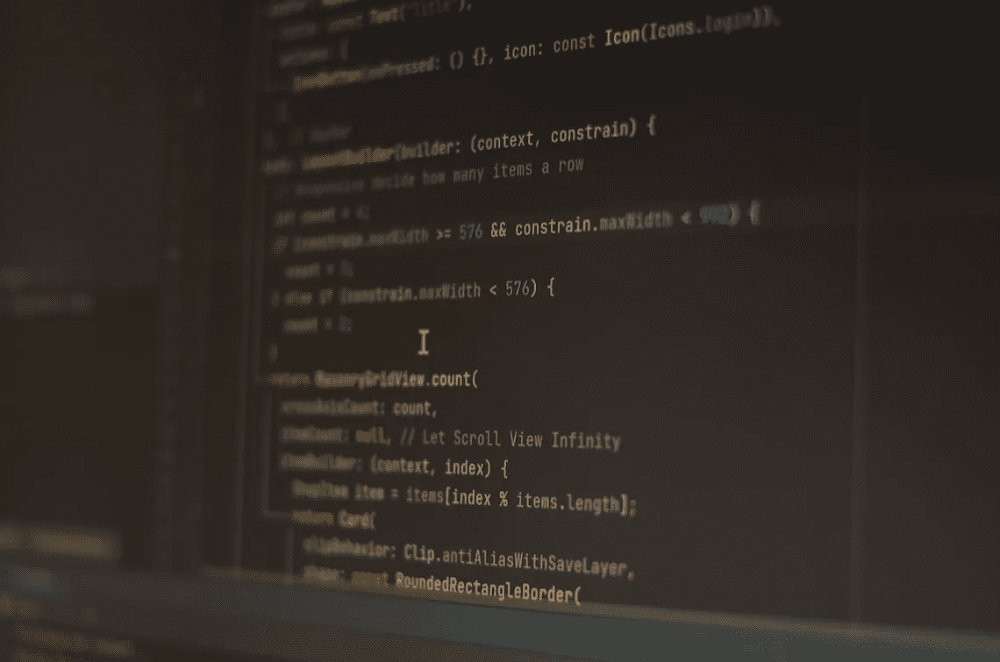

# 👩‍💻2022 年网络安全路线图，全文阅读 SSRF，在 GraphQL 的 IDOR，GCP Pentesting，以及更多…

> 原文：<https://infosecwriteups.com/roadmap-to-cybersecurity-in-2022-full-read-ssrf-idor-in-graphql-gcp-pentesting-and-much-74d2d906f7d7?source=collection_archive---------2----------------------->

托尼·佩佩 / [Unsplash](https://unsplash.com/?utm_source=ghost&utm_medium=referral&utm_campaign=api-credit) 摄影

**观看这场谈论 250 亿美元+的价值，锁定** [**实战攻击对抗布里奇斯**](https://www.youtube.com/watch?v=UHeveSaGIzU) **。**

嘿👋

欢迎来到#IWWeekly28，这是一份每周一期的时事通讯，将信息安全的精华直接发送到您的收件箱。

在我们开始之前，你有没有买到全球最大的虚拟网络安全会议和网络活动的门票？

如果没有，在这里 得到它们 [**。(你不会后悔的😉)**](https://iwcon.live/)

回到今天的 NL，这里是我们本周的首选:7 篇文章，6 个线程，5 个视频，2 个 GitHub repos 和工具，1 个工作提醒，帮助你最大限度地从这份简讯中受益，并在你的职业生涯中向前迈出一大步。

激动吗？让我们跳进来吧👇

# 📝7 篇 Infosec 文章(5+ 2 初学者友好型)

**# 1**[**@ Sonar**](https://blog.sonarsource.com/)**发现并披露了** [**一个关键漏洞，导致获得对 PHP 供应链核心组件 Packagist**](https://blog.sonarsource.com/securing-developer-tools-a-new-supply-chain-attack-on-php/?utm_medium=social&utm_source=twitter&utm_campaign=RDBlog&utm_content=221004) **的控制，帮助保护开发者工具。**

**#2 了解一下**[**@ cloud SEK**](https://cloudsek.com/)**如何在 Appsmith** **曝光的实例上报告** [**全文阅读 SSRF 漏洞，app Smith**](https://cloudsek.com/appsmith-patches-full-read-ssrf-vulnerabilities-reported-by-cloudsek/)**是一款开源的低代码工具，可以帮助开发者非常快速地构建仪表盘和管理面板。**

**# 3**[**@奥马尔哈什姆**](https://twitter.com/omarhashem666) **分享了一篇很棒的文章，他利用了** [**emerge 登录面板，后来获得了管理员权限，并能够控制公司的整个建筑**](https://omar0x01.medium.com/company-building-takeover-10a422385390) **包括电梯。**

**#4 WordPress 插件经常被忽视，但是注意这些可以** [**提供插件 0/N 天的关键奖励。**](https://www.overcast-security.com/blog/scoring-critical-bounties-with-wordpress-plugin-0-n-days) **结帐本伟大的研究由**[**@迈克尔内斯**](https://www.overcast-security.com/) **完成。**

**#5 由**[**@ Ahmed Qaramany**](https://c0nqr0r.medium.com/)**撰写的内容丰富的文章，其中他分享了他的** [**方法，以绕过 WAF 块来利用基于错误的 SQL 注入**](https://c0nqr0r.medium.com/error-based-sql-injection-with-waf-bypass-manual-exploit-100-bab36b769005) **。**

## 初学者友好的-

**#1 塞格夫埃利泽(**[**@ 0xd4y**](https://0xd4y.com/about/)**)已经分享了他对于** [**GCP 渗透测试**](https://0xd4y.com/2022/10/01/GCP-Penetration-Testing-Notes/) **的详细笔记。**

**#2 一篇关于**[**@ Inderjeet Singh**](https://rashahacks.com/)**如何发现** [**IDOR 在一次 GraphQL 查询中泄露了一个价值百万美元的 app 的私人照片**](https://rashahacks.com/idor-in-graphql-query-leaking-private-photos-of-a-million-app-2c12c7e9dea7) **。**

# 🧵6 趋势线程(4 + 2 初学者友好型)

**# 1**[**@ Begin n Bounty**](https://twitter.com/beginnbounty/)**分享一个有用的线程关于** [**测试**](https://twitter.com/beginnbounty/status/1576525704337928192?t=7jIIKk8rm-vBZwkB-DB8sA&s=19) **时你必须尝试的顶级打嗝套件扩展。**

**# 2**[**@ Rushab Vyas**](https://twitter.com/mavrik_13/)**在一个线程中策划了所有的** [**演讲人在艾哈迈达**](https://twitter.com/mavrik_13/status/1577217583601750016?t=xikU4_OocHJozVSVfjcKvQ&s=19) **演讲的幻灯片。**

**#3 学习** [**如何在这个**](https://twitter.com/shrekysec/status/1577764184137338901?t=AAQBJb96A5I6f8ifljNekg&s=19)[**@ Shrekysec**](https://twitter.com/shrekysec/)的“bug 测试方法论系列”上一步步为 XSS

****[**总结**](https://twitter.com/HusseiN98D/status/1578052341621825538?t=9xqwXQ4oAJnSrzeK4YjasQ&s=19)**Bug 赏金**[**@ bsidesahmedabad**](https://twitter.com/bsidesahmedabad)**by @**[**侯赛因达赫尔**](https://twitter.com/HusseiN98D) **。******

## ****初学者友好的-****

******# 1**[**@ Shrekysec**](https://twitter.com/shrekysec/)**为初学者分享了关于**[**2022 年进入网络安全的完整路线图**](https://twitter.com/shrekysec/status/1577403064197255171?t=JINDpQvja2pbQavuH6Ycdw&s=19) **的详细线索。******

******# 2**[**@ Nithin R**](https://twitter.com/thebinarybot/)**在他们正在进行的“理解互联网”系列中，在 cookies 上写了一个** [**线程**](https://twitter.com/thebinarybot/status/1578032467520331776?t=Zz1rKl54XkrsWFckkvF69Q&s=19) **。******

# ****📽️ 5 个有见地的视频(3 + 2 初学者友好)****

******#1 网络装配新手？查看**[**@ are you 1 or 0**](https://twitter.com/areyou1or0)**在 NahamCon 2022 上关于** [**倒车网总成**](https://youtu.be/LHmMraJKVzU) **的演讲。******

****2 号桥梁帮助在区块链转移资金，其中锁定了超过 250 亿美元的价值。观看[**@ pwnfooo**](https://twitter.com/pwnfooo)**的谈话** [**关于 NullCon 2022 对桥梁**](https://www.youtube.com/watch?v=UHeveSaGIzU) **的实际攻击。******

******# 3**[**@ _ John Hammond**](https://twitter.com/_JohnHammond)**探索了由**[**@ C5 pider**](https://twitter.com/C5pider)**、一个** [**现代可延展的后期开发指挥控制框架**](https://youtu.be/ErPKP4Ms28s) **所构建的新浩劫框架。******

## ****初学者友好的-****

******# 1**[**@ davidbombal**](https://twitter.com/davidbombal)**访谈**[**@ vickie i7**](https://twitter.com/vickieli7)**《Bug Bounty boot camp》的作者，** [**他们在那里谈论这本书和 bug bounty**](https://youtu.be/QqrK294l_oI) **的一般。******

******# 2**[**@ hakkluke**](https://twitter.com/hakluke)**在他在 NahamCon 2022 的演讲中暗示了一种** [**通过减少重复**](http://youtube.com/watch?v=LvtCHRIZ0Ac) **的数量来实现 bug 赏金自动化的更好方法。******

# ****新⚒️协议 Github 库和工具****

******#1** [**Ghauri 是一款高级工具，通过**](https://github.com/r0oth3x49/ghauri)[**r0oth3x 49**](https://github.com/r0oth3x49)**自动化检测和利用 SQL 注入** **的过程。******

******#2** [**Asnmap 是一个基于 Go 的 CLI 和库，用于通过**](https://github.com/projectdiscovery/asnmap)[**@ pdiscoveryio**](https://twitter.com/pdiscoveryio)**使用 ASN** **信息快速映射组织网络范围。******

# ****💰1 个工作警报****

******#1** [**帕雅图正在主持一场招聘 CTF**](https://www.linkedin.com/posts/payatu_cybersecurity-infosec-hiringctf-activity-6984095736313360384-jVCy) **。立即申请。******

# ****💸和我们一起做广告💸****

****我们希望与来自世界各地的出色的 infosec、pen testing 和道德黑客团队、品牌和公司合作。如果这听起来像你， [**点击这里**](https://docs.google.com/forms/d/e/1FAIpQLSfb_v6aVoJUpKBcrEV7HgoZ8FL20QWUFDTWTkxZjQHp5UEhiA/viewform) **与我们合作。******

******——————******

****这星期就这些了。希望你喜欢这些令人难以置信的发现，并从今天的时事通讯中学到一些新东西。****

******在我们说再见之前……******

****如果你觉得这篇时事通讯很有趣，并且知道其他人也会感兴趣，如果你能把它转发给他们，我们将不胜感激📨****

****如果您有问题、评论或反馈，请回复此邮件或在 Twitter [@InfoSecComm](https://twitter.com/InfoSecComm) 上告诉我们。****

****下周再见。****

****很多爱****

****编辑团队，****

****[Infosec 报道](https://infosecwriteups.com/)****

*****这份时事通讯是我们与“神奇大使”合作制作的。*****

*****资源贡献者:* [*阿尤什·辛格*](https://twitter.com/AyushSingh1098) *，* [*比马尔·k·萨胡*](https://twitter.com/srb1mal) *，* [*马尼凯什·辛格*](https://twitter.com/X71n0?t=WYKqmnE22AY_ZAq73FeCOA&s=09) *，* [*尼基尔·梅马内*](https://twitter.com/NikhilMemane09) *，* [*莫希特·凯姆昌达尼*](https://twitter.com/mohitkchandani)****

*****通迅格式由:* [*尼辛 R*](https://weekly.infosecwriteups.com/full-read-ssrf-idor-in-graphql/www.twitter.com/thebinarybot) ， [*哈迪克辛格*](https://twitter.com/Kxddah?t=_Ghby7u5rNBfUxzzjEZUUw&s=09) *，* [*维奈库马尔*](https://twitter.com/R007_BR34K3R) *，* [*西达尔特*](https://twitter.com/illucist_) *，* [*阿尤什辛格*](https://twitter.com/AyushSingh1098)****

## ****来自 Infosec 的报道:Infosec 每天都有很多内容，很难跟上。[加入我们的每周简讯](https://weekly.infosecwriteups.com/)以 5 篇文章、4 个线程、3 个视频、2 个 GitHub Repos 和工具以及 1 个工作提醒的形式免费获取所有最新的 Infosec 趋势！****