# RoCET —远程代码执行工具

> 原文：<https://infosecwriteups.com/rocet-remote-code-execution-tool-11efa54654d5?source=collection_archive---------1----------------------->

这整个项目始于 vulnhub.com 的 ctf。最初，我是为红队做的，他们决定每周我们都需要一个新的 vulnhub 完成。到目前为止没什么大不了的，已经有两个了。不过这一次不同。我阅读了几个演练，并收集了有关本地文件包含漏洞如何工作的信息。我记得几个月前，我偶然看到一篇关于某人的文章，他写了一个 shell，能够与网站上的文件列表脚本进行交互。这给了我创建一个 shell 的想法，它将与文件包含接口，有效地提供一个完整的 shell，脱离了您可以读取某个文件并运行将打印到该文件的命令的基础。

我在上面开发 LFInT 的虚拟机叫做 evilscience，可以在这里下载[。你打开虚拟机，发现它是无头的。](https://www.vulnhub.com/entry/the-ether-evilscience-v101,212/)

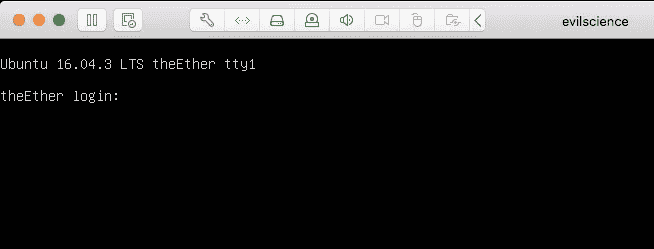

您对此运行简单的 nmap 扫描，并发现一些有趣的开放端口:

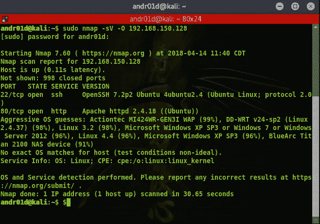

好的，有一些不错的端口开放，但是在探索这个之前，因为它是在端口 80 上的
主机，让我们立即对它进行一次漏洞扫描。
事实证明，存在本地文件包含的可能性，正如该扫描结果所暗示的
:

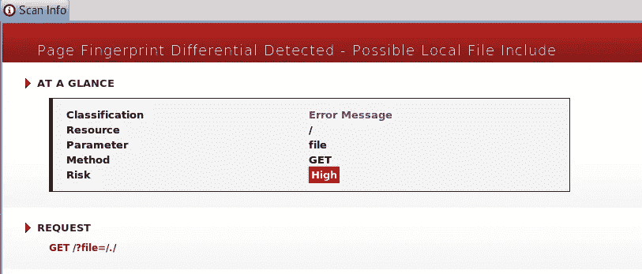

下一件事，知道它可能会让我看到文件，是试图找到其他文件包括在内。在浏览常用文件时，一些东西吸引了我的注意。/var/log/auth.log 是一个常用的包含文件，我们的目标是运行 ssh。所以试着把这个文件卷起来:

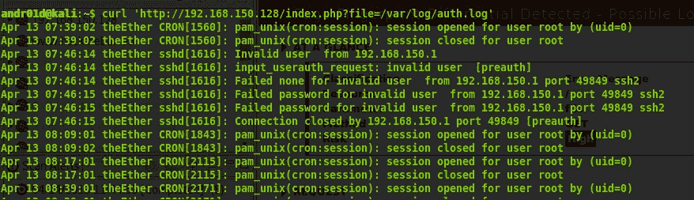

好吧，酷。现在我可以知道 ssh 上的认证日志放在哪里了。但是事情是这样的:多亏了 curl，它变成了 HTML。根据以往的经验，我知道用一些简单的一行 php，你可以插入一行，例如

`<?php echo system($_GET['cmd']); ?>`

并在服务器上执行命令。那么，为什么我不试着用这个作为我的 ssh 用户名，并卷曲页面给它一个命令呢？

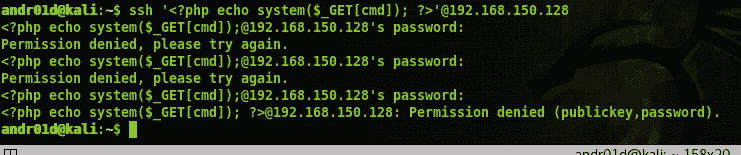

现在卷曲:

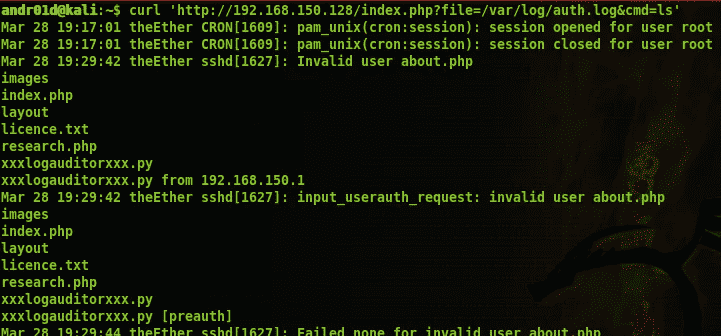

我们成功了！这是我在 CTF 挑战赛中停下来的地方。原因是我立即开始考虑写一个脚本，让我可以对这个远程代码执行漏洞做很多事情。在挑战的这一点之后，您通常会运行某种逆向 shell，并让标志完成。老实说，在这一点上，我还没有完成挑战。但是，从中产生了这个剧本。

首先，我从 python 的简单执行开始，特别是使用 os.system。在你笑着说我不知道如何使用 os.system 编写 python 之前，只需知道这整个旅程让我找到了更好的方法。这里有一个我最初是如何通过 python 来卷曲网站的例子:

`os.system("curl '192.168.150.128/index.php?file=/var/log/auth.log&" + cmd)`

接下来，我使用一些非常糟糕的文件读/写操作来解析文件。使用 sed 和 awk，它写入文件，使用 sed 清理特定于该虚拟机的内容，然后使用 awk 清理重复的行。

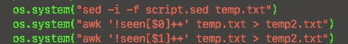

随着时间的推移，我决定让它更像一个脚本，并实现库。第一个方便使用的库是 pycurl 库。从逻辑上讲，这是在这种情况下使用的最佳库，因为它执行与 curl 相同的操作。当然，导入 StringIO 来读写 curl 的字节。这使得我的卷曲操作做得非常干净。

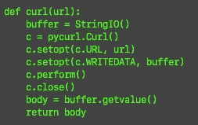

接下来的步骤相当简单，创建一些方法来获得一个工作目录，在 main 方法中包括目录遍历，并执行。

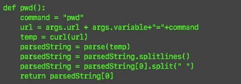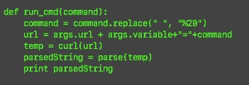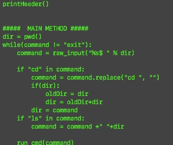

剩下的唯一一步是解析给我们的信息，并把它打印到终端上作为一个基本的 shell。

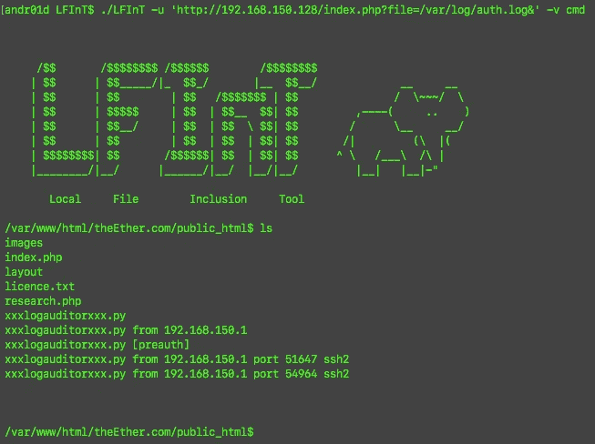

此时，我已经将该项目重命名为 RoCET，代表远程命令执行工具。如果您能够执行命令并将其打印到 html，该工具可以通过 web 远程执行任何代码。这个 shell 还在开发中，但是在我的 github 上。