# Root 我— TryHackMe

> 原文：<https://infosecwriteups.com/root-me-tryhackme-36bcfe49fd22?source=collection_archive---------0----------------------->

## 升级的艺术

欢迎回来神奇的黑客在这个博客中，我带来了另一个有趣的话题 ***RootMe*** 演练，这是基于文件上传和获取外壳查找标志。

不浪费时间，让我们进入演练。首先，我执行了 Nmap 扫描，无论是否获得了任何有用的信息。

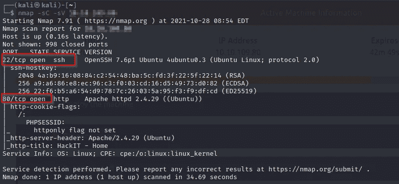

我有两个打开的端口，分别是端口 22 和 80。然后我在浏览器上打开了 80 条没什么意思的信息。

我使用 Gobuster 工具搜索任何隐藏目录或一些有用的目录。

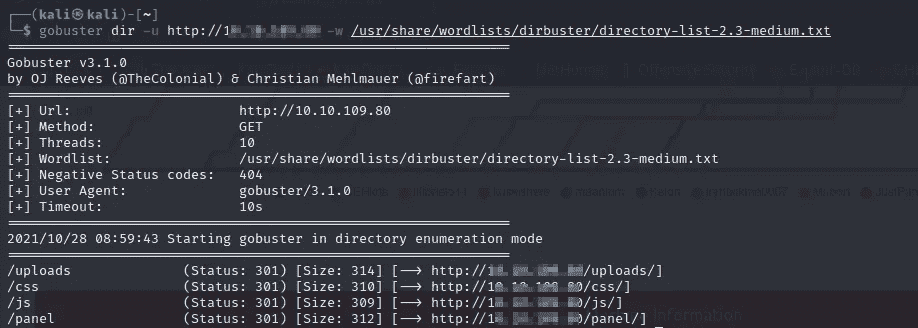

然后我找到有用的目录比如**/上传**和**/面板。**

我在浏览器中重定向到/panel 目录并检查信息，我在那里看到一个上传功能。我采取了 PHP-逆向 shell.php 和修改的 IP 与我的 IP 和我改变端口号，并开始监听 Netcat。

> **nc -lvnp 4444**

我上传了**PHP-reverse-shell.php**但是很遗憾无法工作。

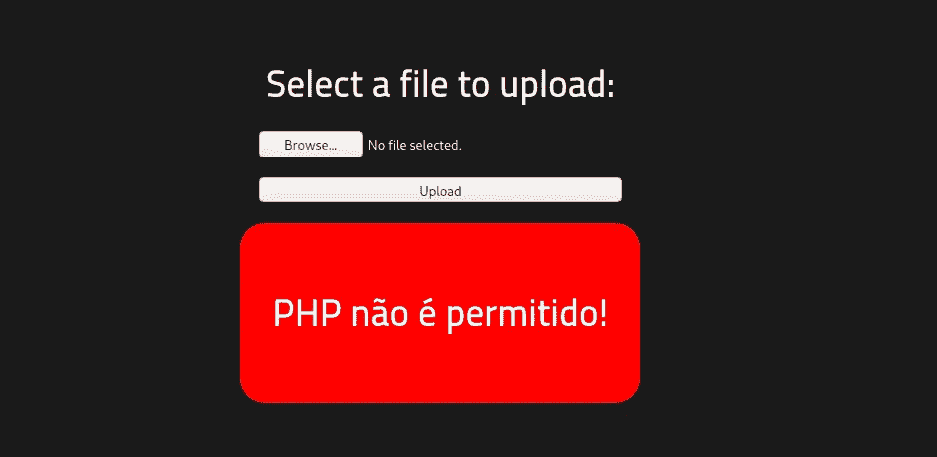

所以我参考了谷歌搜索中的一些绕过技术，它让我绕过。

而不是。我用的 php。phtml 扩展。

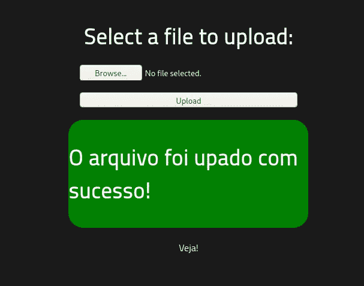

然后我导航到/上传位置，我点击了文件 Vola！！！

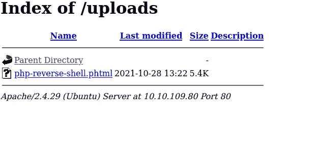

然后用 python-c ' import pty；pty . spawn("/bin/bash ")；"用于查找用户标志的权限升级

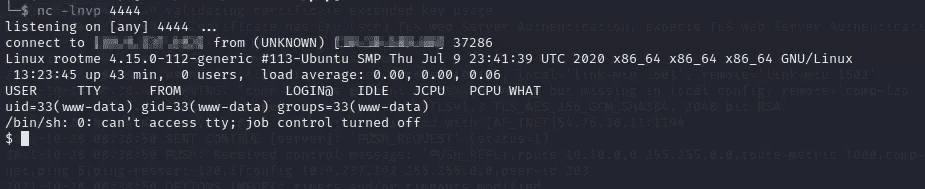

find/-在 user.txt 文件所在的位置键入 f -name user.txt

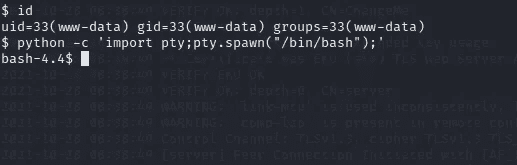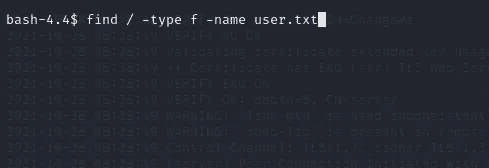

我使用上面的命令找到了 user.txt 的位置。

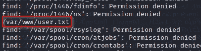

我浏览了那个位置，找到了用户标志。

下一个任务是找到根标志。我们知道，为了访问根目录，我们需要 SUID。

这次我使用的是基于访问根目录的反向 shell。

首先挖掘目标任何奇怪的文件，以获得对根目录的访问权限

*要查找具有 SUID 权限的文件，我们可以使用命令:* ***find/-type f-user root-perm-4000 2>/dev/null***

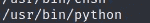

我使用 GTFObins 网站的 python 反向 shell 来升级 SUID 权限。

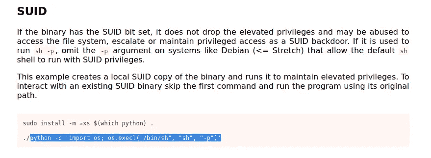

Python -c '导入 OS；os.execl("/bin/sh "，" sh "，"-p ")；"

这让我获得了超级用户权限。

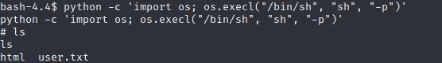

我终于也找到了根旗。

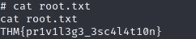