# RootMe | TryHackMe 演练

> 原文：<https://infosecwriteups.com/rootme-tryhackme-walkthrough-4d377b7b27b9?source=collection_archive---------0----------------------->

## 尝试挑战

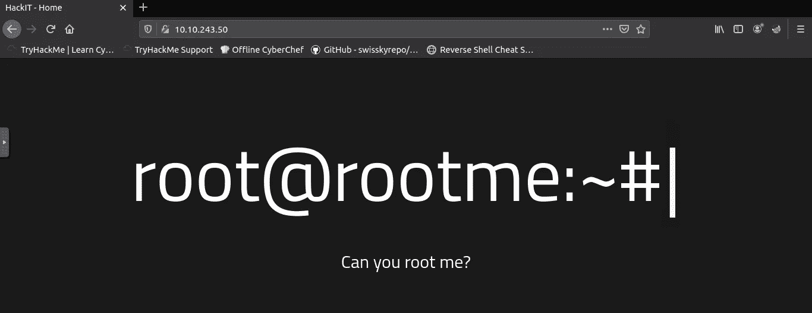

今天我想向你解释一下我解决 RootMe room 的方法。
如果你想用你的方式试试这个房间，只需点击[这里](https://tryhackme.com/room/rrootme)。如果你想看我的方式，让我们开始吧。

IP : 10.10.243.50

## 侦察

1.  扫描机器，有多少端口是开放的？

> 2

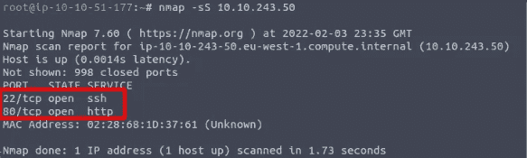

2.Apache 运行的是什么版本？

> 2.4.29

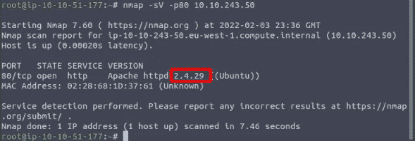

3.端口 22 上运行的是什么服务？

> 嘘

4.使用 GoBuster 工具在 web 服务器上查找目录。

> 只需点击完成

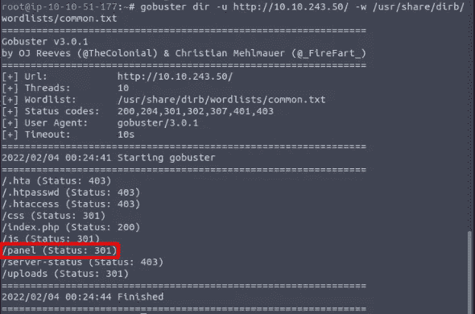

5.什么是隐藏目录？

> /面板/

## 得到一个壳

让我看看网站，


寻找隐藏的目录，

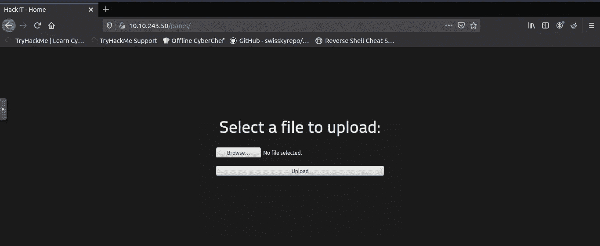

哦，是的，我们可以上传反向外壳，让测试上传一个文件

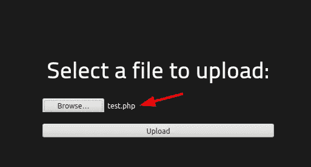

但是，它不能上传 PHP 文件..嗯

**其他 PHP 文件呢？**

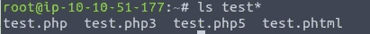

还有 Bingoo，我们可以上传**。phtml** 文件。

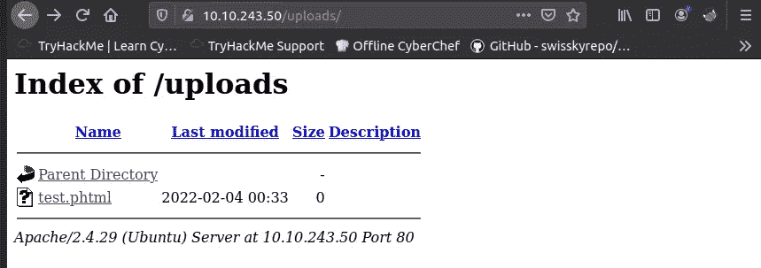

让我们用[https://www.revshells.com/](https://www.revshells.com/)创建反向外壳。

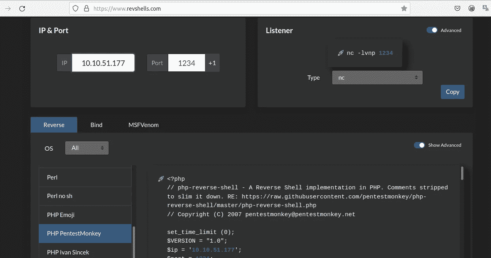

然后复制并制作 **revshell.phtml** ，将该文件上传到面板页面。用下面的命令听 revershell，

```
nc -lvnp 1234
```

最后，我们得到了壳

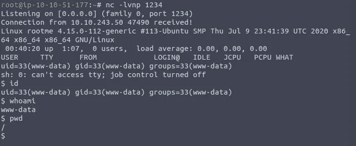

**如何获得旗帜？**

我用这个命令来搜索目录谁可写，也许我可以看到一些有趣的目录。

```
find / -writable 2>/dev/null | cut -d “/” -f 2,3 | grep -v proc | sort -u
```

是的，我明白了。

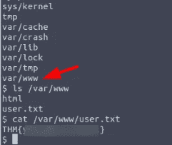

## 权限提升

1.  搜索有 SUID 权限的文件，哪个文件比较怪异？

> /usr/bin/python

用 find 命令我们可以查看有 SUID 的二进制文件，而/usr/bin/python 是一个有趣的文件。

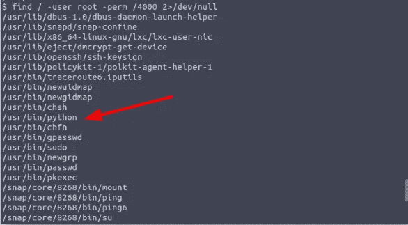

2.找一个表格来提升你的特权。

> 只需点击完成

因为我只需要读取 root.txt，所以我使用来自 **gtfobins** 的文件读取命令。

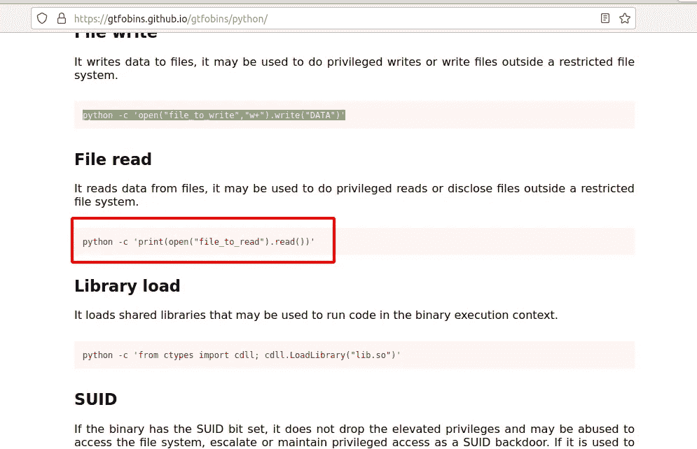

3.root.txt

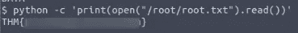

## 结论

这个房间非常适合学习渗透测试。你可能有自己的方法来侵入这个房间，你可以利用 python SUID 漏洞或 Metasploit 获得 root 访问权限，但我今天不会这么做

如果你有其他方法黑这个房间，请与我分享，我们可以一起讨论。谢谢

# 🔈 🔈Infosec Writeups 正在组织其首次虚拟会议和网络活动。如果你对信息安全感兴趣，这是最酷的地方，有 16 个令人难以置信的演讲者和 10 多个小时充满力量的讨论会议。[查看更多详情并在此注册。](https://iwcon.live/)

[](https://iwcon.live/) [## IWCon2022 - Infosec 书面报告虚拟会议

### 与世界上最优秀的信息安全专家建立联系。了解网络安全专家如何取得成功。将新技能添加到您的…

iwcon.live](https://iwcon.live/)