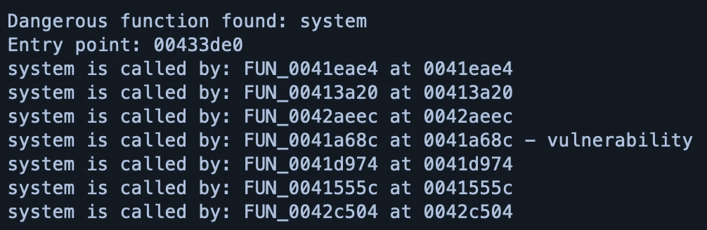
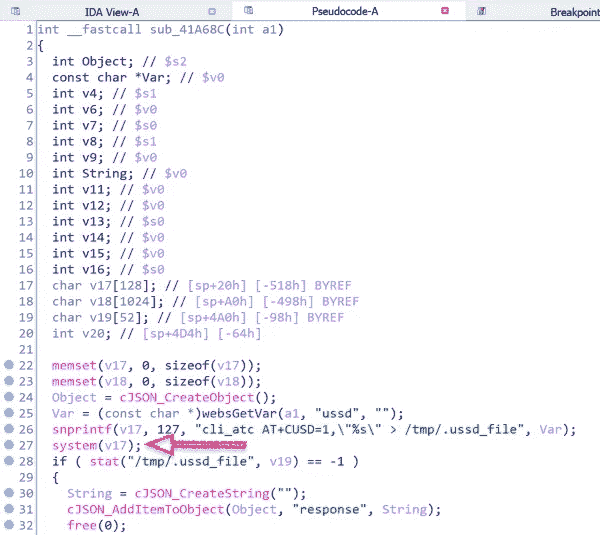
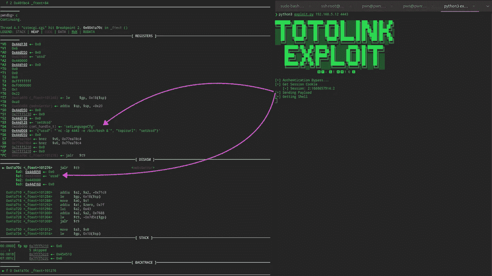
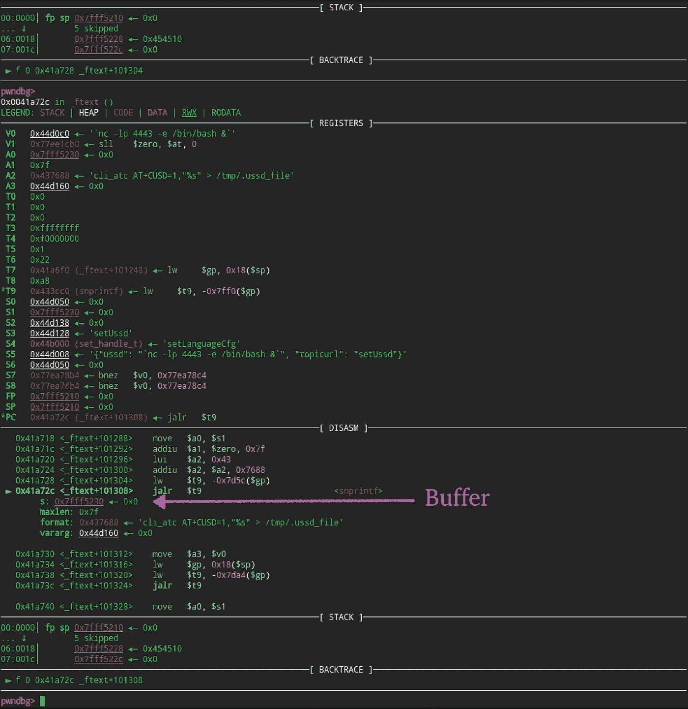
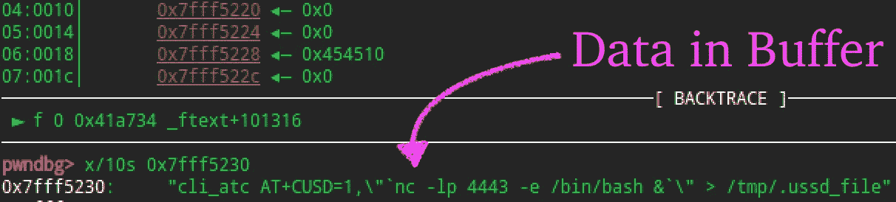
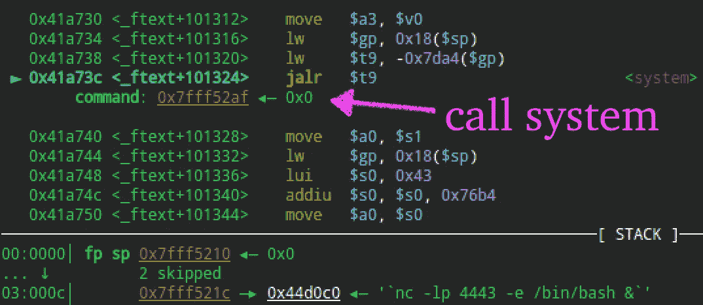
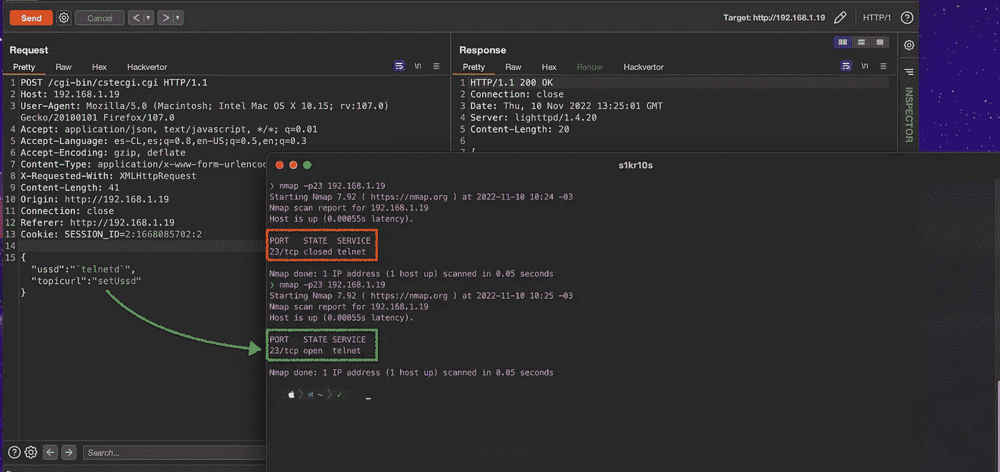
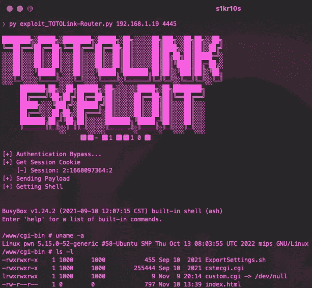

# 路由器 NR1800X 中的新错误—通过 setUssd 的命令注入

> 原文：<https://infosecwriteups.com/router-nr1800x-command-injection-via-setussd-7291f60b3c95?source=collection_archive---------2----------------------->

嗨，欢迎这篇文章的所有读者。

在一份 [Mitre](https://cve.mitre.org/) 出版物中，出现了一个 TOTOLink NR1800X 路由器(CVE-2022–41525)版本 V9.1.0u.6279_B20210910 的漏洞，这引起了我的注意，所以我继续了解关于该漏洞的更多信息。

卖主—【https://www.totolink.net 

对报告的漏洞做了一些总结，我继续做了一些测试，比如模拟固件，并在 [Ghidra](https://ghidra-sre.org/) 中启动我的脚本，以识别其他潜在的危险功能(Rce / BoF)。

结果，我得到了一个很大的有希望的函数列表(strcpy / system / etc)。其中一个在图片中高亮显示( **0x0041a68c** )，指向包含漏洞的函数。

功能列表

在我已经使用了 [Ghidra](https://ghidra-sre.org) 之后，我继续分析了 [IDA](https://hex-rays.com/ida-pro/) 中的二进制文件 **cstecgi.cgi** 。(多个工具的使用只是为了方便)。

从函数的静态分析开始，我们可以很快看到漏洞，其中第 26 行格式化了 **v17** 缓冲区，然后由 **system()** 函数作为参数发送。

在 IDA 中反转

现在，为了更详细地了解，我们将看到参数如何传递到内存的整个过程，在系统模式下调试固件。

首先，我们在 **websGetVar()** 函数中放置一个断点，该函数负责获取请求体中发送的值。在这种情况下，它验证发送的值是 **ussd** 。

通过请求发送数据

然后字符串用 **snprintf()** 格式化，存储在缓冲区 **0x7fff5230** 中。

格式化字符串

这里我们可以看到格式化后的字符串在缓冲区中的最终外观。

用数据缓冲

最后，使用堆栈参数调用 **system()** 函数。

呼叫系统()

为了使命令的执行成为可能，需要识别激活动作的名称 **setUssd** ，这样我们就可以在路由器中重新创建一个有效负载来启动 **telnetd** 服务。

请求概念证明

最后，通过连接两个漏洞来开发漏洞。第一个是绕过身份验证的请求，该请求将会话发送给利用代码执行的第二个请求。

剥削

## Poc 视频

[https://www.youtube.com/watch?v=Mcutnejlepk](https://www.youtube.com/watch?v=Mcutnejlepk)

## 结论

在已经分析过的系统中总能发现新的(0 天)漏洞。

## 博客

 [## 米格尔 M.Z - @s1kr10s

### 编辑描述

s1kr10s.github.io](https://s1kr10s.github.io/) 

## 来自 Infosec 的报道:Infosec 每天都有很多内容，很难跟上。[加入我们的每周简讯](https://weekly.infosecwriteups.com/)以 5 篇文章、4 个线程、3 个视频、2 个 GitHub Repos 和工具以及 1 个工作提醒的形式免费获取所有最新的 Infosec 趋势！