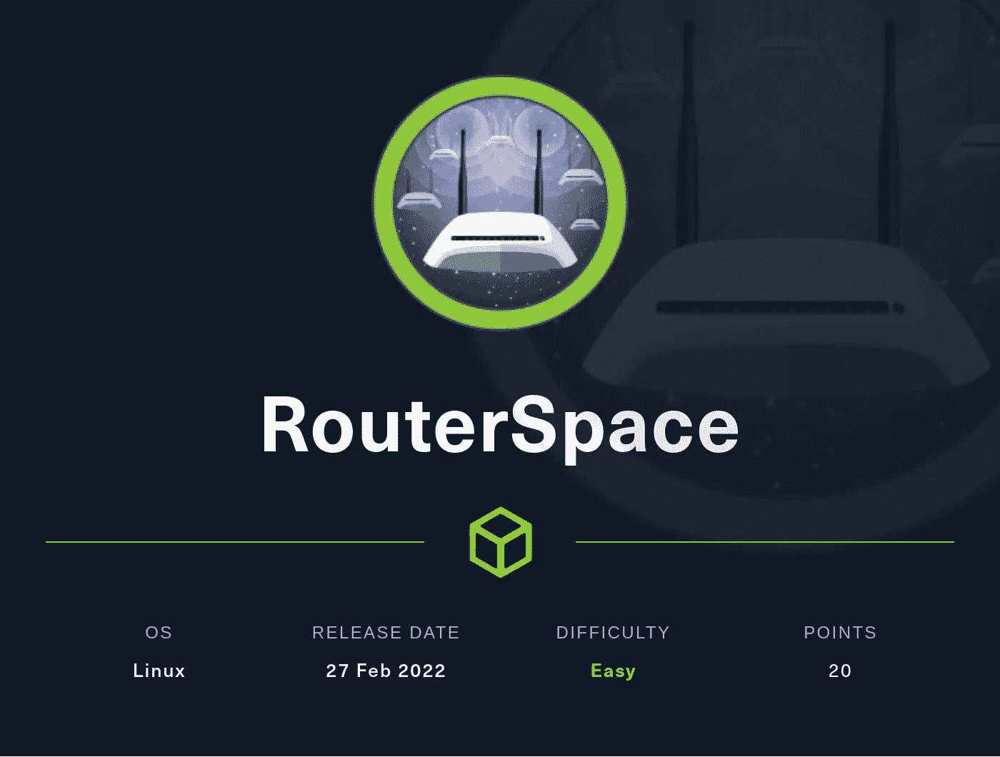
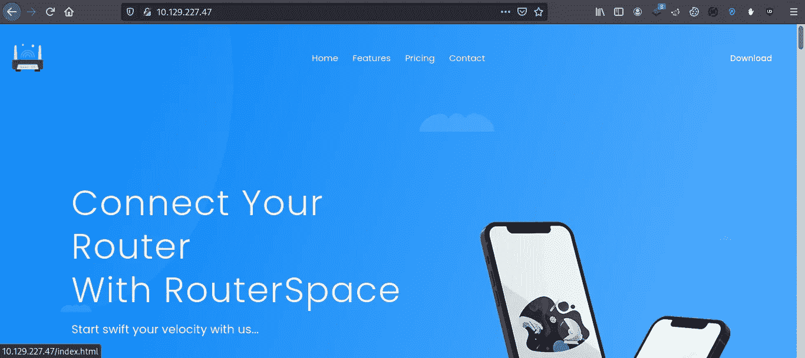
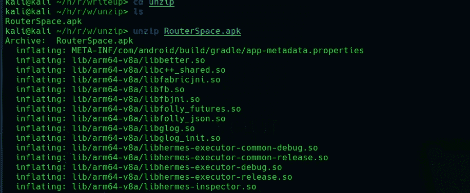
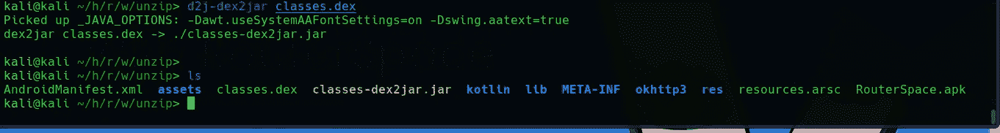
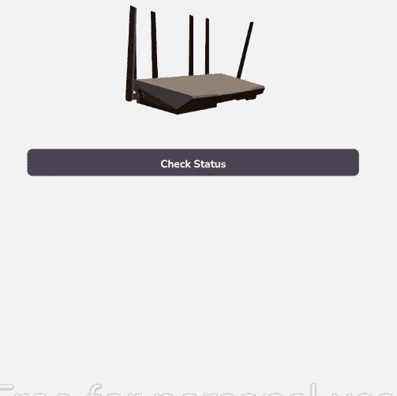
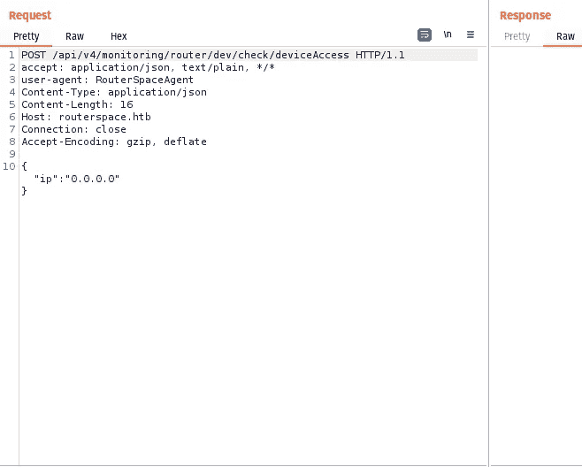
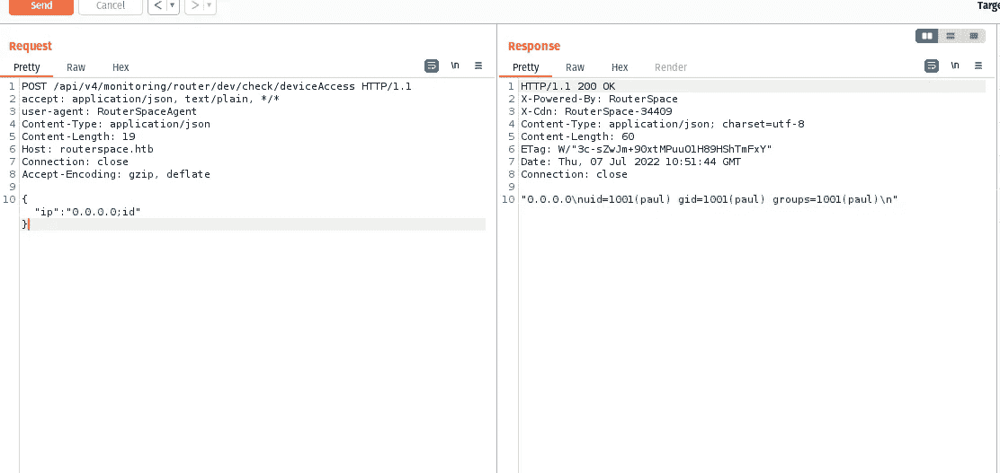
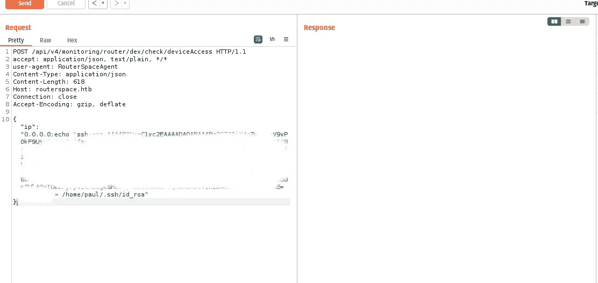
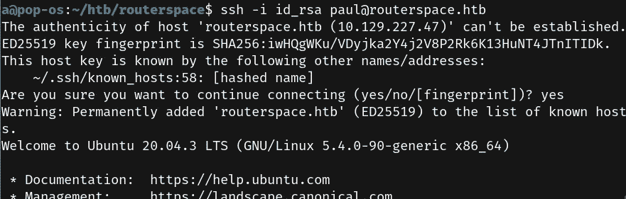
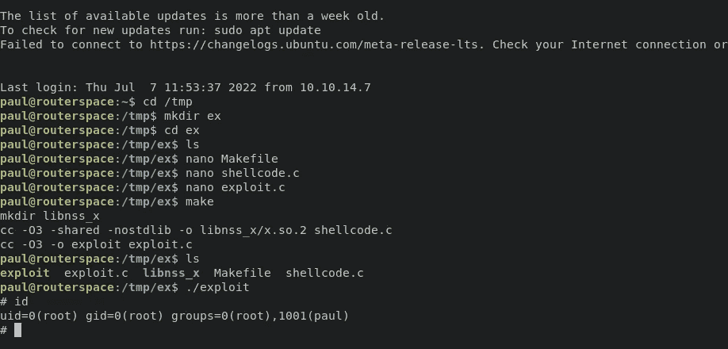

# 黑客盒子的路由器空间

> 原文：<https://infosecwriteups.com/routerspace-from-hackthebox-74de4a9ba988?source=collection_archive---------2----------------------->

## Android 漏洞和 sudo 漏洞



大家好，我是 Hac，今天我们将讨论 Hackthebox 的路由器空间，这是一个很容易退役的 Linux 盒子，你必须利用 **Android** 应用程序在盒子上获得最初的立足点，然后我们将使用 **sudo** 漏洞将你的权限升级为 root 用户。

**我们需要的工具:**

我们将从 Nmap 扫描开始

有两个端口开放 22 (ssh)和 80 (http)。像往常一样，我们将开始查看端口 80。因为它的攻击面更大。



我们还可以下载按钮“RouterSpace.apk ”,它看起来很有趣。我们可以用 apk 文件做很多事情。在 CTF，我们可以使用像 [**Mobsf**](https://github.com/MobSF/Mobile-Security-Framework-MobSF) 这样工具来寻找“代币或凭证”,或者我们可以使用像 [**apktool**](https://github.com/iBotPeaches/Apktool) 、 [**dex2jar**](https://www.kali.org/tools/dex2jar/) 和 [**jadx**](https://github.com/skylot/jadx) 这样的工具来进行人工处理。

Android 应用程序分析主要有两种方法

1-静态分析

2-动态分析

 [## 动态分析与静态分析

### 动态分析是在运行时对应用程序的测试和评估。静态分析是测试和…

www.cism.ucl.ac.be](https://www.cism.ucl.ac.be/Services/Formations/ICS/ics_2013.0.028/inspector_xe/documentation/en/help/GUID-E901AB30-1590-4706-94B1-9CD4736D8D2D.htm) 

我们将尝试这两种方法，因为我们对 apk 了解不多。通常我从静态分析开始。

但在此之前，我们需要知道**apk 到底是什么**。“Apk”是 android 操作系统用于分发 Android 应用程序的文件格式。现在我们需要知道 **Apk** **就像一个 zip 文件**，是的，我们可以通过使用像 **unzip** 这样的工具**解压**。

**静态分析**

我们可以解压缩文件，然后使用 dex2jar 进行转换”。dex“文件另存为”。压缩为“jar”的“类”文件



解压缩 RouterSpace.apk



d2j-dex2jar classes.dex

现在我们可以拉开拉链了”。罐子”。并寻找感兴趣的文件/目录，如 **AndroidManifest.xml** 和 smali 代码。但对于最初的立足点，我们需要动态分析，所以我们不会深入到静态分析部分。

**动态分析**

如果你是第一次这样做，我可能会很棘手。但是相信我，这很容易，如果你在使用谷歌时出错，请记住一件事。说完了，让我们开始这一部分。

我们需要 [genymotion](https://www.genymotion.com/) 作为 android 模拟器，然后我们需要配置我们的 burp 套件，以便拦截 HTTP 请求。如果你已经完成了设置你的 android 实验室的详细步骤。因此，继续检查这篇文章，以便入侵。

[](/manager-from-hackthebox-b93aecbd46dd) [## 建立一个安卓黑客实验室

### Android 开发简介的一部分

infosecwriteups.com](/manager-from-hackthebox-b93aecbd46dd) 

一旦我们完成设置，我们将打开 android 应用程序并点击“检查状态”按钮。



如果您的代理/设置正确，我们应该会收到此请求。



我做了一些改变，我能够执行系统命令。



现在我尝试使用 revershell，但是好像有什么东西(防火墙)阻挡了我们的请求。我做了一些枚举，发现我们对/home/paul/有写权限。嘘。我将我的公钥添加到了`/home/paul/.ssh/authorized_keys`



现在我通过 ssh 登录



现在我运行 Linpeas 来找出在这个盒子上找到根的可能方法。我发现了一个根漏洞。

```
sudo-1.8.31 
```

[](https://github.com/mohinparamasivam/Sudo-1.8.31-Root-Exploit) [## GitHub-mohinparamasivam/Sudo-1 . 8 . 31-Root-Exploit:CVE 的 Root shell PoC-2021-3156

### CVE 根壳 PoC-2021-3156(无暴力),用于教育等目的。在 Ubuntu 20.04 上针对 sudo 测试…

github.com](https://github.com/mohinparamasivam/Sudo-1.8.31-Root-Exploit) 