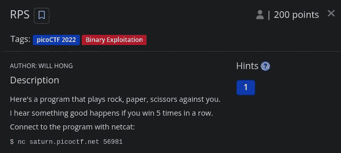
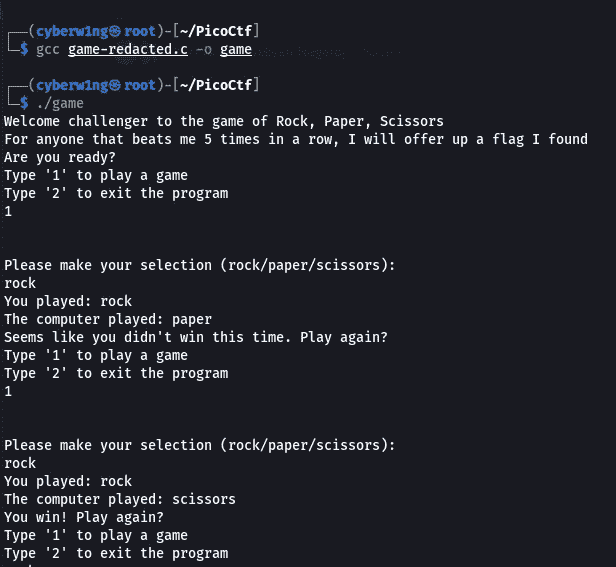
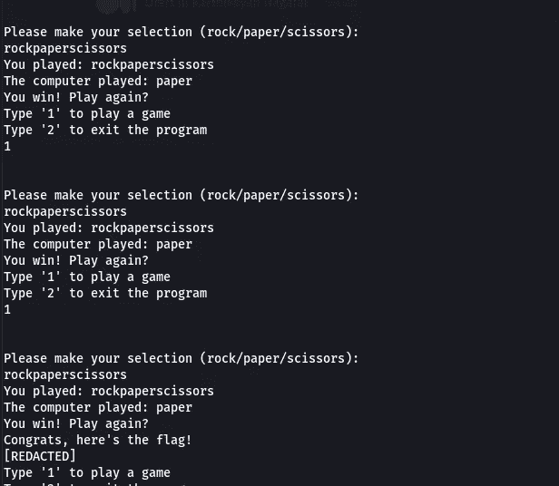
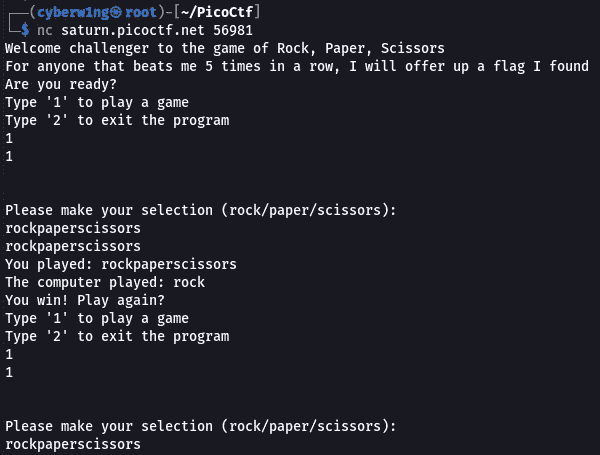
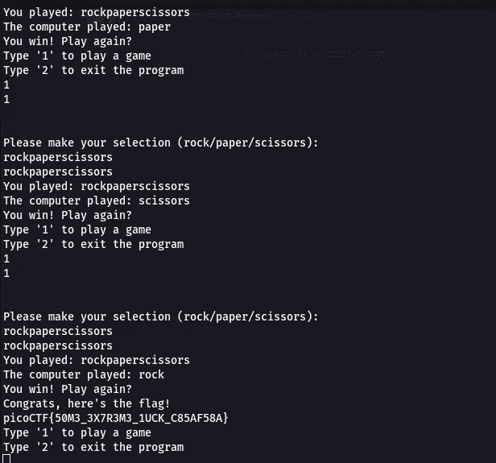

# RPS —二进制开发挑战报告| PicoCTF 2022

> 原文：<https://infosecwriteups.com/rps-binary-exploitation-challenge-writeup-picoctf-2022-5e856321a644?source=collection_archive---------5----------------------->

## RPS—PicoCTF |方法中的简单二进制开发程序



## **描述:**

*   这里有一个程序，和你玩石头、布、剪刀。
*   我听说如果你连续赢 5 次会有好事发生。
*   用 netcat 连接到程序:
    `$ nc saturn.picoctf.net 56981`
*   该程序的源代码与标记编辑可以下载[在这里](https://artifacts.picoctf.net/c/444/game-redacted.c)。

## 任务文件:

[https://artifacts.picoctf.net/c/444/game-redacted.c](https://artifacts.picoctf.net/c/444/game-redacted.c)

## 分析:

```
#include <stdio.h>
#include <stdlib.h>
#include <stdbool.h>
#include <string.h>
#include <time.h>
#include <unistd.h>
#include <sys/time.h>
#include <sys/types.h>

#define WAIT 60

static const char* flag = "[REDACTED]";

char* hands[3] = {"rock", "paper", "scissors"};
char* loses[3] = {"paper", "scissors", "rock"};
int wins = 0;

int tgetinput(char *input, unsigned int l)
{
    fd_set          input_set;
    struct timeval  timeout;
    int             ready_for_reading = 0;
    int             read_bytes = 0;

    if( l <= 0 )
    {
      printf("'l' for tgetinput must be greater than 0\n");
      return -2;
    }

    /* Empty the FD Set */
    FD_ZERO(&input_set );
    /* Listen to the input descriptor */
    FD_SET(STDIN_FILENO, &input_set);

    /* Waiting for some seconds */
    timeout.tv_sec = WAIT;    // WAIT seconds
    timeout.tv_usec = 0;    // 0 milliseconds

    /* Listening for input stream for any activity */
    ready_for_reading = select(1, &input_set, NULL, NULL, &timeout);
    /* Here, first parameter is number of FDs in the set, 
     * second is our FD set for reading,
     * third is the FD set in which any write activity needs to updated,
     * which is not required in this case. 
     * Fourth is timeout
     */

    if (ready_for_reading == -1) {
        /* Some error has occured in input */
        printf("Unable to read your input\n");
        return -1;
    } 

    if (ready_for_reading) {
        read_bytes = read(0, input, l-1);
        if(input[read_bytes-1]=='\n'){
        --read_bytes;
        input[read_bytes]='\0';
        }
        if(read_bytes==0){
            printf("No data given.\n");
            return -4;
        } else {
            return 0;
        }
    } else {
        printf("Timed out waiting for user input. Press Ctrl-C to disconnect\n");
        return -3;
    }

    return 0;
}

bool play () {
  char player_turn[100];
  srand(time(0));
  int r;

  printf("Please make your selection (rock/paper/scissors):\n");
  r = tgetinput(player_turn, 100);
  // Timeout on user input
  if(r == -3)
  {
    printf("Goodbye!\n");
    exit(0);
  }

  int computer_turn = rand() % 3;
  printf("You played: %s\n", player_turn);
  printf("The computer played: %s\n", hands[computer_turn]);

  if (strstr(player_turn, loses[computer_turn])) {
    puts("You win! Play again?");
    return true;
  } else {
    puts("Seems like you didn't win this time. Play again?");
    return false;
  }
}

int main () {
  char input[3] = {'\0'};
  int command;
  int r;

  puts("Welcome challenger to the game of Rock, Paper, Scissors");
  puts("For anyone that beats me 5 times in a row, I will offer up a flag I found");
  puts("Are you ready?");

  while (true) {
    puts("Type '1' to play a game");
    puts("Type '2' to exit the program");
    r = tgetinput(input, 3);
    // Timeout on user input
    if(r == -3)
    {
      printf("Goodbye!\n");
      exit(0);
    }

    if ((command = strtol(input, NULL, 10)) == 0) {
      puts("Please put in a valid number");

    } else if (command == 1) {
      printf("\n\n");
      if (play()) {
        wins++;
      } else {
        wins = 0;
      }

      if (wins >= 5) {
        puts("Congrats, here's the flag!");
        puts(flag);
      }
    } else if (command == 2) {
      return 0;
    } else {
      puts("Please type either 1 or 2");
    }
  }

  return 0;
}
```

请注意下面的代码

```
if (wins >= 5) {
        puts("Congrats, here's the flag!");
        puts(flag);
      }
```

如果`wins ≥ 5`的值那么它将显示该标志。

**输出:**



为了得到这面旗帜，我们必须连续赢 ***5 次。*** 那么我们来分析一下`play()`函数

```
if (strstr(player_turn, loses[computer_turn])) {
    puts("You win! Play again?");
    return true;
  } else {
    puts("Seems like you didn't win this time. Play again?");
    return false;
  }
```

这里使用`strstr()`函数来检查字符串`loses[computer_turn]`是否在`player_turn`的字符串中。如果存在，它将返回 true

**演示示例:**

```
char* hands[3] = {"rock", "paper", "scissors"};
char* loses[3] = {"paper", "scissors", "rock"};
```

`player_turn = rock
computer_turn = 2--> Means hand[2] -- scissors
loses[computer_turn] = rock`

因此，在这种情况下，字符串`loses[computer_turn]`在`player_turn`中，因此它将返回 True，我们将获胜

所以为了得到这个标志，我们必须使用字符串`rockpaperscissors`作为`5 Times`的输入

```
rock is in rockpaperscissors
paper is in rockpaperscissors
scissors is in rockpaperscissors
```

所有的条件都为真，所以我们会得到旗子

**解决方案:**



所以在 Netcat 中这样做可以获得标志

```
nc saturn.picoctf.net 56981
```



```
Ans: picoCTF{50M3_3X7R3M3_1UCK_C85AF58A}
```

请随时通过 LinkedIn 提出问题，并为我买一杯咖啡: )

[](https://buymeacoffee.com/cyberw1ng)

感谢您的阅读！！

快乐剥削~

```
Author: Karthikeyan Nagaraj ~ Cyberw1ng
```

ctf，二进制开发，netcat，pico ctf，2022，捕捉旗帜，挑战，写文章，旗帜，karthikeyan nagaraj，cyberw1ng

## 来自 Infosec 的报道:Infosec 每天都有很多内容，很难跟上。[加入我们的每周简讯](https://weekly.infosecwriteups.com/)以 5 篇文章、4 个线程、3 个视频、2 个 GitHub Repos 和工具以及 1 个工作提醒的形式免费获取所有最新的 Infosec 趋势！