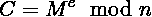
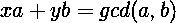
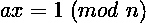
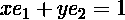
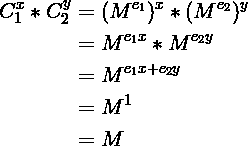
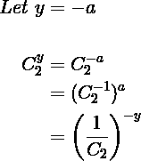
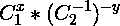

# RSA 攻击:公共模数

> 原文：<https://infosecwriteups.com/rsa-attacks-common-modulus-7bdb34f331a5?source=collection_archive---------0----------------------->

来源: [Unsplash](https://unsplash.com/photos/sZmIT85cV84)

RSA 以**Rivest–sha mir–ad leman**命名，是一种在现代日常应用中广泛使用的公钥密码系统。更具体地说，RSA 实现可以在 PGP 加密、数字签名、SSL、磁盘加密等中找到。

这篇文章描述了一种可以在 RSA 上执行的最简单的攻击。虽然这种攻击在现实世界中很少发生，但是如果您对密码学感兴趣，理解它是非常有用的，另外，我已经看到了许多可以通过这种攻击解决的 CTF 挑战。

# 方案

考虑以下场景:

假设*鲍勃*想要 s 与*爱丽丝*通信，并使用爱丽丝的公钥(n，e₁)用 RSA 加密消息。和往常一样，*伊芙*在偷听消息。他成功地发送了几条消息，但是过了一会儿，由于 CPU 过热(或其他随机原因),一个位被意外翻转，消息被错误的公钥(n，e₂).)加密

因此，假设 Eve 可以访问同一消息 M 的两个不同的密文，这两个不同的密文已经用不同的指数但共同的模数加密:

> ct₁= ₑ₁₎(me₍ₙ)
> 
> ct₂= ₑ₂₎(me₍ₙ)
> 
> 如果 e₂的 gcd(e₁= 1，gcd = 1，她可以恢复明文

很有趣吧？但是请继续阅读下面的内容，进一步分析攻击是如何执行的，以及为什么一开始就有可能。

# 数学背景

让我们首先确保支持攻击的数学是清楚的。

回想一下，RSA 加密的执行过程如下:

同样，**贝佐特定理**指出，如果有整数 *a* 和 *b* ，它们都不为零，那么有整数 *x* 和 *y* 使得:

最后，让我们简单地修改一下模运算中的除法，它比常规运算稍微复杂一点。你很可能已经知道，mod **n** 中整数 **a** 的乘法逆元是 **x** ，其中 **x** 由以下等式给出，也可以写成 **a⁻** :

例如，假设我们在 mod 7 (Z₇).分数 1/2 (2⁻)实际上是 2 的乘法倒数，在这种情况下是 **4** (2x4 = 1 (mod 7))。现在问题来了！根据 Bezout 的说法，如果分母 **a** 和模数 **n** 不是互质，那么分母不可逆 mod ***n*** 。换句话说，分数 1/a 是无效的。类似于常规算术中的除以 0。

# 攻击

回到我们的上下文中，如果 gcd(e₁**，e₂)=1** ，那么我们有整数 *x* 和 *y* 这样:

现在，通过使用**扩展的欧几里德算法**，我们可以找到 *x* 和 *y* ，然后很容易证明明文可以恢复如下(所有的数学运算都在公共模中执行):

虽然这个等式看起来很简单，但是计算起来有点复杂，因为通常情况下 **y** 是一个负整数。因此，必须对 Cʸ进行如下评估:

正如我们上面讨论的那样，为了使那个分数有效，C₂必须在模 n 中是可逆的。为了保持这一点， **gcd(C₂，n)=1** 也必须保持(互质)。

因此，为了实际恢复明文消息，攻击者必须计算:

这就是破解全能 RSA 的全部代价！但是因为我们是程序员，我们讨厌用笔和纸做数学，这里有一个 python 脚本可以自动完成这个过程:

以下是一些示例密文、指数和模数，尝试检查您是否可以提取明文:

> n = 10310906590233462022610116200879396350425602793917020091876799039690194735425901832050310642083250325252525290183205325252542902525325252925252525202525325203253252525292525252
> 
> ct1 = 9816552858889758135776273783468945136225275426454053812132813162649382585817815698098095910988729098290909829098290909890989099098999998989989899998998999989999989899998998998
> 
> e1 = 15
> 
> ct2 = 1024751882475638482869459153804766780260285487632701088535293182515123667291516829151682915168978059761527270270151827516367291682916829168751675167516516751651653675436753753
> 
> e2 = 13

享受攻击 RSA 的乐趣吧！