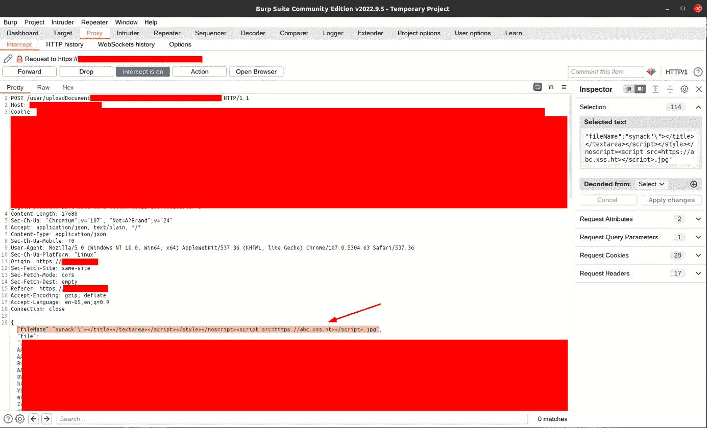
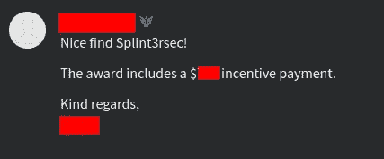

# XSS 俄罗斯轮盘赌

> 原文：<https://infosecwriteups.com/russian-roulette-xss-bbba6afd2570?source=collection_archive---------0----------------------->

# 故事

这一切都发生在一周精疲力尽的学习中，在数据科学考试的前一天晚上，我必须记住各种复杂的数学公式。晚上 10 点，学习累了，还不觉得困，决定睡前在 Synack 上打猎 1 小时。这是那天晚上我做的最好的决定！

选择 Synack 而不是其他平台的动机是我的朋友 Conda 进入了 SRT，我记得那条推文！

我启动了我的 LP+ ,然后我开始寻找新的目标。我注意到一个闪电战运行，所以我决定尝试一下。— Blitz 是一种短期促销活动，根据您报告的严重程度，您可以获得额外的现金奖励。-

# 狩猎

我打开我的博客并登录网站，令我惊讶的是它是一种我不会说的外语**(提示:外语网站较少被其他猎人测试，因为他们大多数人都懒得翻译内容)**所以我有一个翻译扩展，让我可以理解每个部分是什么。就像每个猎人应该做的那样，我开始点击我眼前所有可能的按钮。测试了不同的功能，并对平台非常熟悉。

回到 Burpsuite，我有这段时间内所有 HTTP 请求的日志，API 请求很有趣。因此，由于时间限制(上午 8 点考试)，我决定从这个网站处理货币交易的业务逻辑错误开始，尝试了所有不同的支付负金额的组合，用不同的金额取款，将帖子请求更改为 GET 等等……但都没有成功。我试图寻找 IDOR，因为请求有数字 id，但不幸的是，在 cookies 中计算了一个哈希值，不允许我这样做。

# 隐藏文件上传

在网站的一个隐藏部分，你必须通过设置才能找到它，我注意到一个上传按钮，就像这样:

这个按钮是关于把你的文档发送给网站的管理员，这样他们可以验证它们。另一件有帮助的事情是，这个按钮在发送我的文档后没有消失，这意味着我可以尽可能多地尝试重新发送它们，但只是在管理员批准我的文档之前。好攻击点！

所以我像普通用户一样上传了一个虚拟文件，然后点击上传。我去了 Burpsuite，看到了幕后发生的事情，文件在一个 JSON POST 请求中被发送到网站，其中包含两个密钥；**文件名**和**数据**，显然第一个是关于我们文档的名称，第二个包含我们文档的 base64 值。

# 最后一枪，俄罗斯轮盘赌

在这里，我决定结束我的狩猎会话，并将我的盲 XSS 有效载荷添加到文件名中，因为…为什么不呢，对吗？即使它不工作，我仍然会熟悉该网站，并在第二天测试其他东西。

那个 XSS·亨特网址不是我的

# SRT 会员免责声明

该目标允许包括第三方网站，如 XSS 亨特执行测试，**阅读范围！！**如果提到不允许包含第三方，您也不应该使用类似的网站。

# 第二天

所以那天晚上，我发送完有效载荷后就去睡觉了，6 点起床复习准备考试，去了大学，我考得很好！所以到目前为止，我是安全的，不会再为重考 XD 而学习，这意味着未来有更多的狩猎时间！

我的一天很正常，收件箱里什么都没有，回到家，离开学校休息一个小时，然后开始为下一次考试学习。通常我在学习的时候会关掉手机上的 wifi，以免容易分心，所以当我完成时，我会关掉笔记本电脑，然后去刷牙。在路上，我决定打开手机上的 wifi，查看我的通知……是的，你猜对了，令我惊讶的是，我连续收到 5 个 gmail 通知，说我的有效载荷在互联网:D 的某个地方被发射了

我想都没想就改变了主意，去刷牙，开始跑向我的笔记本电脑，打开它，当我这样做的时候，我正在重新检查手机，如果它是一个假阳性，它似乎不是这样！现在，我必须非常迅速地报告，以避免陷入重复区。

# 报告

晚上 11 点，我发送了一份非常快速的报告，包括 PoC 截图、cookies 和步骤，然后提交了它。两天后，VO 在报告上发送了一条消息，要求我在提交的报告中详细说明更多步骤，例如攻击者可以对 cookies 做什么，包括 XSS·亨特的截图等等……我这样做是因为我知道这肯定不是一份重复的报告，所以这次我花了足够多的时间来写报告，并尽可能地具体，以便客户在阅读时能够理解每个小细节。

同一天晚上，我收到一封电子邮件，说明我的漏洞被接受了！

如果这意味着什么，这意味着 Synack 是一个非常专业和快速的平台，在这里你可以通过分类获得报酬，并在你的报告上获得专业的回复。我们以 VO 如此友好的回复结束了提交

# 最后的想法

事实上，我的朋友康达激励我越来越多地寻找和发现这个平台，考试期间很难，但我会尽力在考试后给它一些时间！下一个目标是现在达到更高的水平。

我还想为令人惊叹的平台[马修·布莱恩特](https://xsshunter.com/)XS 亨特大声喊出来，看到它在 2023 年关闭真让人难过！谢谢你的努力！

## 来自 Infosec 的报道:Infosec 每天都有很多内容，很难跟上。[加入我们的每周时事通讯](https://weekly.infosecwriteups.com/)以 5 篇文章、4 个线程、3 个视频、2 个 GitHub Repos 和工具以及 1 个工作提醒的形式免费获取所有最新的 Infosec 趋势！