# S3 桶:云轨迹日志分析

> 原文：<https://infosecwriteups.com/s3-bucket-cloud-trail-log-analysis-ddefee0f025f?source=collection_archive---------2----------------------->

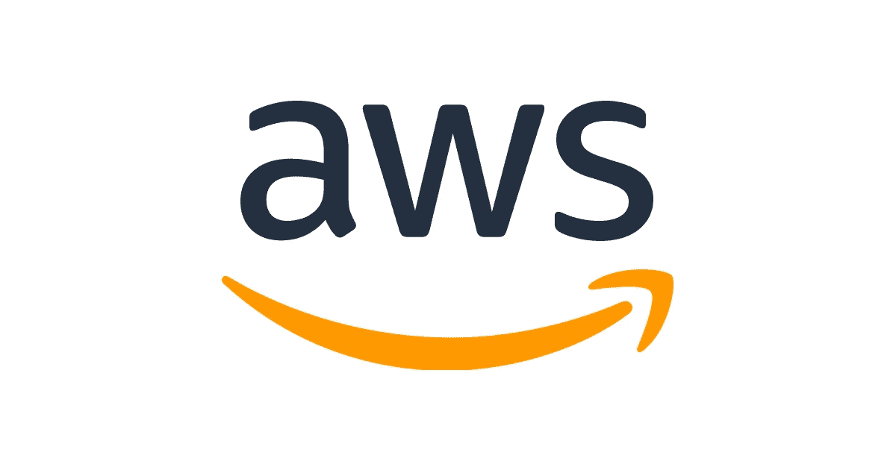

这篇文章提供了我在 [CyberDefenders](https://cyberdefenders.org/blueteam-ctf-challenges/84) 网站上解决由 [*Scott Piper*](https://twitter.com/0xdabbad00) 创建的 **Bucket** CTF 挑战的方法，这是一个蓝色团队专注的挑战，要求你分析 AWS 云轨迹日志的副本，并找出允许成功妥协发生的错误配置。

# 放弃

我喜欢在一篇文章之前添加一个简短的免责声明，以鼓励人们在阅读本文之前尝试一下这个房间，因为在这篇文章中显然会有**剧透****。我相信，如果你先自己尝试一下，然后在遇到困难或需要提示时再来写这篇文章，你会更喜欢 CTF。因此，没有任何进一步的拖延，让我们开始吧！**

# **网络卫士问答**

*****1。*** ***用于配置凭证的完整 AWS CLI 命令是什么？*****

**AWS CLI 将您使用“ *aws configure* 指定的敏感凭证信息存储在名为“ *credentials* ”的本地文件中，该文件位于名为“”的文件夹中。 *aws* "在你的主目录下。**

```
aws configure
```

**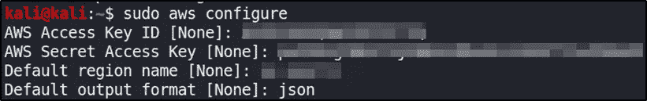**

***用于配置凭据的 AWS CLI 命令。***

****2。** ***桶“flaws2-logs”的“创建”日期是什么时候？*****

**我登录到 AWS 管理仪表板并选择 S3 服务，在那里我看到有一个名为“ *flaws2-logs* ”的单个存储桶，它是创建于“*2018 年 11 月 19 日，20:54:31 (UTC+00:00)* ”。**

**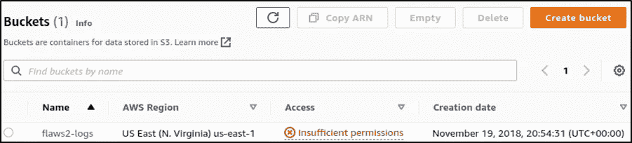**

***S3 桶“flaws2_logs”详情。***

*****3。*** ***第一个生成的事件叫什么名字——按时间？*****

**选择 S3 桶" *flaws2_logs* "并向下导航文件夹结构，我可以看到桶中存储了八个日志对象，从上到下按最旧到最新排序。**

**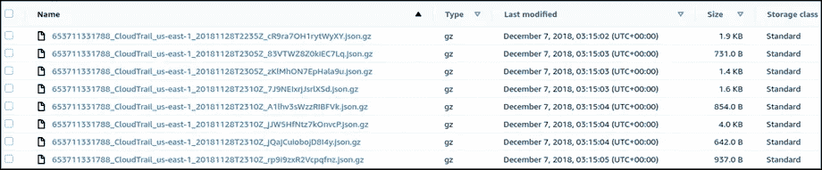**

***S3 斗物体。***

**我下载了所有八个日志文件，并使用了命名约定" *CloudTrail-#。json* ”，其中“ *CloudTrail-1.json* ”最老。我打开“ *CloudTrail-1.json* ”文件，看到生成的第一个事件名是“ *AssumeRole* ”。**

**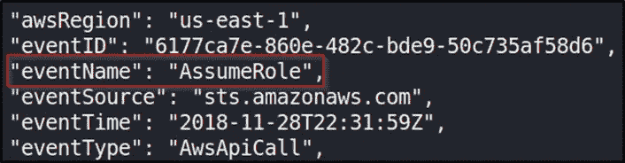**

***根据时间生成的第一个事件的名称。***

*****4。******UTC 时间 2018–11–28 23:03:20 事件是由哪个源 IP 地址生成的？*****

**在回顾了 Cloud Trail logs JSON 结构之后，我决定创建一个名为“ *json_print.py* 的简单 python 脚本来回答这个问题。**

**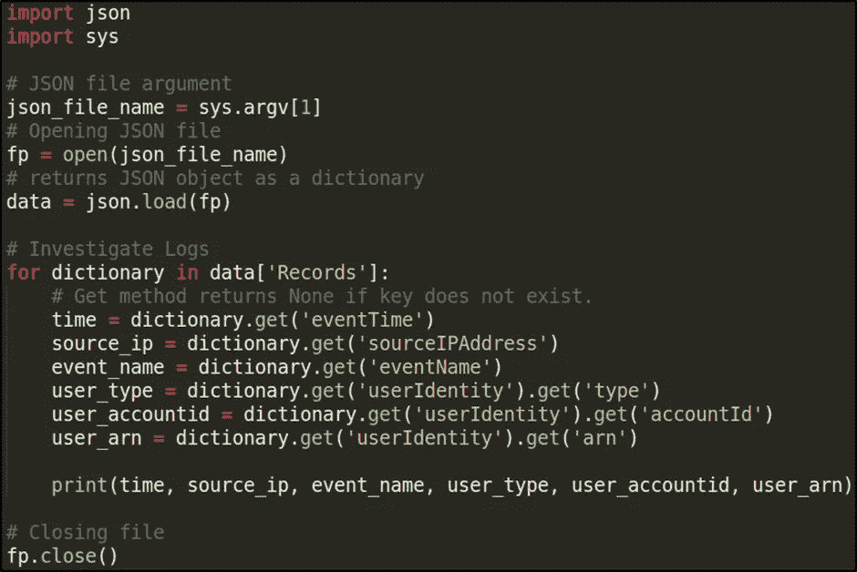**

**“JSON-print . py”python 脚本。**

**执行这个脚本后，我可以看到源 IP 地址是" *34[。]234[.]236[.]212* ”。**

```
python3 json-print.py CloudTrail-4.json
```

**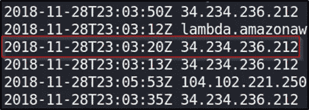**

***源 IP 地址是“34[。]234[.]236[.]212"* *生成了日期为 2018 年 11 月 28 日 23:03:20 UTC* 的事件**

**在 VirusTotal 中搜索 IP 地址，显示其属于亚马逊 AWS 基础设施。**

**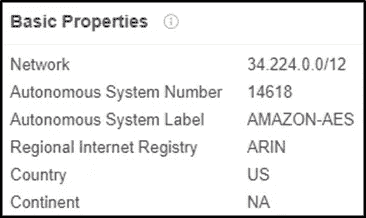**

***属于亚马逊 AWS 基础设施的 IP 地址。***

*****5。*** ***哪个 IP 地址不属于亚马逊 AWS 基础设施？*****

**回顾上图中的 IP 地址，我可以看到 IP 地址" *104[。]102[.]221[.]250* ”。查看 VirusTotal 中的 IP 地址显示，它不属于亚马逊 AWS 基础设施。**

**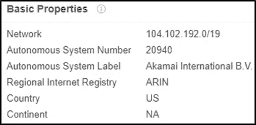**

***IP 地址不属于亚马逊 AWS 基础设施。***

*****6。*** ***哪个用户发出了“ListBuckets”请求？*****

**查看日志文件“ *CloudTrail-7.json* ”，可以看到单个事件。我决定使用一个名为[beautiier . io](https://beautifier.io/)的网站来帮助格式化 JSON 代码。我可以看到用户“ *level3* ”发出了“ *ListBuckets* ”请求。**

**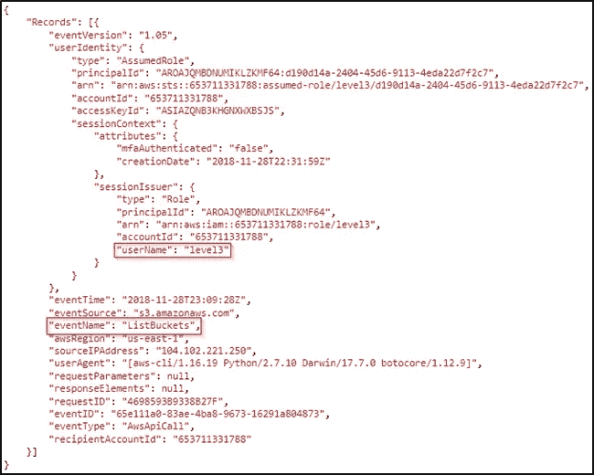**

***“level 3”用户发出了“ListBuckets”请求。***

****7*。*** ***用户“level1”发出的第一个请求是什么？*****

**查看日志文件" *CloudTrail-2.json* ，我可以看到一个事件，它显示用户发出的第一个请求" *level1* "是" *CreateLogStream* "。**

**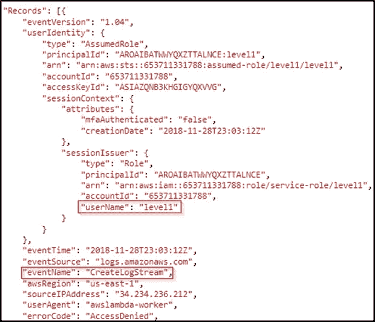**

***“级别 1”用户发出了“创建日志流”请求。***

# **事件调查**

**利用从回答上述问题中获得的信息，我开始进一步调查该事件。当测试 S3 的时候，你首先要做的事情之一就是看看 S3 桶的政策是什么。存储桶策略和访问控制列表(ACL)用于访问控制，充当允许和拒绝访问 S3 资源的前线。我们可以使用 aws-cli 检索“ *flaws2-logs* ”存储桶的存储桶策略，或者通过 S3 管理控制台查看该策略。**

```
aws s3api get-bucket-policy --bucket flaws2-logs
```

**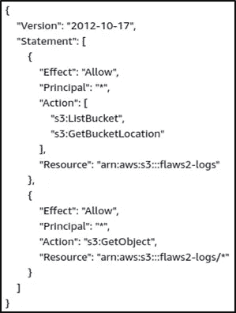**

***“flaws 2-logs”存储桶策略。***

**我可以看到，使用星号通配符将主体(即可以请求对 AWS 资源进行操作的人或应用程序)设置为任何人，并且 S3 操作“ *GetObject* ”允许从桶中检索对象。我还可以看到任何人都可以执行“ *ListBucket* ”和“ *GetBucketLocation* ”动作。多年来，由于开放亚马逊 S3 桶，一些大公司发生了大量严重的数据泄露。为了测试" *flaws2-logs* " S3 桶的开放性，我可以尝试通过它的 URL 访问它。存储桶的 URL 格式有两种选择:**

*   **[*http://S3 . Amazon AWS . com/[bucket _ name]/*](http://s3.amazonaws.com/[bucket_name]/)**
*   **[*http://[bucket _ name]. S3 . Amazon AWS . com/*](/[bucket_name].s3.amazonaws.com/)**

**私有存储桶将返回“拒绝访问”的消息，并且不会显示任何存储桶内容。但是，对于公共存储桶，单击 URL 将列出该存储桶中包含的前 1000 个文件。键入“*http://s3.amazonaws.com/flaws2-logs/*”显示该桶是可公开访问的，我可以看到存储在桶中的八个云轨迹日志。**

**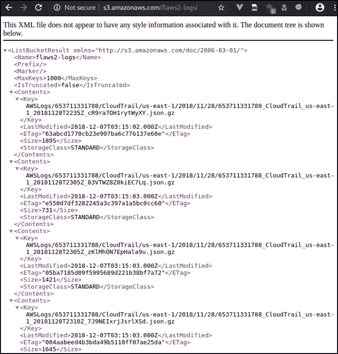**

***“flaws 2-logs”桶可公开访问。***

**既然我们已经确认了公众可以访问这个 bucket，以及可以执行哪些请求，那么接下来我将更详细地查看日志。如果我查看日志文件" *CloudTrail-7.json* ，我可以看到一个" *ListBucket* "来自用户的请求" *level3* "。**

****

***“level 3”用户发出了“ListBuckets”请求。***

**检查该角色时，我们看到描述中声明该角色只应由 ECS 服务运行，因为 AssumeRolePolicyDocument 只允许一个原则。 *104[。]102[.]221[.]250* " IP 地址也不属于亚马逊 AWS 基础设施。**

```
*aws --profile target_security iam get-role --role-name level3*
```

**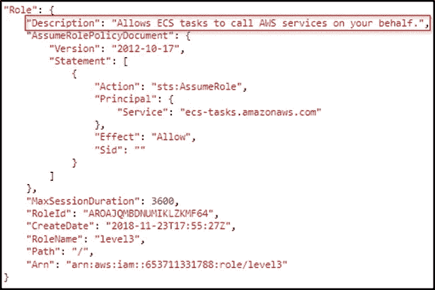**

***“level 3”角色描述。***

**基于这些详细信息，我们可以假设 ECS 容器一定被黑客攻击了，凭据被盗了，因为通常情况下，我们会看到资源(在本例中是 ECS)从其自己的 IP 而不是"*104[]发出 AWS API 调用。]102[.]221[.]250* ”。回顾之前的事件，我可以看到用户“ *level1* ”执行了“ *ListImages* ”、“ *BatchGetImage* ”和“ *GetDownloadUrlForLayer* ”请求。**

```
python3 json-print.py CloudTrail-5.json
```

**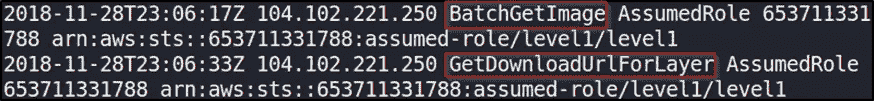**

***“level 1”执行了“BatchGetImage”和“GetDownloadUrlForLayer”请求。***

```
python3 json-print.py CloudTrail-4.json
```

**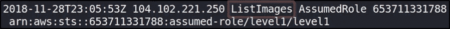**

***“level 1”执行了“ListImages”请求。***

**检查" *ListImages* "请求，我可以看到事件在请求参数中包含一个名为" *level2* "的存储库。**

**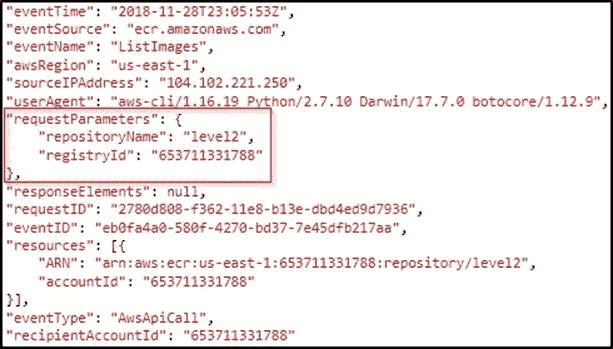**

***事件在请求参数中包含一个名为“level2”的存储库。***

**我们可以查看弹性容器注册中心(ECR)的策略，我们看到主体是" *** "，这意味着这些操作对任何人都是公开的。**

```
aws --profile target_security ecr get-repository-policy --repository-name level2
```

**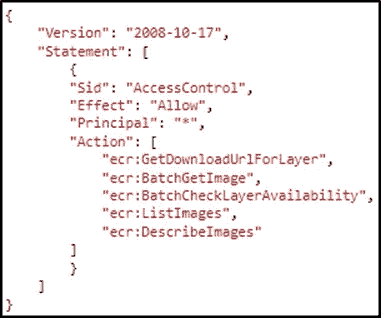**

***ECR“二级”储存库。***

# **事故影响和建议**

**亚马逊 S3 被认为是一个公众可访问的平台。这意味着通过正确的 URL 和权限，可以从任何地方通过 HTTP 请求访问任何 bucket，就像普通浏览器访问网站一样。公共水桶是 AWS 和 S3 最大的健康风险之一。据报道，由于 S3 糟糕的安全状况导致的错误配置，导致了大量数据泄露。存储桶策略和存储桶或对象 ACL 允许您将其配置为任何人都可以访问。许多管理员忽略了这一点，让他们的 S3 资源开放，而不知道他们这样做。当然，AWS 有强调这一点的提示和警告，并试图防止这种类型的安全漏洞，但这并没有阻止许多敏感数据通过这个简单的错误泄漏的发生。**

**建议包括:**

*   ****S3 水桶的监控**。没有监控，就没有稳定的方法来检查对您的 S3 环境的访问。**
*   ****S3 环境的测试和审计**。像漏洞评估甚至简单的渗透测试这样简单的事情将有助于突出可以容易修复的问题。**
*   ****避免宽松政策**。如果策略允许太多用户访问 S3 资源，那么如果这些帐户受到威胁，就会出现问题。**

# **结束语**

**我真的很喜欢通过这个 CTF 工作，并有机会了解更多关于调查云踪迹日志以发现成功入侵的迹象。谢谢你一直读到最后，继续黑下去😄！**

***来自 Infosec 的报道:Infosec 上每天都会出现很多难以跟上的内容。* [***加入我们的每周简讯***](https://weekly.infosecwriteups.com/) *以 5 篇文章、4 个线程、3 个视频、2 个 Github Repos 和工具以及 1 个工作提醒的形式免费获取所有最新的 Infosec 趋势！***