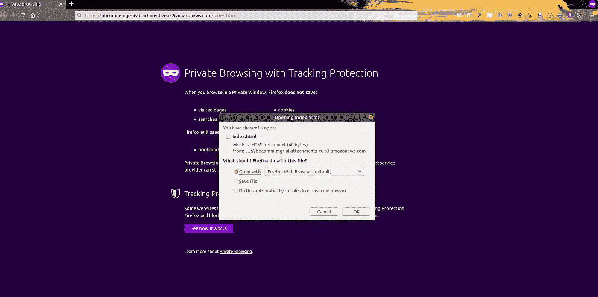
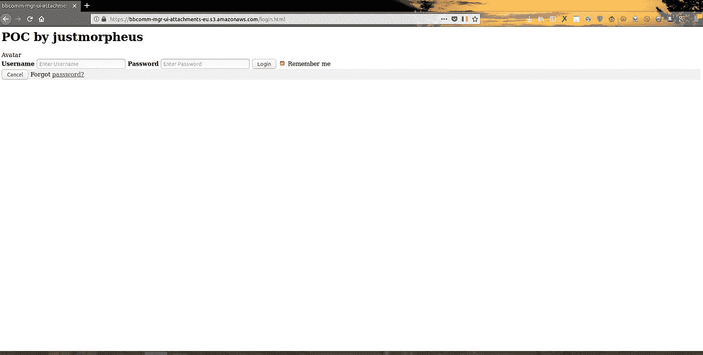
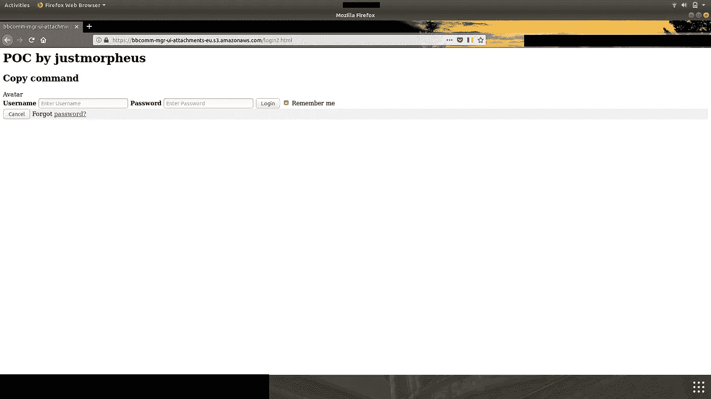
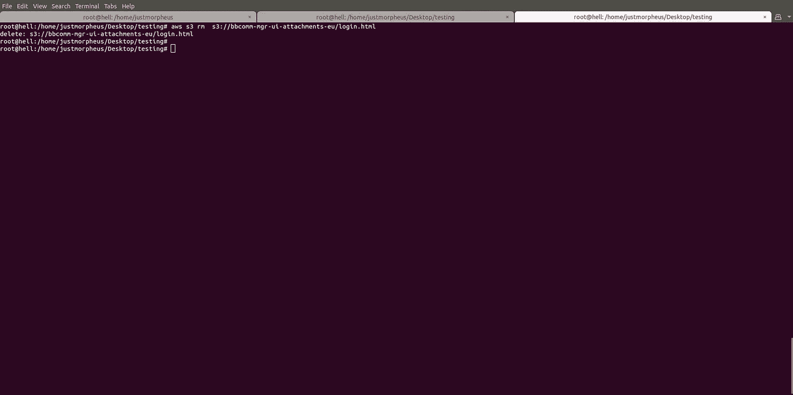

# 亚马逊的 S3 桶配置错误

> 原文：<https://infosecwriteups.com/s3-bucket-misconfiguration-in-amazon-a7da6a6e02ea?source=collection_archive---------1----------------------->

## **描述**

## **概要:**

在试图访问[**https://www . Amazon . in**](https://www.amazon.in/)**上的一个联系人美国页面时，我发现了一个错误配置的 s3 存储桶。在这个场景中，s3 存储桶的错误配置允许任何用户向 S3 存储桶上传和删除任何文件:[https://bbcomm-mgr-ui-attachments-eu.s3.amazonaws.com](https://bbcomm-mgr-ui-attachments-eu.s3.amazonaws.com/login.html)**

> **在寻找联系客户服务时，我看到页面有上传功能，所以为什么不尝试上传一些 php 外壳。打开我的打嗝拦截器，试图绕过文件上传。它允许 png，jpeg 和 gif 格式。但每次我试图上传，它显示错误的反应，但后来我启动蜘蛛找出任何其他网页链接到这个网页。我看到有一个 s3 存储桶与我试图上传的文件相同。复制链接后，我可以下载我的文件。哇啊！我能够找到配置错误的亚马逊桶。客户经理可以从这个桶中下载发送给他们的附件。当你向零售商询问发票收据时，你可以附上图片、pdf 等。附件被上传到 s3 存储桶。**

## ****目标:****

**[https://bbcomm-mgr-ui-attachments-eu.s3.amazonaws.com](https://bbcomm-mgr-ui-attachments-eu.s3.amazonaws.com/login.html)**

## ****概念验证****

**1) 访问网址:
[https://bbcomm-mgr-ui-attachments-eu . S3 . Amazon AWS . com/login 2 . html](https://bbcomm-mgr-ui-attachments-eu.s3.amazonaws.com/login2.html)**

**2)尝试在桶中写入和删除文件:**

**a)书写命令:
使用卷曲书写 index.html**

**curl -XPUT -d '**

# **上传由 just morpheus' '[https://bbcomm-mgr-ui-attachments-eu.s3.amazonaws.com/index.html](https://bbcomm-mgr-ui-attachments-eu.s3.amazonaws.com/index.html)**

****

**index.html**

**b)使用 AWS CLI:
移动和复制命令:**

1.  **AWS S3 mv login.html S3://bbcomm-mgr-ui-attachments-eu-grants read = uri =[http://acs.amazonaws.com/groups/global/AllUsers](http://acs.amazonaws.com/groups/global/AllUsers)**

****

1.  **AWS S3 CP login2.html S3://bbcomm-mgr-ui-attachments-eu-grants read = uri =[http://acs.amazonaws.com/groups/global/AllUsers](http://acs.amazonaws.com/groups/global/AllUsers)**

****

**删除命令:**

1.  **AWS S3 RM S3://bbcomm-mgr-ui-attachments-eu/log in . html**
2.  **AWS S3 RM S3://bbcomm-mgr-ui-attachments-eu/index . html**

****

****结果:**
我们现在拥有对 an Amazon.in 存储桶的完全写/执行权限。
还尝试使用 dirbuster 强行打开目录，发现了一个文件夹。
可用于下载机密文件，也可用于网络钓鱼。**

## ****解决方案:****

**不要允许任何人进行完全的读/写/执行访问。
见文档:[https://docs . AWS . Amazon . com/Amazon S3/latest/dev/access-control-overview . html](https://docs.aws.amazon.com/AmazonS3/latest/dev/access-control-overview.html)**

## ****参考与感谢:****

**[https://blog . detect ify . com/2017/07/13/AWS-S3-错误配置-解释-fix/](https://blog.detectify.com/2017/07/13/aws-s3-misconfiguration-explained-fix/)
[https://medium . com/@ jonathanbouman/how-I-hacked-apple-com-unrestricted-file-upload-bcda 047 e 27 e 3](https://medium.com/@jonathanbouman/how-i-hacked-apple-com-unrestricted-file-upload-bcda047e27e3)**

**特别提及@kunal_mahar —信息安全分析师。**

## ****时间线:****

**2018 年 10 月 7 日:发现并向亚马逊举报。
2018 年 10 月 7 日:已确认 Bug 并已分配案例 id。2018 年 3 月 8 日:亚马逊安全团队修复了一个错误。
2018 年 12 月 8 日:发布概念验证。**

**PS:亚马逊没有名人堂或奖励，因为它在协调披露政策下工作**

****

***关注* [*Infosec 报道*](https://medium.com/bugbountywriteup) *获取更多此类精彩报道。***

** [## 信息安全报道

### 收集了世界上最好的黑客的文章，主题从 bug 奖金和 CTF 到 vulnhub…

medium.com](https://medium.com/bugbountywriteup)**