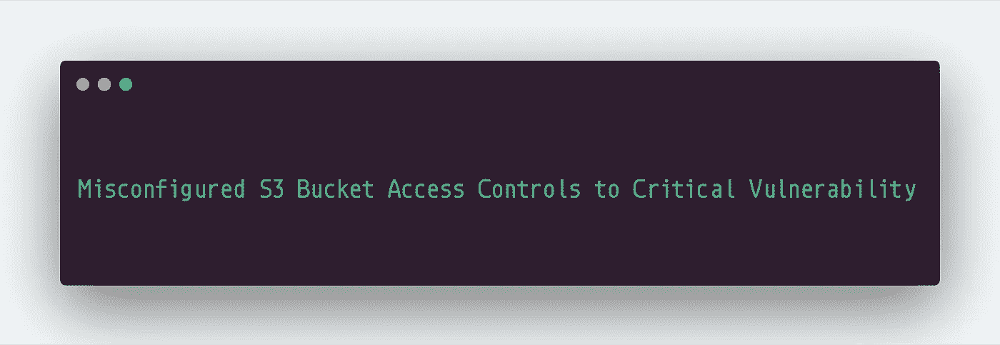
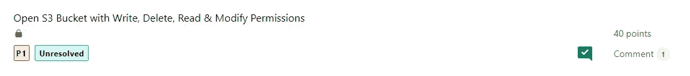

# 严重漏洞的错误配置的 S3 存储桶访问控制

> 原文：<https://infosecwriteups.com/s3-bucket-misconfigured-access-controls-to-critical-vulnerability-6b535e3df9a5?source=collection_archive---------1----------------------->

亚马逊 S3(简单存储服务)是一种流行和广泛使用的存储服务。许多公司使用 S3 存储桶来存储他们的资产，如用户资料图片、静态资源以及任何符合其业务逻辑和需求的东西。然而，如果桶没有正确配置，或无人认领，攻击者可能会执行一些有害的行动，如 S3 桶接管或 S3 内容接管。

嗨，各位黑客和爱好者，在这篇文章中，我将谈论最近遇到的一个错误配置的 S3 桶允许我执行任何 CRUD 操作，从而导致一个严重的漏洞。

你可以在这里阅读更多关于亚马逊 S3 的信息。

我测试的应用程序范围很广。这一发现与该计划的一个附属项目有关。姑且称这家子公司为“【subtarget.com】T2”。

我用下面的命令从子域枚举和解析唯一子域开始:

> 【subtarget.com-silent | httpx-follow-redirects-status-code-vhost-threads 300-silent | sort-u | grep "[200]" | cut-d[-f1>resolved . txt

在那里，我找到了一个名为“https://QA-assets-us . subtarget . com”的子域，在导航到这个子域时，我注意到**存储桶是打开的，并且我看到了“** ListBucketResult”

现在，存储桶被用于静态资源，所以没有必要报告这一点，因为有时存储桶是故意打开的(至少他们是这么说的)。

下一步是查看下面的条目，它提供了 **S3 存储桶的名称:**

> **<姓名>有人——姓名——此处</姓名>**

现在，下一个过程是测试 S3 存储桶的访问控制。通常，bucket 不得向未授权用户提供以下权限:

*   在桶上创造一些东西
*   修改桶上的东西
*   删除桶上的一些东西
*   读取铲斗上的一些敏感数据(具体情况具体分析)

为了测试 **S3 存储桶的访问控制，**最好的方法是使用， **AWS CLI 和默认命令。**

1.  安装 AWS CLI
2.  提供 AWS 访问密钥和密码以配置 AWS CLI

现在，使用以下命令检查我们是否有权在 S3 存储桶上上传(创建)某些内容:

> **AWS S3 CP yourtest file . txt S3://bucket name**

成功后，您应该会看到类似这样的内容:

> **上传:。/yourtestfile.txt 到 S3://bucket name/your test file . txt**

同样，在本例中，我成功地将文件上传到了 bucket。

但是，等等，让我们检查更多的权限以增加影响，让我们删除我们上传的文件，看看它是否有效。使用以下命令来完成此操作:

> **AWS S3 RM S3://bucket name/yourtestfile . txt**

我们成功删除了文件。

现在，影响增加了，因为**我可以删除原来的资源并上传一个新的攻击者定义的同名资源。无论应用程序在哪里引用该资源，它现在都会显示攻击者定义的资源。**

# 外卖:

1.  检查 S3 开放时段并查找时段名称
2.  使用 AWS CLI 检查 S3 存储桶访问控制
3.  通过查看所有 C.R.U.D(创建、读取、更新和删除)操作来增加影响。

**时间线:**

**报告了公司的>拦截器对影响>进行了分类&被接受为 P1**

如果你学到了什么或喜欢阅读，请鼓掌、分享和关注。

推特:[https://www.twitter.com/harshbothra_](https://www.twitter.com/harshbothra_)

领英:[https://www.linkedin.com/in/harshbothra](https://www.linkedin.com/in/harshbothra)