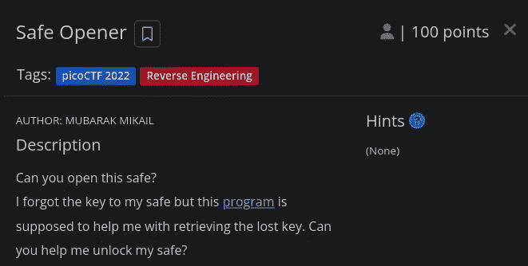
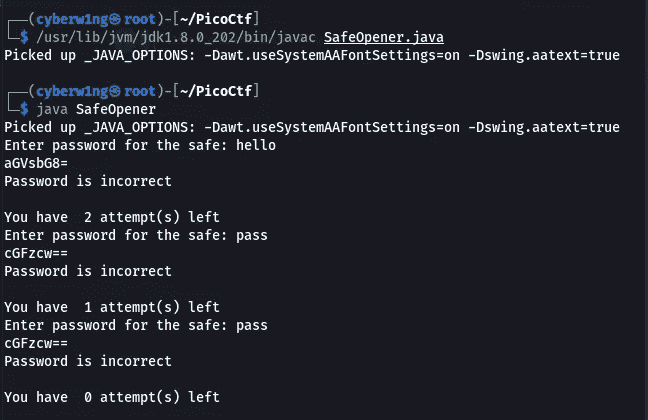
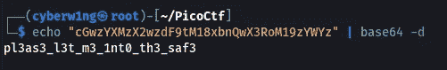

# 保险箱开启器—逆向工程| PicoCTF 2022 详细报道

> 原文：<https://infosecwriteups.com/safe-opener-reverse-engineering-picoctf-2022-writeup-21b22937b6ae?source=collection_archive---------3----------------------->

## 保险箱开启者—皮可 CTF 100 分逆向工程挑战赛| Karthikeyan Nagaraj



`Description:
Can you open this safe?
I forgot the key to my safe but this [program](https://artifacts.picoctf.net/c/463/SafeOpener.java) is supposed to help me with retrieving the lost key. Can you help me unlock my safe?`

**任务文件:**
下载任务文件[SafeOpener.java 这里](https://artifacts.picoctf.net/c/463/SafeOpener.java)https://artifacts.picoctf.net/c/463/SafeOpener.java

# 分析:

## 保险箱开启器的程序代码:java

```
import java.io.*;
import java.util.*;  
public class SafeOpener {
    public static void main(String args[]) throws IOException {
        BufferedReader keyboard = new BufferedReader(new InputStreamReader(System.in));
        Base64.Encoder encoder = Base64.getEncoder();
        String encodedkey = "";
        String key = "";
        int i = 0;
        boolean isOpen;

        while (i < 3) {
            System.out.print("Enter password for the safe: ");
            key = keyboard.readLine();

            encodedkey = encoder.encodeToString(key.getBytes());
            System.out.println(encodedkey);

            isOpen = openSafe(encodedkey);
            if (!isOpen) {
                System.out.println("You have  " + (2 - i) + " attempt(s) left");
                i++;
                continue;
            }
            break;
        }
    }

    public static boolean openSafe(String password) {
        String encodedkey = "cGwzYXMzX2wzdF9tM18xbnQwX3RoM19zYWYz";

        if (password.equals(encodedkey)) {
            System.out.println("Sesame open");
            return true;
        }
        else {
            System.out.println("Password is incorrect\n");
            return false;
        }
    }
}
```

## SafeOpener.java 的输出:

编译 java 程序，并通过以下命令执行它
确保给出`javac`文件的路径，就像我在截图中给出的那样

```
javac SafeOpener.java
java SafeOpenerChecks whether the 
```



1.  该程序有一个条件语句`while`，它将执行循环 3 次
2.  每次我们输入的字符串都被转换成`base64`并传递给一个名为 openSafe 的方法
3.  该方法检查给定的 base64 代码是否匹配一个`encodedkey`——它是编码格式的标志
4.  如果给定的编码字符串等于 encodedkey，那么它将打印*“芝麻开门”*

## 解决方案:

**简单地解码 base64 中的 encoded key**会给你一个标志
使用命令行或任何其他在线解码器来解码

```
echo "cGwzYXMzX2wzdF9tM18xbnQwX3RoM19zYWYz" | base64 -d
```



```
Ans: picoCTF{pl3as3_l3t_m3_1nt0_th3_saf3}
```

感谢您的阅读！！

逆向工程快乐~

```
Author: Karthikeyan Nagaraj
```

picoctf，ctf，逆向工程，写作，初学者挑战，karthikeyan nagaraj，cyberw1ng

## 来自 Infosec 的报道:Infosec 每天都有很多内容，很难跟上。[加入我们的每周简讯](https://weekly.infosecwriteups.com/)以 5 篇文章、4 个线程、3 个视频、2 个 GitHub Repos 和工具以及 1 个工作提醒的形式免费获取所有最新的 Infosec 趋势！