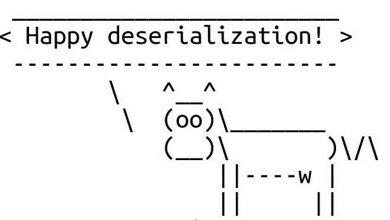

# Spring Security OAuth2 中更安全的反序列化

> 原文：<https://infosecwriteups.com/safer-deserialization-in-spring-security-oauth2-37be6f55a860?source=collection_archive---------2----------------------->

Java 标准库提供了`ObjectInputStream`类，它为反序列化 Java 对象提供了一种便捷的方式。不幸的是，这种方式默认是不安全的。使用此类可能会为 Java 反序列化攻击打开大门，在更糟糕的情况下，这可能会导致任意代码执行。

我最近发现 Spring Security OAuth2 库可能容易受到这样的攻击。幸运的是，成功的攻击有一个强大的先决条件，对手可能很难满足。尽管如此，我认为让库更安全一点可能更好，项目维护人员欣然接受了这一贡献。以下是细节。

(最初发表于[https://blog.gypsyengineer.com](https://blog.gypsyengineer.com/en/security/safer-deserialization-in-spring-security-oauth.html))



# 问题

Spring Security OAuth2 可以将认证信息和用户详细信息存储到 SQL 或 Redis 数据库中。在将数据存储到数据库之前，库使用由`ObjectOutputStream`提供的默认 Java 序列化机制对其进行序列化。然后，从数据库中读取数据后，库用`ObjectInputStream`类不安全地反序列化它。参见`SerializationUtils`类:

```
public static  T deserialize(byte[] byteArray) {
         ObjectInputStream oip = null;
         try {
             oip = new ConfigurableObjectInputStream(
                    new ByteArrayInputStream(byteArray),
                    Thread.currentThread().getContextClassLoader());
             [@SuppressWarnings](http://twitter.com/SuppressWarnings)("unchecked")
             T result = (T) oip.readObject();
```

Spring 框架提供的`ConfigurableObjectInputStream`类只是包装了`InputObjectStream`类，没有添加任何安全检查。

这意味着，如果攻击者能够将恶意数据放入数据库，那么在更糟糕的情况下，他可以执行任意代码，结果是危害整个应用程序。然而，成功利用漏洞有几个要求。

首先，攻击者必须使用应用程序的 JVM 中可用的类构建一个反序列化小工具。很可能这不是一个大问题，因为 Java 标准库提供了许多危险的类。此外，应用程序可以加载许多库，这也有助于构建反序列化小工具。

第二，为了利用这个反序列化缺陷，攻击者必须找到一种方法将恶意数据放入数据库。例如，他可以尝试找到一个 SQL 注入。但是，可能没那么容易，以至于这个要求可能很难达到。

我通过检查代码发现了问题。然后，我向 Pivotal 安全团队报告了此事。但是由于上面的第二个要求，他们决定不将它视为库中的一个漏洞。然而，他们欢迎一个补丁，该补丁增加了一个深度防御措施来防止这种反序列化攻击。

# 解决方案

为了防止 Java 反序列化漏洞，应用程序必须限制一组可以反序列化的类。最好的方法之一是实现一个允许类的白名单。有三种方法可以实现这种保护机制:

1.  使用 JEP 290 中引入的过滤 API。
2.  使用 Apache Commons IO 中的`ValidatingObjectInputStream`类。
3.  覆盖`ObjectInputStream.resolveClass()`方法，并在那里实现白名单。

第一种方式要求应用程序使用具有 JEP 290 的 Java 版本。第二种方法是向 Spring Security OAuth 添加一个额外的依赖项。我决定走第三条路，因为它不会引入任何额外的依赖性:

*   添加了一个新的`SaferObjectInputStream`类，检查类是否允许反序列化。
*   定义了一个类别白名单，分别为`java.lang.*`、`java.util.*`和`org.springframework.security.*`。
*   [更新了](https://github.com/spring-projects/spring-security-oauth/pull/1703)的`RedisTokenStore`类来使用白名单中的`SaferObjectInputStream`。
*   [更新了](https://github.com/spring-projects/spring-security-oauth/pull/1760)JDBC 类以使用白名单中的`SaferObjectInputStream`。

该更新已在 Spring Security OAuth2 `2.3.7`中发布，但不幸的是，该解决方案引发了一个问题。原来白名单太严格了。如果应用程序存储了令牌或用户详细信息的自定义实现，那么由于限制性白名单的原因，新版本的库将无法对它们进行反序列化。此外，用户无法修改白名单来使应用程序再次工作。几个用户[报告了这个问题](https://github.com/spring-projects/spring-security-oauth/issues/1759#issuecomment-543076614)。

我在`2.4.0`中通过引入一个新的 API 修复了这个问题，它允许用户指定一个自定义的白名单。默认的白名单仍然包含`java.lang.*`、`java.util.*`和`org.springframework.security.*`类。起初，我更新了库，默认应用白名单。但是后来，项目维护者让我把它变成一个选择加入的选项。原因是`2.4.0`是一个小版本，所以当它迁移到新版本时不会给应用程序带来任何问题。

下面是我对[所做的，让反序列化再次变得伟大](https://github.com/spring-projects/spring-security-oauth/pull/1784):

1.  增加了一个新的`SerializationStrategy`接口，有两个实现:`DefaultSerializationStrategy`和`WhitelistedSerializationStrategy`。
2.  `DefaultSerializationStrategy`使用了不安全的反序列化。
3.  `WhitelistedSerializationStrategy`允许指定允许反序列化的类的白名单。如果没有指定类别，该策略将使用默认的白名单:`java.lang.*`、`java.util.*`和`org.springframework.security.*`。
4.  向`SerializationUtils`类添加了一个新的静态`SerializationStrategy`字段。默认策略是不安全的`DefaultSerializationStrategy`。
5.  该策略可以通过调用新的`SerializationUtils.setSerializationStrategy()`方法或在`META-INF/spring.factories`文件中指定策略来覆盖。

现在，用户可以使用以下代码启用默认白名单:

```
SerializationUtils.setSerializationStrategy(new WhitelistedSerializationStrategy());
```

或者，用户可以实现自己的序列化策略，例如，通过扩展`WhitelistedSerializationStrategy`类:

```
package org.custom.impl.oauth2;public class CustomSerializationStrategy
    extends WhitelistedSerializationStrategy { private static final List<String> ALLOWED_CLASSES 
                = new ArrayList<String>();
        static {
            ALLOWED_CLASSES.add("java.lang.");
            ALLOWED_CLASSES.add("java.util.");
            ALLOWED_CLASSES.add("org.springframework.security.");
            ALLOWED_CLASSES.add("org.custom.impl.oauth2.");
        } CustomSerializationStrategy() {
            super(ALLOWED_CLASSES);
        }
    }
}
```

下面是用户如何在`META-INF/spring.factories`文件中指定`WhitelistedSerializationStrategy`策略:

```
org.springframework.security.oauth2.common.util.SerializationStrategy = \
org.springframework.security.oauth2.common.util.WhitelistedSerializationStrategy
```

当然，`META-INF/spring.factories`也允许使用定制的序列化策略。

# 结论

默认情况下，Spring Security OAuth2 库仍然以不安全的方式使用反序列化，这可能会使应用程序易受攻击。尽管所讨论的反序列化缺陷可能很难被利用，但为了安全起见，启用`WhitelistedSerializationStrategy`可能更好。

# 参考

1.  [春季安检口](https://github.com/spring-projects/spring-security-oauth)
2.  [目标输入流](https://docs.oracle.com/javase/8/docs/api/java/io/ObjectInputStream.html)
3.  [JEP 290](https://openjdk.java.net/jeps/290)
4.  [验证目标输入流](https://commons.apache.org/proper/commons-io/javadocs/api-2.5/org/apache/commons/io/serialization/ValidatingObjectInputStream.html)

*原载于 2019 年 11 月 16 日*[*https://blog.gypsyengineer.com*](https://blog.gypsyengineer.com/en/security/safer-deserialization-in-spring-security-oauth.html)*。*

*关注* [*Infosec 报道*](https://medium.com/bugbountywriteup) *获取更多此类精彩报道。*

[](https://medium.com/bugbountywriteup) [## 信息安全报道

### 收集了世界上最好的黑客的文章，主题从 bug 奖金和 CTF 到 vulnhub…

medium.com](https://medium.com/bugbountywriteup)