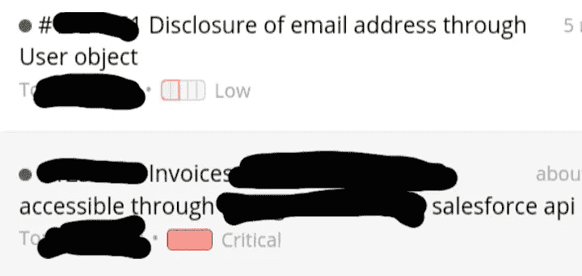
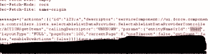

# Salesforce bug 搜索至关键 bug

> 原文：<https://infosecwriteups.com/salesforce-bug-hunting-to-critical-bug-b5da44789d3?source=collection_archive---------0----------------------->

## 或者我是如何知道有些虫子真的很罕见的

啊，是的，第三方十次有九次超出范围。但有时并非如此。有时它非常在范围之内。与 Zendesk 不同，Salesforce 可能会被其客户端错误配置或处于默认状态，从而允许访问有趣/不应该公开的数据。

**Bug**

这真的很简单(更复杂和深入的分析，查看这篇[文章](/in-simple-words-pen-testing-salesforce-saas-application-part-2-fuzz-exploit-eefae11ba5ae)。

低与临界

首先，你必须在 Salesforce/aura 上找到一个子域，通常是 help.target.com、support.target.com 或 community.target.com，但也可以是一些随机的东西，如 state.target.com 等。如果是 widescope 计划，最好使用 nuclei 和 Salesforce aura 模块来自动化该过程，但有时可能需要手动方法。

第二，在找到 Salesforce/aura 站点后，使用 burp 甚至 Firefox/chrome network inspector 找到任何对 aura 端点的 POST 请求。当正文中有消息参数时，您将知道您在寻找什么:

最后一步，这是您了解目标是否易受攻击的地方，编辑消息参数，将该值替换为以下内容(您甚至不必对其进行编码):

如果结果显示成功和电子邮件地址是 john@target.com 或 john@gmail.com 或类似的

恭喜你，你已经找到了极有可能低 bug/P4。

但是，如果它显示的电子邮件地址是 something@salesforce.com，或空，或客人用户没有授权，那么他们已经正确配置了子域，你应该继续前进。

**低 vs 关键**

有很多 Salesforce 网站都有 low/p4 类型的 bug，这种 bug 快速且易于测试，但可以是获得任何奖金的过程(但是，根据我的经验，这种 bug 的奖金在 50 美元到 150 美元之间)。

但是，还有中到高到临界，其中临界是最罕见的品种。

**大玩意**

小的东西只是让用户/用户配置文件给出非默认/空值，但是中等和大的东西，那些才是真正有趣的。

我指的是 Content/ContentDocument 和 CollaborationGroup，从它们的名字来看，它们可能有一些有趣的东西，甚至是关键的东西。但是，其中一个更有可能令人失望，即使它似乎有很多东西要调查。

**内容/内容文档**

这是你一开始会非常兴奋的地方，因为它有一个巨大的文档列表，但是之后你会发现。png 或类似的，有像标志，品牌，设计等词。那些太烂了。从我的经验来看，它们从来都不有趣。但是当它。doc，。pdf 等。这些都非常值得研究。以我的经验来看，我曾经找到过很多有详细银行发票的 pdf 文档，当然还有很多 PII。有史以来最快的支付(不到 24 小时和 2000 美元，不是一个私人计划)。

**协作组**

这里有一个你可以从回复文字中看出它有多有趣。如果它包含关于公司计划的讨论，以及员工的姓名和他们在公司的职位，我的意思是攻击者如何滥用这一点已经很明显了。最重要的是，有问题的 bbp 会确切地知道他们有多不希望这些信息成为可访问的信息。当然，根据我的经验，它没有达到临界/P1，也没有达到 P2，但 P3 在好的 BBP 上支付很高。

这里重要的是，特别是如果你正试图把寻找 bug 作为一份全职工作/单一收入来源，理解 bbp 认为第三方超出范围。如果他们可以将自己配置得更安全，这意味着这很可能是一个例外。虽然 P3 的工资没有 P1/P2 高，但也比 P4 高 4-5 倍(显然，这取决于 bbp)。

*来自 Infosec 的报道:Infosec 上每天都有很多事情发生，很难跟上。* [***加入我们的每周简讯***](https://weekly.infosecwriteups.com/) *以 5 篇文章、4 个线程、3 个视频、2 个 Github Repos 和工具以及 1 个工作提醒的形式免费获取所有最新的 Infosec 趋势！*