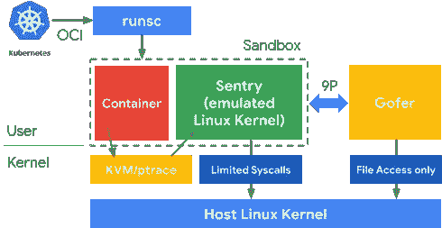
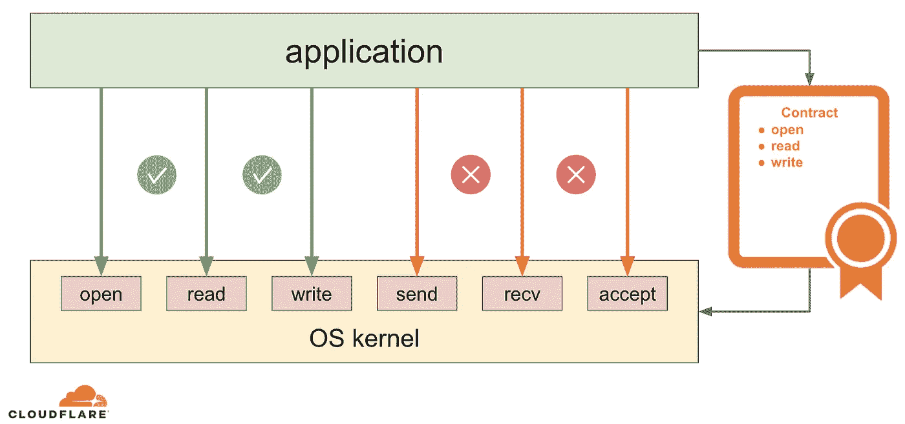
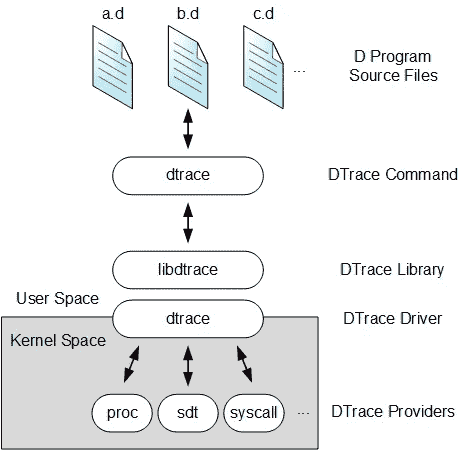
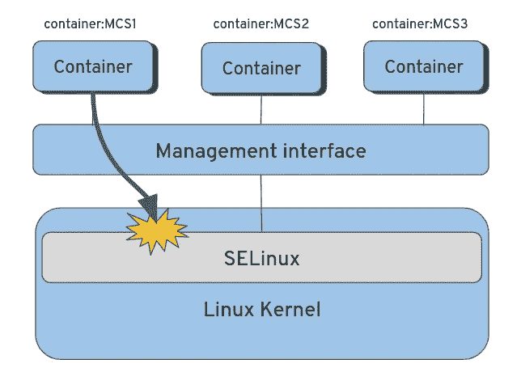
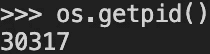
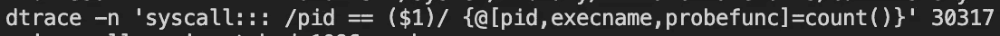
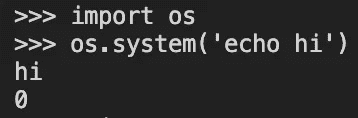
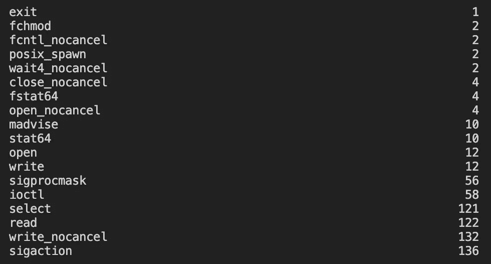
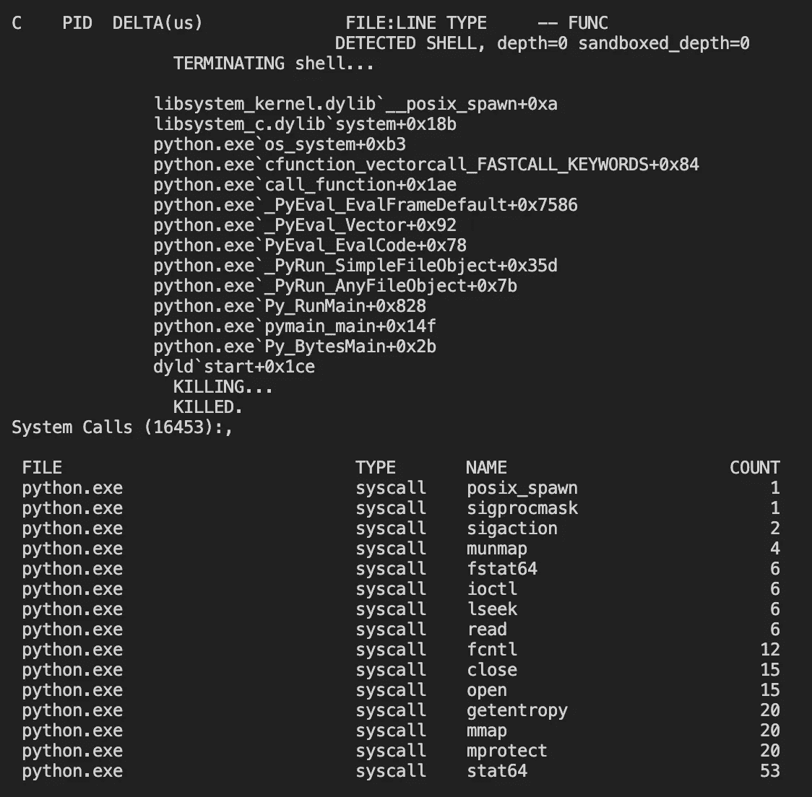
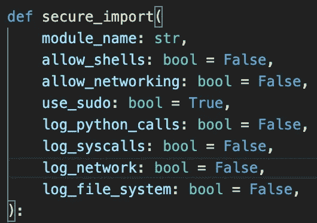

# 在代码中沙盒化 python 模块

> 原文：<https://infosecwriteups.com/sandboxing-python-modules-in-your-code-1e590d71fc26?source=collection_archive---------1----------------------->

运行来自不可信来源的代码仍然是一个未解决的问题。
尤其是像 Python 和 Javascript 这样的动态语言。
我将从两个未回答的问题开始；

> 如果为 http 导入 ***请求*** *，为什么*请求*要能打开一个**终端**并切换到 **sudo** ？*
> 
> 如果导入 ***日志*** ，为什么只要**把**文件写到**特定目录**就可以**网络**(或者像 Log4Shell 里的 LDAP)？

这是我如何为 python 导入编写沙箱的故事:
创建一个生产就绪的解决方案，并针对不同的用例进行测试。

## *TL；博士*

*解决方案如下。底部 GitHub 链接。* 如何在你的第三方包中利用**泡菜**？

```
>>> import pickle
>>> class Demo:
...     def __reduce__(self):
...         return (eval, ("__import__('os').system('echo Exploited!')",))
... 
>>> pickle.dumps(Demo())
b"\x80\x04\x95F\x00\x00\x00\x00\x00\x00\x00\x8c\x08builtins\x94\x8c\x04eval\x94\x93\x94\x8c*__import__('os').system('echo Exploited!')\x94\x85\x94R\x94."
>>> pickle.loads(b"\x80\x04\x95F\x00\x00\x00\x00\x00\x00\x00\x8c\x08builtins\x94\x8c\x04eval\x94\x93\x94\x8c*__import__('os').system('echo Exploited!')\x94\x85\x94R\x94.")Exploited!
0
```

有了`secimport`，你可以控制这样的动作做任何你想做的事情:

```
In [1]: import secimport
In [2]: pickle = secimport.secure_import("pickle")
In [3]: pickle.loads(b"\x80\x04\x95F\x00\x00\x00\x00\x00\x00\x00\x8c\x08builtins\x94\x8c\x04eval\x94\x93\x94\x8c*__import__('os').system('echo Exploited!')\x94\x85\x94R\x94.")[1]    28027 killed     ipython
```


闵达莱为“secimport”创作的一些 AI 艺术作品。底部 GitHub 链接。

向我们的代码中添加一个新的库可能具有挑战性，原因有几个:

*   开发人员无法确切地知道对一个包的期望。你导入它，但是在你不知道的情况下，它可以在你的环境中为所欲为。
*   对于您的用例来说，很难说运行这个库的最低要求是什么。
*   一个人应该允许的系统调用集是什么，这样它才能正常工作，仅此而已？

我们信任开源社区。然而我们使用的包的维护者是个人。没有用 ***==*** *锁定版本会有很大的风险；*我们的包会在您的 CI 中静默更新，新代码会在我们不知道的情况下在这些包中运行。

[每天都有人匿名上传恶意车轮到 PyPI](https://www.bleepingcomputer.com/news/security/malicious-pypi-package-opens-backdoors-on-windows-linux-and-macs/) 。
有时候是你已经在用的包。

一天早上，一个拿着全球通用 pip 包的人醒来后憎恨俄罗斯。为了抗议，[他在安装 python 包时删除了俄国和白俄罗斯安装程序的硬盘，方法是检查 IP 并在导入时运行](https://www.bleepingcomputer.com/news/security/big-sabotage-famous-npm-package-deletes-files-to-protest-ukraine-war/) ***os.system*** (或类似的东西)。历史会重演，所以再次发生只是时间问题……这太容易了。

> 更不用说，在添加一个新的开源软件时，你不能检查整个代码(但是谷歌和苹果可以)。

# 当今的解决方案大多是带外的，并且是基于进程的。

如果一个给定的模块包含漏洞、恶意逻辑或一个很小任务的大代码库，我们必须以某种方式限制它。
**主机(计算机)应该不会被你的应用程序或其第三方应用程序触及**。

那么我今天能做什么呢？

1.  为整个应用程序创建一个 [sec-comp](https://en.wikipedia.org/wiki/Seccomp) (Linux 安全计算)概要文件。如果你的程序以一种意想不到的方式运行，无论是由于第三方库还是你自己的代码，它将被记录或者进程将被立即终止。RedHad，SE-Linux，SECCOMP，所有这些伟大的东西。
2.  CI/CD 或 IDE 中的静态代码分析/安全扫描器。你寻找过时的包或者你分析代码。
    如: [**Snyk**](https://snyk.io/) **，**[**check Marx**](https://checkmarx.com/)**，**[**Clair**](https://github.com/quay/clair)**。**
3.  根本不在代码库中使用开源或第三方软件。那在规模上是不可行的…但是我知道一些小的创业公司根本不在他们的代码中使用开源。这是硬核——想象一下从头开始实现任何逻辑。
4.  [WASI](https://wasi.dev/) 沙盒化— **WebAssembly 太棒了！**
    但是，不像 Rust/Go/。Net，Python 不编译成 WebAssembly，所以这个解决方案目前与我们无关 [(rust-python 有人吗？).](https://github.com/RustPython/RustPython)
5.  在虚拟机或虚拟机管理程序(不同于容器)中运行软件。
    [**Google**](http://research.google.com) 开发了一款针对容器的沙盒，名为 [***gVisor***](https://gvisor.dev/docs/) 。gVisor 是一种 VM，它翻译应用程序中的每个系统调用。
    为了这个项目， **Google 从零开始实现了**[**Linux**](https://www.linux.org/)**，在 Go。
    沙盒二进制文件(运行容器)大约 17MB。
    每个系统调用都被翻译成 [gVisor](https://gvisor.dev/docs/) 然后再翻译成主机，同时执行高级策略。印象深刻，对吧？**

****

**然而，在虚拟机中运行应用程序通常会导致性能下降。我亲身体验过(很棒的)沙盒，它使应用程序的速度降低了 50%。**

**[谷歌使用 gVisor 来隔离谷歌应用引擎中的容器。](https://cloud.google.com/appengine/docs/standard/runtimes)**

**就像 Google 一样，我认为开源包将永远是您的应用程序的攻击面。但这并不意味着你应该改变你的编码方式。每个模块都应该有自己的限制，由开发人员定义或从某个模板中选择。**

# **如何在我们的 python 流程中约束模块**

**我希望开发人员能够在导入/编译时，将代码中的任何包限制在给定的范围内，而不是为应用程序提供一个统一的概要文件。
就像 [SELinux](https://www.redhat.com/en/topics/linux/what-is-selinux#:~:text=Security%2DEnhanced%20Linux%20(SELinux),Linux%20Security%20Modules%20(LSM).) 在执行时为 Linux 内核中的进程授予白名单范围一样，我希望开发人员能够在特定的约束下，在他们的代码中控制任何包**。****

****

**log 4 壳人？为什么 Log4J 应该可以默认打开 LDAP 连接？**

# **限制 Python 模块— MVP**

**我想要一个可以记录每个 python 调用和每个 syscall 的工具。我假设我们和内核之间没有恶意会影响可见性。
听起来很难，保持性能不变听起来更难。
这种级别的跟踪/沙箱通常会影响运行时性能。**

**可以使用以下技术来实现这种工具:**

*   **eBPF**
*   ****DTrace****
*   **任何其他的。*跟踪工具。**

> **我知道 eBPF 现在很常见，但是我们需要一些跨平台的东西，能够更快的学习曲线和更容易的动手评估设置，让时间更有价值。**
> 
> **我们不能假设每个 python 开发者都知道 eBPF 的 C 语言。我假设在 MVP 之后很容易用 eBPF 代替( **eBPF 也叫“DTrace 2.0”**)。**

****

**DTrace 堆栈概述**

**在阅读了足够多的[博客](https://www.brendangregg.com/blog/index.html)并尝试了不同的工具后，
我明白了 [**dtrace**](https://www.oracle.com/solaris/technologies/dtrace-tutorial.html#:~:text=DTrace%2C%20or%20Dynamic%20Tracing%2C%20is,DTrace%20to%20analyze%20several%20applications.) 是这个用例的正确起点。在我看来，与 eBPF 不同，dtrace 不需要以某种方式编译内核(不是每个 Linux 都内置的)。
**dtrace** 可以在 Mac 和 Windows 上工作，为更多用户提供任何基于 dtrace 的解决方案。
**dtrace** 也是[破坏性的](https://docs.oracle.com/cd/E19253-01/817-6223/chp-actsub-4/index.html)，这意味着它可以从监控 python 进程的 [dscript 探测器](https://docs.oracle.com/cd/E18752_01/html/819-5488/gcfqr.html)中杀死一个进程。这正是我想要的。**

**看下图；代替**容器**的是 python **模块**，代替 **SELinux** 的是 **dtrace** ，探测内核。**

****

**我们用 python 模块代替了容器，用 dtrace 代替了 SELinux，探测内核。**

**1.运行 python 过程:**

****

**2.在后台运行 dtrace 进程:**

****

***3。想报道什么就报道什么***

****

**4.dtrace 输出:**

****

**太神奇了！我们可以看到***POSIX _ spawn****syscall 被调用(第 4 行)。***

***在这个例子中，我使用了**" dtrace*-n "****将一个钩子传递给 dtrace。* 我已经将这个 dtrace 命令扩展成了一个 [**dscript**](https://docs.oracle.com/cd/E18752_01/html/819-5488/gcfqr.html) ，这是一种存储这些钩子并对这些探针进行编程来做我们想要做的事情的方法。***

***在一个示例之后，我编写了一个 dscript 程序(脚本文件),当一个特定的 python 模块调用一个“spawn”syscall 时，它会终止一个进程。***

******

***当特定 python 模块调用“spawn”syscall 时，终止 python 进程的 dscript 程序。***

*   ***我在 dscript 语言中使用一种叫做[关联数组](https://myaut.github.io/dtrace-stap-book/lang/assocarr.html)的东西有效地实现了它。***
*   ***我为脚本中需要的变量实现了一个 python 包装器，并为 dtrace 文件内容创建了一个模板。***

# *****然后，我写了“sec import”**！***

******

***MVP 版本的“安全导入”或“secimport”的示例。***

***`secimport`是一个 python 包，可用于:***

*   ***在您的生产环境中约束/限制特定的 python 模块。***
*   ***开源，来自不可信来源的第三方。***
*   ***在用户空间/操作系统/内核级别审计 python 应用程序的流程。***
*   ***在统一配置下运行整个 python 应用程序***
*   ***有点像 python 模块的`seccomp`。跨平台。***

## ***网络示例***

```
*>>> import requests
>>> requests.get('https://google.com')
<Response [200]>

>>> from secimport import secure_import
>>> requests = secure_import('requests', allow_networking=False)

# The next call should kill the process,
# because we disallowed networking for the requests module.>>> requests.get('https://google.com')
[1]    86664 killed*
```

## ***外壳示例***

```
*Python 3.10.0 (default, May  2 2022, 21:43:20) [Clang 13.0.0 (clang-1300.0.27.3)] on darwin
Type "help", "copyright", "credits" or "license" for more information.

# Let's import subprocess module.
>>> import secimport
>>> subprocess = secimport.secure_import("subprocess", allow_shells=False)

# Let's import os 
>>> import os
>>> os.system("ps")
  PID TTY           TIME CMD
 2022 ttys000    0:00.61 /bin/zsh -l
50092 ttys001    0:04.66 /bin/zsh -l
75860 ttys001    0:00.13 python
0
# It worked as expected, returning exit code 0.

# Now, let's try to invoke the same logic using a different module, "subprocess", that was imported using "secure_import":
>>> subprocess.check_call('ps')[1]    75860 killed     python

# Damn! That's cool.*
```

*   ***模块的 dtrace 配置文件保存在:`/tmp/.secimport/sandbox_subprocess.d`***
*   ***日志文件:`/tmp/.secimport/sandbox_subprocess.log`***

# ***结论***

***看起来安全社区需要一个沙箱，它能够限制代码中的特定模块，同时保持它在同一个进程中。我提出了一种在我们的代码库中处理第三方代码的方法。***

***源代码:
https://github.com/avilum/secimport***

***示例:[https://github . com/avilum/sec import/blob/master/docs/examples . MD](https://github.com/avilum/secimport/blob/master/docs/EXAMPLES.md)***

***如果我让像 python 这样的动态语言成为可能，我相信社区将能够用几行代码实现其他语言的工具。***

## ***谢谢你读到这里。***

***如果你喜欢这篇文章，我欢迎你查看我以前的一些版本:***

***[](/how-i-discovered-thousands-of-open-databases-on-aws-764729aa7f32) [## 我是如何在 AWS 上发现数千个开放数据库的

### 我寻找和报告包含财富 500 强公司、医院、加密等敏感数据的数据库的旅程

infosecwriteups.com](/how-i-discovered-thousands-of-open-databases-on-aws-764729aa7f32) [](/poc-for-google-phishing-in-10-minutes-ɢoogletranslate-com-dcd0d2c32d91) [## 10 分钟后谷歌钓鱼的概念验证:ɢoogletranslate.com

### 回到 2016 年，我看到一篇关于有人购买ɢoogle.com 的帖子。它被用于网络钓鱼建议(注意第一个…

infosecwriteups.com](/poc-for-google-phishing-in-10-minutes-ɢoogletranslate-com-dcd0d2c32d91) [](/identify-website-users-by-client-port-scanning-using-webassembly-and-go-e9798b4aa05c) [## 通过客户端端口扫描识别网站用户—使用 WebAssembly And Go

### 网站倾向于从浏览器扫描其用户的开放端口，以更好地识别新用户/回头客。可以…

infosecwriteups.com](/identify-website-users-by-client-port-scanning-using-webassembly-and-go-e9798b4aa05c) [](https://medium.com/digital-diplomacy/facebook-knows-what-you-eat-how-to-visualize-all-the-data-facebook-knows-about-us-c89fe3cb4f89) [## 脸书知道你吃什么:一步一步地发现脸书收集的关于你的全部数据。

### 一个我如何通过编程探索 https://facebook.com/dyi 的故事。

medium.com](https://medium.com/digital-diplomacy/facebook-knows-what-you-eat-how-to-visualize-all-the-data-facebook-knows-about-us-c89fe3cb4f89)***