# SANS Holiday Hack(kring lecon)2020 报道—第 1 部分

> 原文：<https://infosecwriteups.com/sans-holiday-hack-kringlecon-2020-write-up-part-1-82041d094b01?source=collection_archive---------0----------------------->

> 这是我的 SANS Holiday Hack 文章的第 1 部分，涵盖了目标 1-4 和在以下房间进行的相关小型试验:入口通道、餐厅、庭院和厨房。


我有幸参加了 SANs Holiday Hack Challenge，今年被亲切地称为 KringleCon，和前几年一样，它是一个爆炸。KringleCon 是我最喜欢的在线 CTF 之一，它将教育视频和讲座与有趣的技术挑战结合在一起。今年也没有什么不同，因为我能够完全完成所有的挑战，我想这将有助于我全面了解我是如何通过的。

这篇文章将按照我浏览房间的顺序进行，这在很大程度上符合主要目标，尽管随着新信息的发现，房间可能会被多次访问。和任何类似的 CTF 挑战一样，有多种方法可以解决大多数问题。

# 山区——目标 1

目标 1:广告牌上有一张圣诞老人桌子的照片，上面有他的个人礼物清单。圣诞老人打算给乔什·赖特准备什么节日礼物？向山下的叮当·林福德讨教。

KringleCon 让你在一个上山的贡多拉前面的山坡上开始。与叮当·林福德交谈时，他暗示看展示的广告牌，上面链接着 https://kringlecon.com/textures/billboard.png。此链接显示了一张图片，其中有一个区域被扭曲和模糊。


为了这个目标，我使用了在线图片编辑器 [PhotoPea](https://www.photopea.com/) ，我发现它非常好用。求解步骤如下:

1.  套索该地区，并复制到一个新的层。

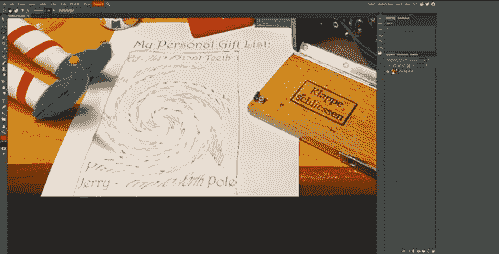

2.移动图像到新图层的正中央，应该会看到红色的线条出现


3.选择过滤器->扭曲->旋转

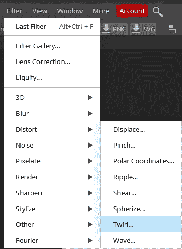

4.旋转直到你可以阅读，虽然不完美，但应该足够了

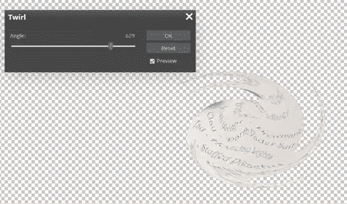

解决方案是 **Proxmark**

# 城堡方法—目标 2

乘缆车到城堡入口。除了主要目标 2，还有 2 个支线任务， **Kringle Kiosk** 和 **Unescape Tmux** 。

## 克林果售货亭

运行基于文本的应用程序，选项#4 能够输入任意数据，可以与标准的 Linux 命令执行符号相结合，如“；”

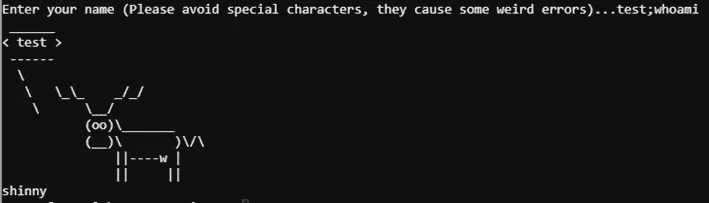

用加法求解；/bin/bash 来运行 bash shell。


## Unescape Tmux

重新连接到丢失的 tmux 会话。使用`tmux ls`查找，然后使用`tmux attach-session -t ID`连接。


# 目标 2 —调查 S3 铲斗

目标 2:当您打开过度包装的文件时，包内是什么文本字符串？与城堡前的 Shinny Upatree 对话，获得挑战的提示。对于这个挑战，我们需要找到正确的 S3 桶，使用提供的应用程序，然后通过各种文件格式展开

1.  正常运行 bucket_finder.rb

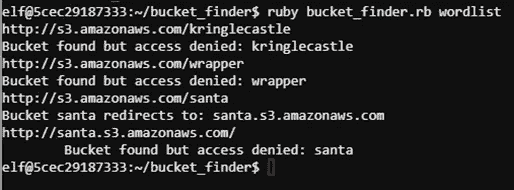

2.让我们尝试一个更加自定义的单词表，注意突出显示的 Wrapper3000，让我们添加它。确保使用小写字母，因为 AWS s3 存储桶必须是小写字母

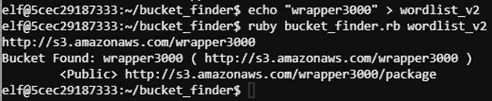

3.下载文件并检查它

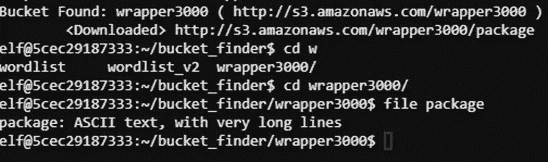

4.该文件是一系列不同的文件格式。下表显示了每种格式的步骤，并运行命令将其移动到下一阶段。弄清楚所用的文件格式`file <file_name>`

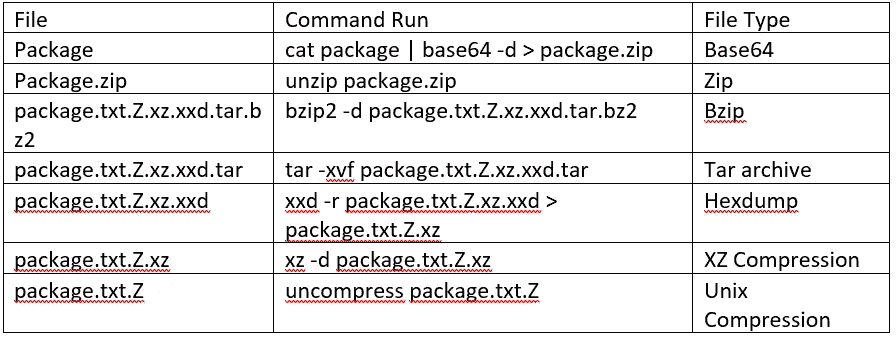

5.package.txt 的内容

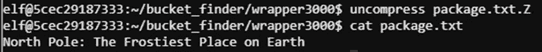

答案=“地球上最寒冷的地方”

# 餐厅

这个位置只包含一个涉及使用 JavaScript 解决一个益智游戏的支线任务。

## 精灵密码

这个游戏的目标是使用 JavaScript 编程精灵到达终点。我从来没有真正使用过 JavaScript，所以我的代码不是最干净的，我没有尝试额外的挑战级别，但能够成功地完成所需的级别。有些关卡有一个额外的挑战，以杠杆或梦境的形式出现，要求你解决并返回任意的数据挑战。

1.  一级

```
elf.moveLeft(10)
elf.moveUp(10)
```

2.第二级

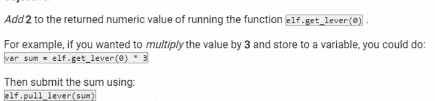

```
elf.moveTo(lever[0])
elf.pull_lever(elf.get_lever(0) + 2)
elf.moveLeft(4)
elf.moveUp(10)
```

3.第三级

```
for (i = 0; i < 3; i++) {
  elf.moveTo(lollipop[i])
}
elf.moveUp(1)
```

4.四级

```
for (i = 0; i < 3; i++) {
  elf.moveLeft(3);
  elf.moveUp(12);
  elf.moveLeft(3);
  elf.moveDown(12);
}
```

5.第 5 级

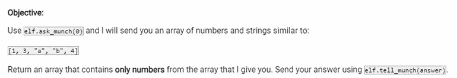

```
function numbersOnly(value) {
  if (typeof(value) === ‘number’) {
    return value;
  }
}
elf.moveTo(lollipop[1])
elf.moveTo(munchkin[0])
elf.tell_munch(elf.ask_munch(0).filter(numbersOnly))
elf.moveUp(3)
```

6.6 级

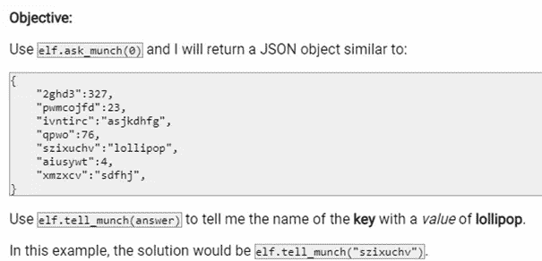

> 我使用了这里找到的函数来解决这个问题:[https://stack overflow . com/questions/9907419/how-to-get-a-key-in-a-JavaScript-object-by-its-value](https://stackoverflow.com/questions/9907419/how-to-get-a-key-in-a-javascript-object-by-its-value)

```
for (i = 0; i < 4; i++) {
  elf.moveTo(lollipop[i])
}
function getKeyByValue(object, value) {
  return Object.keys(object).find(key => object[key] === value);
}
elf.moveTo(munchkin[0])
elf.tell_munch(getKeyByValue(elf.ask_munch(0), “lollipop”))
elf.moveUp(3)
```

# 庭院——目标 3

庭院有 1 个次要目标和 3 个主要目标。

## Linux 入门

这个附带目标的目标是找到并使用合适的 Linux 命令来解决这个问题。下表列出了问题和命令:

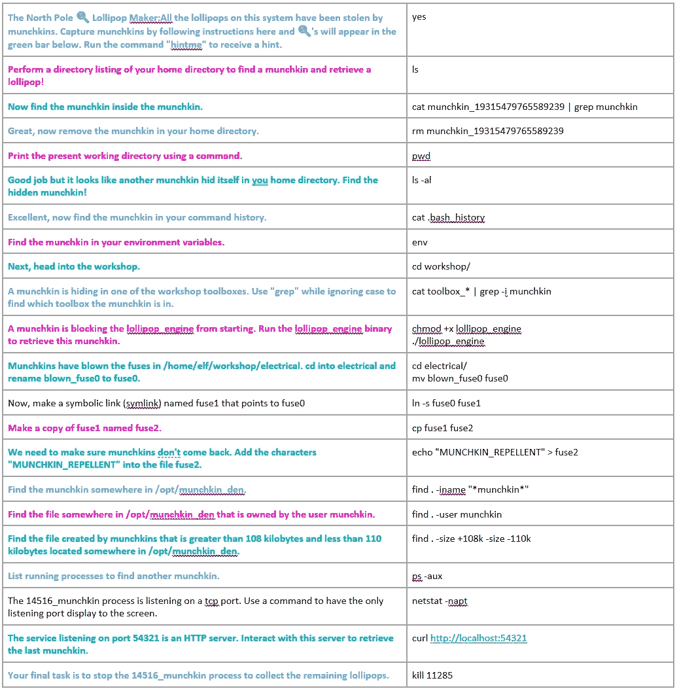

# 目标 3 —销售点

目的:帮助庭院中的 Sugarplum Mary 找到销售点终端的管理员密码。密码是什么？

下载给定的 Exe 文件。提示指出，这是一个电子 ASAR 应用程序，并建议使用 NPM 模块 ASAR 将其解包。我不是 npm 的粉丝，所以决定手动做。

1.  用 7Zip 解压 exe 文件，最后会得到一个 PluginsDir 文件夹。

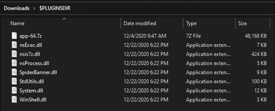

2.解压`app-64.7z`档案。


3.在所有目录中搜索 asar 文件


4.在收藏夹文本编辑器中打开并搜索密码

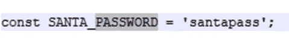

# 厨房

厨房是另一个没有主要目标的房间，但是通过解决这些较小的目标给出的提示在以后会非常有用。

## 电话拨号

1.  需要听声音，并在粘滞板上匹配相应的声音。这个有点傻但是不太难。

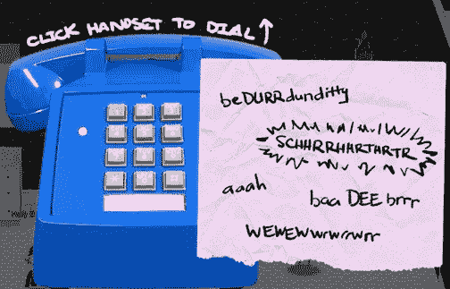

2.顺序是:

```
baaDEEbrrr
aaah
WEWEWwrwrrwrr
beDURRdunditty
SCHHRRHHRTHRTR
```

3.正确回答这个问题为后面的问题提供了一个重要线索:


## Redis 臭虫狩猎

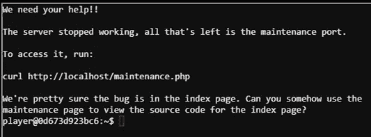

1.  可以通过 curl 参数向 redis 传递命令。

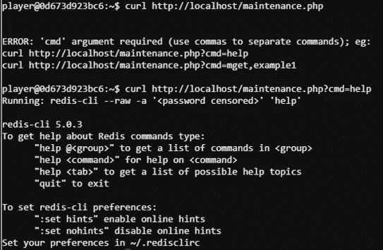

2.[https://book . hack tricks . XYZ/pentesting/6379-pentesting-redis](https://book.hacktricks.xyz/pentesting/6379-pentesting-redis)很有帮助

3.获取 Config Get *命令的输出，确保使用`,`在 curl 中拆分单词

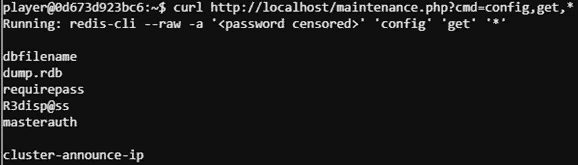

4.使用找到的密码，登录到普通 redis-cli

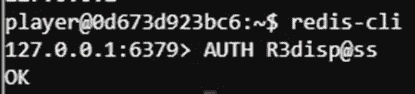

5.按照这里的说明[https://book . hack tricks . XYZ/pentest/6379-pentest-redis # webshell，](https://book.hacktricks.xyz/pentesting/6379-pentesting-redis#webshell)我们的目标是上传一个简单的 web 服务器，我们可以向它发送命令，具体来说就是这里找到的 web 服务器:[https://leons.im/posts/single-line-web-shell/](https://leons.im/posts/single-line-web-shell/)。

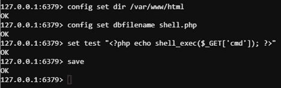

6.一旦上传了 webshell，发送命令读取指定的索引文件并输出结果。格式有点乱，但足够容易阅读。

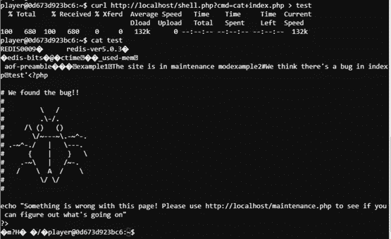

# 电梯(绿色)—目标 4

目的:操作圣诞老人

我们会多次回到电梯，但这是第一次操作非常简单。你只需要让光流穿过绿光，进入相应的插座。有很多方法可以做到这一点，这是我的:


[**第二部分**](https://medium.com/bugbountywriteup/sans-holiday-hack-kringlecon-2020-write-up-part-2-617e1870ed2e)