# SANS Holiday Hack(kring lecon)2020 报道—第 2 部分

> 原文：<https://infosecwriteups.com/sans-holiday-hack-kringlecon-2020-write-up-part-2-617e1870ed2e?source=collection_archive---------2----------------------->

> 这是我的 SANS Holiday Hack 文章的第 2 部分，涵盖了目标 5-8 和在以下房间进行的相关小型试验:KringleCon 会谈、演讲者未准备好的房间、车间和屋顶。

第一部分

# 克林贡会谈

这一层包含 3 个性质相似的侧面目标。

## 扬声器 UNPrep

进入演讲人准备好的房间的门在一个侧面目标的后面，在一个二进制文件中找到一个密码。还有两个相似的目标，打开房间内的灯和自动售货机。对于所有 3 个目标，你都可以进入`~/lab`文件夹，修改二进制文件的副本。

**门——容易**

1.  在 door 二进制文件上运行 strings 命令，并输入找到的密码。

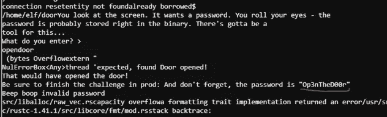

**灯—中等**

1.  Lights 有一个包含加密密码的. conf 文件

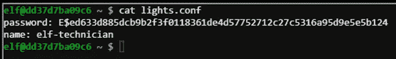

2.跑步。/lights 显示配置的用户名被打印出来。也许值得检查一下用户名是否会自动解密密码

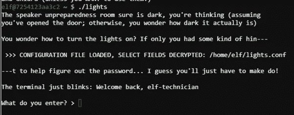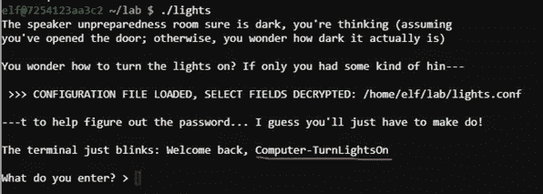

3.输入解密的密码

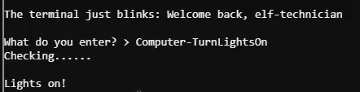

**自动售货机—硬**

1.  同样的技巧在这里不起作用，但可以删除配置文件和。/vending-machine 允许您输入新用户/通行证并输出加密值。

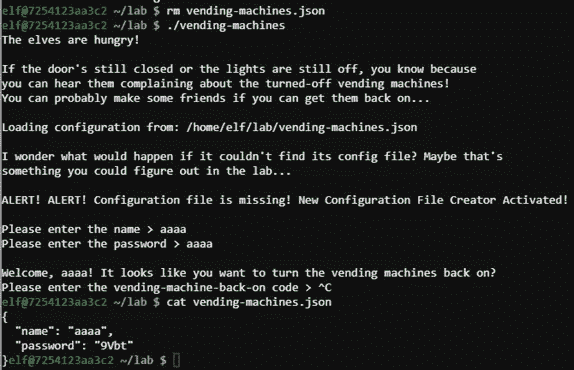

2.既然我们知道了明文和密文，只需要想出加密的方法就行了。

3.我喜欢从添加大量的一个字母开始，看看。

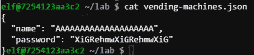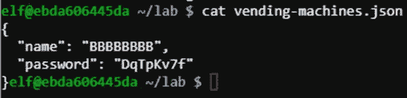

4.然后我试着混合已知的字母。

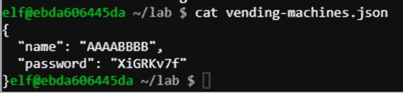

前半部分匹配 A 8 字符模式的前半部分，后半部分匹配 B 8 字符模式的结尾。密码中的每个字母位置将与明文模式的密码模式中的相应字母位置相匹配。

*如果密码= p，则 p[x] =密码模式[x]*

《出埃及记》如果明文密码是 ABAB，那么密码就是 XqGT 或 A[1]B[2]A[3]B[4]

5.Python 来拯救找出其余的密码模式，并解决这个问题。

代码的第一部分创建了一长串要编码的字母，然后作为 encoded_data 变量加载。然后对该变量进行解析，以创建每个字母到其 8 个字符密码的映射。

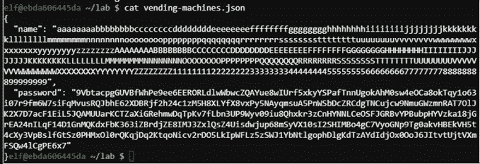

代码的结尾将给定的密码拆分成一个八位字节，并通过已知值对来解密 CandyCane1 的答案。

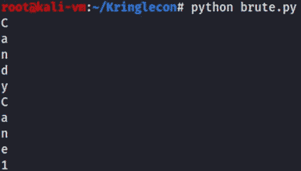

# 扬声器准备室

这里有一个附带目标，与 PRNG 一代有关。

# 打雪仗

和游戏机旁边的 Tangle Coalbox 对话给出了一些重要的提示，包括[的链接 https://github . com/kmyk/mersenne-twister-predictor/blob/master/readme . MD](https://github.com/kmyk/mersenne-twister-predictor/blob/master/readme.md)，会大量使用。

1.这个游戏的工作方式如下，每次你产卵时，你和敌人的棋盘都是由一个伪随机数发生器决定的。由于你可以打开游戏的多个实例，当试图解决困难的水平，你只是给了一个固定的数字，你可以把这个数字加载到简单的水平，击败它，然后重放困难的。对于 impossible，没有提供数字，但是在 HTML 注释中有一个 624 个以前尝试过的“随机”值的列表。使用这些值，您可以预测您的下一个值应该是什么，并执行加载到简单游戏中的相同过程。

2.加载是不可能的，点击 F12 并查看 html 源代码，会找到值列表。

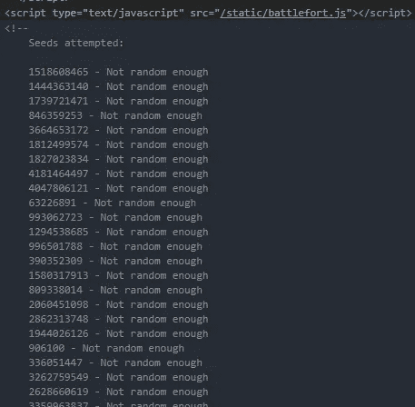

3.复制并清理到只有数字

4.安装之前提到的 Mersenne twister，并将给定的值输入预测器，输出第一个结果。

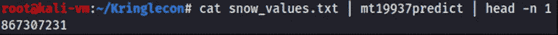

5.将该值复制到简易板中，如果操作正确，您的两块板应该具有完全相同的起始位置，表明敌人也是如此。然后你可以在 easy 上算出答案，在 impossible 上重演。

# 电梯(绿色+红色)

提供通往车间和屋顶的通道。再次，多种方法来解决，这是我使用自动售货机的门户网站。

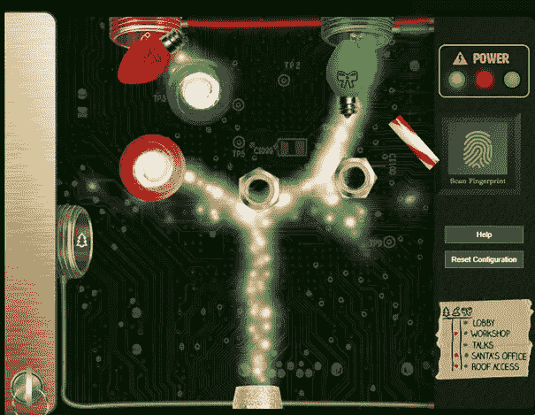

# 研讨会——目标 5

在工作室里，有一个次要目标，以及目标 5，它需要在隔壁房间找到一个物品。

## 自动排序正则表达式

直截了当地解决每个正则表达式挑战。前 3 个很简单，接下来的几个充分利用了边界组，将每个问题分成小组。

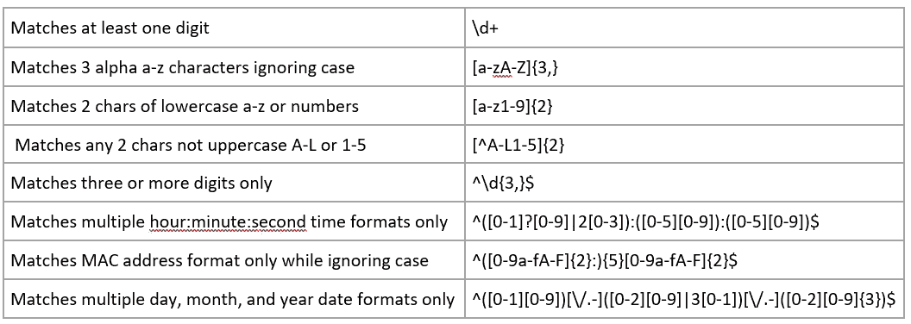

# 目标 5 —打开 HID 锁

为此，我们需要打开车间的锁，但要这样做，我们首先需要获得包装室的 Proxmark。一旦获得，就采取以下步骤。

1.  记得在厨房里，Shinny Upatree 被认为是值得信任的。Shinny 位于前面的草坪上，所以请让开，站在 Shinny 附近
2.  在项目中打开 Proxmark CLI

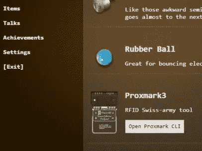

3.在接近 Shinny 时运行`lf hid read`并保存它给出的值

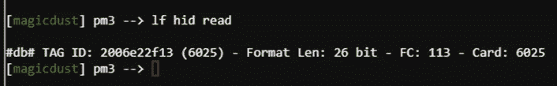

4.回到车间袖手旁观门并运行`lf hid sim -r <id value>`

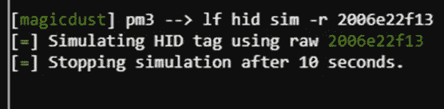

5.车间的门现在应该是开着的

> 重要提示—穿过下一个房间会让你变成圣诞老人，这样你就可以进入特定的区域和终端。将来我扮成圣诞老人去的任何地方都会被标记出来。

# 大会堂—目标 6

# (圣诞老人)目标 6 — Splunk 挑战

目标:访问大房间中的 Splunk 终端。圣诞老人害怕攻击克林果的敌对组织的名字是什么？

这是一个 Splunk 挑战赛，提供 7 个问题，必须在 Splunk 索引中搜索并找到正确答案。

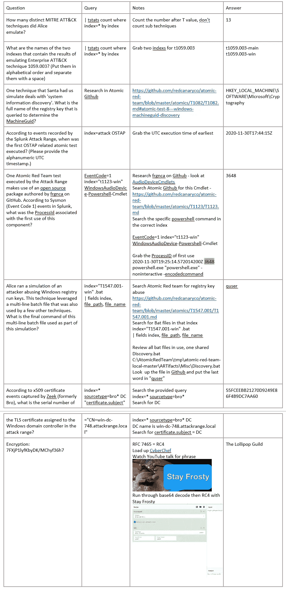

# 屋顶——目标 7

屋顶(也称为网络战争)两个侧面目标和两个主要目标。这两个次要目标可以在任何时候完成，但主要目标只有在你成为圣诞老人后才能完成。

## Scapy Prepper

这个附带目标旨在通过询问一系列问题的解决方案来教授 python 模块 scapy 如何工作的基础知识。表中给出了解决方案

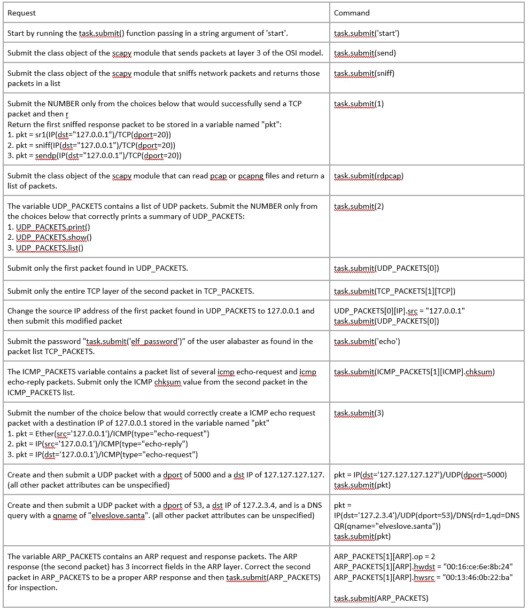

## Can 总线调查

目的是找到 CAN 总线转储中的锁定-解锁-锁定序列，并输入解锁的时间值。

1.  登录终端— cat candump

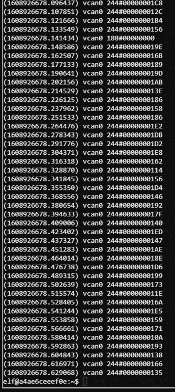

2.用 grep inverse -v 标志删除多余的 188 和 244 值。

`cat candump.log | grep -v “244” | grep -v "188"`

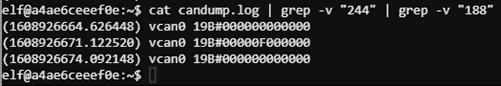

3.中间值是正确的解锁值。

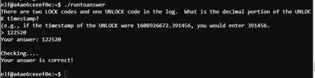

# (圣诞老人)目标 7 —圣诞老人 Can-D 巴士

目标:白色杀机不知何故在雪橇的 CAN-D 总线上插入了恶意信息。我们需要你排除恶意信息，而不是其他人来修理雪橇。参观屋顶上的 NetWars 房间，并与 Wunorse Openslae 交谈以获得提示。

1.  点击雪橇，通过排除 080，019，188，244 删除现有的垃圾邮件。

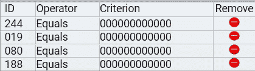

2.测试制动器，给出两个值，正确值和一个额外的 FFFFFF 值。

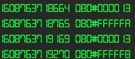

3.排除 FFFFF 值

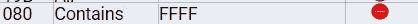

4.测试门

Lock = 19B#00000000000

解锁= 19B#00000F000000

注意正在进行的 19B#0000000F2057，排除

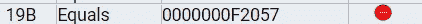

5.删除早期的调试值

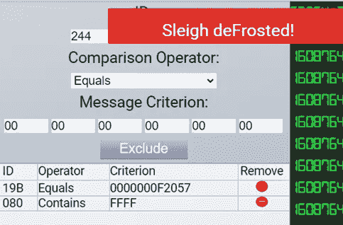

# 包装室—目标 8

# (圣诞老人)目标 8 —损坏的标签生成器

目标:帮助 Noel Boetie 修理包装间的[标签生成器](https://tag-generator.kringlecastle.com/)。环境变量 GREETZ 中的值是什么？请与厨房的 Holly Evergreen 联系，寻求帮助。

标签生成器位于 https://tag-generator.kringlecastle.com/的[。解决方案如下:](https://tag-generator.kringlecastle.com/)

1.  上传随机 txt 文件并注意错误路径

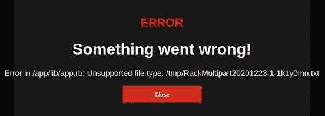

2.打开 Burp 或其他代理，上传一个小的普通 jpeg 图像，注意图像的提取路径

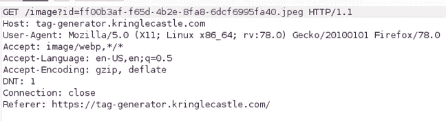

3.用`?id=../app/lib/app.rb`在/image 页面测试 LFI

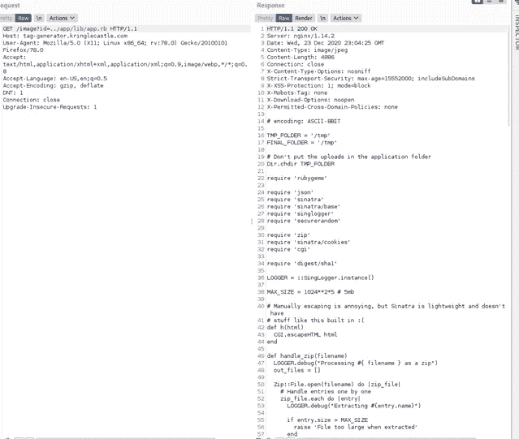

4.因为我们可以读取任何文件，问题是找到一个环境变量，所以我们可以读取 linux 中/proc/self/environ 下的所有 env。

> 我假设这里有另一个使用 zip 文件的方法，因为源代码指出了这一点。

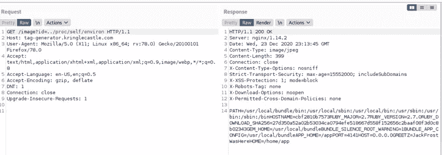

5.答案:JackFrostWasHere

[**第三部分**](https://medium.com/bugbountywriteup/sans-holiday-hack-kringlecon-2020-write-up-part-3-5cdb627363ae)