# SANS Holiday Hack(kring lecon)2020 报道—第 3 部分

> 原文：<https://infosecwriteups.com/sans-holiday-hack-kringlecon-2020-write-up-part-3-5cdb627363ae?source=collection_archive---------3----------------------->

> 这是我的 SANS Holiday Hack 文章的最后一部分，涵盖了目标 9-11。

[第一部](https://medium.com/bugbountywriteup/sans-holiday-hack-kringlecon-2020-write-up-part-1-82041d094b01) / [第二部](https://medium.com/bugbountywriteup/sans-holiday-hack-kringlecon-2020-write-up-part-2-617e1870ed2e)


# (圣诞老人)目标 9 — ARP 欺骗

目标:去屋顶的网络战争房间，帮助雪花石膏雪球使用 ARP 协议访问主机。在`/NORTH_POLE_Land_Use_Board_Meeting_Minutes.txt`检索文档。谁回避了文件上描述的投票？

1.这样做的总体目标是将 ARP 和 DNS 欺骗结合起来，将 HTTP 流量发送到您的计算机，然后使用该流量插入恶意的。deb 文件并获取受害者电脑的文件。

> ARP 和 DNS 欺骗都使用 Scapy 来拦截和调整传入的数据包
> 
> 有效的 ARP 和 DNS 请求/响应存储在/pcaps 文件夹中
> 
> 模板 scapy 脚本保存在/scripts 文件夹中

2.我做的第一件事是创建一个小的助手 python 脚本来读取所提供的/pcaps 并输出 scapy 信息，以便对我的响应进行建模。这为我们提供了需要加载到响应中的值，特别是第二个包，也就是响应。

```
from scapy.all import *packets = rdpcap('arp.pcap')
for packet in packets:
  print(packet.show())
```

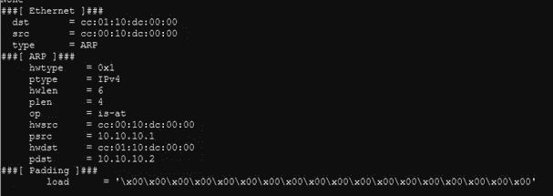

3.当调整 ARP/DNS scapy 脚本时，最好对进入的数据包本身使用动态值，而不是硬编码。还必须翻转 source 和 dest，因为我们正在回复传入的数据包

4.Arp 欺骗

我从提供的脚本中删除了 p 和 hwlen，因为不需要它们，并调整了其他值以匹配提供的 arp 包或正确的返回位置。

5.当它在一个窗口中运行时，应该会看到对`ftp.osuosl.org`的 DNS 请求开始通过。还需要返回一个 DNS 欺骗来将数据包定向到我们的机器。和以前一样，我阅读了提供的正确的 DNS 包，并根据那里的响应模拟了我的包。

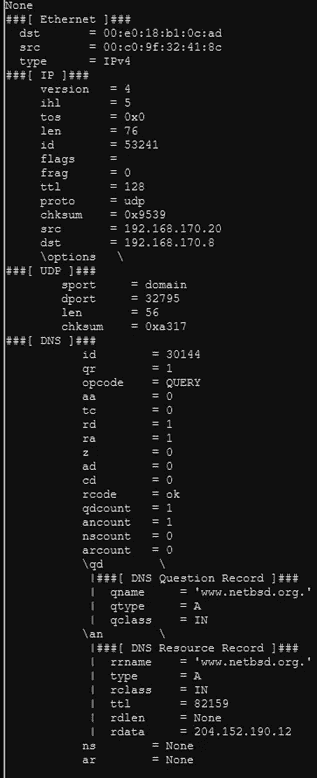

对于这一个，困难的部分是正确地形成 dns 响应片段，必须添加相当多的片段。确保您的响应与您查看的提供的数据包完全匹配。

6.准备就绪后，应该会开始看到 HTTP 流量。启动 HTTP 服务器会显示发送的请求。

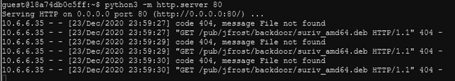

7.现在我制造了一个恶意的。deb 文件，遵循这里的指南:[http://www.wannescolman.be/?p=98](http://www.wannescolman.be/?p=98)

我们所需要做的就是将代码放入 DEBIAN/postinst 文件夹，并构建我们自己的 deb 文件。转到 tmp 并创建一个与所请求的相匹配的目录结构

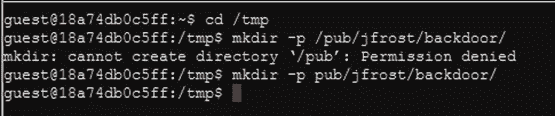

从~/debs 文件夹中复制 socat deb 并将其拆分，使用 tar 拉出控制结构

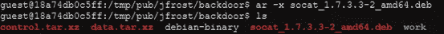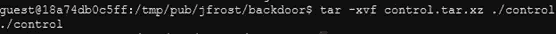

在后门文件夹中创建一个 work/DEBIAN 文件夹，并将控制文件移入其中。创建反向 shell 或命令，我打算用 socat 文件读取。

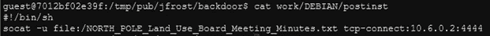

设置权限，构建和重命名文件。

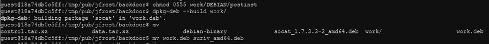

回到 tmp，设置 socat 监听器并启动 HTTP 服务器。

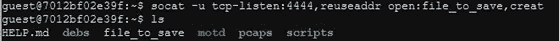

文件应该保存到本地机器。答案是坦塔·克林果

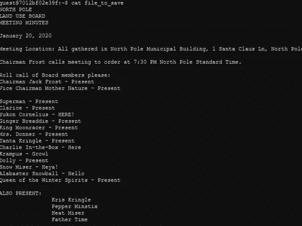

# 电梯(红色、绿色、黄色)—目标 10

再多种方法解决，这是我的。作为圣诞老人，你应该可以通过指纹识别器进入圣诞老人的办公室。

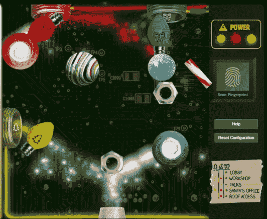

# 目标 10 —电梯旁路

目的:绕过 Santavator 指纹传感器。不带圣诞老人的指纹进入圣诞老人的办公室。

为了这个目标，你需要离开圣诞老人的身份，穿过挂在门厅的画。另外，我发现所用的技术只在 Chrome 上有效，所以我推荐使用它。

1.作为普通玩家进入电梯，确保三盏灯都亮着。

2.按 F12，打开电梯源代码，我们关心的部分在这里:

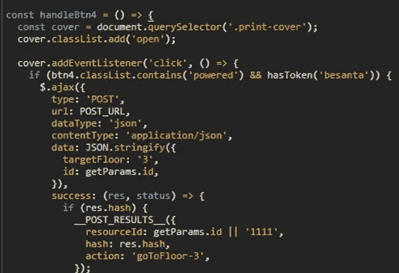

关键的拦截器是令牌“贝桑塔”

3.在 F12 菜单中打开开发者控制台，并在开发者控制台中将上下文设置为电梯。使用 Javascript 将 besanta 令牌添加到列表中。

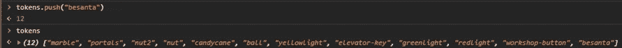

4.现在试试指纹扫描仪，即使不是圣诞老人也能工作。

# 圣诞老人办公室-目标 11a/11b

圣诞老人的办公室只包含一个项目，最后的 11a/11b 目标。

# (Santa)目标 11a —区块链调查第 1 部分

目标:即使您拥有的区块链块以块 129996 结尾，您能预测块 130000 的随机数吗？与扬声器无准备室的 Tangle Coalbox 交流预测技巧，与 Tinsel Upatree 交流更多技巧和[工具](https://download.holidayhackchallenge.com/2020/OfficialNaughtyNiceBlockchainEducationPack.zip)。(仅输入随机数的 16 个字符的十六进制值)

1.  目标是正确预测数据块 130000 的随机数。每个随机数是一个 64 位 MD5 和。我们之前预测了打雪仗的 32 位，现在也要做同样的事情，但是 64 位增加了一些复杂性。我们需要获取每个随机数，将其分成两个 32 位表示，获取这 32 位中的前 624 位，预测出其余的，选择正确的，组合回 64 位，转换为 16 位十六进制字符。这是可行的，因为每个 nonce 都是 MD5，并且是在 32 位部分中创建的，所以每个 32 位部分都遵循我们之前了解的 Mersenne 预测符。像 SHA-256 这样更健壮的散列随机数不会有这个弱点。
2.  第一步:从每个块中获取完整的 64 位 nonce，并分成两个 32 位。我在这里使用了一个拆分器函数:[https://stack overflow . com/questions/32053137/split-each-after-32-bits-of-128-bit-input-in-python](https://stackoverflow.com/questions/32053137/split-each-after-32-bits-of-128-bit-input-in-python)。我所有的代码都放在给定的 naughty.py 的底部，它是作为提示的一部分提供的

这里的一个关键部分是分割的顺序，你看我把 split[1]放在 split[0]的上面。稍后，我将展示如何验证订单是否正确

通过管道输出到文件，并去掉前 624 个值。

`head -n 624 32_bit_full_values.txt > 32_bit_known.txt`

3.现在我们需要计算出我们想要的准确的预测随机数。Wordcount 显示整个文件中共有 3096 个随机数(记住每个块有 2 个随机数)。3096–624 = 2472.这意味着接下来的 2472 个预测随机数将与已知值匹配。

4.让我们验证我们的预测是正确的

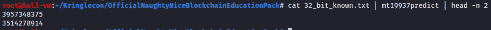

这两个值组合回 64 位时，应该等于 624/2=312 个块现时(我们用来预测的 624 之后的下两个值)。312 块 nonce = 15093713008609744919。

用这个组合回 64 位:[https://stack overflow . com/questions/3553354/concatenate-two-32-bit-int-to-get-a-64 bit-long-in-python](https://stackoverflow.com/questions/3553354/concatenate-two-32-bit-int-to-get-a-64-bit-long-in-python)。

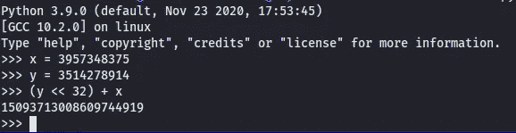

验证了我们预测的是正确的值

5.为了得到 130000 块，我们需要预测比现在多 4 个块，因为最后一个块是 129996

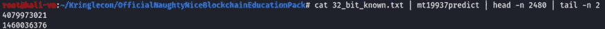

6.将这些值组合在一起并转换成十六进制形式


57066318f32f729d 就是答案

# (Santa)目标 11b —区块链调查第 2 部分

目的:杰克蚀变块的 SHA256 为:58 a3 b 9335 a6 CEB 0234 c 12d 35 a 0564 c 4 e f0e 90152d 0 EB 2 ce 2082383 b 38028 a 90 f。如果您够聪明，您可以通过仅更改 4 个字节的值来重新创建该块的原始版本。一旦您重新创建了原始块，该块的 SHA256 是什么？

1.我们得到了 Jack 修改的块的 SHA256 值:58 a3 b 9335 a6 CEB 0234 c 12d 35 a 0564 C4 ef 0 e 90152d 0 EB 2 ce 2082383 b 38028 a90f

我们需要找到那个块，调整 4 个字节，并将其恢复到预期值。我不会太深入地探究技术细节，但会试图涵盖所发生的事情的基本情况。这个滑梯是无价的[https://speakerdeck.com/ange/colltris](https://speakerdeck.com/ange/colltris)

2.通过 SHA256 哈希找到该块。SHA256 哈希目前尚未计算，因此我们需要计算它并找到正确的块。创建一个 SHA256 函数，复制现有的 md5 函数。

```
def sha256_hash(block):
    hash_obj = SHA256.new()
    hash_obj.update(block.block_data_signed())
    return hash_obj.hexdigest()
```

运行每个程序块并保存输出。

```
for block in c2.blocks
    sh = sha256_hash(block)
    print("{} - {}".format(count,sh))
    count+=1
```

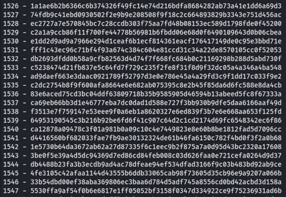

搜索给定的散列导致框 1010

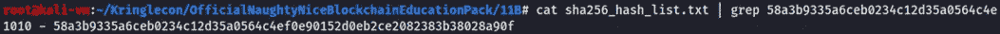

打印有问题的块给出了一大块数据，但显示其上存储了两个文档。

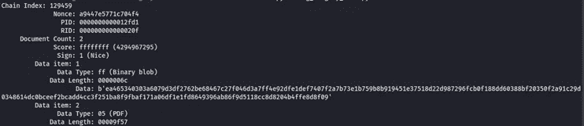

3.忽略二进制 blob，使用内置的 dump_doc 类下载 PDF。虽然它是一个有效的 PDF，但内容似乎不正确。


4.这就是幻灯片开始发挥作用的地方。简而言之，有一个 pdf 漏洞，它允许某人通过调整一个比特来轻易地改变 PDF 中显示的内容。阅读[此处](https://github.com/corkami/collisions#pdf)了解更多信息。这种攻击技术被称为 UniCOLL，最大的秘密是，由于 MD5 在 64 位块中操作，如果您将一位增加/减少 1 个值，您可以在下一个块中的相应字节上进行相反的交互，以获得相同的 MD5 哈希值。

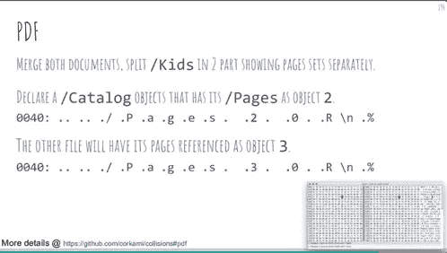

因此，在这种情况下，基本上有 2 个 PDF 合并为一个，原来的审查和杰克的积极审查。通过调整一位将页面值从 2 移动到 3，我们应该能够显示原始评论。

5.让我们将这个单独的块保存为. dat 文件，并将其加载到 hexeditor 中。我用的是 [https://hexed.it](https://hexed.it) ，超级好用。首先要做的几件事会有所帮助。在设置中设置行长度为 32 位，获取当前 MD5 哈希值工具- >文件哈希生成器- > Md5

6.调整数值:

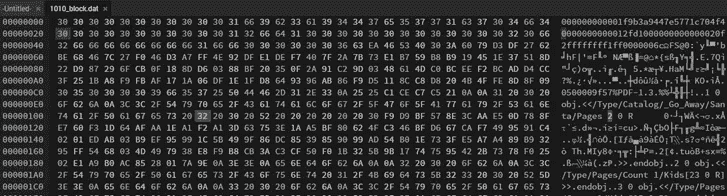

将 32 (2)调整为 33 (3)

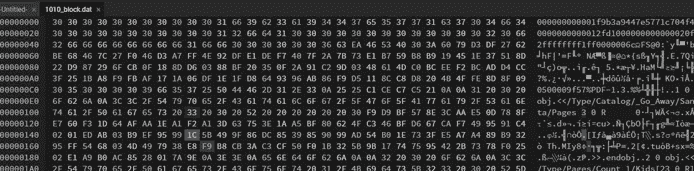

向下移动两行，并将该值向下调整一行以进行偏移

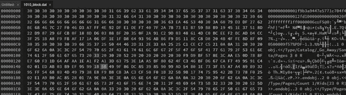

7.检查新的 MD5 散列(应该是相同的值)并使用 UNIX“hex edit”或保存此文件复制 hexedits for real。

8.正确的审查现在应该显示。


9.还有另外一组要做的更改，原始块显示 Nice 标志已经设置好了。我们可以假设这是不正确的，标志应该是顽皮的

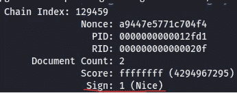

根据 python 源代码，淘气的标志可以是任何< 1

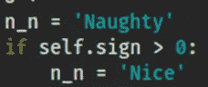

10.再次查看 hexed.it，这一次我们查看的是最开始的值，具体来说，我们在 ffffffff 的分数后寻找 1

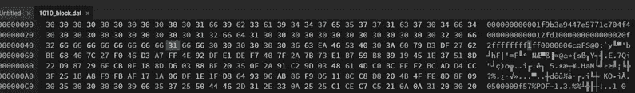

让我们将其向下调整为 0，并将相应的位 2 向下调整 1 行。

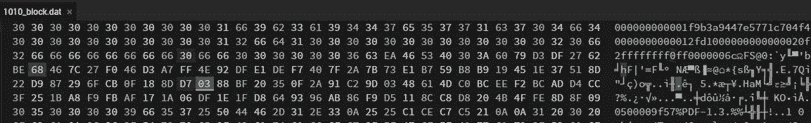

11.让我们验证一下，两个 dat 文件的 MD5 应该是相同的，而 SHA256 发生了变化。

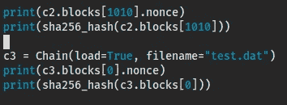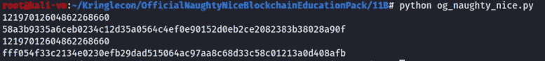

可以看出 MD5 和是相同的，而 SHA256 是不同的

12.答案是 fff 054 f 33 c 2134 e 0230 efb 29 dad 515064 AC 97 aa 8 c 68d 33 c 58 c 01213 a0d 408 AFB

# 结束并回顾

一旦你完成 11b，交换回你的正常角色，让你的方式到圣诞老人的办公室，并在阳台上获得学分和链接到 KringleCon 赃物商店。

像往常一样，今年的 KringleCon 制作精良，执行到位，我很高兴成为其中的一员，为这场有趣的冒险带来一些关注。对我来说，特别是 ARP/DNS 欺骗真的很有趣，因为这一直是我喜欢看到的东西，所以实际上使用 Scapy 来找出它是很棒的。区块链在最后的操纵是激烈的，没有我，还有其他几个克林果康的与会者可能无法搞清楚。总的来说，我玩得很开心，并期待着明年的！