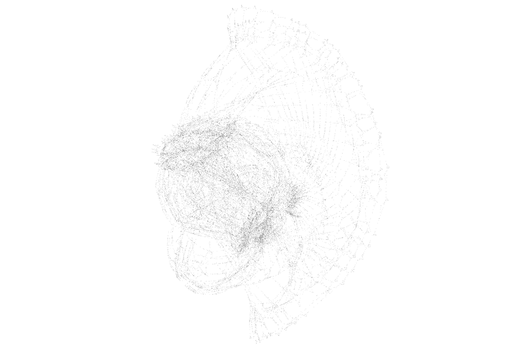
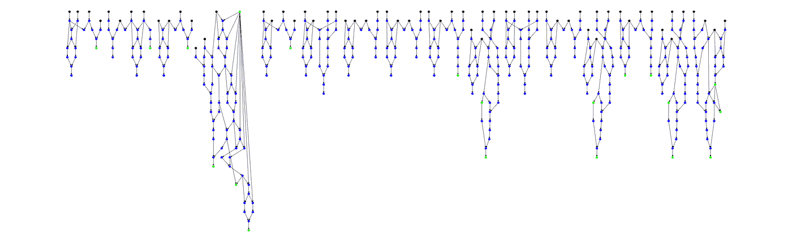
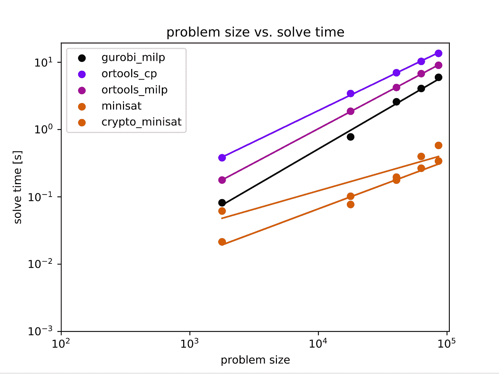
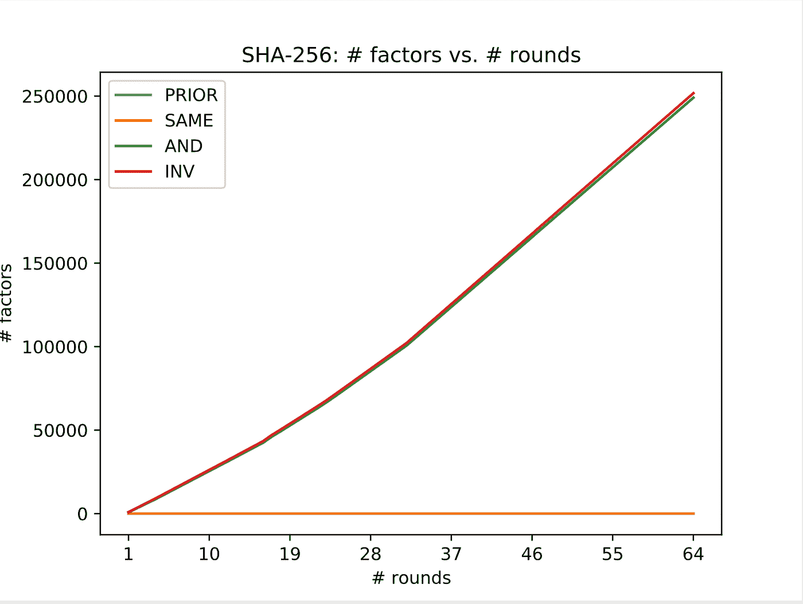
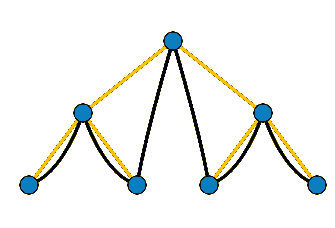
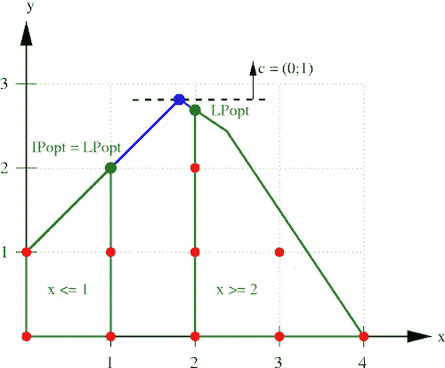
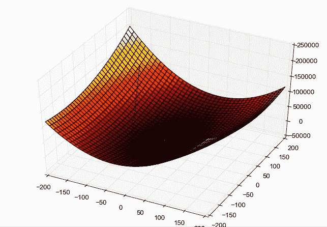
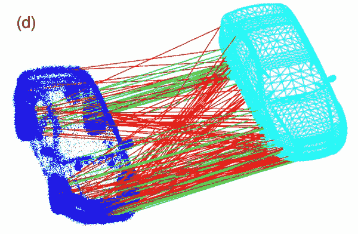
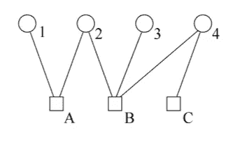
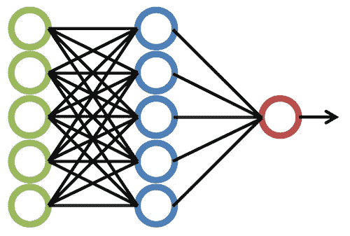

# 对 SHA-256 的 SAT 求解器、优化和信念传播攻击

> 原文：<https://infosecwriteups.com/sat-solver-optimization-and-belief-propagation-attacks-on-sha-256-33c0233440e9?source=collection_archive---------0----------------------->

## 四轮 SHA-256 散列函数产生 17，806 个未知位和 26，383 个逻辑关系。我们可以在一秒钟内解决这个问题。

如果你跟踪比特币使用的臭名昭著的 SHA-256 哈希函数的 64 轮中的 4 轮中的所有比特及其逻辑关系，这将是它的样子。一个有 17806 个节点，26383 条边的图。我们可以在不到一秒的时间内解决它。



4 轮 SHA-256 位关系[图片由作者提供]

# 描述

在本帖中，我们将尝试反转单向加密哈希函数，特别关注 [SHA-256](https://en.bitcoinwiki.org/wiki/SHA-256) 。散列函数`f`可以被认为是对比特`X`的运算，以产生输出比特`Y` : `f(X) = Y`。给定`Y`和`f`如何工作的知识，我们想要找到一些比特`X'`比如`f(X') = Y`。这通常被称为[原像攻击](https://en.wikipedia.org/wiki/Preimage_attack)。注意`X`不一定需要等于`X'`。

一次成功的原像攻击对基本上整个互联网、金融界和主要政府的国防都有严重的影响。哈希函数用于各种领域:从比特币挖掘和交易，到 HTTPS 加密，再到在服务器数据库中存储用户密码。

我花了很长时间(太长了！)试图用各种方法解决这个“不可能”的问题，详述如下。作为一个**免责声明**:我没有声称这些方法中的任何一个破坏了完整的 64 轮 SHA-256 散列函数的安全性。大概还是不可行(证明我错了！).这里有些方法最多能解 16 轮，有些方法连 1 轮都解不了。但主要的一点是分享想法，并激发你在这些想法的基础上继续努力。

这个项目对应的 Python 和 C++代码可以在 [GitHub](https://github.com/trevphil/preimage-attacks) 上找到。这篇文章最初发表在 trevphil.com。

# 散列函数的符号表示

为了解决这个问题，我们需要做的第一件事是找出哈希函数`f`如何对输入位`X`进行操作，以产生输出位`Y`，而不对`X`做任何假设。为此，我编写了一些哈希函数，包括 SHA-256 和一些简单的“测试”函数，它们对符号位向量进行操作。这种符号表示允许我们跟踪哈希函数中所有计算的输入和输出位之间的关系，例如，如果`C = A & B`，我们跟踪位`C`是`A`和`B`的“与”结果的关系。最终，在所有的计算之后，我们将得到函数`f(X) = Y`中`Y`的每一位和`X`的每一位之间的关系。

在这个过程中可以做一些简化。例如，假设位`A`是来自未知输入`X`的位，位`B`是哈希算法中等于 0 的*常数*。那么我们知道`C = A & 0 = 0`所以`C = 0`不管`A`的值是多少。下面列出了对单个位的操作的一些简化:

*   `B = A & 1 = A`
*   `B = A | 0 = A`
*   `B = A | 1 = 1`
*   `B = A ^ 1 = ~A`
*   `B = A ^ 0 = A`
*   `B = A ^ A = 0`
*   `B = A & A = A | A = A`

这些简化有助于减少散列函数的符号表示的大小，因为输出位`B`有时是常数或等于未知输入`A`。当这种情况发生时，我们不需要引入新的未知变量。

此外，通过将所有运算(XOR、OR、add)减少到仅使用 AND 和 NOT 逻辑门，可以使问题更容易处理。我把 NOT gates 称为 INV(为逆):`B = ~A`。让我们看一个使用 AND 和 INV 门重写 XOR 的例子:`C = A ^ B`等价于

```
X = ~(A & B)
Y = ~(A & X)
Z = ~(B & X)
C = ~(Y & Z)
```

这个*确实*引入了中间变量，但关键的是，AND 和 INV 运算可以**线性化**，也可以在连续域中表示，这在数学上很重要。通常在离散域中，我们会将每一位视为取值为 0 或 1 的二进制“[随机变量](https://en.wikipedia.org/wiki/Random_variable)”。

AND 运算可以用乘法:`C = A & B = A * B`表示，INV 运算用减法:`B = ~A = 1 - A`表示。为了线性化 AND 运算，我们可以使用下面的方法:

```
C = A & B = A * B
Equivalent to:
C <= A
C <= B
C >= A + B - 1
```

注意，在 INV 操作期间没有信息丢失(我们总是可以从 INV 的输出中恢复输入)，但是在输出为 0 期间和输出为 0 时有*信息丢失。当输出为 1 时，我们知道两个输入都必须为 1。但是当输出为 0 时，有三种可能的输入:`0 = 0 & 0 = 0 & 1 = 1 & 0`。**因此，反转散列函数的所有复杂性都来自输出为 0 的与门**。*

# 例子

这是一个相对简单的(与 SHA-256 相比)“哈希函数”，我创建了一个测试函数。如果我们可以使用输出位`Y`(显示为绿色)的观测值来预测输入位`X`(显示为黑色)，那么我们就在正确的轨道上。



作者图片

哈希函数本身看起来像这样:

```
def hash(hash_input, difficulty):
  n = len(hash_input)
  n4 = n // 4 np.random.seed(1)
  A = int.from_bytes(np.random.bytes(n // 8), 'big')
  B = int.from_bytes(np.random.bytes(n // 8), 'big')
  C = int.from_bytes(np.random.bytes(n // 8), 'big')
  D = int.from_bytes(np.random.bytes(n // 8), 'big') mask = SymBitVec((1 << n4) - 1, size=n)
  h = hash_input
  for _ in range(difficulty):
    a = ((h >> (n4 * 0)) & mask) ^ A
    b = ((h >> (n4 * 1)) & mask) ^ B
    c = ((h >> (n4 * 2)) & mask) ^ C
    d = ((h >> (n4 * 3)) & mask) ^ D
    a = (a | b)
    b = (b & c)
    c = (c ^ d)
    h = a | (b << (n4 * 1)) | (c << (n4 * 2)) | (d << (n4 * 3))
  return h
```

不平凡，但仍然足够简单，求解器可以快速评估。我们一开始就可以做的一件事是“**预解**”技术。假设我们观察到一个散列位`A = 1`，我们知道它通过 INV: `A = ~B`与图中的“父”位相关。我们可以自动赋值`B = 0`。类似地，对于具有值 1 的与门输出的位，图中的父位可以被赋予值 1。在将这些位值“反向传播”到双亲之后，我们可以再次“正向传播”，因为我们可能已经找到了逻辑门的输入值，而这些逻辑门的输入先前是未知的。可以重复向后/向前传递，直到没有发现新的比特值。这已经可以在哈希计算中解决数量惊人的位数。

# 解决方法

在预求解操作之后，位关系的有向图可能仍然具有许多未知位。我们可以用暴力来解决这个问题，但是还有其他更快更有效的方法。使用截至 2020 年 11 月的最新和最棒的解决方法，从我认为最有效到最无效列出了解决方法。在第 17 轮 SHA-256 上，即使是最好的方法似乎也失败了(下面讨论)。

1.  [CryptoMiniSat](https://www.msoos.org/cryptominisat5/)
2.  [迷你卫星](http://minisat.se/)
3.  古罗比 MILP
4.  [谷歌](https://developers.google.com/optimization/mip/mip) `[ortools](https://developers.google.com/optimization/mip/mip)` [MILP](https://developers.google.com/optimization/mip/mip)
5.  [谷歌](https://developers.google.com/optimization/cp) `[ortools](https://developers.google.com/optimization/cp)` [约束编程](https://developers.google.com/optimization/cp)
6.  [复杂约束编程](https://www.ibm.com/analytics/cplex-cp-optimizer)
7.  [复杂 MILP](https://www.ibm.com/support/knowledgecenter/SSSA5P_12.7.1/ilog.odms.cplex.help/CPLEX/UsrMan/topics/discr_optim/mip/01_mip_title_synopsis.html)
8.  传统优化
9.  [带刻度的非凸面](https://arxiv.org/pdf/1909.08605)
10.  愚蠢的信念传播
11.  神经网络

这些策略可以分为几个大类，我将很快讨论。

首先，这是一个问题大小(未知变量数量)与选定数量的求解器运行时间的对数图，以及对该对数数据的线性回归。问题的大小对应于 SHA-256 回合 1、4、8、12 和 16。这些解算器是在我的弱双核 16 GB MacBook Air 上运行的，没有一个被允许运行超过 24 小时。



作者图片

我认为观察 SHA-256 算法的复杂度如何随着回合数的增加而增加是很有趣的。在第 17 回合发生了一些事情，导致了复杂性的激增。我的最佳猜测是，计算中“相距很远”的位之间的与门是问题所在。如果您为哈希计算期间创建的每个位分配一个单调递增的索引，并查看输入到与门的位的索引之间的最大距离，则最大间隔约为 126，000 位，最多 16 轮。在 17 轮时，差距增加到 197，000 位。对于 SAT 求解器，这可能意味着它不会检测到无效的变量赋值，直到值已经传播了很长一段距离。对于完整的 64 轮 SHA-256，最大差距是 386，767。

下面，我们可以看到，随着循环次数的增加，位关系图中 INV 和 and 门的数量呈(近似)线性增长。先验因子对应于散列输入位，因此它们自然保持不变。



作者图片

# SAT 求解器



图片修改自[维基共享](https://commons.wikimedia.org/wiki/File:Tree-depth.svg)

可满足性(SAT)求解器对布尔逻辑关系进行操作，以找到自由布尔变量的满意赋值。我会把像 MiniSat、CryptoMiniSat、`ortools`约束编程和 Cplex 约束编程这样的解算器归入这一类。这些类型的求解器通常通过将固定值分配给自由变量来工作，直到出现逻辑冲突，然后回溯直到冲突被解决，并在冲突区域尝试新的变量分配。尽管这是一个粗略的简化。人们想出了很多方法来加速这个过程，启发法来选择变量赋值的顺序，从冲突中学习等等。[这里](https://www.msoos.org/minisat-faq/)是一个很好的入门网站，[这个家伙](https://www.youtube.com/watch?v=d76e4hV1iJY&ab_channel=ClojureTV)做了一个很好的演讲。

据我所知，这是迄今为止前像攻击最好的方法之一。许多解算器都是用 C 或 C++实现的，所以它们运行速度极快，并且用启发式算法进行了大量优化。人们已经尝试使用 SAT 解算器来破解加密哈希函数，但是你最终会碰到可行问题大小的极限。为了使用 MiniSat 或 CryptoMiniSat，我将位关系转换为 [DIMACS 合取范式](https://people.sc.fsu.edu/~jburkardt/data/cnf/cnf.html) (CNF)。我甚至没有利用 CryptoMiniSat 对 XOR 门的优化处理，因为所有东西都简化为 AND 和 INV 门。

# MILP



图片来自[维基共享资源](https://commons.wikimedia.org/wiki/File:Branch-and-bound-polytopes.png)

混合整数线性规划(MILP)是一种优化形式，其中优化变量可以是整数值，而不是通常的实数值。古罗比·MILP、克莱斯·MILP 和`ortools` MILP 就属于这一类。老实说，支撑 MILP 解算器的理论相当复杂(或者我应该说...[单工](https://en.wikipedia.org/wiki/Simplex))。然而，如果你想阅读更多，谷歌术语像“线性编程松弛”，“分支和界限”，或“切割平面。”一个很好的起点是 Gurobi 对 MIP 的介绍。

像 Gurobi、Cplex 和 [coin-or](https://www.coin-or.org/) 这样的主要玩家的解算器工作得很好(很像 SAT 解算器)，直到 17 轮 SHA-256。INV 逻辑门编码为求解器的等式约束(`B = 1 — A`)，and 门编码为前面描述的 3 个不等式约束。优化目标是任意的，但是我通常最大化未知位值的总和。

# 传统优化



图片来自[维基共享资源](https://commons.wikimedia.org/wiki/File:Gradient_descent_method.png)

与混合整数优化相反，我还尝试了使用实值优化变量的普通优化。具有 N 个元素的向量`x`被优化，其表示哈希计算中每个比特的值。为了转换为布尔值，如果`x[i] > 0.5`，我将位 *i* 设置为 1，否则为 0。在优化中，位反转被表示为等式约束，`Ax = b`，and 门由 3 个不等式表示(如前所述)，给出不等式约束`Cx <= d`。还可以将`x`的上下限添加到不等式约束中，从而加强`0 <= x <= 1`。

对于位反转约束的例子，我们说`bit_1 = ~bit_0 = 1 - bit_0`。然后我们会在`A`中有一个类似于`[1 1 0 ... 0]`的行，并且在`b`向量中相应的元素会是`1`。然后`Ax = b`给出`bit_0 + bit_1 = 1`。

除了观察到的散列输出位被初始化为它们的观察值之外，`x`的初始猜测被初始化为`0.5`。我没有将观察到的位添加到等式约束中，因为 [SLSQP](https://docs.scipy.org/doc/scipy/reference/optimize.minimize-slsqp.html) 抱怨系统是超定的。

如果问题变得相当复杂，这种方法的表现就会很差。通过舍入实数来近似布尔值并不能很好地转化为有效的解决方案。

# **稳健估计和分级非凸性**



图片来自 [H. Yang、P. Antonante、V. Tzoumas 和 L. Carlone](https://arxiv.org/pdf/1909.08605.pdf)

我已经在基于图形的 SLAM 上做了相当多的工作，并且有了一个想法，从健壮的估计技术到解决原像问题。这种东西叫做“分级非凸性”(GNC)，在[这篇](https://arxiv.org/abs/1909.08605)论文中介绍过。

在 GraphSLAM 中，很多研究都致力于剔除错误添加到图表中的异常值。当图形被优化时，某些技术如[动态协方差缩放](http://www2.informatik.uni-freiburg.de/~stachnis/pdf/agarwal13icra.pdf) (DCS)可以帮助图形优化忽略影响目标函数的异常值。GNC 实现了类似的结果，但其工作原理是将非凸优化问题转化为凸优化问题，然后用每次迭代后都会改变的超参数逐渐降低凸性。我的想法是将同样的事情应用于原像问题。对于每个与门，我们可以添加“冲突的”约束，这些约束对与门变量做出不同的假设(想想:`0&0`、`0&1`、`1&0`、`1&1`)，其中一些假设是不正确的。随着优化的进行，稳健估计技术将拒绝坏的约束并保留好的约束。

不幸的是，就像以前一样，这对于中等复杂的问题来说也不是很有效。然而，如果这项技术可以扩展到 MIP 优化，也许我们会看到非常不同的结果。

# 信念传播



图片来自[维基共享资源](https://commons.wikimedia.org/wiki/File:Factor_Graph_representation.png)

置信传播(BP)是一种迭代的“消息传递”算法，其中消息在因子图中的因子和随机变量(RVs)之间传递。当没有消息变化超过某个小值ε时，我们说算法已经*收敛*。

一旦消息收敛，我们可以使用它们在因子图上执行查询，例如回答问题“如果我知道所有的散列位，输入消息位 0 是 1 的概率是多少？”

“消息”到底是什么？老实说，这很难解释。有点数学化，理论化，不直观。我会推荐[这篇文章](http://nghiaho.com/?page_id=1366)去了解它。

因子图是一个二分图，其中图的一边以 RVs(位)作为节点，另一边以所有“因子”作为节点(and、INV 逻辑门)。每个因子代表一个条件概率分布，并且具有一个“查询”RV(逻辑门的输出)以及一个“相关性”RV 列表(逻辑门的输入)。

比如让`C = A & B`。那么一个因子`f`可以代表`P(C | A, B)`，即观察到`C = 0`或`C = 1`的概率，假设我们知道`A`和`B`的值。

每个因素都有一个表，该表包含查询位的[条件概率分布](https://en.wikipedia.org/wiki/Conditional_probability_distribution) (CPD)，给出了所有可能的依赖值。该表在消息传递算法中使用。如果一个因子中有 n 个依赖项，那么表的大小就是 2^N，因此您可以看到将每个因子的大小保持在较低水平是多么有益。我们的因子`f`会有一个表，如:


C = A & B 的 CPD 表[图片由作者提供]

**注意**:不需要计算`P(C = 0 | A, B)`，因为它可以由`1.0 - P(C = 1 | A, B)`导出。

我已经用 C++实现了信念传播算法，因为用 Python 处理大规模问题会很慢。然而，我发现这种方法在实践中表现不佳。树结构上的信念传播将总是收敛，但是对于循环因子图没有收敛保证(所谓的“多圈信念传播”)。

由于循环消息传递，最终经常发生的是消息值的分歧，我们会遇到数字上溢/下溢错误。一个可能的解决方案是和积算法的对数版本，我*尝试过*来实现，但是放弃了(见[这里](https://www.researchgate.net/publication/3924103_Efficient_implementations_of_the_sum-product_algorithm_for_decoding_LDPC_codes)，这里[这里](https://www2.cs.duke.edu/research/AI/papers/Felzenszwalb06.pdf))。

# 神经网络



图片来自[维基共享资源](https://commons.wikimedia.org/wiki/File:NeuralNetwork.png)

这里的想法是，在已知散列输出`Y`和散列函数`f`的情况下，可以训练神经网络来预测有效的散列输入`X`。换句话说，神经网络应该通过观察随机输入和输出的许多实例来学习反函数`g`，其中`f(g(Y)) = Y`。为此，我(痛苦地)修改了符号位向量原语，以支持 [PyTorch](https://pytorch.org/) 张量，并 100%支持反向传播。

我实现的神经网络架构需要投入更多的工作和思考。到目前为止，他们的表现一点也不好。我一直在努力加强位之间的“硬”关系，例如网络试图在哈希计算中学习所有位的有效分配，但同时需要知道，如果两位通过 INV 操作相关，那么`B = 1 - A`。基于图形的神经网络是一种可能的方法，但我最近看到了这个[演讲](https://www.youtube.com/watch?v=EqvzIGY_bI4&ab_channel=MicrosoftResearch)和相应的[代码](https://github.com/dselsam/neurosat/tree/master/python)用于一个叫做“NeuroSAT”的网络，这非常有趣，也许很有前途。

不幸的是，通过散列函数的反向传播(更一般地说，在一个大问题上训练网络)非常慢。我相信这是哈希函数创建的复杂的[亲笔签名](https://pytorch.org/docs/stable/autograd.html)图的结果，因为所有的切片和单个张量元素(位)的移动。

# 参考资料和资源

我希望你在这里学到了一些东西，或者这篇文章激发了我还没有想到的创造性解决方案的想法。您可以随时尝试联系我(trevphil3 -at- gmail -dot- com ),我会尽力回复。我花了一年多的时间在业余时间研究这个问题，我对此充满热情！除了本文正文中的链接，这里还有一些更有帮助的链接和论文:

*   [基于 SAT 的 SHA-1 原像攻击，Vegard Nossum 硕士论文](https://www.duo.uio.no/bitstream/handle/10852/34912/thesis-output.pdf?sequence=1&isAllowed=y)
*   [解释使用比特币的 SAT 求解器](http://jheusser.github.io/2013/02/03/satcoin.html)
*   [用于密码分析的 SAT 解算器](https://www.microsoft.com/en-us/research/publication/applications-of-sat-solvers-to-cryptanalysis-of-hash-functions/)
*   [可视化加密哈希函数](http://blog.sophisticatedways.net/2018/11/visualising-sha-1.html)
*   [md5 实现](https://github.com/narkkil/md5)
*   [利用计算成本高昂的黑盒函数解决高维设计问题的建模和优化策略调查](http://www.sfu.ca/~gwa5/pdf/2009_01.pdf)
*   [对 Keccak 的单一跟踪攻击](https://eprint.iacr.org/2020/371.pdf)

*最初发表于*[*trevphil.com*](https://trevphil.com/posts/preimage-attacks)