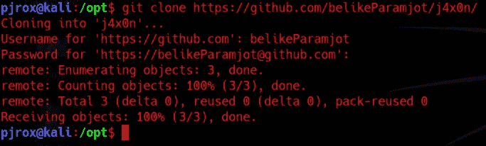
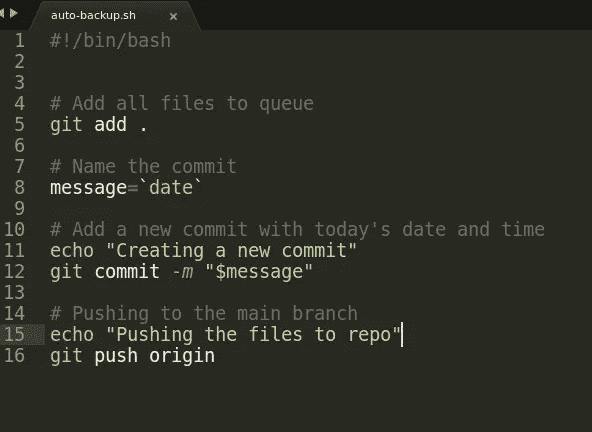
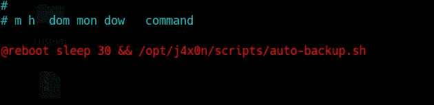

# 安排自动备份(Linux)到 github，只需 3 个简单的步骤

> 原文：<https://infosecwriteups.com/schedule-automated-backups-linux-privately-to-github-in-3-simple-steps-bfa97f122d5b?source=collection_archive---------2----------------------->

所以我正在设置这个新的虚拟机，几乎花了一整天的时间将我以前安装的文件复制到这个新的虚拟机中…现在，对我来说…我有点好奇，想尝试新事物，看看它们是如何运作的。有时我甚至看不到我正在使用我的实际机器来尝试这些东西…并且虚拟机最终崩溃，因为我定期地用那些配置文件进行阻碍。因此，我希望每当我安装新的虚拟机时，都有一个系统。我可以很容易地将我以前的机器状态复制粘贴到我的新状态。

> 专业提示:是的，我倾向于使用更多的虚拟机，而不是建立一个全新的系统，其中我有一些超过 100GB 的恒定数据，包括游戏、种子、工具等。F. 100GB 备份到云！！如果那些 100GB 的东西可以在主机上保持不变，那么虚拟机崩溃对我来说就不是问题了。

此外，VMware 中可能有一个定期自动创建虚拟机快照的功能，但我很确定我不知道它(目前还不知道)。而且，我可以不处理整个文件系统映像，然后通过硬盘驱动器、硬盘驱动器等将它带到我的新设备上。(再次因为…把常用的 OS 文件(/bin，/run，/proc)上传到云端只是浪费数据和云存储)。

因此，我现在计划将重要文件自动备份到我在 github 上的私人回购中。

# 1337 的东西

从在 github 上创建一个私人回购开始(如果你想让它们公开，这完全是你的选择)。我为自己创造了一个…


然后将该存储库克隆到您以前的安装中，以将备份文件复制到该存储库中。我默认使用/opt 目录来保存我的备份和其他东西。



如你所见…它要求用户名和密码，因为这是我的 github 上的私人回购。

然后将所有重要的文件/目录移动/复制到克隆的目录中…我通常会复制我的配置文件、其他自动化脚本和待办事项列表(以防万一我的桌子上有一堆任务，突然我的虚拟机崩溃，我没有办法恢复这些任务),就这样。


很好，第 1 步完成…现在是编写备份脚本的时候了。为了便于阅读，我不会详细描述脚本中的每一步(大多数是不言自明的)。



我只是喜欢通过同步日期和时间来命名我的每个私有回购提交。这就是我的自动备份脚本。确保给它可执行的权限。

```
chmod +x auto-backup.sh
```

* * *注意:第一次通过 git push 在 github 上提交新的回购时，需要输入用户名和密码。因此，在运行这个脚本之前，将您的凭证添加到 git 中，这样它就可以默认为以后登录的凭证。您可以通过运行以下命令来实现这一点***

```
git config credential.helper store
git config --global user.name 'Your username'
git config --global user.password 'Your password'
git config --global user.email 'Your email'
```

运行以上命令后…你要做的就是第 3 步。将您的脚本添加到 crontab，以便它在每次重新启动时执行。要为用户添加 crontab 条目，请运行:

```
crontab -e -u username
```

如果这是您第一次使用编辑器，可能会要求您选择要使用的编辑器。选择你的选择，添加如下条目。

```
@reboot /path/to/auto-backup.sh
```

这将运行自动备份，只要系统启动…为了更复杂地处理内存，您可以给 crontab 一个睡眠时间，这样它就不会在系统启动时增加备份压力。



您可以通过以下命令为您的用户列出 cronjobs:

```
crontab -l 
```

# 就这样，还有…

现在，我所要做的就是将我需要自动备份的文件复制到/opt/j4x0n 文件夹中，它将在每次重启时自动备份。

如果你还有任何疑问，请随时联系我。我很乐意帮忙；)此外，如果您希望我在自动化脚本或我的家庭实验室创作(仅限软件)上发布更多类似的博客帖子，请告诉我。我也很乐意分享。感谢阅读。

和平。