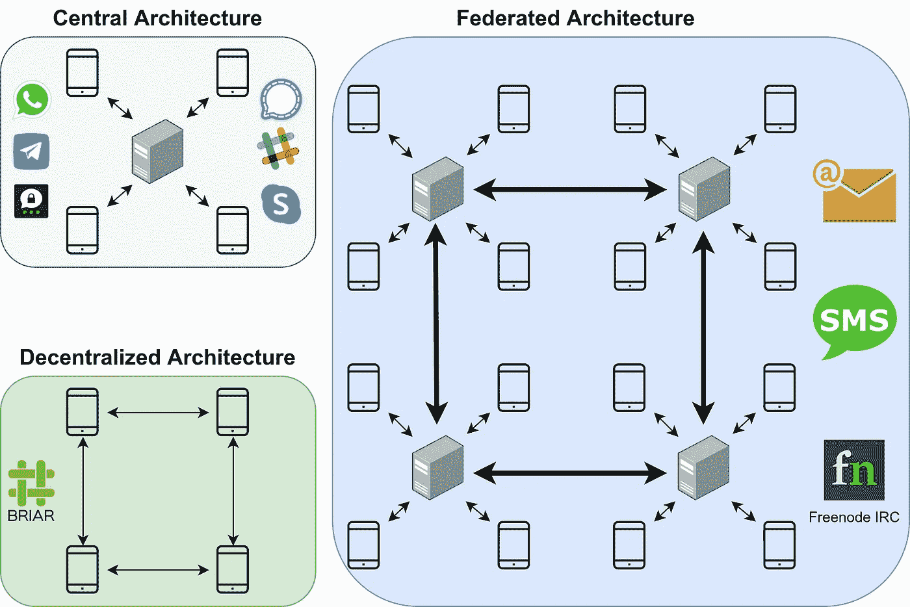

# 安全和私密的即时消息😇

> 原文：<https://infosecwriteups.com/secure-messaging-5d2fc7748c24?source=collection_archive---------3----------------------->

## 保密性、可靠性、隐私性、可用性、跨平台支持……-要考虑的事情太多了！

奥列格·马尼在 [Unsplash](https://unsplash.com?utm_source=medium&utm_medium=referral) 上拍摄的照片

今天，几乎每个人都在使用文本、图像、声音或视频进行实时交流。我们在智能手机和台式电脑上使用它。我们在私人和工作中使用它。它被被起诉的少数民族和恐怖分子使用。

本文概述了 2022 年广泛传播的安全消息系统。它指出了各种不同之处，因此可能会给你一个为你的家人、朋友或公司选择什么的想法。

本文的重点是让您了解如何比较信使:通过特性、隐私特性或系统架构。我会提到 **WhatsApp** 、 **Threema** 和 **Signal** ，因为他们是我最了解的信使。还有其他大的，比如中国的[微信](https://en.wikipedia.org/wiki/WeChat)和俄罗斯的[电报](https://en.wikipedia.org/wiki/Telegram_(software))。

# 特征——功能要求

由[美元吉尔](https://unsplash.com/@dollargill?utm_source=medium&utm_medium=referral)在 [Unsplash](https://unsplash.com?utm_source=medium&utm_medium=referral) 上拍照

当我们比较软件时，我们通常会看它们支持的特性。对于即时通讯工具，这些功能包括群聊、发送图片/录音/视频、语音和视频通话、表情符号和 Unicode 支持。

从我的角度来看，信使似乎支持所有相同的功能。但是你可能有你真正想要的这个功能，那么这可能会成为你使用某些应用的障碍。

# 系统结构

可视化中央架构、联合架构和分散架构之间的差异。图片作者:马丁·托马斯

根据通信模式，消息传递系统可以分为三类:

**中央架构**拥有管理服务器的单一权限。客户端总是与单个服务器通信，但可能使用端到端加密(E2EE)来保持通信内容的私密性。然而，服务器知道诸如谁在什么时间与谁交谈之类的元数据。大多数服务使用这种模式，因为它最容易设置和保证可用性。例如 WhatsApp、Threema、Signal、Telegram、Slack 和 Skype。大多数 IRC 房间都在一台服务器上，因此它们是集中的。

**联合架构**拥有由独立组织控制的服务器。服务器形成网络并交换消息。客户端连接到一台服务器。例如电子邮件、SMS 和 Freenode IRC。

**消息传递的分散架构**超级难。我听说 Tox.chat、Ricochet.im 和 Briar 通过 TOR 网络遵循这种模式。然而，我不确定细节，也不确定潜在的缺点，如可用性和消息传递的速度。

# 聊天伙伴的发现

照片由 [Van Tay Media](https://unsplash.com/@vantaymedia?utm_source=medium&utm_medium=referral) 在 [Unsplash](https://unsplash.com?utm_source=medium&utm_medium=referral) 上拍摄

每个交流系统都有一个问题，就是如何找到你想交流的人。你需要一些标识符。你是怎么做媒的？

典型的发现选项有:

*   **电子邮件地址**或**电话号码**
*   **散列的**电子邮件地址或电话号码:这样服务器可以知道你认识哪些人，以防有人加入，但服务器不知道普通地址。这意味着它们不能用于广告或其他目的。
*   **个人资料**(例如 Github、Reddit)
*   **带外发现**:用户名或随机生成的标识符，要求您以另一种方式告诉您的通信伙伴如何找到您。

# 隐私功能

托拜厄斯·图利乌斯在 [Unsplash](https://unsplash.com?utm_source=medium&utm_medium=referral) 上拍摄的照片

隐私功能对于大多数即时通讯来说是不可或缺的，否则你可能会想使用像 Twitter 这样的微博服务。至少你应该有传输加密和端到端加密

他人阅读的内容:

*   **传输加密**:确保网络中的人无法读取消息。如果你有一个中心架构，供应商仍然可以。如果消息是通过 HTTPS 交换的，就会给出。
*   **端到端加密(E2EE)** :只有发送方和接收方可以读取消息，而不是使用的平台。E2EE 可确保内容的机密性，但前提是您的通信伙伴必须保密。
*   完整性:我收到完整的信息了吗？被改了吗？

元数据:

*   真实性:确保你在和你认为你在交谈的人交谈。这条信息真的是爱丽丝发的还是别人发的？
*   **元数据保密性**:平台是否收集活动记录，即你何时/向谁/多久/在什么时间发送消息？

邮件转发:

*   **短暂消息(自我删除消息、过期消息)**:如果你的通信伙伴想要公开你们的对话，可能会有一点帮助。
*   否认:你可能想帮助人们说他们没有说过什么。

该服务:

*   **服务的可用性**:服务对问题是否稳健？它能承受负荷吗？
*   **审查阻力**:服务能阻止我和某些人通话吗？别人可以被屏蔽和我说话吗？

# 开源和开放协议

马库斯·斯皮斯克在 [Unsplash](https://unsplash.com?utm_source=medium&utm_medium=referral) 拍摄的照片

开源软件公开消息应用的源代码。开放协议专注于让公众知道通信的方式。

如果消息应用和必要的基础设施是开源的，人们可以检查它的问题，添加新功能，如果最初的开发者放弃了它，还可以继续开发。这并不总是容易的，但是如果软件被大量使用，这些事情更有可能发生。

开放式消息传递协议的示例有:

*   [IRC](https://en.wikipedia.org/wiki/Internet_Relay_Chat)
*   [XMPP](https://en.wikipedia.org/wiki/XMPP) : [OMEMO](https://en.wikipedia.org/wiki/OMEMO) 。知名客户有 [Gajim](https://gajim.org/) 、 [Conversations](https://play.google.com/store/apps/details?id=eu.siacs.conversations&hl=de&gl=US) 、 [Monal](https://apps.apple.com/de/app/monal-xmpp-chat/id317711500) 。WhatsApp 使用 XMPP 的一个变种，叫做 funXMPP。
*   [OTR(私信)](https://en.wikipedia.org/wiki/Off-the-Record_Messaging)
*   [Matrix.org](https://en.wikipedia.org/wiki/Matrix_(protocol)):使者是[元素](https://en.wikipedia.org/wiki/Element_(software))(原暴动与向量)

# 服务

亚历山大·席默克在 [Unsplash](https://unsplash.com?utm_source=medium&utm_medium=referral) 上拍摄的照片

您现在知道了许多对您来说可能很重要的不同标准，但是有哪些服务，它们之间的比较如何？

有太多的消息应用程序，无法在一篇文章中对它们进行比较。我将它们分为以下几类:

*   **业务团队沟通** : [懈怠](https://en.wikipedia.org/wiki/Slack_(software))，微软[团队](https://en.wikipedia.org/wiki/Microsoft_Teams)
*   **非工作消息** : [三马](https://en.wikipedia.org/wiki/Threema)，[信号](https://en.wikipedia.org/wiki/Signal_(software))，Telegram， [Facebook Messenger](https://en.wikipedia.org/wiki/Messenger_(software)) 和 [WhatsApp](https://en.wikipedia.org/wiki/WhatsApp) ，[腾讯 QQ](https://en.wikipedia.org/wiki/Tencent_QQ) ，苹果 iMessage， [Birar](https://en.wikipedia.org/wiki/Briar_(software))
*   **视频通话** : [变焦](https://en.wikipedia.org/wiki/Zoom_(software))，[微软 Skype](https://en.wikipedia.org/wiki/Skype)

# 现在…我该如何选择？

有几个因素大大缩小了选择范围:

*   平台支持:你或你的联系人想在台式电脑上使用它吗？iOS？安卓？微软手机？
*   **特点**:需要视频通话吗？需要端到端的加密群聊吗？
*   **攻击场景**:应用需要防审查吗？你在乎别人是否能证明消息来自你吗？服务知道你在什么时候和谁说话对你来说重要吗？

请注意，您关心的攻击场景可能比您想象的要多。一个很好的例子是这个故事:

 [## 一位父亲给医生拍了他赤裸的孩子的照片。谷歌将他标记为罪犯。

### 谷歌有一个自动工具来检测儿童的虐待图像。但是系统可能会出错，而且…

www.nytimes.com](https://www.nytimes.com/2022/08/21/technology/google-surveillance-toddler-photo.html) 

# 请参见

Will Scott 在 36C3 (2019)上做了一个关于这个话题的演讲

# 下一步是什么？

在这个关于应用安全(AppSec)的系列文章中，我们已经解释了攻击者的一些技术😈以及防守队员的技术😇：

*   第 1 部分: [SQL 注入](https://medium.com/faun/sql-injections-e8bc9a14c95)😈🐝
*   第二部分:[不要泄密](https://levelup.gitconnected.com/leaking-secrets-240a3484cb80)😇
*   第 3 部分:[跨站点脚本(XSS)](https://levelup.gitconnected.com/cross-site-scripting-xss-fd374ce71b2f) 😈🐝
*   第 4 部分:[密码哈希](https://levelup.gitconnected.com/password-hashing-eb3b97684636)😇
*   第五部分: [ZIP 炸弹](https://medium.com/bugbountywriteup/zip-bombs-30337a1b0112)😈
*   第六部分:[验证码](https://medium.com/plain-and-simple/captcha-500991bd90a3)😇
*   第七部分:[电子邮件欺骗](https://medium.com/bugbountywriteup/email-spoofing-9da8d33406bf)😈
*   第 8 部分:[软件组成分析](https://medium.com/python-in-plain-english/software-composition-analysis-sca-7e573214a98e) (SCA)😇
*   第九部分: [XXE 袭击事件](https://medium.com/faun/xxe-attacks-750e91448e8f)😈🐝
*   第十部分:[有效的访问控制](https://levelup.gitconnected.com/effective-access-control-331f883cb0ff)😇
*   第十一部分:[通过十亿次大笑做某事](https://medium.com/bugbountywriteup/dos-via-a-billion-laughs-9a79be96e139)😈
*   第十二部分:[全磁盘加密](https://medium.com/faun/full-disk-encryption-2090489f9760)😇
*   第 13 部分:[不安全的反序列化](https://medium.com/bugbountywriteup/insecure-deserialization-5c64e9943f0e)😈
*   第 14 部分:[码头工人安全](https://levelup.gitconnected.com/docker-security-5f4df118948c)😇
*   第 15 部分:[证件填充](https://levelup.gitconnected.com/credential-stuffing-ff58ee8c3320)😈🐝
*   第 16 部分:[多因素认证](https://medium.com/plain-and-simple/multi-factor-authentication-cefff819be95) (MFA/2FA)😇
*   第 17 部分:[重做](/redos-denial-of-service-by-regex-59c7ffab4880?source=user_profile---------0-------------------------------&gi=bec35fb230e3)😈
*   第 18 部分:安全和私人即时消息😇
*   第 19 部分:密码劫持😈
*   第 20 部分:备份😇
*   第 21 部分:加密木马😈
*   第 22 部分:单点登录😇
*   第 23 部分:剪贴板劫持😈
*   第 24 部分:证书😇
*   第 25 部分:区块链的种族条件攻击😈
*   第 26 部分:移动设备管理(MDM)😇
*   第 27 部分:服务器端请求伪造(SSRF)😈
*   第 28 部分:网络隔离😇
*   第 29 部分:社会工程(包括钓鱼)😈
*   第 30 部分:虚拟专用网络😇
*   第 31 部分:CSRF😈

如果您对更多关于 AppSec / InfoSec 的文章感兴趣，请告诉我！

我喜欢写关于软件开发和技术的文章🤩不要错过更新: [**获取我的免费电子邮件简讯**](https://martinthoma.medium.com/subscribe) 📧或者[如果你还没有报名参加 medium](https://martinthoma.medium.com/membership)✍️——两者都鼓励我多写🤗