# 使用 elastic-packet beat+Suricata 实现安全网络监控

> 原文：<https://infosecwriteups.com/secure-network-monitoring-with-elastic-packetbeat-suricata-7ecd871b1a52?source=collection_archive---------0----------------------->

使用 ELK stack、Packetbeat 和 Suricata 对网络进行安全监控


泰勒·维克在 Unsplash[上的照片](https://unsplash.com/s/photos/network?utm_source=unsplash&utm_medium=referral&utm_content=creditCopyText)

如果你想保护网络分段，这不是你唯一需要的东西。我们现在面对的是拥有多种设备需要保护的公司。如今，监控您的网络和设备是绝对必要的，每个组织都应该收集有关其设备和网络的所有可能的安全信息。如果您不监控您的网络或设备，您如何能够检测出什么是正常行为或攻击？存在明显的恶意攻击，但在任何网络安全事件中，早期检测都至关重要。检测异常活动的最佳且更实用的方法之一是网络监控。在这篇文章中，我们将会看到如何用一些开源工具来监控你的网络，然后将所有的信息聚集到一个 ELK 集群中。

# 期待 tcpdump 和 Wireshark

可能在阅读标题后，您想到的一些工具是 Wireshark/tshark 或 tcpdump。尽管这些工具是很好的网络数据包分析器，但并不集中于自动检测。我们将使用使用或实现 tcpdump 功能但具有更多功能的工具。此外，tshark 和 tcpdump 都没有与 elasticsearch 直接集成。


与 ELK 集成的开源监控工具

这并不完全正确，tshark 已经与旧版本的 elasticsearch 进行了某种整合，但目前还不可用。Tshark 提供了一个选项`-T ek`，可以生成 JSON 输出和弹性映射。但是我只能在 ELK 6.6.0 集群上配置和使用这些选项，并且经过了大量的调整。

```
tshark -i en0 -T ek 
tshark -G elastic-mapping --elastic-mapping-filter ip,udp,dns
```

ELK 目前在 7.9.2 版本上，在 6.6.0 版本中我们缺少了很多新功能，比如弹性 SIEM。对于[的每个功能](https://bugs.wireshark.org/bugzilla/show_bug.cgi?id=15784)都有[两个未解决的 bug](https://bugs.wireshark.org/bugzilla/show_bug.cgi?id=15719)，所以让我们希望一切都在某个时候得到解决。这种情况促使我检查网络监控的其他可能性，事实是，现在，我们不需要 tshark。在这种情况下，我们将使用 Packetbeat 和 Suricata。

# 包装杯

[Packetbeat](https://www.elastic.co/es/beats/packetbeat) 是由 Elasticsearch 开发的网络监控工具，使用 libpcap 库进行网络流量捕获。使用这个工具，我们可以监控 HTTP、TLS 或 DNS 以及其他网络协议。但有必要提及的是，该工具的重点不是安全性，而是应用程序监控。这并不意味着从安全角度来看没有用，但是我们需要注意一些限制。

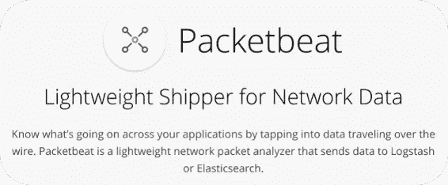

[https://www.elastic.co/es/beats/packetbeat](https://www.elastic.co/es/beats/packetbeat)

## 配置数据包比特

要使用 Packetbeat，需要修改 packetbeat.yml 文件来调整我们的配置。首先，我们需要指定嗅探接口。如果你不知道使用哪一个，你可以运行`packetbeat devices`来检查你的接口。分配了 IP 地址的接口可能就是您想要监控的接口。不幸的是，现在你不能选择两个或更多的接口[，因为缺乏对多接口](https://github.com/elastic/beats/issues/263)的支持。在 Linux 中，我们有选择`any` 监听所有接口的可能性。要选择我们的接口，我们只需在 *packetbeat.yml.* 中写入接口名称

```
packetbeat.interfaces.device: **eth0**
```

同样在 Linux 中，我们可以打开`af_packet`作为数据包接口。af_packet 是 libpcap 的替代方案，能够提供快速网络嗅探。

```
packetbeat.interfaces.type: af_packet
```

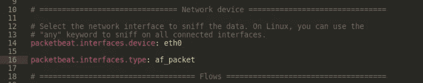

packetbeat.yml 配置文件

## 数据包协议

如前所述，我们可以使用 Packetbeat 监控几个网络协议。同样在 *packetbeat.yml* 文件中，我们需要指定我们想要监控的每个端口和协议。如果我们使用一些非标准端口，我们将需要在这一部分指定它们。此时，您可能意识到了 packetbeat 的安全限制，如果有人通过 8081 端口或任何其他非默认端口发送 HTTP 流量，而我们没有在配置中包括这些端口，会发生什么情况？。如果发生这种情况，Packetbeat 将无法检测和解析该流量。


指定端口和协议的 packetbeat.yml 文件

尽管这种情况可能发生，但这并不意味着 packetbeat 在网络监控中没有用。例如，使用 Packetbeat 的 DNS 监控对于防范安全事故非常有用。我只是指出这一点，以证明包括更多网络监控工具的必要性，就像前面提到的那些。

## 打包输出

被打包作为 Elastic 团队开发的工具，针对 elasticsearch 进行配置真的很容易吗？像 ELK stack 的任何其他 beat 一样，我们需要在 *packetbeat.yml* 中指定 elasticsearch 或 logstash 输出。至此，包含一个`geoip-info`管道真的有用吗？

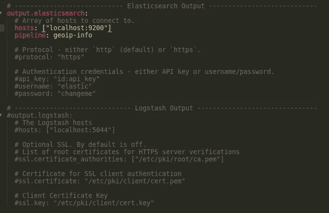

packetbeat.yml 输出配置文件

## 地理信息

Kibana 的一个很酷的功能是他们的地图，如果我们对网络 IP 进行地理定位，我们将能够在地图上描绘这些信息。由于与 Maxmind GeoLite2 城市数据库的集成，Elastic 能够自动地理定位 IP，但我们需要配置 elastic `geoip`处理器。在将`pipeline: geoip-info`添加到我们的 *packetbeat.yml* 文件之后，我们需要指明 elastic 来地理定位这些 IP。

执行该操作所需的唯一步骤是在 elasticsearch 中创建一个摄取节点管道。我们可以使用 Kibana 控制台或`curl`运行下面的 PUT 来创建管道。

```
PUT _ingest/pipeline/geoip-info
{
  "description": "Add geoip info",
  "processors": [
    {
      "geoip": {
        "field": "client.ip",
        "target_field": "client.geo",
        "ignore_missing": true
      }
    },
    {
      "geoip": {
        "field": "source.ip",
        "target_field": "source.geo",
        "ignore_missing": true
      }
    },
    {
      "geoip": {
        "field": "destination.ip",
        "target_field": "destination.geo",
        "ignore_missing": true
      }
    },
    {
      "geoip": {
        "field": "server.ip",
        "target_field": "server.geo",
        "ignore_missing": true
      }
    },
    {
      "geoip": {
        "field": "host.ip",
        "target_field": "host.geo",
        "ignore_missing": true
      }
    }
  ]
}
```

在执行这个 PUT 之后，Packetbeat 发送到我们 ELK 集群的每个 IP 都将被地理定位。这个过程也可以使用 Logstash 和 [Geoip 过滤器插件](https://www.elastic.co/guide/en/logstash/current/plugins-filters-geoip.html)来完成，但是在 ELK 集群中并不总是需要 Logstash。

## Kibana 仪表板

使用 Packetbeat 的另一个有用的东西是它们预先配置的 Kibana 仪表板。Packetbeat 附带了几个仪表板，用于轻松分析网络流量。此外，每个仪表板都可以修改，我总是建议在 Kibana 中设置这些仪表板，然后根据您的需要定制它们。同样，我们需要修改 *packetbeat.yml* 来指示我们在 setup.kibana 下的 Kibana 位置。如果在此部分没有指定凭证，packetbeat 将使用 output.elasticsearch 凭证来验证 kibana。

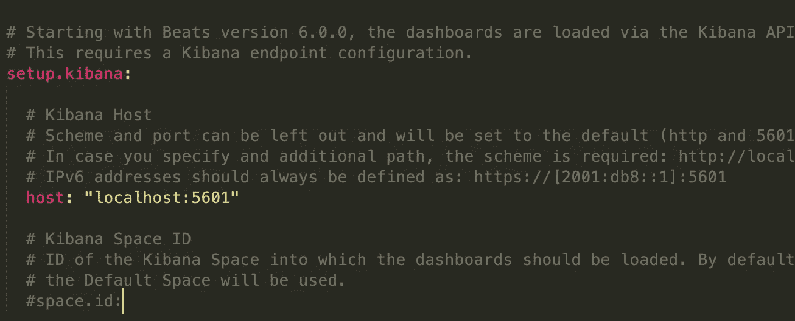

packetbeat.yml Kibana 配置

写完这些配置后，我们可以用`packetbeat test config -e`来检查一切是否正确

此后，我们可以开始部署 Kibana 仪表板，并使用`packetbeat setup -e`加载弹性指数映射。如果一切正常，我们应该会看到这条消息:*“ki Bana 仪表板成功加载”。*

## 发射包包

唯一剩下的就是发射 Packetbeat。作为一个网络监控工具，我们需要一个 sudo 用户。首先，我们需要将 *packetbeat.yml* 的所有者改为 root，然后启动 packetbeat。

```
sudo chown root packetbeat.ymlsudo ./packetbeat -e
```

# 网络 IDS 和 IPS — Suricata

在整篇文章中，我一直提到，作为一个完整的网络安全监控解决方案，Packetbeat 是不够的。我们需要用其他网络安全解决方案来补充这个工具，这些解决方案可以充当网络入侵检测和保护系统(NIDS 和 NIPS)。一个可以实现这个功能的开源工具是 [Suricata](https://suricata-ids.org/features/all-features/) 。


Suricata 提供检测和保护功能，可与 ELK 堆栈集成。与 Packetbeat 不同，Suricata 监控网络流量，并尝试与一些预定义的安全规则进行匹配。如果该流量符合特定安全规则，Suricata 可以生成警报或阻止该流量。此外，有许多检测恶意活动的开放规则，但我们也可以创建自己的规则。

## 安装 Suricata

Suricata 被广泛使用，有[二进制包](https://suricata-ids.org/download/)帮助它的安装。在 Ubuntu/Debian 系统中安装 Suricata 就像输入`sudo apt install suricata`一样简单。

如果你在 Ubuntu/Debian 系统上通过二进制包安装 Suricata，日志的默认文件夹将是 */var/log/suricata* ，配置文件将在 */etc/suricata* 中。

## 下载苏里卡塔规则

如前所述，Suricata 使用规则来检测恶意活动。这使得 Suricata 成为 NIDS/NIPS 的标志性基础系统。您可以手动下载并安装这些规则，但最好的方法是使用像 suricata-update 或 oinkmaster 这样的工具。有几组公共规则由社区维护并经常更新，因为最好的选择是使用可以定期下载这些更新的工具。

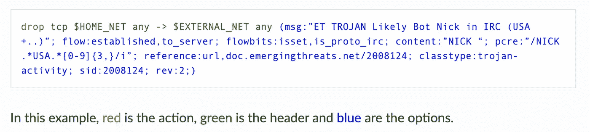

来自[https://Suricata . readthedocs . io/en/suricata-4 . 1 . 4/rules/intro . html](https://suricata.readthedocs.io/en/suricata-4.1.4/rules/intro.html)的 suricata 规则示例

如果我们选择 oinkmaster，它可以很容易地在 Debian/Ubuntu 系统中使用 apt 安装`sudo apt install oinkmaster`。然后我们需要编辑 */etc/oinkmaster.conf* 来指定规则可以从哪里[下载](http://rules.emergingthreats.net/open/suricata/emerging.rules.tar.gz)。

```
url  = http://rules.emergingthreats.net/open/suricata/emerging.rules.tar.gz
```

添加这些信息后，我们可以使用我们的配置文件运行 oinkmaster，并指定存储规则的位置。

```
sudo oinkmaster -C /etc/oinkmaster.conf -o /etc/suricata/rules
```

这个命令也是更新规则的命令，所以您应该每天运行 oinkmaster。一个简单的方法是用 oinkmaster 命令添加一个 crontab。只需记住 oinkmaster 需要 sudo 权限，因此它应该是 root 用户 crontab。

```
0 1 * * * oinkmaster -C /etc/oinkamaster.conf –o /etc/suricata/rules
```

## 配置 Suricata 规则

Suricata 有多个规则，我们需要告诉 Surica 使用哪一组规则。首先，我们需要编辑*/etc/suricata/suricata . YAML*来指示分类文件所在的位置。这个分类文件列出了 Suricata 使用所有可能的规则集。用 oinkmaster 下载规则后，这个分类文件必须出现在 */etc/suricata/rules a* 下。

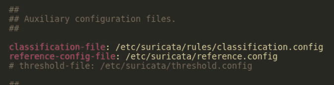

suricata.yaml 配置文件

然后，我们需要在 rule-files 部分下添加我们想要使用的规则集。如果你只是想添加所有的规则，我创建了一个 [gist](https://gist.github.com/CarlosLannister/3ea9aaa15fe4f0825134e21881354139) 文件，方便复制粘贴所有的名字。

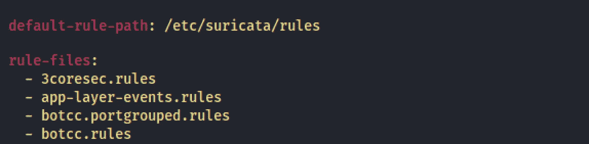

suricata.yaml 规则-文件

## 网络结构

我们需要配置的另一件事是在 *suricata.yaml* 文件中指定我们的家庭网络。这将允许 Suricata 区分传入和传出流量。默认情况下，所有不是来自我们家庭网络的流量都将被归类为外部流量，*！$HOME_NET* 。


suricata.yaml 中的家庭网络和外部网络 IPs

## 测试并运行 Suricata

在安装和配置完 Suricata 之后，我们可以试着运行它。使用`-i`选项，我们可以选择 Suricata 将要监听的接口，也推荐使用`--init-errors-fatal`来检测可能的错误。

```
sudo suricata -c /etc/suricata/suricata.yaml -i **eth0 --init-errors-fatal**
```

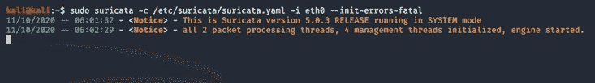

苏里卡塔发射无误

根据您的系统和您的 Suricata 安装，一些规则可能会给您带来错误。例如，Suricata 可以监控网络工业协议，如 Modbus 或 DNP3，但您需要从源代码安装 Suricata 才能拥有这些功能。如果您对监控这些协议不感兴趣，您可以禁用这个规则文件(在 *suricata.yaml* 中)。

## IPS 模式

所有以前的 Suricata 设置它是作为一个 IDS，没有任何交通阻塞选项。如果我们想要阻止流量，我们需要激活 IPS 模式。Suricata 可以使用 NFQUEUE 作为 IPS 工作，因此这种 IPS 模式只能在 Linux 系统中运行。

我们可以用我们想要的配置创建一个 nf queue[,然后用`-q`参数将该队列指定给 Suricata。](https://suricata.readthedocs.io/en/suricata-4.1.2/setting-up-ipsinline-for-linux.html)

```
sudo suricata -c /etc/suricata/suricata.yaml **-q 0**
```

## 苏里卡塔与麋鹿的融合

在所有这些之后，剩下的唯一事情就是将 Suricata 与我们的麋鹿群整合。默认情况下，Suricata 会在 */var/log/suricata/eve.json 中创建一个包含 json 事件的日志。*任何 JSON 事件都可以插入到 elastic 中，但是我们有一个官方的、受支持的使用 Filebeat 的集成。

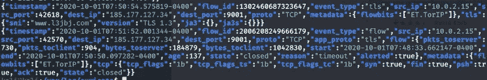

包含 Tor 事件的 Suricata eve.json 文件

## Filebeat

Filebeat 是将日志传送到 ELK 集群的最佳方式之一。Filebeat 有许多[模块](https://www.elastic.co/guide/en/beats/filebeat/current/filebeat-modules.html)，可用于吸收多种服务和技术。第一步是从[弹性网页](https://www.elastic.co/es/downloads/beats/filebeat)下载 Filebeat。

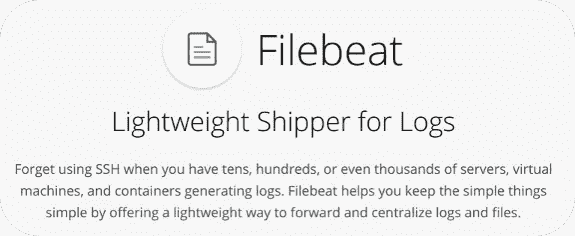

下载 Filebeat 后，我们可以开始启用我们感兴趣的模块。我们将发布 Suricata 日志事件，因此我们需要启用 Suricata 模块。

```
filebeat modules enable suricata
```

然后我们需要在 */modules.d/suricata.yml* 中编辑模块 Suricata 的配置。Filebeat 中的每个模块都有一个配置文件，因为我们只发送 Suricata 日志，我们只需要修改 suricata.yaml 中的 *suricata.yml.* 我们需要在 tag var.paths 部分指定 Suricata JSON 日志的位置。在我们的例子中，路径将是*/var/log/suricata/eve . JSON*。

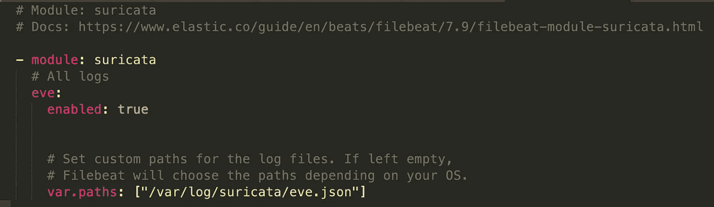

filebeat/modules . d/suricata . yml 配置文件

现在，我们需要编辑 *filebeat.yml. A* s，我们用 *packetbeat.yml* 进行了编辑。有必要配置我们的 elastic 和 Kibana 输出，添加必要的地址和凭证。在这里，我还将推荐添加地理 ip 信息管道，以地理定位苏里卡塔确定的所有 IP。

此外，我们可以执行的另一个调整是地理定位我们的家庭网络 IP。内部地址不能使用 MaxMind 数据库进行地理定位，但是我们可以在 *filebeat.yml、*中指定如何处理这些地址。这不是一个强制性的步骤，但它可以让我们看到基巴纳内部更完整的地图。在 *filebeat.yml* 里面有一个叫做 processors 的部分，在这里我们可以指定属于一个网络空间的所有地址都要添加某些地理位置信息。在我的例子中，我正在把马德里地区的地理位置信息添加到我的家庭网络中，但是你可以选择你想要的任何信息。

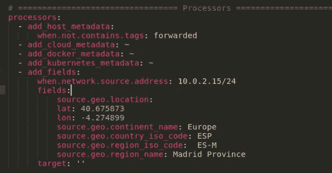

geo-ip 处理器文件节拍

最后，我们只需要在 Kibana 上加载所有映射和仪表板，没错，Suricata 也有预定义的 Kibana 仪表板，然后启动 Filebeat。

```
filebeat setup -efilebeat -e
```

如果一切正常，您应该会看到如下所示的输出，从中您可以了解日志路径是如何配置的。另外，记得使用 sudo 权限启动 Filebeat，以便能够读取 */var/log/suricata* 文件夹。

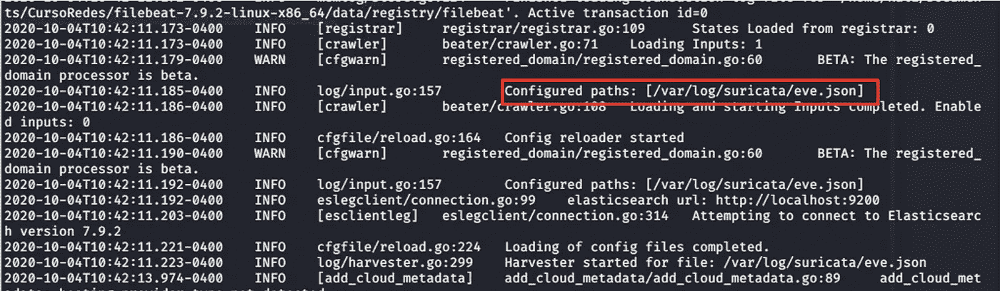

来自 Suricata eve.json 日志文件的 Filebeat 运行和运输信息

# 基巴纳

最后，我们可以打开我们的 Kibana，查看所有已经加载的酷信息和仪表板。


请记住，您可以使用 Kibana 创建自己的可视化效果，但是在我看来，您已经拥有了足够多的可视化效果。Packetbeat 有一个概述仪表板，显示一些通用信息和几个到其他仪表板的链接。我的建议是从概览仪表板开始，然后根据你的需要跳到每个细节。

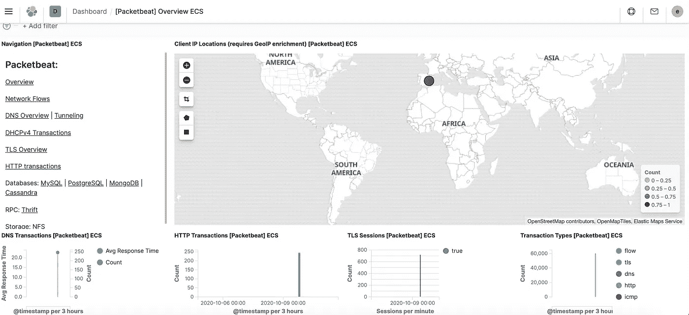

Packetbeat 概览仪表板

在 Suricata 的情况下，您将拥有一个警报总览仪表板和事件总览仪表板。事件概述提供了一些关于我们网络的一般信息，更多安全关键信息将在警报概述仪表板中显示。


苏里卡塔事件概述仪表板

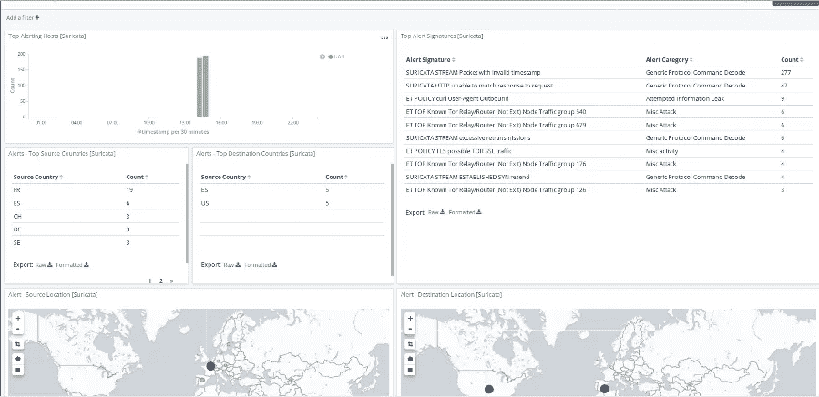

苏里卡塔警报概览仪表板

每次匹配某个 Suricata 规则时，都会生成一个警报。根据您激活或包含的规则，您将在 Kibana 中看到不同的警报。

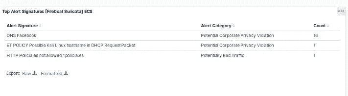

Suricata 检测到的顶级警报特征的详细信息

例如，我已经添加了一些 Suricata 规则来阻止西班牙国家报 policia.es 的网站，然后如果我试图访问它，就会生成警报。

```
drop http $HOME_NET any -> $EXTERNAL_NET any (msg:"HTTP Policia.es not allowed *.policia.es"; flow:established,to_server; content:"policia.es"; http_host; isdataat:!1,relative; classtype:bad-unknown; sid:1;)drop dns $HOME_NET any -> $EXTERNAL_NET any (msg:"DNS Policia.es"; content:"policia"; classtype:policy-violation; sid:2; rev:1;)drop tls $HOME_NET any -> $EXTERNAL_NET any (msg:"SSL Policia.es"; tls.subject:"policia"; classtype:policy-violation; sid:3; rev:1;)
```

# 建议和进一步工作

我已经将 ELK 集群的安全性排除在了本文的范围之外，但是请记住始终启用安全性。你**不得在没有任何适当认证**的情况下离开你的麋鹿群 **。此外，麋鹿最大的优点之一就是它们的灵活性。我的建议是根据你的需要来调整这个框架。想想你的需求是什么，然后运用我们在这篇文章中学到的所有东西。**

我没有谈到和解释的另一件事是 Kibana 内部的 SIEM 功能。在我看来，[弹性 SIEM](https://www.elastic.co/siem) 是目前创建 SIEM 的最佳选择。我们已经讨论了如何在 Kibana 中插入和可视化信息，但是 elastic SIEM 允许我们做更多的事情。我们可以交叉关联信息，添加检测规则，使用机器学习进行异常检测或通过 Slack 发送警报。检查并使用 Elastic SIEM，因为 Packetbeat 和 Suricata 添加的所有信息在那里也是可见和可操作的。

此外，请记住，还有其他网络安全监控工具。也许你们中的一些人正在考虑 Snort 和 Zeek。这两个工具都与 ELK Stack 集成，如果你想使用 Zeek，最近有一篇关于如何将 [Zeek 与 elasticsearch](https://www.elastic.co/es/blog/collecting-and-analyzing-zeek-data-with-elastic-security) 结合使用的帖子。最后，就说我正在写另一个系列的文章，涵盖了前面提到的一些话题，所以如果你想阅读其中的一些，请跟我来；).