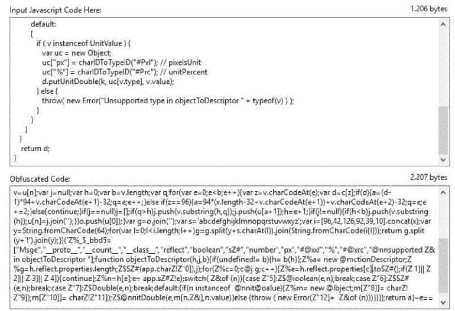
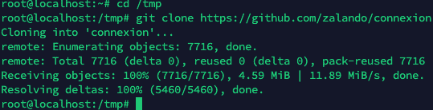
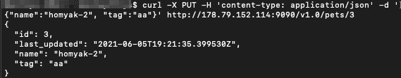
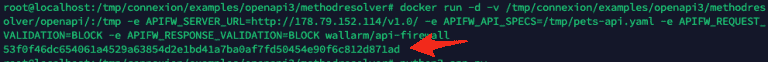
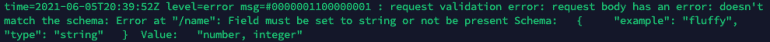
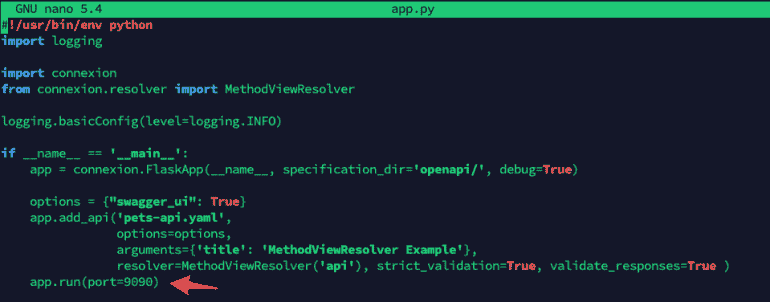

# 使用免费 API 防火墙保护 REST🔒操作指南

> 原文：<https://infosecwriteups.com/securing-rest-with-free-api-firewall-how-to-guide-6375aefeb5be?source=collection_archive---------3----------------------->

在当今世界，网络应用变得越来越重要。坏演员知道这一点，他们比以往任何时候都更频繁地针对他们。这不太可能很快停止，因为随着对技术的依赖，世界需要的网络应用数量只会增加。完全防止攻击是不可能的，但我们需要尽最大努力做到这一点，在这个领域的日常斗争中，我们有一种武器，称为“硬化”。

# 什么是硬化

从最基本的意义上来说，强化你的服务器意味着增强它的防御能力，但实际上，服务器有很多易受攻击的地方。一种常用的技术是净化我们应用程序中的用户输入。用户数据可能包含恶意代码或意想不到的输入，我们应该小心加强我们的服务器对这种行为。

另一种经常使用的强化技术是 javascript 混淆。Web 应用不再是过去的静态网站。它们包含大量 javascript，这些 javascript 可能会向潜在的黑客透露大量信息。为了防止这种情况，代码被混淆，这样黑客就很难弄清楚应用程序的内部工作方式。



数据包级别的防火墙已经在生产环境中实施了很长时间，但是最近 [Web 应用防火墙](https://www.wallarm.com/product/cloud-waf)正在快速普及。他们将检查任何 http 请求，根据配置，他们可能会报告或阻止任何包含意外或恶意输入的调用。这只是现代系统管理员工具箱中的一个工具，但却是一个非常重要的工具。

# 硬化与不硬化

像生活中所有美好的事情一样，强化 web 应用程序也是有代价的。更坚固的服务器将更安全，不会受到攻击者的攻击，但它也会更慢，因为所有这些安全措施都是有代价的。它们将需要整个系统及其组件更多的处理时间，这可能会大大降低应用程序的速度。

正是因为这个原因，通常需要在实施太少的强化和实施太多的强化之间取得平衡。

# 符合 API 防火墙

API Firewall 是一款轻量级 API 防火墙，通过 API 模式验证来保护云原生环境中的 API 端点。API Firewall 依赖于一个积极的安全模型，允许符合预定义 API 规范的调用，同时拒绝其他所有调用。

从技术上来说，API Firewall 是一个反向代理，内置了 OpenAPI v3 请求和响应验证器，用 Go 编写，并针对极高的性能和接近零的额外延迟进行了优化。

# 先决条件

要安装 API 防火墙，我们需要满足几个先决条件。

*   Docker 守护程序已安装([https://www.docker.com/](https://www.docker.com/))
*   需要安装 git(【https://www.atlassian.com/git/tutorials/install-git】T2
*   API 防火墙，我们将在稍后的指南中下载(【https://hub.docker.com/r/wallarm/api-firewall】T4)
*   Zalando 的连接演示 API repo[https://github.com/zalando/connexion](https://github.com/zalando/connexion)

# 安装连接演示

为了测试我们的 WAF，我们将使用 Zalando 提供的*连接*演示。当然，我们需要安装并运行它。我们可以通过一个简单的命令做到这一点。

pip 安装连接[swagger-ui]稍后我们将启动*连接*，这样我们就可以用我们的 API 防火墙测试它。

# 安装

首先，在克隆连接库之前，我们进入/ *tmp* 目录。

```
cd /tmp
git clone <https://github.com/zalando/connexion>
```



接下来，我们需要从 docker hub 中取出 *api-firewall* docker 文件

docker 拉墙/API-防火墙

最后一步，我们可以使用以下命令轻松运行 API 防火墙

```
docker run -d -v /tmp/connexion/examples/openapi3/methodresolver/openapi/:/tmp -e APIFW_SERVER_URL=http://178.79.152.114:9090/v1.0/ -e APIFW_API_SPECS=/tmp/pets-api.yaml -e APIFW_REQUEST_VALIDATION=BLOCK -e APIFW_RESPONSE_VALIDATION=BLOCK -p 8282:8282 wallarm/api-firewall
```

这将在后台启动我们的 docker 容器，并为我们提供 docker 容器的标识符。


接下来是启动 connexion python 应用程序，因为我们需要测试一些东西。我们可以通过进入“methodresolver”目录并使用 python3 启动应用程序来实现这一点。

```
cd /tmp/connexion-master/examples/openapi3/methodresolver/
python3 app.py
```

您可以查看它在日志中使用的 URL。

现在我们需要测试使用 curl 时一切都正常。我们将尝试发出一个 PUT 请求来更新一些数据，看看是否可行。我们必须从外部计算机执行这个请求，因为我们将与服务器的公共 IP 地址对话。确保用你的 IP 地址替换我们的。

```
curl -X PUT -H 'content-type: application/json' -d '{"name":"homyak-2", "tag":"aa"}' <http://178.79.152.114:8282/v1.0/pets/3>
```

这应该会返回以下输出。

```
{ "id": 3, "last_updated": "2021-06-05T19:21:35.399530Z", "name": "homyak-2", "tag": "aa" }
```



现在我们有了一个工作的 API 框架和一个工作的 API 防火墙，我们可以尝试发出一个恶意的请求。

```
curl -X PUT -H 'content-type: application/json' -d '{"name":111, "tag":"aa"}' <http://178.79.152.114:8282/v1.0/pets/3>
```

这将返回 403 错误响应。

要在服务器上检查这一点，我们可以使用命令“docker logs CONTAINERID”返回并检查 docker 容器的日志，其中 CONTAINERID 是我们通过运行“docker run”命令获得的。



如果您丢失了这个 ID，这不是问题，您可以使用“docker 容器”来检查正在运行的 docker 容器。接下来，我们可以运行“docker logs”命令来查看我们的日志，并看到 API 防火墙正在过滤掉请求并阻止它们。



# 基本细节

让我们谈一谈我们正在做的事情。首先，我们正在下载 connexion，这是一个演示应用程序，将帮助我们测试我们的 API 防火墙。为了运行它，我们需要通过 python 的 pip 来安装它。

拉出 docker 容器后，我们使用 docker 容器在端口 8282 上启动防火墙。使用了以下命令。

```
docker run -d -v /tmp/connexion/examples/openapi3/methodresolver/openapi/:/tmp -e APIFW_SERVER_URL=http://178.79.152.114:9090/v1.0/ -e APIFW_API_SPECS=/tmp/pets-api.yaml -e APIFW_REQUEST_VALIDATION=BLOCK -e APIFW_RESPONSE_VALIDATION=BLOCK -p 8282:8282 wallarm/api-firewall
```

在其中，我们使用以下标志来表示端口 8282 应该被转发。

-p 8282:8282

我们还使用标志-e API fw _ SERVER _ URL = http://178 . 79 . 152 . 114:9090/v 1.0/来指示我们的 web 服务器在哪里运行。稍后导航到“/tmp/connexion-master/examples/open API 3/method resolver/”并使用“python3 app.py”启动应用程序，该 web 服务器将由来自 connexion 演示的 pets 示例组成。当然，您需要稍后将 ip 地址替换为您自己的服务器的 IP 地址，并且不要忘记更改端口。您可以将您的 web 服务器托管在与 API-firewall 相同的服务器上，也可以托管在不同的服务器上，在我们的例子中，我们将运行在相同的服务器上。

“-e API fw _ REQUEST _ VALIDATION = BLOCK-e API fw _ RESPONSE _ VALIDATION = BLOCK”标志确保未通过验证规则的请求会被阻止。

-v 参数将本地驱动器上的“/tmp/connexion/examples/open API 3/method resolver/open API/”文件夹挂载到 docker 容器上的“/tmp”文件夹。

最后-d 标志确保 docker 容器将在后台运行。

我还想说的一件事是 docker 中的“-e”标志表示一个环境变量。既然我们正在保护我们的应用程序，我们也需要启动它。当我们转到/tmp/connexion/examples/open API 3/method resolver/并运行“python3 app.py”时，这正是我们要做的。这将在端口 9090 上启动一个 web 服务器，并为 API 提供服务。



现在，我们有了一个 API 防火墙的工作系统，它过滤流向我们 API 的流量。在现实生活中，我们现在将禁止外部网络访问端口 9090，只允许来自内部网络的流量。

# 其他环境变量

除了前面提到的使用“-e”标志的环境变量之外，我们还有其他几个选项。

**主要部分:**

```
APIFW_URL: "http://0.0.0.0:8081" # listening protocol, address and port APIFW_LOG_LEVEL: "DEBUG" # could be INFO, ERROR, WARNING or DEBUG APIFW_READ_TIMEOUT: "5s" APIFW_WRITE_TIMEOUT: "5s" APIFW_SHUTDOWN_TIMEOUT: "5s" APIFW_REQUEST_VALIDATION: "BLOCK" # could be BLOCK, LOG_ONLY or DISABLE APIFW_RESPONSE_VALIDATION: "BLOCK" # could be BLOCK, LOG_ONLY or DISABLE
```

**TLS 部分**

```
APIFW_TLS_CERTS_PATH: "/api-firewall/resources/certs" APIFW_TLS_CERT_FILE: "localhost.crt" APIFW_TLS_CERT_KEY: "localhost.key"
```

**OpenAPI 规范章节**

API-防火墙仅支持 OpenAPI spec v3。该文件可能有 JSON 或 YAML 扩展名。

```
APIFW_API_SPECS: "/api-firewall/resources/swagger.json"
```

**服务器部分**

本节配置 API 防火墙保护的 API 后端。

```
APIFW_SERVER_URL: "http://example.com/v1/" APIFW_SERVER_MAX_CONNS_PER_HOST: 512 APIFW_SERVER_READ_TIMEOUT: "5s" APIFW_SERVER_WRITE_TIMEOUT: "5s" APIFW_SERVER_DIAL_TIMEOUT: "200ms"
```

# 结论

在使用 API 防火墙并安装之后，我们看到了它的安装和定制的简易性。我们可以很容易地设置我们想要监控什么 api，以及在恶意代码被明确识别的情况下我们想要做什么。所有这些都是免费的，没有任何限制，这使得它更好，因为一些 WAF 解决方案可能会变得非常昂贵。

由于 API 防火墙是在 docker 容器中提供的，我们可以通过 helm chart 轻松地将该容器部署到 kubernetes 集群中，该 helm chart 可以在[https://github . com/wall arm/API-firewall/tree/main/helm/API-firewall](https://github.com/wallarm/api-firewall/tree/main/helm/api-firewall)找到，或者使用 docker-compose 选项，我们可以在[https://github . com/wall arm/API-firewall/tree/main/demo/docker-compose](https://github.com/wallarm/api-firewall/tree/main/demo/docker-compose)找到演示。最后，我想呼吁大家采取行动，如果您有任何改进，请毫不犹豫地向 https://github.com/wallarm/api-firewall[的同一个存储库提出请求。事实上，这些配置是开源的，这让我对它们的操作更有信心，我希望我能激励你们中的一些人研究这些配置，甚至可能创建自己的拉请求。](https://github.com/wallarm/api-firewall)

*原载于 2021 年 6 月 8 日 https://lab.wallarm.com**[*。*](https://lab.wallarm.com/securing-rest-with-free-api-firewall-how-to-guide/)*