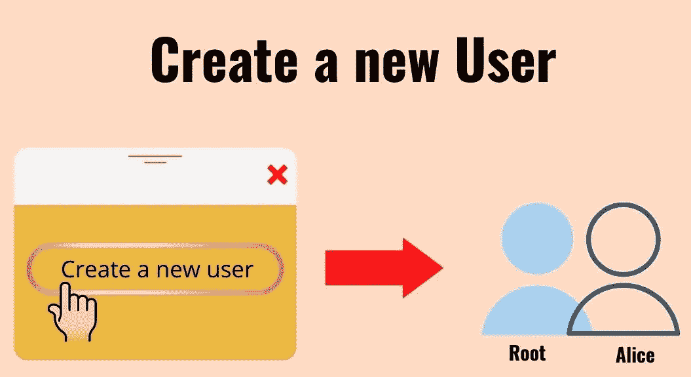
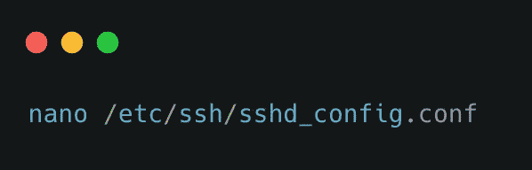
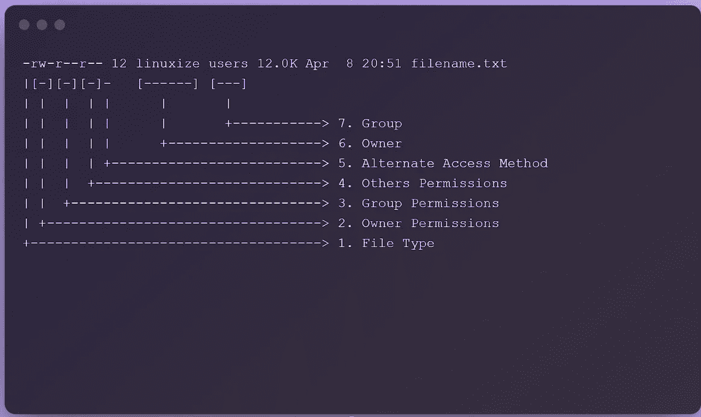

# 使用这些最佳实践来保护您的 Linux 服务器

> 原文：<https://infosecwriteups.com/securing-your-linux-server-with-these-best-practices-50b30e026bd?source=collection_archive---------0----------------------->


照片由 [imgix](https://unsplash.com/@imgix?utm_source=medium&utm_medium=referral) 在 [Unsplash](https://unsplash.com?utm_source=medium&utm_medium=referral) 上拍摄

**简介**

每天都有成千上万的新网站上线。Linux 除了是一个开放源码和用户友好的发行版之外，由于各种其他原因，它是许多人的默认选择。也许您是一名开发人员、学生或管理员，您刚刚完成了第一台 Linux 服务器的安装。

也许你也一直在了解最近发生的黑客攻击和诈骗，并想知道你可以采取什么措施来防止自己成为受害者，因为这些黑客攻击大多是由于服务器和其他项目的配置不当而发生的。

那你来对地方了。这篇博文致力于如何保护您的 Linux 服务器。这将是一篇通用的文章，所以它适合所有的目的，无论是你的个人工作还是办公室/职业相关的工作。所以，让我们回顾一下我们可能会犯的一些常见错误。

# **利用这些最佳实践保护 Linux 服务器的安全**

**创建新用户**



安全照明

如果你是一个习惯性的 Windows 用户，你可能对管理员账户比较熟悉。如果不是，你应该是。在 Linux 上，我们以类似的方式将其称为 root 帐户。root 用户的功能与 Windows 中的管理员用户相同，这意味着他们可以完全控制系统，包括编辑系统设置、添加用户、确定用户权限等。

在基于 Linux 的操作系统中，root 具有最高的角色。它可以用来执行各种命令和功能。这也包括修改系统和引导文件。它变得非常可怕。如果对手访问了您的机器，而您只有根用户，那么默认情况下，攻击者将访问根用户。他可以执行各种操作，从设置流氓帐户到清除您的整个系统设置。为了防止这种行为，您需要创建一个没有 root 权限的新用户，因此创建一个新用户，不要为其提供 root 权限。给它适当的权限来运行您将要处理的服务。如果您想启动任何服务，请使用该用户。这将确保即使服务遭到黑客攻击，攻击者能够获得服务器上的反向外壳，他也无法执行那些需要 root 权限的操作。

1.  **禁用根 SSH 访问**

如果服务器托管在数字海洋、AWS 等云平台上。唯一可以连接到它的方法是使用 SSH。您可能认为这是安全的，但并不总是如此。考虑以下几点。

a)确保密码是强密码。比起密码，更喜欢使用密码短语。

b)不要用便利贴写密码。请改用密码管理器。

c)禁用根 SSH 访问。

但是为什么要禁用 Root SSH 访问呢？这不会妨碍你连接到服务器本身吗？这就是其他用户发挥作用的地方。禁用 root SSH 登录将防止任何攻击者对服务器进行暴力攻击，这样他就可以以 root 身份登录。此外，这将确保即使你的密码被泄露，对手也无法使用。因此，禁用 root SSH 登录并创建一个新用户(如上所述)并为该用户设置 SSH。

下面是禁用它的步骤。

首先，要执行此操作，您必须以 root 用户身份登录(或具有 root 级别的访问权限)。可以编辑包含 SSH 连接和帐户配置信息的 **sshd_config** 文件。这些命令必须在终端中执行。



打开 sshd_config.conf 文件

它将打开文件，现在你只需要禁用根登录选项，向下滚动直到你看到 **#PermitRootLogin**

*将* ***#PermitRootLogin 是*** *改为* ***#PermitRootLogin 否***

```
***#PermitRootLogin no***
```

**2。更改默认权限**

默认情况下，创建新用户时，会在/home 中为该用户创建一个新目录。例如，如果创建了名为 maya 的新用户，则为该用户创建的默认目录将是/home/maya

/home/maya 目录中的文件/文件夹的默认权限是 wrx r-x r-x。通过运行一个简单的命令就可以很容易地识别它

```
***ls -la***
```

列出的权限如下所示。



文件权限

这表明，默认情况下，maya 将拥有所有读取、写入和执行权限。如果在同一个服务器上有任何其他用户，比如说拉吉，那么拉吉可能不能修改任何文件，但是他绝对可以读取 **/home/maya** 目录中的任何文件。

玛雅也一样。她可以阅读/home/raj 目录中的任何内容。

有很多方法可以改变这一点。第一种是手动方式。这是相当乏味和费时的。这可以使用 chmod 命令行实用程序来完成。

让我们看看如何从一个文件进行更改，以便为 root 用户新创建的帐户的任何用户提供适当的权限。

注意:您需要成为 root 用户(或需要 root 级别的权限)才能执行此任务。

您必须更改/etc/login.defs 文件中的 UMASK 值。


打开 login.defs 文件

您将看到 UMASK 的值被设置为 022。改成 077

那么，为什么我们在更改权限时分配数值，让我们简单地理解一下

根据使用的格式，文件权限可以用数字或符号表示。许可号可以由三位或四位数字组成，数字范围从 0 到 7。

当使用三位数时，第一位数表示文件所有者的权限，第二位数表示文件组的权限，第三位数表示用户的权限

```
r (read) = 4
w (write) = 2
x (execute) = 1
no permissions = 0
```

在给定用户类的情况下，权限数字是授予该类用户的权限值的总和。

在权限号中，每个数字可以是数字 4、2、1 和 0 的总和:例如，

```
0 (0+0+0) — No permission.
1 (0+0+1) — Only execute permission.
2 (0+2+0) — Only write permission.
3 (0+2+1) — Write and execute permissions.
4 (4+0+0) — Only read permission.
5 (4+0+1) — Read and execute permission.
6 (4+2+0) — Read and write permissions.
7 (4+2+1) — Read, write, and execute permission.
```

根据此定义，如果权限号设置为 750，则文件的所有者拥有读取、写入和执行权限，文件的组拥有读取和执行权限，而所有其他用户没有权限:

```
Owner: rwx=4+2+1=7
Group: r-x=4+0+1=5
Others: r-x=0+0+0=0
```

现在让我们将 UMASK 的值改为 077

```
UMASK 077
```

下次创建新用户时，默认权限将是 rwx -

因此，只有文件的所有者才能读取、写入和执行其主目录中的任何文件，其他人将无法读取、写入或执行该文件。

**3。关闭任何不需要的端口。**

默认情况下，当您创建服务器时，只有端口 22 会打开，这是用于 SSH 的，用户可以使用它来建立与服务器的通信，如传输文件、创建用户等。您的工作/项目可能需要您打开额外的端口，如 80、443、445、8080、8443 等。我们经常忘记停止服务和关闭不再支持我们事业/目的的端口。

要检查端口和其上运行的服务，您可以使用 **netstat -l 或 ss–l**命令来检查打开的端口，您也可以使用 nmap 来扫描系统上的端口。

还要找到哪些端口/服务对公众开放，哪些在本地可用。一个错误不会变成一场噩梦，因为您可能会将一些不需要的服务暴露给互联网，攻击者可能会利用这些服务入侵您的系统。

例如，MongoDB 是一个 NoSQL 数据库服务器。默认情况下，它监听端口 27001，不需要任何凭据即可登录。如果发现它不是在本地公开，而是对公众开放，那将是毁灭性的。由于登录不需要任何凭证，攻击者不仅可以转储数据，还可以篡改数据。

**4。密码要求**

你可能见过网站警告你密码不符合要求。这可能是由于密码长度不够、没有使用特殊字符等原因。但是许多人可能不知道这也可以在 Linux 和 Windows 环境中设置。作为根用户，您可以设置密码复杂性、长度和到期时间。为了设置它们，您需要修改 **login.defs** 文件。有几个属性需要修改。


打开 login.defs 文件

向下滚动直到看到这些属性，

*   **通行证 _ 最大 _ 天数**
*   **关 _ 分 _ 天**
*   **通行证 _ 警告 _ 年龄**

**PASS_MAX_DAYS** 是密码可以使用的最大天数。默认情况下，它是 99999。如果您在公司、企业环境中，那么您可以根据您公司的政策更改该值。否则，建议在 90 天后更改密码。

**PASS_MIN_DAYS** 告知允许您更改密码的最少天数。默认情况下，该值为 0，但您可以根据您和您公司的要求进行更改。

**PASS_WARN_AGE** 用于警告用户更改密码。默认情况下，它被设置为 7，并将用于在 **PASS_MAX_DAYS** 之前 7 天警告用户更改它。

如果您还想设置密码的最小长度，您可以通过修改 Linux 中的 common-password 文件来轻松实现。通过使用以下命令，使用 nano 打开文件。


打开公共密码文件

访问与下面提供的行类似的行:

```
password [success=1 default=ignore] pam_unix.so obscure sha512
```

根据您公司的政策，您可以添加想要设置的字符数。我将保持它 8。所要做的就是在行尾添加 **minlen 8** 。以便它看起来类似于下面提供的行:

```
password [success=1 default=ignore] pam_unix.so obscure sha512 minlen 8
```

**结论**

谈到网络安全/网络攻击，我们人类是最薄弱的环节。任何连接到互联网的东西都是易受攻击的，或者将来可能会变得易受攻击。我们有责任确保我们的实体免受敌人的攻击，不被他们利用。建议您检查 SSH、您的 web 服务器或系统上运行的任何其他服务的日志文件，以查看任何异常活动。

## 来自 Infosec 的报道:Infosec 每天都有很多内容，很难跟上。[加入我们的每周简讯](https://weekly.infosecwriteups.com/)，以 5 篇文章、4 个线程、3 个视频、2 个 GitHub Repos 和工具以及 1 个工作提醒的形式免费获取所有最新的 Infosec 趋势！