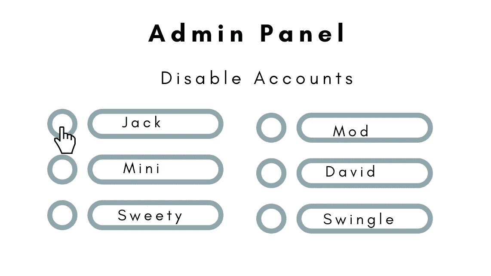
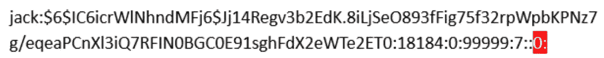
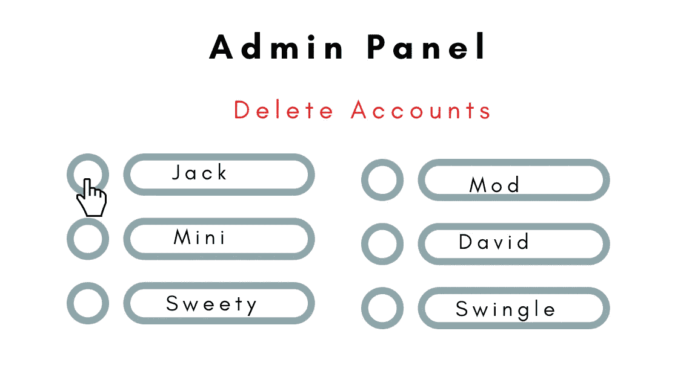
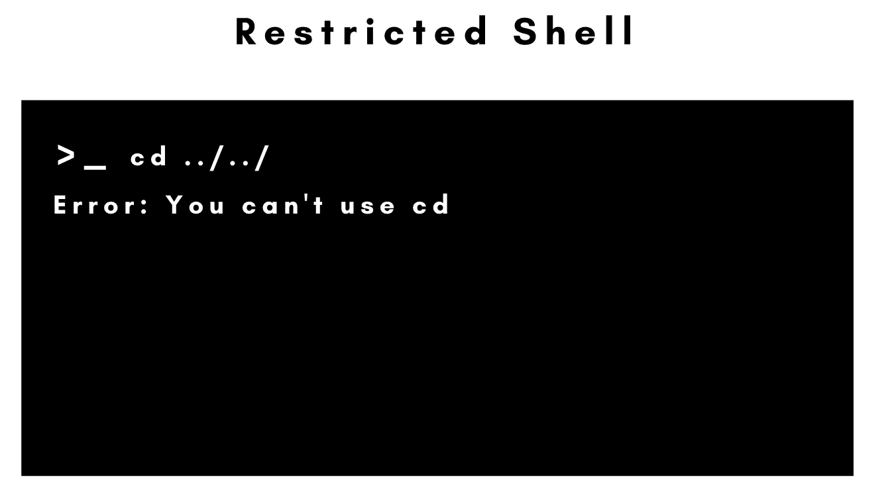

# 保护您的 Linux 服务器第 3 部分

> 原文：<https://infosecwriteups.com/securing-your-linux-servers-part-3-23a711a701a7?source=collection_archive---------0----------------------->


在 [Unsplash](https://unsplash.com?utm_source=medium&utm_medium=referral) 上 [Sai Kiran Anagani](https://unsplash.com/@anagani_saikiran?utm_source=medium&utm_medium=referral) 拍摄的照片

**简介**

在开发应用程序、部署容器技术或在企业中工作时，Linux 是许多开发人员的默认首选。它快速、简洁，需要更少的资源，并在用户手中提供更多的能力。通常，我们忘记意识到它预装了默认设置，这可能违反了您公司的安全策略。

因此，建议遵循最佳的安全策略，并使用最新的安全功能来更新您自己和您的服务器。

这是保护 Linux 服务器系列文章的第 3 部分。前面两个部分可以在[这里](https://securitylit.medium.com/securing-your-linux-server-with-these-best-practices-50b30e026bd)和[这里](https://medium.com/codex/securing-your-linux-server-part-ii-48e45c581931)找到。这是前两篇博文的一个小小的进步，涵盖了一些你应该遵循的更好的安全实践，即使你是一个独立的开发者或者一个公司的管理员。

**禁用用户账户**



禁用用户帐户

不同的公司有不同的政策来处理用户帐户，如果一个员工暂时休假或永久解雇。这里最常见的方法之一是至少禁用该员工的用户帐户，直到当局发出进一步通知。

这实现了两个目标。该系统将受到多种方式的保护。首先，在所有者不在的情况下，任何人都不得进入，以确保员工的个人信息不会被编辑或干预。它还降低了休眠用户帐户导致用户帐户受损的可能性。如果您想禁用某个用户帐户，可以使用 usermod 或 password 命令。它们都执行一些不同的功能，其中之一是用户帐户的停用。要停用 Jack 的帐户，请按照以下步骤操作:

```
usermod –L jack**or**passwd –l jack
```

/etc/passwd 文件用于跟踪 Linux 系统中注册的用户帐户。这些命令将做的是添加一个**！/etc/passwd 文件第二个字段中的**(感叹号)。

虽然你可能认为这已经解决了问题。但是如果用户创建一个 SSH 密钥来登录他的帐户，禁用用户帐户将不起作用。在这种情况下，您需要使用 chage–E0 命令来禁用用户帐户。

```
chage –E0 jack
```

当您使用 chage 命令时，它将对/etc/shadow 文件做一个小的修改。通常为空的第八个字段将被设置为零，表示该账户已被有效关闭。选择此选项后，chage 命令不仅会跟踪密码更改的间隔天数，还会提供帐户到期日期的信息。第八个字段中的零表示帐户在 1970 年 1 月的第一天到期，但也只是锁定帐户。



/etc/shadow 文件的 jack 条目

**删除用户账户**



删除用户帐户

一旦您知道不再需要某个用户帐户，您可以将其删除。这将确保用户在被解雇后不会出于任何个人动机或怨恨而进行任何恶意活动。要删除一个用户帐户，您可以使用 **userdel** 命令。要删除 jack 的帐户:

```
userdel jack
```

要删除/home 和/mail 目录中 jack 的文件，可以使用–**r**标志

```
userdel –r jack
```

也可能有一些进程以用户的名义运行。因此，也有必要阻止它们，以消除将来可能出现的任何不一致。你可以使用 **killall** 命令来实现。

```
sudo killall –u jack`
```

另一种方法是强制删除用户帐户以及在其权限下运行的所有进程，即使用户仍然登录。您可以使用**–f(force)**标志来这样做。

```
userdel –f jack
```

**创建受限外壳**



受限外壳

在开始创建受限外壳之前，让我们先看看什么是受限外壳。顾名思义，限制性外壳是具有强加于其上的限制的外壳。由于对用户施加的限制，大量命令对用户不可用。当需要拒绝访客或普通用户访问任何可能用来损害文件、系统或网络的命令时，使用这种方法特别有用。你通常会在大学图书馆、网吧和其他类似的地方找到它们。Bash 是大多数基于 Linux 的操作系统的默认 shell，包括 Ubuntu。因此，您可以利用 **rbash** ，这也被称为受限 bash。

有几种方法可以实现受限制的 shells。

**类型 1:创建新用户账户时。**
为用户或员工创建新的用户账户时，过程相当简单。创建访问受限的新用户帐户

```
sudo useadd jack –s /bin/rbash
```

为用户 jack 设置密码

```
sudo passwd j4cKP$$word`
```

要为用户 jack 创建两个目录，即/home/jack 和/home/jack/bin。

```
sudo mkdir –p /home/jack/bin`
```

将$PATH 变量更改为/home/jack/bin，以便 jack 只能运行/home/jack/bin 目录中的命令。否则，设置受限制的 shell 就没有任何意义，因为它很容易被绕过。

```
export PATH=$HOME/bin
```

现在，您可以添加希望 jack 运行的二进制文件/命令。您可以手动移动/home/jack/bin 目录中的二进制文件，或者创建指向您的计算机或连接的文件系统上的另一个文件或文件夹的**符号链接或符号链接**。一个**符号链接**是 Linux 和 Unix 中的一种符号链接。

例如，为了使用户插孔的 **ping** 命令有效:

```
sudo cp /bin/ping /home/jack/bin
```

要使用符号链接:

```
sudo ln –s /bin/ls /home/jack/bin
```

**类型 II:当已经创建了一个用户帐户** 来对现有用户施加限制时，可以使用 usermod 命令。要为 tom 实现 rbash:

```
sudo usermod –s /bin/rbash tom
```

**禁用 u 盘**

根据计算机的重要程度，建议且有必要禁用主机上的 USB 端口和记忆棒。u 盘可能是恶意软件、勒索软件等的来源，我们通常会不假思索地插入我们发现的任何设备。

要禁用 u 盘，可以使用 Linux 机器中的 blacklist.conf 文件。这些命令应该只由拥有 admin 或 sudo 权限的人运行。这些步骤是:

```
nano /etc/modprobe.d/blacklist.conf`
```

当 blacklist.conf 文件打开时，在末尾添加以下行。

```
blacklist usb_storage`
```

下一步是打开 rc.local 文件。

```
nano /etc/rc.local
```

最后一步是添加下面两行。

```
modprobe -r usb_storage
exit 0
```

**结论**

虽然前两篇博客更多地关注用于独立开发、web 托管和其他相关目标的 Linux 服务器，但是与前两篇博客不同，这篇博客文章更多地关注 Linux 系统的企业安全性。