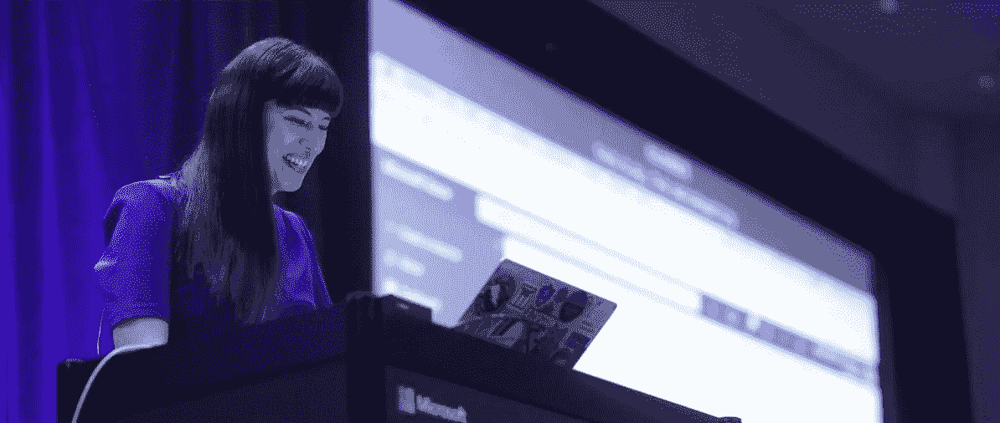

# 安全缺陷与质量缺陷有着本质的不同

> 原文：<https://infosecwriteups.com/security-bugs-are-fundamentally-different-than-quality-bugs-9eb8f8663089?source=collection_archive---------0----------------------->

这个话题在今年的提问阶段出现了几次:质量缺陷和安全缺陷“具有同等价值”，安全测试和 QA 是“同一件事”，安全测试应该“只由 QA 来执行”，以及相对于 QA 来说，进行安全测试“不需要特定的技能”。这篇文章将解释为什么我从根本上不同意所有这些说法。

首先是一些定义。

[**软件错误**](https://en.wikipedia.org/wiki/Software_bug) 是计算机程序或系统中的错误、瑕疵、失败或故障，导致其产生不正确或意想不到的结果，或以意想不到的方式运行。

安全漏洞特指导致 [***漏洞***](https://en.wikipedia.org/wiki/Vulnerability_(computing)) 的漏洞。 [***漏洞***](https://en.wikipedia.org/wiki/Vulnerability_(computing)) 是可被威胁者(例如攻击者)利用来在计算机系统内执行未授权动作的弱点。

> QA 寻找软件 bug(任何种类)；安全测试人员寻找漏洞。这是主要的区别，他们的目标。

就像所有女人都是人，但不是所有人都是女人；虽然所有的安全缺陷都是缺陷，但并不是所有的缺陷都是安全缺陷。

现在让我们仔细分析一下上面的每一个主张。

> 1.质量缺陷和安全缺陷'具有同等价值'。

如果一个安全漏洞会导致低风险的漏洞，那么它与一个导致系统一次又一次崩溃的非安全相关的漏洞没有“相同的价值”。这就好像一个安全漏洞造成了潜在的数据泄露，或者更糟，这并不等同于页面之间的字体不匹配。我认为，安全漏洞比常规漏洞更有可能导致灾难性的业务损失，因为如果您的系统受到恶意行为者的控制，创造力是唯一的限制。恶意的演员总是用他们能造成的伤害让我吃惊。

有人穿着迷彩服。— # [多伦多，2019 年](https://www.microsoft.com/ignite-the-tour/?WT.mc_id=SheHacksPurple-blog-tajanca)

> 2.安全测试和质量保证是“同一件事”

安全测试和质量保证测试的目标是不同的，我觉得这使它们明显不同(如果它们是相同的，为什么它们不会被称为相同的东西？)，然而我想更深入地了解这个想法。

> ***安全是质量的一部分。***

我常说，“安全是质量的一部分。”，因为我相信这是真的。你不可能拥有一个没有安全感的高质量产品；这是一种矛盾修饰法。如果一个应用程序很快，很漂亮，做了客户要求的一切，但有人在它发布的第一天就闯入，我不认为你会发现有人愿意称它为高质量的应用程序。

有许多不同类型的测试；

单元测试——验证小代码单元(函数/子例程)的小型自动化测试，以验证它做了它应该做的事情。

集成测试—在不同组件之间进行测试，以确保它们能够很好地协同工作。比单元测试大，但不如端到端测试激烈。

端到端测试—确保您的应用从开始到结束都符合预期

用户验收测试(UAT)——客户需求的手动和/或自动测试(通常与“QA”互换使用)，

用户体验测试(UX)——从用户的角度验证应用程序或产品是否易于使用和理解

回归测试——验证新的变化没有破坏任何已经测试过的东西，对所有先前发布的功能进行“重新测试”

压力/性能/负载测试——验证您的应用程序可以处理大量的使用/流量，同时继续良好地运行，通常使用软件工具来执行(虽然这三者略有不同，但它们通常都集中在一起)

安全测试——手动和自动测试的混合，使用一种或多种工具，目的是发现应用程序中的漏洞。

还有更多类型的测试，但我想你明白了。

一些或所有这些类型的测试可以用来验证一个产品是高质量的，安全性只是其中的一部分。因此，安全测试和质量保证不是“一回事”

> 3.安全测试'应由 QA 执行'

上面列出的每一种测试都需要不同的技能。所有这些都需要耐心、对细节的关注、基本的技术技能，以及以软件开发人员能够理解并能够解决问题的方式记录您所发现的内容的能力。相似之处到此为止。每一种类型的测试都需要不同的经验、知识和工具，这通常意味着您需要雇用不同的资源来执行不同的任务。此外，我们不能同时专注于每一件事，同时在每一件事上都做得很好。

虽然理论上你可以找到一个在所有这些领域都有技能和经验的人，但这是罕见的，而且作为全职资源雇佣这个人可能会很昂贵。这也是一般软件测试雇佣的人员不经常承担安全测试任务的原因之一。另一个原因是，拥有经验和技能来执行彻底和完整的安全测试的人目前很少见，存在技能短缺，而作为一个行业，我们很幸运地拥有相当多的熟练 QA 专业人员，使他们更容易雇用和配备人员。最后，与一般的软件测试人员相比，成为一名安全测试人员所需的时间、培训和经验更难获得。

关于如何执行安全测试的培训非常昂贵，而且很难找到，与其他类型的测试相比，通常需要更长的时间来学习这种技能，而且与 QA 相比，进入该行业的机会更少。因此，与一般测试相比，成为安全测试人员更加困难。稀缺的资源、高需求、昂贵的培训意味着雇佣安全测试人员的成本要比雇佣通用软件测试人员的成本高得多。

所有这些事实导致了这样一个现实:让 QA 团队配备在 QA 和安全测试方面经验丰富的专业人员是成本过高的。这也意味着您正在为您的组织中的测试创建一个单点故障，从长远来看，这不会为您节省资金。

#[2019 年多伦多 MSIgniteTheTour](https://www.microsoft.com/ignite-the-tour/?WT.mc_id=SheHacksPurple-blog-tajanca)

关于这个话题的另一点；那些在安全行业工作的人可能对他们关注的领域(安全)有偏好，并且可能不愿意在他们关注的领域之外执行其他类型的工作(从事专业工作的人通常希望尽可能在他们的专业领域内工作，安全测试就是一种专业)。

> 4.与 QA 相比，进行安全测试不需要特定的技能。

首先，我觉得这种说法是对 QA 测试人员的侮辱，就好像他们没有一套特定的技能使他们擅长他们的工作。我不相信那是真的。我怀疑当人们提出这种观点时，是出于对我们行业的失望，因为老实说，我无法理解有人认为安全测试不需要特定的经验、培训或技能；否则就不会出现技能短缺，也不会是高薪工作。安全测试是测试领域中的一个专业，就像任何领域中都有专业一样，根据定义，它需要更多的知识和培训来形成完成工作所需的技能。

我无意贬低 QA 测试的价值，只是想说明质量保证不同于确保产品安全。我还应该说，我觉得黑客有时在电视、媒体和我们整个行业中被美化了，以一种对我来说不符合逻辑的方式。安全测试非常重要，但我不认为黑客比从事 IT 工作的其他专业人员优越。事实上，我选择将我的职业生涯集中在 AppSec、DevSecOps 和其他类型的防御上，**因为我真的相信，我们编写安全的代码比我们‘黑掉所有东西’更重要**。安全*不仅仅是安全测试(道德黑客)，它还包括安全设计、安全编码、威胁建模等。*

我觉得像这样的评论(#4)不是基于事实，而是基于感觉，在这种情况下很难与人辩论。

> 如果我们在这个话题上有不同意见，那没关系。辩论是有益健康的，我很乐意在评论中听到你的感受、想法和观点。

在这一点上，我想提醒大家的是**安全是每个人的工作**。不仅每个人都有责任以他们知道的最安全的方式完成自己的工作，而且让许多不同的人带着安全的想法来看待某些事情可以帮助我们发现新的和不同的问题，否则这些问题可能会被忽略。

# **像这样的内容还有更多，可以看看我的书，** [**爱丽丝和鲍勃学应用安全**](https://aliceandboblearn.com/) **还有我的在线培训学院，** [**我们黑紫**](https://academy.wehackpurple.com/) **！**

## 我有一个邮件列表，请订阅，这是免费的！