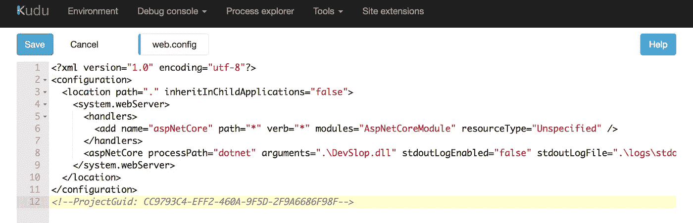
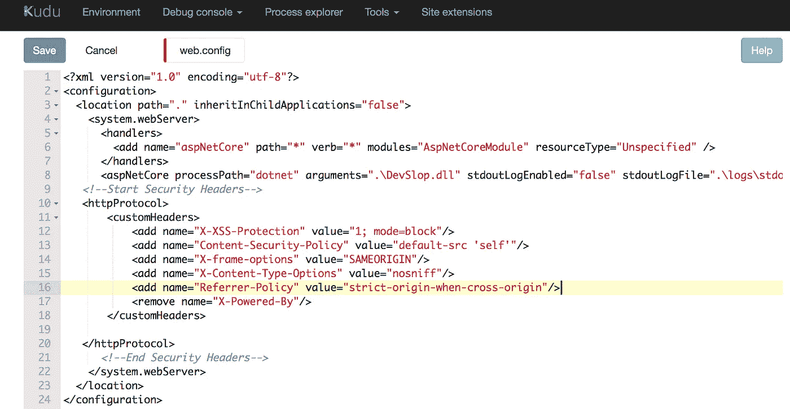
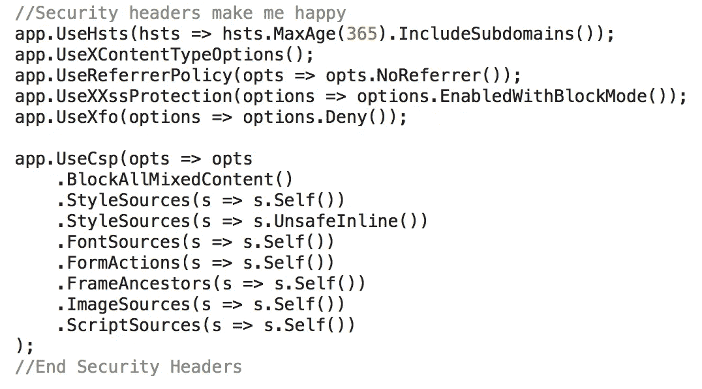
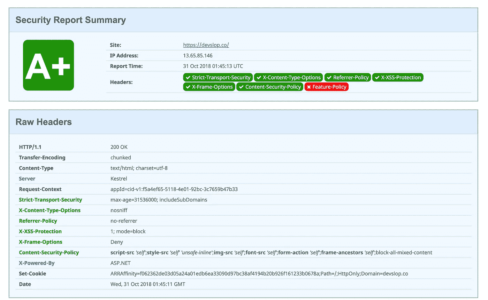

# ASP.Net 和的安全标头。网络核心

> 原文：<https://infosecwriteups.com/security-headers-1c770105940b?source=collection_archive---------0----------------------->

对于那些不关注我自己或[弗兰齐斯卡·布勒](https://twitter.com/bufrasch)的人，我们有一个名为 [OWASP DevSlop](https://devslop.co) 的开源项目，在这个项目中，我们通过编写易受攻击的应用程序、创建管道、发布概念证明以及记录我们在 [YouTube 频道](https://aka.ms/DevSlopShow)和我们的博客上所了解的内容来探索 DevSecOps。在本文中，我们将探索如何向我们的概念验证网站[DevSlop.co](https://devslop.co)添加安全头。这篇博客文章与 Franziska 的文章 [OWASP DevSlop 的 TLS 和安全头之旅](https://medium.com/@franbuehler/owasp-devslops-journey-to-tls-and-security-headers-aa892f1ac851)密切相关。如果你喜欢这本，也看看她的。:)

[我和 Franziska Bühler](https://twitter.com/bufrasch) 在[第 2 集](https://www.youtube.com/watch?v=-il28nDFgBg&t=3s)、 [2.1](https://www.youtube.com/watch?v=6-mqK3jr6Jg&t=3s&list=PLI9RITMnVbyg-OEn2vbsDnzWi9jGd6_5u&index=5) 和 [2.2](https://www.youtube.com/watch?v=uJeUodTRCEs) 的 [OWASP DevSlop Show](http://aka.ms/DevSlopshow) 期间安装了几个安全头。不幸的是我们发现。Net Core 没有 web.config，所以下一次我们发布的时候，它删除了我们添加的漂亮的标题。虽然这不是个好消息，但这是另一个学习的机会，也给了我一个很好的借口，让我最终写下了我一直承诺的 **Security Headers** 博文。开始了。

我们的 web.config 看起来太…空的。

刚才，[我加回了头文件](https://www.youtube.com/watch?v=uJeUodTRCEs)，但是我把它们添加到了我的。[网芯](https://docs.microsoft.com/dotnet/core/?WT.mc_id=SheHacksPurple-Blog-tajanca) app，你可以在这里观看[。特别感谢](https://www.youtube.com/watch?v=uJeUodTRCEs)[达米恩·博德](https://damienbod.com/2018/02/08/adding-http-headers-to-improve-security-in-an-asp-net-mvc-core-application/)的帮助。[网芯](https://docs.microsoft.com/dotnet/core/?WT.mc_id=SheHacksPurple-Blog-tajanca)麻花。

如果你想深入了解我们在节目中做了什么，以及每个安全标题意味着什么，你应该阅读 Franziska 的博客文章。她解释了每一个步骤，如果你第一次尝试添加安全头到你的 web . config([ASP.Net](https://docs.microsoft.com/dotnet/standard/?WT.mc_id=SheHacksPurple-Blog-tajanca)，而不是[)。网芯](https://docs.microsoft.com/dotnet/core/?WT.mc_id=SheHacksPurple-Blog-tajanca))，你一定要看。

web.config 中 ASP.Net 的新代码如下所示:

<http protocol>
<custom headers>
<add name = " X-XSS-保护" value = " 1；mode = block "/>
<add name = " Content-Security-Policy " value = " default-src ' self ' "/>
<add name = " X-frame-Options " value = " same origin "/>
<add name = " X-Content-Type-Options " value = " nosniff "/>
<add name = " Referrer-Policy " value = " strict-origin-when-cross-origin "/【添加名称—结束安全标题→

我们新改进的网络。配置！

还有我的 startup.cs 的新代码([)。网芯](https://docs.microsoft.com/dotnet/core/?WT.mc_id=SheHacksPurple-Blog-tajanca))，长这样(谢谢[达米恩 Bod](https://damienbod.com/2018/02/08/adding-http-headers-to-improve-security-in-an-asp-net-mvc-core-application/) ):

//安全头让我开心
app。使用 Hsts(hsts = > hsts。MaxAge(365)。include subdomain())；
app。UseXContentTypeOptions()；
app。UseReferrerPolicy(opts =>opts。nore Ferrer())；
app。UseXXssProtection(options = >选项。EnabledWithBlockMode())；
app。UseXfo(options = >选项。deny())；

app。UseCsp(opts => opts
。BlockAllMixedContent()
。style sources(s =>s . Self())
。style sources(s =>s . unsafeline())
。font sources(s =>s . Self())
。FormActions(s =>s . Self())
。frame ancestors(s =>s . Self())
。image sources(s =>s . Self())
。script sources(s =>s . Self())
)；
//结束安全头

我们漂亮的安全标题！

在未来的剧集中，我们还将添加:

*   我们的 [cookies](https://blog.dareboost.com/en/2016/12/secure-cookies-secure-httponly-flags/) 的安全设置
*   x-允许的跨域策略:无
*   Expect-CT:(我们的提供商目前不支持)
*   功能策略:摄像机“无”；麦克风“无”；说话人“自己”；振动“无”；地理位置“无”；加速度计“无”；环境光传感器“无”；自动播放“无”；加密媒体“无”；陀螺仪‘无’；磁力计‘无’；midi“无”；付款“无”；画中画“无”；usb“无”；VR‘无’；全屏*；

有关所有这些安全头的更多信息，我强烈建议您阅读 [OWASP 安全头指南](https://www.owasp.org/index.php/OWASP_Secure_Headers_Project#xpcdp)。

我们现在在所有重要的地方都取得了好成绩，https://securityheaders.com、https://www.ssllabs.com、T21、http://hardenize.com，但是我们希望能进一步提高我们的分数。

更多信息，请观看我们的节目！美国东部时间每周日下午 1-2 点，在[混音器](http://aka.ms/devslop-mixer)和 [Twitch](http://aka.ms/devsloptwitch) 上，录像稍后可在我们的 [YouTube](http://aka.ms/DevSlopShow) 频道上获得。

请使用所有适用于您的安全标题。

# **像这样的内容还有更多，查看我的书，** [**爱丽丝和鲍勃学习应用安全**](https://aliceandboblearn.com/) **和我的在线培训学院，** [**我们黑紫色**](https://academy.wehackpurple.com/) **！**

## 我有一个邮件列表，请订阅，这是免费的！