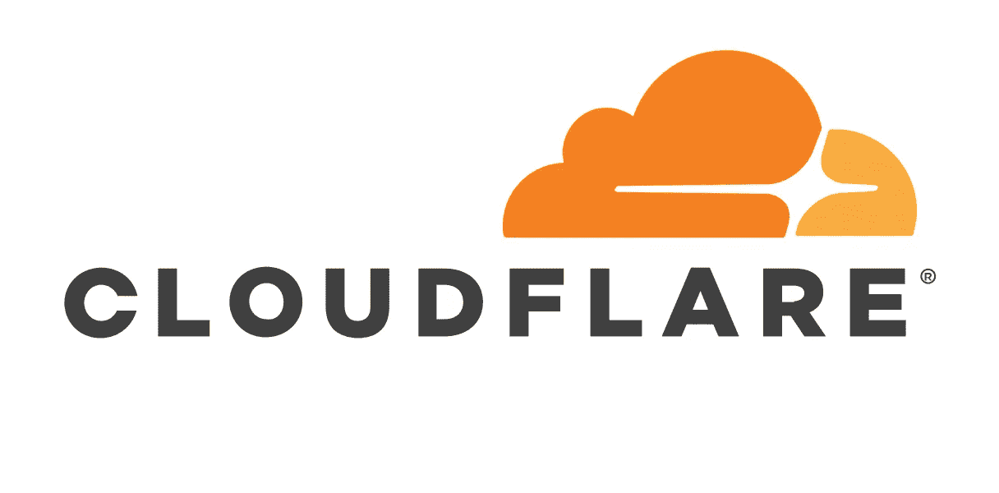
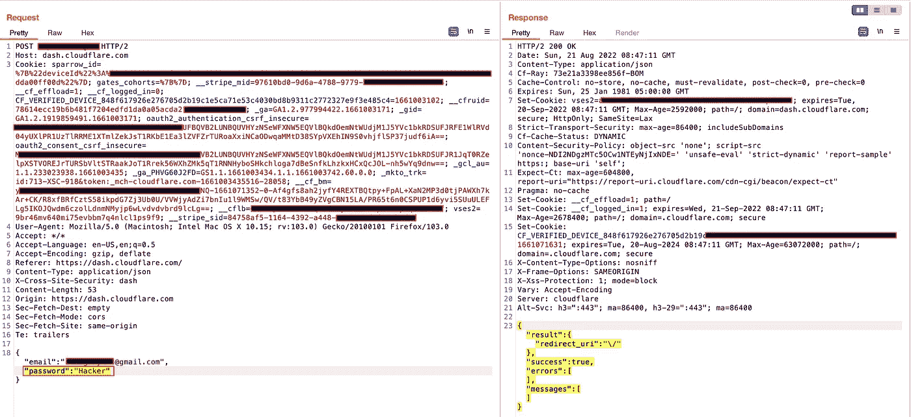
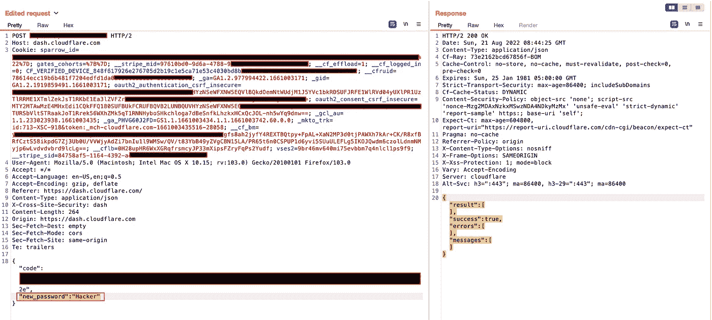
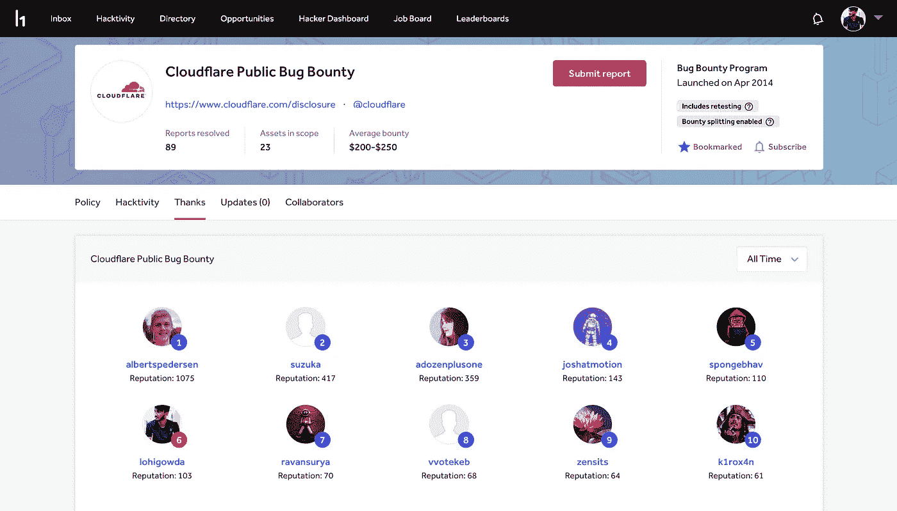

# 安全性与合规性—绕过 Cloudflare 密码策略限制

> 原文：<https://infosecwriteups.com/security-vs-compliance-cloudflare-password-policy-restriction-bypass-da07ca7df4f2?source=collection_archive---------2----------------------->

在 bug bounty 上稍作休息后，我开始在 [Cloudflare Bug Bounty 程序](https://hackerone.com/cloudflare?type=team)上狩猎。这篇文章是关于**密码策略限制旁路的。**

几乎每个组织都在其应用程序上遵循严格的密码策略。有时候要看产品。例如加密、银行、电子商务应用。强密码策略对于合规性也是强制性的。有关[密码政策](https://en.wikipedia.org/wiki/Password_policy#:~:text=A%20password%20policy%20is%20a,part%20of%20security%20awareness%20training.)的更多详情。

来主图吧…

我开始在 Cloudflare 应用程序中寻找 bug。这是我关于 [Cloudflare Bug Bounty 计划](https://hackerone.com/cloudflare?type=team)的第二份有效报告。第一个问题与[盲人 SSRF](https://hackerone.com/reports/1467044) 有关。这份报告已经公开了。

Cloudflare 有一个强有力的密码策略。应该是 8 个字符长，特殊字符，数字，但是只在 UI 上。如果攻击者拦截了注册 API 端点，他就可以为自己的帐户设置一个弱密码。

**漏洞利用部分:**

导航到 Cloudflare 注册/重置页面，并在用户界面上使用强密码输入所有详细信息。然后使用 Burp-Suite(代理工具)捕获注册请求。将强密码修改为弱密码(例如，Hacker@123 修改为 Hacker)。

登录请求

密码重置

然后我把这个请求转发给服务器，得到了 200 ok 的响应。所以我的弱密码被更新了。这样，用户可以为他们的帐户设置弱密码。这是一个安全性和合规性问题。

**报告详情:**

*   **8 月 21 日—** 在 **HackerOne** 向 Cloudflare 程序报告
*   **8 月 22 日—** 报告被分类
*   8 月 23 日— 奖励写得好的报告 200 美元+**+50 美元**。
*   8 月 23 日— 要求复试
*   **8 月 23 日—** 问题修复，获得奖励 **$50** 进行复试。

从这份报告中获得的总赏金为 **$300** 。目前，我是 [**Cloudflare Bug 赏金计划**](https://hackerone.com/cloudflare/thanks) **的前 6 名猎人。**

Cloudflare 感谢页面

**感谢阅读！….黑客快乐！**

> ***领英:*** [*洛思高达米*](https://www.linkedin.com/in/lohigowda/)
> 
> ***推特:****[*lohigowda _ in*](https://twitter.com/lohigowda_in)*
> 
> ****insta gram:****[*lohigowda . in*](https://www.instagram.com/lohigowda.in/)**
> 
> *****作品集:****[*https://www.lohigowda.in/*](https://www.lohigowda.in/)***

## **来自 Infosec 的报道:Infosec 每天都有很多内容，很难跟上。[加入我们的每周简讯](https://weekly.infosecwriteups.com/)以 5 篇文章、4 个线程、3 个视频、2 个 GitHub Repos 和工具以及 1 个工作提醒的形式免费获取所有最新的 Infosec 趋势！**