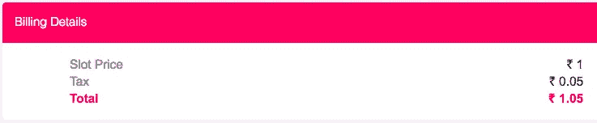
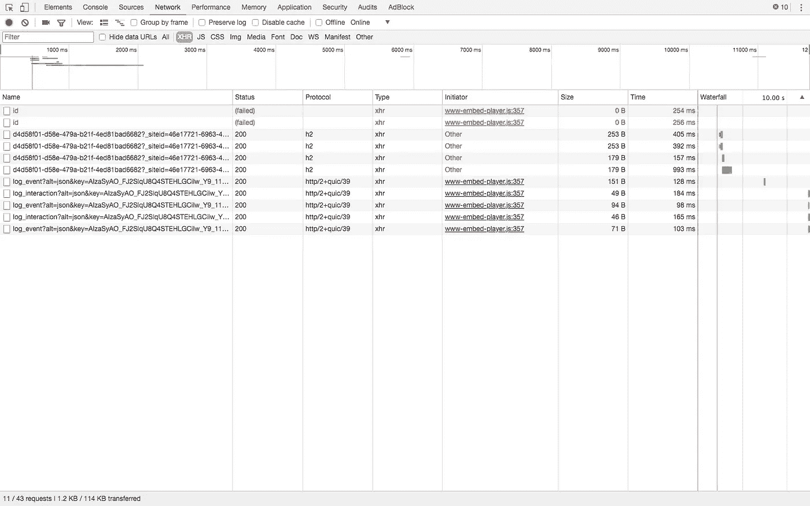
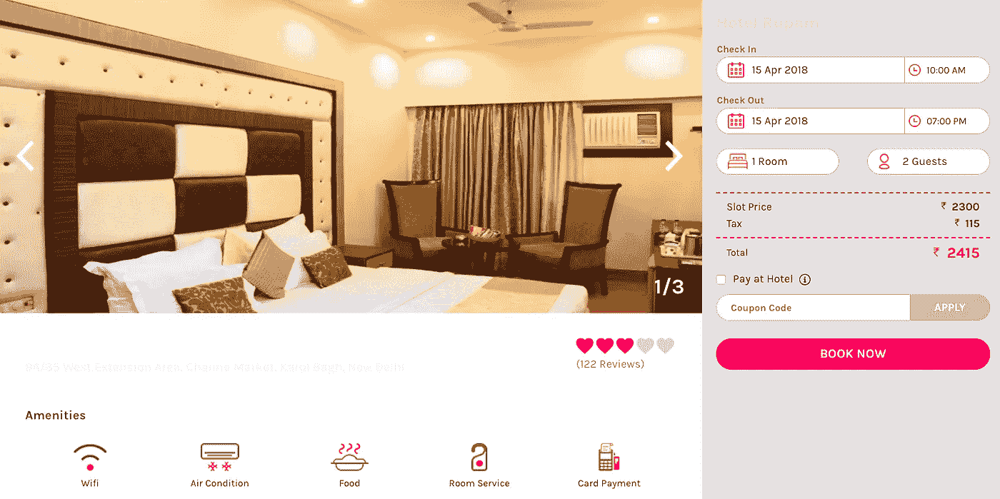
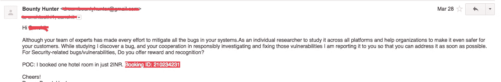

# # security reach—“我是如何预订到 1.50₹的酒店房间的！”

> 原文：<https://infosecwriteups.com/securitybreach-how-i-was-able-to-book-hotel-room-for-1-50-9b35f18e49e8?source=collection_archive---------2----------------------->

让我们开始吧…

发票

# 了解潜在客户:

酒店预订网站设在印度的已婚和未婚夫妇。该网站负责预订印度 40 多个城市的酒店房间。

# 潜在客户识别:

1.  我总是在搜索定制的网络应用软件——✔
2.  [API 驱动的方法学](https://www.codegent.com/blog/2013/8/the-value-of-api-driven-development) — ✔
3.  [CORS 错误配置](https://bit.ly/2vbmRlb) - ✔

# 工具(值得一提)

1.  邮差— [chrome app](https://chrome.google.com/webstore/detail/postman/fhbjgbiflinjbdggehcddcbncdddomop?hl=en) — ✔
2.  [邮递员拦截器](https://chrome.google.com/webstore/detail/postman-interceptor/aicmkgpgakddgnaphhhpliifpcfhicfo?hl=en) — ✔
3.  谷歌 Chrome 浏览器——✔

# 让我们开始吧

## 先决条件:

1.  无非是你(真实的你)

> 记住！你的酒吧和地面之间的差距就是你受苦的空间，因为你没有真实地体验现实。你的身体在这里，你的思想在上面。地面是接纳生活的地方，我们可以体验到平静与和谐。— **未知**

> **——*[***如何***](https://medium.com/@hariomvashisth/here-we-worship-the-moon-and-sun-36f303373c95)*
> 
> ****和我一起发现自己****——*[***梦幻闹钟***](https://medium.com/@hariomvashisth/dream-alarm-80824b3f2a9)*

> ***亚里士多德**:“认识自己是一切智慧的开始。”*

## *非常有灵感！让我们了解一下我们如何做到这一点*

1.  *打开他们的精彩梦想网站(example.com)，进入网络选项卡，监控 XHR 流量*

**

*chrome 控制台->网络选项卡*

*2.选择你最喜欢的酒店。*

**

*酒店页面—之前*

*一旦你开始监测网络标签，你会知道他们通过 API 处理输入数据的方式。多亏了 CORS -> *，你可以通过邮递员做大量的实验。用 postman 拦截器捕获他们的 API 调用，并更改预订金额。支付最低金额，享受您的一天！*

*虽然我取消了预订，因为这只是一个概念验证。*

**

*通过电子邮件报告漏洞*

*d̶e̶s̶p̶i̶t̶e̶̶o̶f̶̶i̶n̶f̶o̶r̶m̶i̶n̶g̶̶t̶h̶e̶i̶r̶̶t̶e̶c̶h̶̶t̶e̶a̶m̶,̶̶t̶h̶e̶y̶̶d̶i̶d̶n̶'̶t̶̶p̶a̶y̶̶a̶t̶t̶e̶n̶t̶i̶o̶n̶̶t̶o̶̶t̶h̶e̶̶i̶d̶e̶n̶t̶i̶f̶i̶e̶d̶̶v̶u̶l̶n̶e̶r̶a̶b̶i̶l̶i̶t̶y̶.̶̶t̶h̶e̶̶d̶a̶y̶s̶̶a̶r̶e̶̶p̶a̶s̶s̶i̶n̶g̶̶a̶n̶d̶̶t̶h̶e̶̶s̶i̶t̶e̶̶i̶s̶̶g̶r̶o̶w̶i̶n̶g̶̶w̶e̶l̶l̶̶i̶n̶̶p̶r̶o̶f̶i̶t̶s̶̶b̶u̶t̶̶a̶l̶o̶n̶g̶̶w̶i̶t̶h̶̶t̶h̶i̶s̶̶i̶s̶s̶u̶e̶.̶̶i̶n̶̶t̶h̶e̶̶c̶o̶m̶i̶n̶g̶̶f̶u̶t̶u̶r̶e̶,̶̶t̶h̶e̶̶r̶e̶l̶a̶t̶i̶v̶e̶̶c̶o̶n̶s̶e̶q̶u̶e̶n̶c̶e̶̶a̶n̶d̶̶b̶o̶o̶m̶i̶n̶g̶̶p̶o̶s̶s̶i̶b̶i̶l̶i̶t̶y̶̶w̶i̶l̶l̶̶b̶e̶̶t̶h̶a̶t̶̶a̶n̶y̶̶h̶a̶c̶k̶e̶r̶̶o̶r̶̶s̶o̶f̶t̶w̶a̶r̶e̶̶p̶r̶o̶f̶e̶s̶s̶i̶o̶n̶a̶l̶̶c̶a̶n̶̶d̶u̶m̶p̶̶t̶h̶e̶i̶r̶̶e̶n̶t̶i̶r̶e̶̶d̶a̶t̶a̶b̶a̶s̶e̶̶a̶n̶d̶̶c̶a̶n̶̶m̶a̶k̶e̶̶i̶t̶̶p̶u̶b̶l̶i̶c̶.̶̶a̶s̶̶a̶̶r̶e̶s̶u̶l̶t̶,̶̶i̶t̶s̶̶r̶e̶p̶u̶t̶a̶t̶i̶o̶n̶̶a̶n̶d̶̶r̶e̶l̶e̶v̶a̶n̶c̶e̶̶w̶i̶l̶l̶̶g̶o̶̶o̶n̶̶d̶e̶c̶r̶e̶a̶s̶i̶n̶g̶̶b̶e̶c̶a̶u̶s̶e̶̶i̶t̶̶w̶i̶l̶l̶̶c̶r̶e̶a̶t̶e̶̶a̶̶m̶e̶n̶t̶a̶l̶i̶t̶y̶̶i̶n̶̶t̶h̶e̶̶m̶i̶n̶d̶s̶̶o̶f̶̶p̶e̶o̶p̶l̶e̶ ̶t̶h̶a̶t̶̶t̶h̶e̶̶f̶o̶l̶l̶o̶w̶i̶n̶g̶̶h̶o̶t̶e̶l̶̶b̶o̶o̶k̶i̶n̶g̶̶w̶e̶b̶s̶i̶t̶e̶̶f̶a̶i̶l̶e̶d̶̶t̶o̶̶k̶e̶e̶p̶̶t̶h̶e̶̶d̶e̶t̶a̶i̶l̶s̶̶c̶o̶n̶f̶i̶d̶e̶n̶t̶i̶a̶l̶̶a̶n̶d̶̶r̶u̶i̶n̶e̶d̶̶t̶h̶e̶i̶r̶̶f̶a̶i̶t̶h̶̶a̶n̶d̶̶t̶r̶u̶s̶t̶̶o̶n̶̶s̶u̶c̶h̶̶w̶e̶b̶s̶i̶t̶e̶s̶.̶*

*我对安全漏洞很着迷，并想过再次联系他们，不是为了奖励或认可，不是为了我，不是为了他们…是为了那些用他们的平台预订酒店的人。于是，我不假思索地打开我的 gmail，写了一封带有一些哲学陈述的电子邮件。*

*我成功地就情感进行了谈判，但作为一名程序员，我很难用语言来表达我的想法。最后，他们理解了我的好意，开始写我的报告。几天后，我收到了“网络漏洞调查”经理发来的一封关于调查报告的电子邮件，他决定给我一些奖励和一份安全审计建议。*

*时间线:*

*发现漏洞:3 月 25 日*

*概念验证:3 月 27 日*

*报道:3 月 28 日*

*调查报告:4 月 24 日*

*赏金奖励:5 月 8 日*

*编码快乐！*

*感谢阅读！这就是这个有趣的发现。☺*