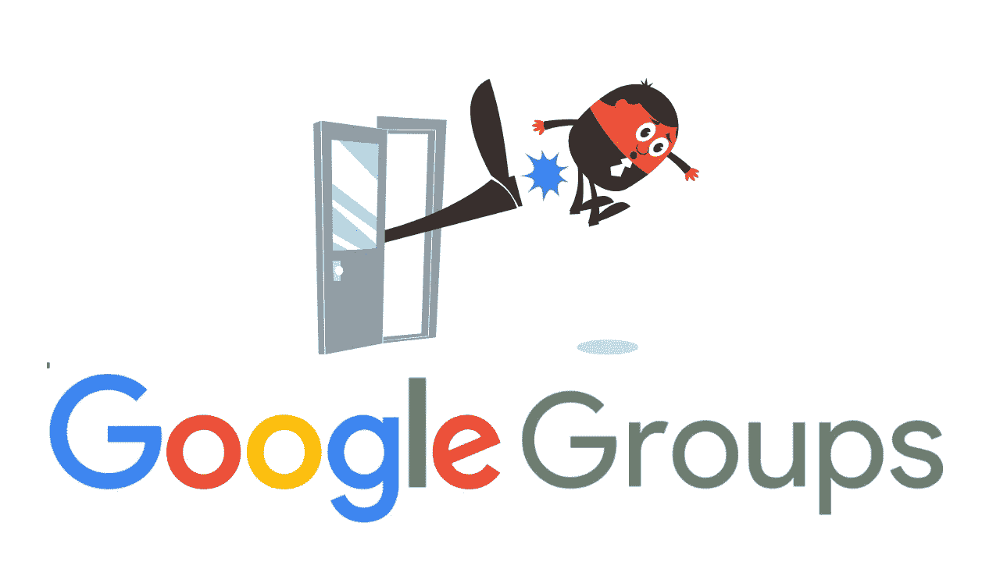
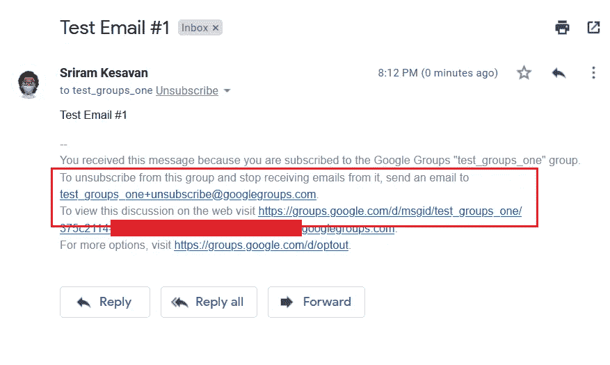
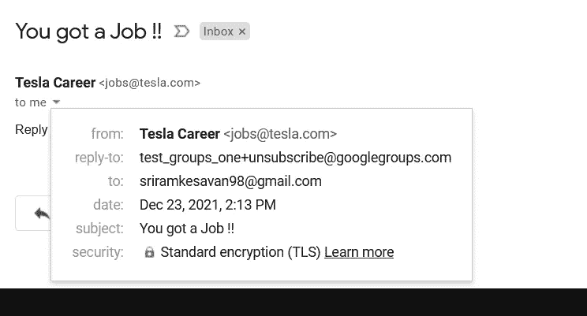
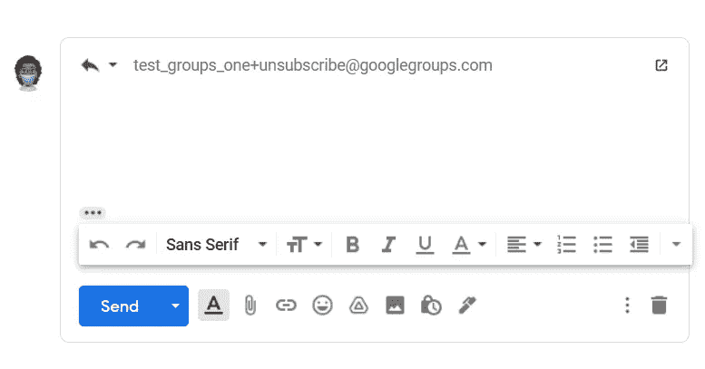
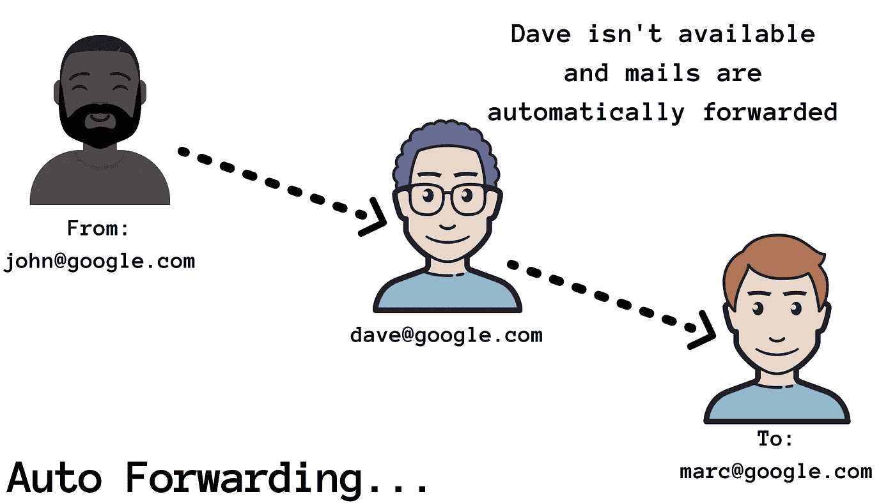
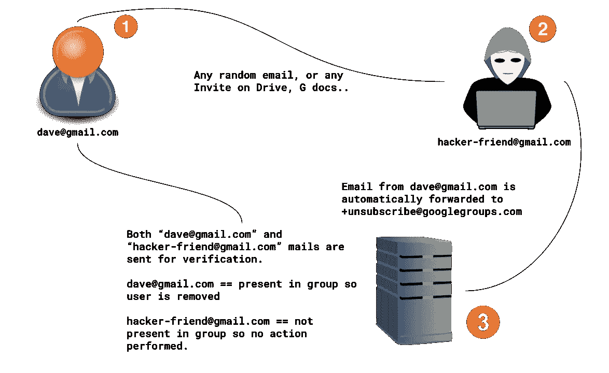
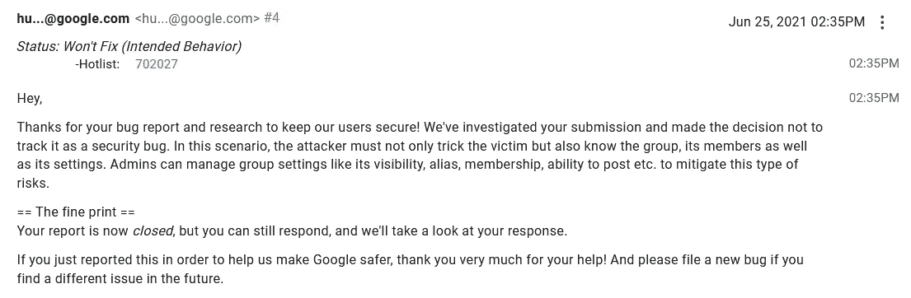
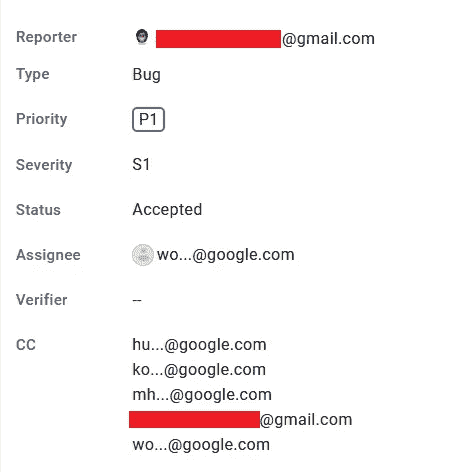
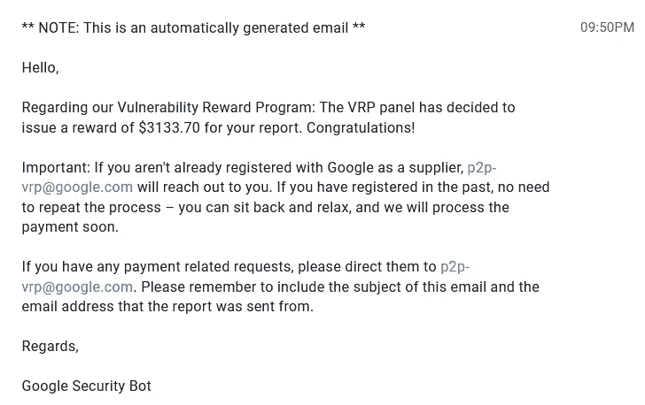

# 给我发邮件，然后被踢出谷歌群！！—# Google VRP——一个差点搞垮 Google Groups 的功能！！

> 原文：<https://infosecwriteups.com/send-a-email-to-me-and-get-kicked-out-of-google-groups-29b5c2c60e95?source=collection_archive---------0----------------------->

***报道:2021 年 6 月 26 日 12 点 51 分***

很多人可能知道什么是[谷歌集团](https://en.wikipedia.org/wiki/Google_Groups)。对于没有的人来说，Google Groups 允许用户创建一个包含多个用户的组，并提供一个公共的邮件 ID。只需发送一封电子邮件，就可以与群组中的成员进行互动。

**例如:**

你创建一个名为***【Apple fans】***的群组，将提供一个邮件 ID "***Apple _ fans @ Google groups . com "***。群组中的成员只需发送一封电子邮件，消息就会发布在群组中！！

组织甚至使用 Google Groups 作为一个 ***票务跟踪系统*** ，根据我的知识和我收集的一些信息，一个修改版本被 Google 用作 ***支付支持系统*** 。

我从来没有真的想在谷歌上测试，但修改后的用户界面让我在那里狩猎。这很酷。

于是我创建了一个名为 ***【测试群】*** 的群，添加了我的一些测试账号，然后给我提供了一个常用的邮箱 ID***“Test _ Groups _ one @ Google Groups . com”***

当我开始向谷歌群组发送消息时，有一个功能引起了我的注意，那就是电子邮件中的***"+unsubscribe @ Google Groups . com "****。这个功能在 Google Groups 这么多年都有。但是我从来没有看到一个人测试过这个，所以我决定这次自己测试一下！！*

**

*当我的**“测试组一”**中的用户对继续留在组中不感兴趣时，他/她可以简单地发送电子邮件到****【test_groups_one+unsubscribe@googlegroups.com】*****

***假设我添加了我的朋友 **"friend1@example.com"** ，他不想继续留在这个群中，他可以发邮件给*"****【test_groups_one+unsubscribe@googlegroups.com】****"*，他将自动从这个群中移除。这里有一个视频，它实际上是如何工作的。***

**很多人可能认为 [*电子邮件欺骗*](https://en.wikipedia.org/wiki/Email_spoofing) 是问题所在，但事实并非如此！！**

**我最初花了更多的时间*(可能超过一周甚至更多)*如何将用户从组中移除，以及 SPF 策略在这种情况下实际起作用。所以，为了移除用户，我们需要欺骗受害者直接回复****【+unsubscribe@googlegroups.com】****所以我尝试了**“回复**”功能，这是大多数邮件服务中常见的功能。****

***所以当我们发出邮件时，用户的回复会被发送到退订邮箱。并且该用户将从该组中删除。参考下图，一封 ***回复*** 的欺骗邮件***

****

**但有一个缺点，受害者可以明显地看到他/她正在回复的电子邮件。即使我报告这件事，谷歌的人也不会接受。所以我不得不重新思考，以便找到更好的攻击场景。**

****

**所以我计划屏蔽退订邮件。现在有这么多代理服务，但它太贵了，我选择了一个更便宜的版本。**

**这里的窍门是通过 [*【谷歌支持】*](https://support.google.com/mail/answer/10957?hl=en) 自动转发邮件。为了更好地理解，这里有一个简单的图像:**

****

**因此，当受害者向我们的 ID****【random-user @ Gmail . com】****发送随机邮件时，所有收到的邮件将自动转发到***【test _ groups _ one+unsubscribe @ googlegroups . com】***，受害者将自动从 Google groups 中删除，系统实际上无法验证。****

****

**攻击场景的简化版本。**

**一个简单的形象，以便更好地理解！！我尝试了这个攻击场景，我为我的组织创建了一个群，在他们同意的情况下添加了我的好友，并给他们发了一封电子邮件。他们回复了我的邮件，然后砰的一声，他们一个接一个地从这个群中消失了。英雄联盟**

**这是最后一个视频概念验证是如何实现的。**

**但是，当我决定把这个问题发给谷歌 VRP 时，得到的回复并没有让我高兴:(**

****

**是的，报告以' ***预期行为'*** 关闭，并附有上述说明*。*说真的，谷歌安全 bois，我从字面上开始哭:(**

****

**但我没有放弃。我做的下一件事是获得谷歌 bois 的许可，就此发表一篇文章。所以我很快写了一份报告并发回以获得批准。一周后，我收到了回复:产品团队在解决这个问题上表现良好。**

****

**万岁！！！**

**是的，这和我期待的一样，它发生了。整整两个星期过去了，现在是奖励的时候了。**

****

**是的，它获得了奖励 ***$3133.7*** ，这比我预期的要高，因为我估计这一期是 ***$500*** 或 ***$1337*** ，这比我预期的要高。这是热爱谷歌和谷歌 VRP 的又一个原因。**

**已经应用了一个初始补丁，我也报告了一个补丁旁路，它已经被接受，正在等待谷歌 VRP 专家组的审查。**

**所以我们很快会在新的报道中再见的，伙计们！！**

**感谢阅读！！**

****推特:** [sriramoffcl](https://twitter.com/sriramoffcl)**

****insta gram:**[Sri ram _ off cl](https://www.instagram.com/sriram_offcl/)**

****LinkedIn:**[sriramkesavan](https://www.linkedin.com/in/sriramkesavan/)**

**好吧，如果你喜欢这个，写下来鼓掌👏，那我们来连线:**

****和平** ✌️ **！！！****

**感谢校对:[桑迪约·克里斯坦](https://twitter.com/ChristanSandiyo)**

# **🔈 🔈Infosec Writeups 正在组织其首次虚拟会议和网络活动。如果你对信息安全感兴趣，这是最酷的地方，有 16 个令人难以置信的演讲者和 10 多个小时充满力量的讨论会议。查看更多详情并在此注册。**

** [## IWCon2022 - Infosec 书面报告虚拟会议

### 与世界上最优秀的信息安全专家建立联系。了解网络安全专家如何取得成功。将新技能添加到您的…

iwcon.live](https://iwcon.live/)**